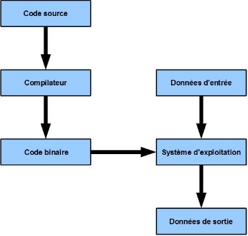
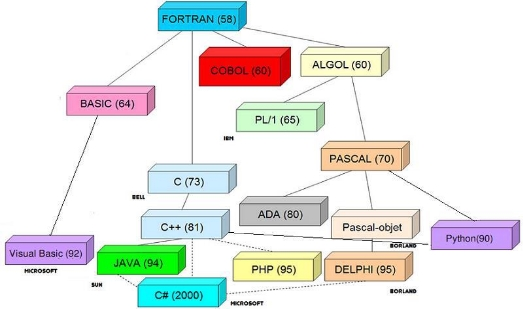
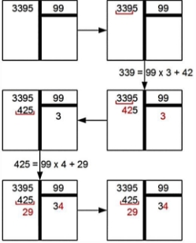
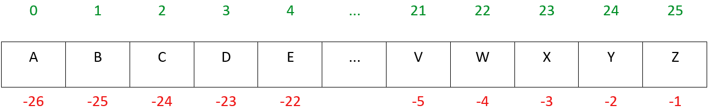

**Table des matières** 

1. [**Un langage de programmation ? Qu’est ce que c’est ?**](#_page0_x40.00_y432.92)

2. [**Quelques langages de programmation courants**](#_page2_x40.00_y36.92) 

3. [**Pseudo-code**](#_page2_x40.00_y367.92)
4. [**Python**](#_page2_x40.00_y464.92)

5. [**Exercices**](#_page10_x40.00_y36.92)

## **<H2 STYLE="COLOR:blue;">1. Un<a name="_page0_x40.00_y432.92"></a> langage de programmation ? Qu’est ce que c’est ?</h2>** 


Il existe plusieurs types de langages de programmation, mais le seul directement utilisable par le processeur est le langage machine constitué de 0 et de 1. Aujourd’hui, presque plus personne ne programme en langage machine.

On peut les classer en :

- **Langage machine** : binaire
- **Langage assembleur** : le langage machine s'exécute directement par un ordinateur après conversion en code machine.
- **Langage de haut niveau**
    - **Langage compilé** : C, C++, Pascal, OCaml
    - **Langage interprété** : Java, JavaScript, Ruby, Python

### **<h3 style="color:green;">1.1. Les langages compilés</h3>**


Dans ces langages, le code source (celui que vous écrivez) est tout d'abord **compilé** par un logiciel appelé **compilateur** en un code binaire qui est très facile à lire pour un ordinateur.


Ce schéma montre les étapes entre le code source, le code assembleur et le code binaire.

### **<h3 style="color:green;">1.2. Les langages interprétés</h3>**


Dans ces langages, le code source est **interprété** par un logiciel appelé **interpréteur**,qui exécute directement chaque ligne de code sans la transformer en code binaire.

### **<h3 style="color:green;">1.3. Principales différences</h3>**

Dans un langage interprété, **le même code source pourra marcher directement sur tout ordinateur**. Avec un langage compilé, il faudra (en général) **tout recompiler à chaque fois** ce qui pose parfois des soucis. 

Par contre, dans un langage **compilé**, le programme est directement exécuté sur l'ordinateur, donc il sera en général **plus rapide** que le même programme dans un langage interprété. 

### **<h3 style="color:green;">1.4. Un<a name="_page1_x40.00_y593.92"></a> langage particulier : Python</h3>** 


C’est une t**echnique mixte** : l’interprétation du **bytecode compilé**. C’est un bon compromis entre la facilité de développement et la rapidité d’exécution ; 

Le **bytecode** (forme intermédiaire) est **portable** sur tout ordinateur muni de la machine virtuelle 

Pour exécuter un programme, Python charge le fichier **source .py** en mémoire vive, en fait **l’analyse,** produit le **bytecode** et enfin **l’exécute**. Afin de ne pas refaire inutilement toute la phase d’analyse et de production, Python **sauvegarde le bytecode** produit (dans un fichier .pyo ou .pyc) et recharge simplement le fichier bytecode s’il est plus récent que le fichier source dont il est issu.  

## **<H2 STYLE="COLOR:BLUE;">2. Quelques<a name="_page2_x40.00_y36.92"></a> langages de programmation courants</h2>** 
### **<h3 style="color:green;">2.1. Historique<a name="_page2_x40.00_y58.92"></a></h3>** 



Ce schéma montre l'évolution et l'interconnexion des différents langages de programmation à travers les décennies, depuis le Fortran et le COBOL jusqu'à des langages modernes comme Python et Java.
### **<H3 STYLE="COLOR:GREEN;">2.2. «<a name="_page2_x40.00_y316.92"></a> Hello world ! »</h3>** 

C'est dans un mémorandum interne de Brian Kernighan, Programming in C : A tutorial, écrit en 1974 dans les laboratoires Bell, que l'on trouve la première version d'un mini-programme affichant à l'écran « Hello World! ».  

???+ question "Faire ce qui est proposé"

    {{ IDE() }}

## **<H2 STYLE="COLOR:BLUE;">3. Pseudo-code<a name="_page2_x40.00_y367.92"></a></h2>** 

En programmation, le pseudo-code est une façon de décrire un algorithme en respectant certaines conventions, mais sans référence à un langage de programmation en particulier. L'écriture en pseudo-code permet de développer une démarche structurée. 

Il n'existe **pas de convention universelle** pour le pseudo-code. Afin de bien nous comprendre dans la suite de ce cours, nous adopterons celle décrite ci-dessous. 

## **<H2 STYLE="COLOR:BLUE;">4. Python<a name="_page2_x40.00_y464.92"></a></h2>** 
### **<H3 STYLE="COLOR:GREEN;">4.1. Pourquoi<a name="_page2_x40.00_y486.92"></a> apprendre le langage Python ?</h3>** 

Python est un langage **simple et puissant**. Il permet d’écrire des **scripts très basiques**, mais grâce à ses nombreuses bibliothèques, il est également utilisé dans des **projets avancés** comme l’intelligence artificielle, la data science et le développement web.


### **<H3 STYLE="COLOR:GREEN;">4.2. Qu’est-ce<a name="_page2_x40.00_y550.92"></a> que c’est ?</h3>** 

En 1989, le hollandais **Guido van Rossum** a développé Python, un langage **multi-plateforme** et **gratuit**, distribué sous **licence libre**.


### **<H3 STYLE="COLOR:GREEN;">4.3. Premiers<a name="_page3_x40.00_y36.92"></a> pas avec Python</h3>** 

Dans cette section, vous allez explorer les fonctionnalités de base de Python en testant des commandes simples.

???+ question "Activité n°1 : Les calculs de base"

    **Tester :**

    ```python
    7 + 3 * 4
    (7 + 3) * 4
    10 / 3
    ```
    ??? success "Python"
        {{ IDE() }}

    ??? success "Solution"

        **Résultat :**
        ```
        19
        40
        3.3333333333333335
        ```

    Les règles de priorité en mathématiques sont-elles respectées ? **Oui** ✅

???+ question "Activité n°2 : Addition de nombres décimaux"

    **Tester :**

    ```python
    3.11 + 2.08
    ```
    ??? success "Python"
        {{ IDE() }}

    ??? success "Solution"

        **Résultat :**
        ```
        5.19
        ```

    **Remarque :** Python utilise la **virgule flottante**, ce qui peut entraîner des imprécisions pour certaines additions.

???+ question "Activité n°3 : Division entière et modulo"

    **Tester :**

    ```python
    11 // 5
    11 // 4
    11 % 4
    11 % 3
    ```
    ??? success "Python"
        {{ IDE() }}

    ??? success "Solution"

        **Résultat :**
        ```
        2
        2
        2
        1
        ```

    **Explication :**
    - `//` représente la **division entière** (quotient sans décimale).
    - `%` permet d’obtenir le **reste de la division**.


La division entière permet de déterminer la valeur tronquée de la division et le modulo permet de déterminer la valeur du reste. 

On souhaite effectuer la division de 3395  par 99.  



On s’est arrêté car 29 est plus petit que 99 et qu’on ne souhaitait pas aller plus loin et se retrouver avec un nombre à virgule. On a effectué une division dite division entière. On en déduit donc que 3395 = 99 \* 34 + 29

???+ question "Activité n°4 : Puissance (exponentiation)"

    **Tester :**

    ```python
    3 ** 2
    2 ** 3
    ```
    ??? success "Python"
        {{ IDE() }}

    ??? success "Solution"

        **Résultat :**
        ```
        9
        8
        ```


### **<h3 STYLE="COLOR:GREEN;">4.4. Variables,<a name="_page4_x40.00_y133.92"></a> et types de données</h3>** 

Une **variable** est un espace mémoire qui stocke une valeur.  

**Attention le symbole de l’affectation est =** 

#### **<H4 STYLE="COLOR:MAGENTA;">4.4.1. Déclaration et affichage d'une variable<a name="_page4_x40.00_y194.92"></a></h4>**

???+ question "Activité n°5 : Affectation et affichage"

    **Tester :**

    ```python
    age = 17
    print(age)  # Affiche la valeur de la variable
    print(type(age))  # Affiche le type de la variable
    ```
    ??? success "Python"
        {{ IDE() }}

    ??? success "Solution"

        **Résultat :**
        ```
        17
        <class 'int'>
        ```


???+ question "Activité n°6 : Incrémentation et décrémentation"

    **Tester :**

    ```python
    a = 10 
    a += 1  # On incrémente la valeur de a
    print(a)

    a -= 3  # On décrémente la valeur de a
    print(a)
    ```
    ??? success "Python"
        {{ IDE() }}

    ??? success "Solution"

        **Résultat :**
        ```
        11
        8
        ```


#### **<H4 STYLE="COLOR:MAGENTA;">4.4.2. Les<a name="_page4_x40.00_y602.92"></a> nombres à virgule flottante (float)</h4>**

???+ question "Activité n°7 : Les nombres flottants"

    **Tester :**

    ```python
    b = 17.0  # Le séparateur décimal est un point
    print(b)
    print(type(b))
    ```
    ??? success "Python"
        {{ IDE() }}

    ??? success "Solution"

        **Résultat :**
        ```
        17.0
        <class 'float'>
        ```


#### **<H4 STYLE="COLOR:MAGENTA;">4.4.4. Les<a name="_page5_x40.00_y196.92"></a> chaînes de caractères (str)</h4>**


???+ question "Activité n°8 : Manipulation de chaînes"

    **Tester :**

    ```python
    nom = 'Dupont'  # Chaîne entre apostrophes
    prenom = "Pierre"  # Chaîne entre guillemets
    print(nom, prenom)  # Affichage avec espace automatique
    ```
    ??? success "Python"
        {{ IDE() }}

    ??? success "Solution"

        **Résultat :**
        ```
        Dupont Pierre
        ```


???+ question "Activité n°9 : Concaténation de chaînes"

    **Tester :**

    ```python
    nom = 'Dupont'
    prenom = "Pierre"
    chaine = nom + " " + prenom  # Concaténation avec espace
    print(chaine)
    ```
    ??? success "Python"
        {{ IDE() }}

    ??? success "Solution"

        **Résultat :**
        ```
        Dupont Pierre
        ```

???+ question "Activité n°10 : Longueur d'une chaîne de caractères"

    **Tester :**

    ```python
    len("abc")
    ```
    ??? success "Python"
        {{ IDE() }}

    ??? success "Solution"

        **Résultat :**
        ```
        3
        ```

    La fonction **len()** permet de connaître le nombre de caractères dans une chaîne.

Un **slice** permet le découpage de structures de données séquentielles (comme les chaînes de caractères ou les listes). La syntaxe utilisée est : **[début:fin:pas].** 

NB : si pas < 0, la liste est parcourue dans le sens inverse. 



???+ question "Activité n°11 : Découpage de chaînes (slice)"

    **Tester :**

    ```python
    string = "ABCDEFGHIJKLMNOPQRSTUVWXYZ" 

    print(string[0])       # Premier caractère : 'A'
    print(string[2])       # Troisième caractère : 'C'
    print(string[:3])      # Trois premiers caractères : 'ABC'
    print(string[:13:2])   # Un caractère sur deux parmi les 13 premiers : 'ACEGIKM'
    print(string[::-1])    # Renversement de la chaîne : 'ZYXWVUTSRQPONMLKJIHGFEDCBA'
    print(string[13::-2])  # Un caractère sur deux à l'envers jusqu'à l'indice 0 : 'NLJHFDB'
    print(string[:13:-2])  # Un caractère sur deux en sens inverse à partir du 14e : 'ZXVTRP'
    print(string[-4:-2])   # Extraction des caractères d'indices -4 à -2 (exclu) : 'WX'
    ```
    ??? success "Python"
        {{ IDE() }}


???+ question "Activité n°12 : Attention aux apostrophes"

    **Tester :**

    ```python
    chaine = 'Aujourd\'hui'   # Séquence d'échappement \'
    print(chaine) 

    chaine = "Aujourd'hui"    # Utilisation des guillemets
    print(chaine)
    ```
    ??? success "Python"
        {{ IDE() }}


???+ question "Activité n°13 : Les sauts de ligne"

    **Tester :**

    ```python
    chaine = 'Premiere ligne\nDeuxieme ligne' 
    print(chaine)
    ```
    ??? success "Python"
        {{ IDE() }}

---

???+ question "Activité n°14 : Problème d'addition entre chaînes et nombres"

    **Tester :**

    ```python
    chaine = 'a' 
    # chaine = chaine + 2  # Provoque une erreur
    chaine2 = chaine + str(2)  # Solution correcte
    print(chaine2)  # Résultat : 'a2'
    ```
    ??? success "Python"
        {{ IDE() }}

    **Remarque :**  
    - Python **ne peut pas additionner directement** une chaîne (str) et un entier (int).  
    - La conversion explicite avec **str()** permet de résoudre ce problème.


???+ question "Activité n°15 : Conversion en minuscules"

    **Tester :**

    ```python
    chaine = "BONJOUR"
    chaine2 = chaine.lower()   # Convertit en minuscules
    print(chaine2) 
    print(chaine) 
    ```
    ??? success "Python"
        {{ IDE() }}


???+ question "Activité n°16 : Séparer une phrase en mots"

    **Tester :**

    ```python
    texte = "Il est important de construire"
    print(texte)

    mots = texte.split(' ')  # Découpe la phrase en mots
    print(mots)
    ```
    ??? success "Python"
        {{ IDE() }}


???+ question "Activité n°17 : Fusionner une liste en chaîne"

    **Tester :**

    ```python
    texte = "Il est important de construire"
    
    liste1 = ' '.join(texte)  # Séparé par un espace
    print(liste1) 

    liste2 = ','.join(texte)  # Séparé par une virgule
    print(liste2)
    ```
    ??? success "Python"
        {{ IDE() }}

#### **<H4 STYLE="COLOR:MAGENTA;">4.4.4. Les booléens (bool)</h4>**

???+ question "Activité n°18 : Les valeurs booléennes"

    **Tester :**

    ```python
    choix = True
    print(type(choix))  # Affiche le type
    ```
    ??? success "Python"
        {{ IDE() }}

    ??? success "Solution"

        **Résultat :**
        ```
        <class 'bool'>
        ```


???+ question "Activité n°19 : Comparaisons booléennes"

    **Tester :**

    ```python
    b = 10
    print(b > 8)
    print(b == 5)
    print(b != 10)
    print(0 <= b <= 20)
    ```
    ??? success "Python"
        {{ IDE() }}

    ??? success "Solution"

        **Résultat :**
        ```
        True
        False
        False
        True
        ```


???+ question "Activité n°20 : Opérateurs logiques"

    **Tester :**

    ```python
    note = 13.0
    print(note >= 12.0 and note < 14.0)
    ```
    ??? success "Python"
        {{ IDE() }}

    ??? success "Solution"

        **Résultat :**
        ```
        True
        ```


???+ question "Activité n°21 : Vérification d’appartenance (in)"

    **Tester :**

    ```python
    chaine = 'Bonsoir'
    print('soir' in chaine)  # Vérifie si 'soir' est présent
    ```
    ??? success "Python"
        {{ IDE() }}

    ??? success "Solution"

        **Résultat :**
        ```
        True
        ```


## **<H2 STYLE="COLOR:BLUE;">5. Exercices<a name="_page10_x40.00_y36.92"></a></h2>** 

=> **CAPYTALE Le code vous sera donné par votre enseignant**

<H3 STYLE="COLOR:red;">Exercice n°1</H3>  ☆ 

Afficher la taille en octets et en bits d’un fichier de 536 ko. 

On donne : 1 ko (1 kilooctet) = 1000 octets !!! 1 octet = 1 byte = 8 bits 


<H3 STYLE="COLOR:red;">Exercice n°2</H3>  ★ 

Le numéro de sécurité sociale est constitué de 13 chiffres auquel s’ajoute la clé de contrôle (2 chiffres). 
Exemple : le numéro entier de sécurité sociale est : 1 89 11 26 108 268 91; il se compose de 1891126108268 et de 91 qui est la clé de contrôle

La clé de contrôle située à la fin du numéro est calculée par la formule : 97 - (numéro de sécurité sociale modulo 97) Retrouver la clé de contrôle de votre numéro de sécurité sociale. Quel est l’intérêt de la clé de contrôle ? 


<H3 STYLE="COLOR:red;">Exercice n°3</H3> ★ 

Afficher la valeur numérique de √(4,63 - 15/16) Comparer avec votre calculette. 
Aide : vous aurez besoin de la fonction racine carrée de python. Pour cela il faut l'importer en commandant par la ligne suivante:
```python
from math import sqrt
``` 


<H3 STYLE="COLOR:red;">Exercice n°4</H3> 

★ 
A partir des deux variables prenom et nom, afficher les initiales (par exemple LM pour Léa Martin). 


<H3 STYLE="COLOR:red;">Exercice n°5</H3>★ 

Quels résultats donnent les instructions suivantes ?  

len("C'est facile de compter") 

len('123' \* 20) 


<H3 STYLE="COLOR:red;">Exercice n°6</H3>☆ 

Supposons que je veuille imprimer les quatre lignes suivantes :  

```txt
Hello World 
Aujourd'hui 
C'est "Dommage!" 
Hum \Oh/ 
```

Quel code est valide pour afficher le message ci-dessus **sans les tester auparavant** puis vérifier à l’aide d’une console python ? 

- code 1 
```
print('Hello World') 
print('Aujourd'hui') 
print('C'est "Dommage!"') 
print('Hum \Oh/') 
```
- code 2 
```
print("Hello World") 
print("Aujourd'hui") 
print("C'est "Dommage!"") 
print("Hum \Oh/") 
```
- code 3 
```
print("Hello World") 
print("Aujourd'hui") 
print("C'est \"Dommage!\"") 
print("Hum \\Oh/") 
```
- code 4 
```
print("Hello World") 
print("Aujourd'hui") 
print("C'est \"Dommage!\"") 
print("Hum \\Oh\/") 
```


<H3 STYLE="COLOR:red;">Exercice n°7</H3> ★☆ 

**PRÉPAREZ UNE MOUSSE AU CHOCOLAT !**  

La recette de la mousse au chocolat sur le site marmiton.org est la suivante : Ingrédients (pour 4 personnes) : 

3 oeufs 

100 g chocolat (noir ou au lait) 

1 sachet de sucre vanillé 

QUIZ SUR LA MOUSSE AU CHOCOLAT 

Pouvez-pour me dire, à une unité près, la quantité de chaque ingrédient que je dois avoir pour faire ma recette pour 7 personnes, en arrondissant les valeurs calculées à l’unité près (par exemple 3.4 est arrondi à 3 et 3.5 à 4) ? 

*Note :  La fonction prédéfinie round() peut vous aider. Pour comprendre comment, tapez dans une console help(round) (Et si l’anglais n’est pas votre fort, n’oubliez pas que google traduction ou un autre traducteur automatique est votre ami).* 


Pour faire de la mousse pour 7 personnes, combien d’oeufs vous faut-il (arrondis à l’unité) ? Combien de grammes de chocolat vous faut-il (arrondis à l’unité) ? Combien de sachets de sucres vanillés vous faut-il (arrondis à l’unité) ? Exemple : 

```python
Recette de mousse au chocolat pour 7 personnes 
Le nombre d'oeufs pour 7 personnes est : … 
La quantité de chocolat pour 7 personnes est : … 
Le nombre de sachet de vanille pour 7 personnes est :… 
```


Généraliser la recette pour un nombre déterminer par l’utilisateur. Par exemple : 

```python
Quel est le nombre de personne ?>? (l’utilisateur entre la valeur 10)
Recette de mousse au chocolat pour  10  personnes
Le nombre d'oeufs pour  10  personnes est : 8
La quantité de chocolat pour  10  personnes est : 250  g
Le nombre de sachet de vanille pour  10  personnes est : 2
```


**Remarque** : Vous aurez besoin de la fonction input() déjà vu en seconde

```python
a = int(input('quel est votre âge?')) # entrer votre âge
print(a)
```


<H3 STYLE="COLOR:red;">Exercice n°8</H3> ★☆ 

L’identifiant d’accès au réseau du lycée est construit de la manière suivante : initiale du prénom puis les 8 premiers caractères du nom (le tout en minuscule). 

Alexandre Lecouturier → alecoutur 

A partir des deux variables prenom et nom, construire l’identifiant. 


