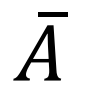
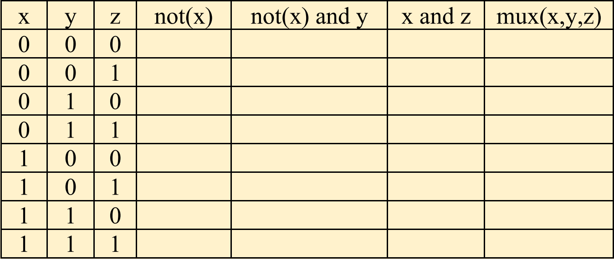
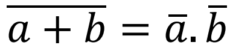
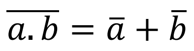
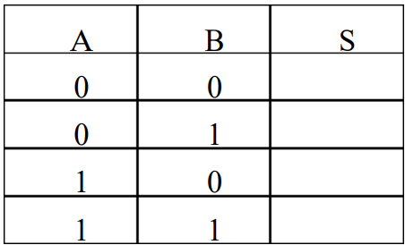
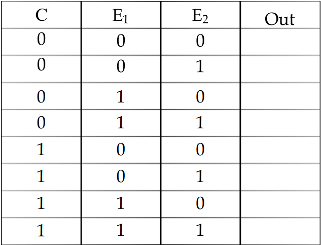
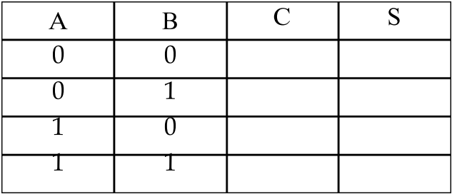

---
author: ELP
title: 05a Les booléens
---

**Table des matières** 

1. [L’algèbre de Boole ](#_page0_x40.00_y375.04)
2. [Les fonctions logiques et tables de vérité](#_page1_x40.00_y213.04)
3. [Quelques propriétés](#_page3_x40.00_y448.04)
4. [Exercices](#_page4_x40.00_y43.04)


## **<H2 STYLE="COLOR:BLUE;">1. L’algèbre<a name="_page0_x40.00_y375.04"></a> de Boole</h2>** 

L'**algèbre de Boole** est une branche des mathématiques qui traite des **opérations logiques**. Elle a été développée par **George Boole** et est largement utilisée en informatique et en électronique numérique.

✅ L’algèbre de Boole repose sur l’ensemble **B = {0, 1}** où :

- `0` représente **FAUX** (état bas).

- `1` représente **VRAI** (état haut).

On y retrouve trois **opérations fondamentales** :


### **<H3 STYLE="COLOR:GREEN;">1.1. ET<a name="_page0_x40.00_y473.04"></a></h3>** 

**Définition** : `a ET b` est VRAI **si et seulement si** `a` ET `b` sont tous deux VRAIS.

✅ Différentes notations :

- `a ⋅ b`

- `a ∧ b`

- `a & b` ou `a && b` (langages C, Java, PHP…)

- `a AND b` (Python, Pascal…)


### **<H3 STYLE="COLOR:GREEN;">1.2. OU<a name="_page0_x40.00_y591.04"></a></h3>** 

**Définition** : `a OU b` est VRAI **si et seulement si** `a` ou `b` (ou les deux) sont VRAIS.

✅ Différentes notations :

- `a + b`

- `a ∨ b`

- `a OR b` (Python, Pascal…)


### **<H3 STYLE="COLOR:GREEN;">1.3. NON<a name="_page1_x40.00_y43.04"></a></h3>** 

**Définition** : `NON a` est VRAI **si et seulement si** `a` est FAUX.

✅ Différentes notations :

- `¬a`

- `!a` (C, Java…)

- `NOT a` (Pascal, ASM…)

Le contraire de « a » est VRAI si et seulement si a est FAUX


## **<H2 STYLE="COLOR:BLUE;">2. Les<a name="_page1_x40.00_y213.04"></a> fonctions logiques et tables de vérité</h2>** 

L'algèbre de Boole est à la base des **circuits logiques** utilisés dans les ordinateurs.

💡 Un **transistor** fonctionne comme un **interrupteur** :  

- `1` : le courant passe (**état haut**).

- `0` : le courant ne passe pas (**état bas**).

🔹 Types de circuits logiques :

1. **Circuits combinatoires** : la sortie dépend uniquement des entrées.

2. **Circuits séquentiels** : la sortie dépend des entrées et de l’historique des états précédents.


### **<H3 STYLE="COLOR:GREEN;">2.1. La<a name="_page1_x40.00_y426.04"></a> porte NON (NOT)</h3>** 

| Entrée (`E`) | Sortie (`S`) |
|---|---|
| 0 | 1 |
| 1 | 0 |

✅ **La sortie est l'inverse de l'entrée.**

???+ question "Tester :"

    ```python
    def NOT(a):
        return not a

    print(NOT(1))  # Affiche 0
    print(NOT(0))  # Affiche 1
    ```

    ??? success "Python"
        {{ IDE() }}


La porte NON est symbolisée par le schéma suivant : 

|Symbole |Autre symbole |Opération |
| - | - | - |
||||

### **<H3 STYLE="COLOR:GREEN;">2.2. La<a name="_page1_x40.00_y623.04"></a> porte OU (OR)</h3>** 

| `E1` | `E2` | `S` (Sortie) |
|---|---|---|
| 0 | 0 | 0 |
| 0 | 1 | 1 |
| 1 | 0 | 1 |
| 1 | 1 | 1 |

✅ **La sortie est 1 si au moins une des entrées est 1.**

???+ question "Tester :"

    ```python
    def OR(a, b):
        return a or b

    print(OR(0, 1))  # Affiche 1
    print(OR(0, 0))  # Affiche 0
    ```

    ??? success "Python"
        {{ IDE() }}


La porte OU est symbolisée par le schéma suivant : 

|Symbole |Autre symbole |Opération |
| - | - | - |
|||E1 + E2 |

### **<H3 STYLE="COLOR:GREEN;">2.3. La<a name="_page2_x40.00_y162.04"></a> porte ET (AND)</h3>** 

| `E1` | `E2` | `S` (Sortie) |
|---|---|---|
| 0 | 0 | 0 |
| 0 | 1 | 0 |
| 1 | 0 | 0 |
| 1 | 1 | 1 |

✅ **La sortie est 1 uniquement si les deux entrées sont 1.**

???+ question "Tester :"

    ```python
    def AND(a, b):
        return a and b

    print(AND(1, 1))  # Affiche 1
    print(AND(1, 0))  # Affiche 0
    ```

    ??? success "Python"
        {{ IDE() }}


La porte ET est symbolisée par le schéma suivant : 


|Symbole |Autre symbole |Opération |
| - | - | - |
|||E1 . E2 |

### **<H3 STYLE="COLOR:GREEN;">2.4. La<a name="_page2_x40.00_y432.04"></a> porte OU EXCLUSIF (XOR)</h3>** 

| `E1` | `E2` | `S` (Sortie) |
|---|---|---|
| 0 | 0 | 0 |
| 0 | 1 | 1 |
| 1 | 0 | 1 |
| 1 | 1 | 0 |

✅ **La sortie est 1 uniquement si les entrées sont différentes.**

???+ question "Tester :"

    ```python
    def XOR(a, b):
        return a ^ b

    print(XOR(1, 1))  # Affiche 0
    print(XOR(1, 0))  # Affiche 1
    ```

    ??? success "Python"
        {{ IDE() }}


La porte XOR est symbolisée par le schéma suivant : 

|Symbole |Autre symbole |Opération |
| - | - | - |
||| |

### **<H3 STYLE="COLOR:GREEN;">2.5. La<a name="_page2_x40.00_y649.04"></a> porte NON ET (NAND)</h3>** 

|Symbole |Table de vérité |Opération |
| - | - | - |
||| |


### **<H3 STYLE="COLOR:GREEN;">2.6. La porte NON OU (NOR)</h3>** 

|Symbole |Table de vérité |Opération |
| - | - | - |
||| |


**<H3 STYLE="COLOR:red;">Activité n°1.:</H3>** Écrivez les tables de vérité des expressions suivantes : 

- 
- 
- 

**<H3 STYLE="COLOR:red;">Activité n°2.:</H3>** Voici un exemple de fonction booléenne : La fonction multiplexeur, notée mux.  
 
mux(x,y,z)=(not(x) and y)or (x and z) 
1  Compléter le tableau 

x y z not(x) not(x) and y x and z mux(x,y,z) 


2 Montrer que (x and y) = not (not(x) or not(y))  

3 Montrer que (x or y) = not (not(x) and not(y))  

4 Trouver l’expression  de  la  fonction  ssi(x,y)  à  l’aide  des  opérateurs booléens   


## **<H2 STYLE="COLOR:BLUE;">3. Quelques<a name="_page3_x40.00_y448.04"></a> propriétés</h2>** 
### **<H3 STYLE="COLOR:GREEN;">3.1. Associativité</h3>**

Certaines parenthèses peuvent être omises :

- `(a + b) + c = a + (b + c) = a + b + c`

- `(a ⋅ b) ⋅ c = a ⋅ (b ⋅ c) = a ⋅ b ⋅ c`


### **<H3 STYLE="COLOR:GREEN;">3.2. Commutativité<a name="_page3_x40.00_y528.04"></a></H3>** 

L'ordre des opérandes **n'a pas d'importance** :

- `a + b = b + a`

- `a ⋅ b = b ⋅ a`


### **<H3 STYLE="COLOR:GREEN;">3.3. Distributivité<a name="_page3_x40.00_y585.04"></a></h3>** 

On peut distribuer les opérations comme en algèbre classique :

- `a ⋅ (b + c) = (a ⋅ b) + (a ⋅ c)`

🚨 **Attention** : La distributivité de `ET` sur `OU` **ne fonctionne pas comme en arithmétique**.

 

### **<H3 STYLE="COLOR:GREEN;">3.4. Lois<a name="_page3_x40.00_y649.04"></a> de Morgan</h3>**[^2] 


Le  complément  d’une  somme  logique  (non  arithmétique)  est  égal  au  produit  logique  (non  arithmétique) des termes complémentés. Loi de Morgan  

  

Le  complément  d’un  produit  logique  (non  arithmétique)  est  égal  à  la  somme  logique  (non  arithmétique) des termes complémentés.  



✅ **Les lois de De Morgan permettent de transformer une opération en son opposée.**

???+ question "Tester :"

    ```python
    def de_morgan_1(a, b):
        return not (a or b) == (not a and not b)

    def de_morgan_2(a, b):
        return not (a and b) == (not a or not b)

    print(de_morgan_1(1, 0))  # Affiche True
    print(de_morgan_2(1, 1))  # Affiche True
    ```

    ??? success "Python"
        {{ IDE() }}

## **<H2 STYLE="COLOR:BLUE;">4. Exercices<a name="_page4_x40.00_y43.04"></a></h2>** 

=> **CAPYTALE Le code vous sera donné par votre enseignant**


**<H3 STYLE="COLOR:red;">Exercice n°1</H3>** ★ **:** On considère le circuit logique suivant. 


1. Réaliser le circuit à l’aide du logiciel Logisim. 
2. Donner l’expression booléenne de S en fonction des variables A et B. 
3. Compléter la table de vérité ci-dessous. 



4 Par quel circuit comprenant seulement deux portes peut-on remplacer le circuit étudié ? 

**<H3 STYLE="COLOR:red;">Exercice n°2</H3>** ★ :  On considère le circuit logique ci-dessous 


1 Donner l’expression booléenne de S en fonction des variables A, B et C. 

2 Compléter la table de vérité ci-dessous 


3 En déduire une formule pour S qui ne dépend que des variables A et B. 

**<H3 STYLE="COLOR:red;">Exercice n°3</H3>** ★ : On considère les circuits logiques ci-dessous 


1 Donner les expressions booléennes de U et V en fonction des variables A, B et C. 

2 Compléter les tables de vérité ci-dessous. 


3 Les expressions booléennes U et V sont-elles équivalentes ? 

**<H3 STYLE="COLOR:red;">Exercice n°4</H3>** ★– (circuit MUX-2) : On considère le circuit logique suivant.


1. Donner l’expression de Out en fonction  de E1 et E2. 
2. Compléter le tableau de vérité de ce circuit. 

Le circuit étudié est appelé multiplexeur à 2 entrées. Selon la valeur de la commande (C), il permet de  reproduire en sortie (Out) : 

- le signal E1 si C est à 0. 
- le signal E2 si C est à 1. 

 


**<H3 STYLE="COLOR:red;">Exercice  n°5</H3>**  (circuit MUX-4)  

On  considère  un  multiplexeur  à  4  entrées, dont le circuit  est  représenté  ci- dessous.  


1. Par analyse du circuit, déterminer l’expression booléenne de Out en fonction des entrées E1,  E2, E3, E4 et des commandes C0 et C1. 

2. Quelles sont les valeurs des commandes C0 et C1 qui permettent de sélectionner en sortie (Out) : 

- l’entrée E1 ? 
- l’entrée E2 ? 
- l’entrée E3 ? 
- l’entrée E4 ? 

**<H3 STYLE="COLOR:red;">Exercice n °6</H3>** ★★– (Half adder) Le circuit étudié, appelé  demi-additionneur, permet d’additionner deux bits A et B.  Il  comporte  deux  sorties  C  et  S  qui  représentent  deux  expressions booléennes.  


1 Donner les expressions booléennes de C et S  en  fonction de A et B.  
2 Compléter la table de vérité de C et S. 

 

3 Quel est le rôle des sorties C et S dans la fonction  du circuit ? 


Le choix de la lettre C vient du fait qu’en anglais,  « retenue»se dit«carry».  

**<H3 STYLE="COLOR:red;">Exercice  n°7</H3>**  ★★–  *(Full adder)* Le circuit étudié dans cet  exercice  permet  d’additionner  deux bits en tenant compte d’une  retenue Cin. 


Réaliser ce circuit à l’aide du logiciel Logisim et compléter la table de vérité ci-dessous. 


**<H3 STYLE="COLOR:red;">Exercice n°8</H3>** ★★**:** Soit le circuit ci-dessous : 


1. Écrivez l'équation de ce circuit. 
2. Établissez la table de vérité de ce circuit. 

**<H3 STYLE="COLOR:red;">Exercice n°9 ★★★ :</H3>** 

Un pont peut supporter 10 tonnes au maximum. La route menant au pont est strictement interdite aux véhicules de plus de 10 tonnes. À chaque extrémité du pont se trouve une barrière et une bascule pour mesurer le poids (a ou b) des véhicules. 


Si un seul véhicule attend devant le pont, la barrière devant lui (A ou B) s'ouvre (étape initiale). Sinon : 

- Si a + b ≤ 10 tonnes, les barrières A et B s'ouvrent. 
- Si a + b > 10 tonnes, seule la barrière correspondant au véhicule le plus léger s'ouvre. 

L'autre véhicule attend que le premier ait franchi le pont, puis le protocole d'ouverture des barrières recommence à l'étape initiale. 

- Si a = b, la barrière A s'ouvre en priorité. 

Indication : a et b n'étant pas des variables binaires, il convient de créer deux variables binaires x et y et de reformuler l'énoncé du problème. 

Aide : on posera x= a + b <= 10  et  y = a > b 

1. Écrivez la table de vérité pour l'ouverture des barrières A et B. 
2. Donnez les équations logiques pour l'ouverture des barrières A puis pour l’ouverture de la barrière B. 
3. Dessinez le circuit logique déterminant l'ouverture des barrières. 


[^1]: ` `*A Programming Language* : langage adapté aux calculs statistiques 
[^2]: Augustus De Morgan (1806-1871) : Logicien et Mathématicien Anglais 