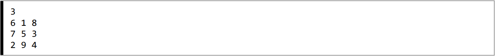

---
author: ELP
title: 05b Types construits
---


**Table des matières** 

1. [Les séquences en Python](#_page0_x40.00_y242.92)
2. [Les dictionnaires](#_page6_x40.00_y36.92)
3. [Exercices](#_page9_x40.00_y273.92)

## **<H2 STYLE="COLOR:BLUE;">1.  Les<a name="_page0_x40.00_y242.92"></a> séquences en Python</h2>** 

Python permet de **stocker plusieurs valeurs** dans une seule structure appelée **séquence**.  

🔹 Une **séquence** est un **ensemble fini et ordonné** d'éléments, chacun ayant un **indice** qui commence à **0** et se termine à **n-1** (où n est la taille de la séquence).  

🛠 **Types de séquences en Python :**  

📌 **Les tuples** : Séquences **immuables** (non modifiables après leur création).

📌 **Les listes** : Séquences **mutables** (modifiables à tout moment).  


### **<H3 STYLE="COLOR:GREEN;">1.1.  Les<a name="_page0_x40.00_y378.92"></a> tuples en Python</h3>** 

#### **<H4 STYLE="COLOR:MAGENTA;">1.1.1. Définition</h4>**


Un **tuple** est une séquence **immuable** (*non modifiable après sa création*). Une fois défini, son contenu **ne peut pas être modifié, ajouté ou supprimé**.  

📌 **Syntaxe :**  

Un tuple peut être défini avec des **parenthèses `()`** ou sans parenthèses.

???+ question "Activité n°1 : Création d'un tuple"

    🔹 **Tester :**  

    ```python
    tuple1 = ('a', 123, True)  # Avec parenthèses
    tuple2 = 'hello',  # Sans parenthèses (notez la virgule)
    
    print(tuple1)
    print(tuple2)
    ```

    ??? success "Python"
        {{ IDE() }}

#### **<H4 STYLE="COLOR:MAGENTA;">1.1.2. Transformer une liste en tuple</h4>**

Python permet de **convertir une liste** en tuple grâce à la fonction `tuple()`.  

???+ question "Activité n°2 : Conversion d'une liste en tuple"

    🔹 **Tester :**  

    ```python
    liste = [7, 5, 6, 8, 3]  # Une liste
    a = tuple(liste)  # Conversion en tuple
    print(a)  
    ```

    ❗ **Attention** : La fonction `tuple()` peut ne pas fonctionner sur certaines versions de Python sur Basthon.

    ??? success "Python"
        {{ IDE() }}


#### **<H4 STYLE="COLOR:MAGENTA;">1.1.3. Concaténation de tuples</h4>**

📌 Deux **opérations principales** sont possibles avec les tuples :  

✅ **Concaténation (`+`)** : Assemble deux tuples. 

✅ **Répétition (`*`)** : Répète un tuple plusieurs fois.  

???+ question "Activité n°3 : Concaténation et répétition"

    🔹 **Tester :**  

    ```python
    t1 = ('a', 'b')
    t2 = ('c', 'd')
    
    print(t1 + t2)  # Concaténation
    print(3 * t1)  # Répétition
    ```

    ??? success "Python"
        {{ IDE() }}

#### **<H4 STYLE="COLOR:MAGENTA;">1.1.4. Accéder aux éléments d'un tuple</h4>**

Les tuples sont **indexés** comme les listes, ce qui permet d’accéder à leurs éléments avec des **indices**.

???+ question "Activité n°4 : Accès aux éléments d'un tuple"

    🔹 **Tester :**  

    ```python
    t = ("a", 1, "b", 2, "c", 3)

    print(len(t))  # Nombre d'éléments
    print(t[2])  # Troisième élément
    print(t[-1])  # Dernier élément
    print(t[1:3])  # Éléments d'indice 1 à 3 (non compris)
    print(t[0:5:2])  # De 0 à 5 (non compris), par pas de 2
    ```

    📌 **Les indices commencent à 0.**

    ??? success "Python"
        {{ IDE() }}


#### **<H4 STYLE="COLOR:MAGENTA;">1.1.5. Tuples imbriqués (Tuple de tuples)</h4>**

Un tuple peut **contenir d'autres tuples**.  

???+ question "Activité n°5 : Tuples imbriqués"

    🔹 **Tester :**  

    ```python
    tuple1 = ('a', 123, True)
    tuple2 = (13, 17)
    grand_tuple = (tuple1, tuple2, 'Hello!')

    print(grand_tuple)
    print(grand_tuple[1][0])  # Accéder au premier élément du deuxième tuple
    ```

    ??? success "Python"
        {{ IDE() }}

💡 **Un tuple est immuable** mais **peut contenir des objets modifiables** comme des listes.

#### **<H4 STYLE="COLOR:MAGENTA;">1.1.6. Parcourir un tuple avec une boucle</h4>**

📌 On peut parcourir un tuple **de deux manières** :  

🔹 **1ère méthode** : Lire directement les éléments.  

🔹 **2ème méthode** : Parcourir avec les indices.

???+ question "Activité n°6 : Parcours d'un tuple"

    🔹 **Tester :**  

    ```python
    prenoms = ("Bruno", "Marie")

    for element in prenoms:  # Méthode 1
        print(element)

    for i in range(len(prenoms)):  # Méthode 2
        print(prenoms[i])
    ```

    ??? success "Python"
        {{ IDE() }}

#### **<H4 STYLE="COLOR:MAGENTA;">1.1.7. Retourner plusieurs valeurs avec un tuple</h4>**


Une **fonction en Python** peut retourner **plusieurs valeurs** grâce aux tuples.

???+ question "Activité n°7 : Retour de plusieurs valeurs"

    🔹 **Tester :**  

    ```python
    def add(a, b):
        c = a + b
        return (a, b, c)  # Retourne un tuple

    mon_tuple = add(5, 8)
    print(f"{mon_tuple[0]} + {mon_tuple[1]} = {mon_tuple[2]}")
    ```

    ??? success "Python"
        {{ IDE() }}

📌 **Remarque** : Les **f-strings** (`f"{variable}"`) permettent d'afficher des expressions plus lisibles.

#### **<H4 STYLE="COLOR:MAGENTA;">1.1.8. Opérations courantes sur les tuples</h4>**

| **Opérations/Méthodes** | **Description** |
|------------------|-----------------------------------|
| `x in s`  | Vérifie si `x` est dans `s` |
| `x not in s` | Vérifie si `x` n'est pas dans `s` |
| `len(s)` | Nombre d’éléments de `s` |
| `s[i]` | Accès à l’élément d’indice `i` |
| `s[i:j]` | Extraction des éléments de `i` à `j` (exclu) |
| `s.index(x)` | Indice de la première occurrence de `x` |
| `s.count(x)` | Nombre d’occurrences de `x` |
| `s + t` | Concaténation de `s` et `t` |
| `n * t` | Répète `t` `n` fois |

📌 **Attention :** Contrairement aux listes, les tuples **ne peuvent pas être modifiés** après leur création.

#### **<H4 STYLE="COLOR:MAGENTA;">1.2.   Exercices</h4>** 

=> **CAPYTALE Le code vous sera donné par votre enseignant**

**<H3 STYLE="COLOR:red;">Exercice 1 : Accès aux éléments</H3>**  

Écrire une fonction `deuxieme(t)` qui renvoie le **deuxième élément** du tuple `t`.

Test :

```python
t = ("Alice", 17, "1ère NSI")
assert deuxieme(t) == 17
```
**<H3 STYLE="COLOR:red;">Exercice 2 : longueur d'un tuple</H3>** 
Écrire une fonction `taille(t)` qui renvoie le **nombre d’éléments** dans le tuple `t`.

Test :

```python
assert taille(("a", "b", "c")) == 3
```

**<H3 STYLE="COLOR:red;">Exercice 3 : Concaténation de tuples</H3>** 
Écrire une fonction `concat(t1, t2)` qui renvoie la **concaténation** de deux tuples.

Test :

```python
assert concat((1, 2), (3, 4)) == (1, 2, 3, 4)
```

**<H3 STYLE="COLOR:red;">Exercice 4 : Extraction de sous-tuples</H3>** 
Écrire une fonction `sous_tuple(t)` qui renvoie un **sous-tuple contenant les deux premiers éléments**.

Test :

```python
assert sous_tuple((10, 20, 30, 40)) == (10, 20)
```

**<H3 STYLE="COLOR:red;">Exercice 5 : parcours d'un tuple</H3>** 
Écrire une fonction `afficher(t)` qui **affiche chaque élément du tuple `t` sur une ligne différente**.

Exemple :

```python
afficher(("maths", "nsi", "anglais"))
```

Affichage attendu :

```
maths
nsi
anglais
```

**<H3 STYLE="COLOR:red;">Exercice 6 : Tuple et boucle</H3>** 
Écrire une fonction `moyenne(t)` qui renvoie la **moyenne** des nombres contenus dans un tuple `t`.

Test :

```python
assert moyenne((12, 13, 14)) == 13.0
```


**<H3 STYLE="COLOR:red;">Exercice 7 :**  **Test d’appartenance :</H3>** En utilisant un parcours de tuple avec la présence d'un indice, écrire une fonction `est_dans(element,tple)` qui en argument reçoit un entiers ( élément) et un tuple d'entier ( tple) qui renvoie un booleen indiquant la présence de élément dans tuple. On testera la fonction sur les scripts suivants : 

Par exemple:
```python
assert est_dans(4,(1,2,3,4,5,6)) == True

assert est_dans(9,(1,2,3,4,5,6)) == False
```

En Python, une fonction qui renvoie plusieurs éléments ( ex : return a,b,c ) renvoie un tuple.
 

**Remarque** : on codera la fonction `est_dans(element,tple)` de 2 manières

- classiquement

- à l'aide du fonction lambda 


### **<H3 STYLE="COLOR:GREEN;">1.3.  Les<a name="_page2_x40.00_y419.92"></a> tableaux en Python : Les Listes</h3>** 

En Python, **les tableaux sont appelés des listes**. Une liste est une **séquence mutable**, ce qui signifie qu'on peut **modifier son contenu après sa création**.  

Contrairement à certains langages où les tableaux ont une **taille fixe** et contiennent des éléments d’un type unique (comme en C), les listes Python peuvent contenir des éléments de types différents et être redimensionnées dynamiquement.

📌 **Définition :**  

Une liste est une **collection d’éléments** séparés par des virgules et entourés de crochets `[]`.  

📌 **Caractéristiques des listes :**  

✅ **Modifiables** : On peut ajouter, supprimer ou modifier des éléments.  

✅ **Indexées** : Chaque élément a un indice, commençant à `0`.  

✅ **Hétérogènes** : Une liste peut contenir des éléments de **différents types** (nombres, chaînes, booléens…).  


#### **<H4 STYLE="COLOR:MAGENTA;">1.3.1. Création de listes en Python</h4>**

???+ question "Activité n°8 : Création de listes"

    🔹 **Tester :**  

    ```python
    liste_vide = []  # Une liste vide
    liste1 = 10 * [0]  # Liste contenant dix zéros
    liste2 = list(range(2, 10, 3))  # Liste contenant les nombres de 2 à 10 avec un pas de 3

    print(liste_vide)
    print(liste1)
    print(liste2)
    ```

    ??? success "Python"
        {{ IDE() }}

📌 **Remarque :**  

🔹 `range(a, b, p)` crée une **suite de nombres** de `a` à `b` **exclu** avec un pas `p`.  

🔹 **ATTENTION** : La borne inférieure est incluse, mais **la borne supérieure est exclue**.  

#### **<H4 STYLE="COLOR:MAGENTA;">1.3.2. Construction de listes par compréhension</h4>**

Python permet de créer des listes de manière **optimisée et élégante** grâce aux **list comprehensions**.

???+ question "Activité n°9 : Construction par compréhension"

    🔹 **Tester :**  

    ```python
    carres = [i * i for i in range(11)]  # Liste des carrés de 0 à 10
    print(carres)
    ```

    ??? success "Python"
        {{ IDE() }}

📌 **Pourquoi utiliser cette méthode ?** 

✅ Plus **rapide** et **plus lisible** qu'une boucle classique.  

✅ Évite d’utiliser `.append()` pour ajouter des éléments.  

❌ **Ne pas faire** :

```python
carres = []
for i in range(11):
    carres.append(i * i)  # Ajout manuel (moins optimal)
```

#### **<H4 STYLE="COLOR:MAGENTA;">1.3.3. Exemples avancés de compréhension de liste</h4>**

???+ question "Activité n°10 : Création avancée de listes"

    🔹 **Tester :**  

    ```python
    multiples_de_3 = [3 * i for i in range(30)]  # Multiples de 3
    multiples_de_6 = [2 * n for n in multiples_de_3]  # Multiples de 6 à partir de ceux de 3

    mon_tab = [p for p in range(0, 5)]  # Liste de 0 à 4

    liste = [1, 7, 9, 15, 5, 20, 10, 8]

    mon_tab2 = [element for element in liste if element > 10]  # Garde les éléments > 10
    mon_tab3 = [elm ** 2 for elm in liste if elm < 10]  # Carrés des éléments < 10
    mon_tab4 = [[[i, j] for i in range(3)] for j in range(2)]  # Liste imbriquée

    import random
    resultat = [random.randint(1, 6) for i in range(10)]  # 10 nombres aléatoires entre 1 et 6

    print(multiples_de_3)
    print(multiples_de_6)
    print(mon_tab)
    print(mon_tab2)
    print(mon_tab3)
    print(mon_tab4)
    print(resultat)
    ```

    ??? success "Python"
        {{ IDE() }}


#### **<H4 STYLE="COLOR:MAGENTA;">1.3.4. Copier une liste en Python</h4>**

En Python, copier une liste **correctement** est important pour éviter les erreurs !

???+ question "Activité n°11 : Copie d'une liste"

    🔹 **Tester :**  

    ```python
    liste3 = [1, 49, 81, 25, 64]
    liste4 = liste3[:]  # Copie classique
    liste5 = liste3[::-1]  # Liste inversée
    liste6 = list(liste5)  # Copie avec list()

    print(liste4)
    print(liste5)
    print(liste6)
    ```

    ??? success "Python"
        {{ IDE() }}

📌 **ATTENTION ⚠️** :  

Si on fait `liste6 = liste5`, on ne crée **pas une nouvelle liste**, mais un **lien** entre `liste6` et `liste5`. Toute modification sur l’une **affectera l’autre** !  

#### **<H4 STYLE="COLOR:MAGENTA;">1.3.5. Ajouter et supprimer des éléments d'une liste</h4>**

???+ question "Activité n°12 : Ajouter et supprimer des éléments"

    🔹 **Tester :**  

    ```python
    liste3 = [1, 49, 81, 25, 64]
    liste3.append("dernier élément")  # Ajout à la fin
    print(liste3)

    liste3.pop(1)  # Supprime l'élément à l'indice 1
    print(liste3)
    ```

    ??? success "Python"
        {{ IDE() }}

#### **<H4 STYLE="COLOR:MAGENTA;">1.3.6. Manipuler des chaînes avec les listes</h4>**

Les listes sont **très utiles** pour manipuler des chaînes de caractères grâce aux méthodes `.split()` et `.join()`.

???+ question "Activité n°13 : Découpage et fusion de chaînes"

    🔹 **Tester :**  

    ```python
    citation = "Je ne cherche pas à connaître les réponses, je cherche à comprendre les questions."

    liste = citation.split(" ")  # Découpe la phrase en liste de mots
    phrase2 = " ".join(liste)  # Recrée la phrase en ajoutant des espaces

    print(liste)
    print(phrase2)
    ```

    ??? success "Python"
        {{ IDE() }}


#### **<H4 STYLE="COLOR:MAGENTA;">1.3.7. Méthodes spécifiques aux listes</h4>**

|Contrairement aux tuples, les listes possèdent **des méthodes supplémentaires** :

| **Méthode** | **Description** |
|------------|----------------|
| `s.append(x)` | Ajoute `x` à la fin de `s`. |
| `s[i] = x` | Modifie l’élément d’indice `i`. |
| `s.insert(i, x)` | Insère `x` à l’indice `i`. |
| `s.remove(x)` | Supprime le premier élément `x` rencontré. |
| `s.pop(i)` | Supprime l’élément à l’indice `i` (ou le dernier par défaut). |
| `s.sort()` | Trie la liste. |
| `s.reverse()` | Inverse l’ordre des éléments. |


**Pourquoi utiliser un tuple plutôt qu'une liste ?**  

✅ **Un tuple est plus rapide qu'une liste.**  

✅ **Si les valeurs ne doivent pas être modifiées, il est préférable d'utiliser un tuple.**  

✅ **Les tuples sont protégés contre les modifications accidentelles.**  

### **<H3 STYLE="COLOR:GREEN;">1.4. Exercices</h3>** 

**<H3 STYLE="COLOR:red;">Exercice 8 :**  **Longueur d'une liste :</H3>**
Ecrire une fonction `longueur(tab)` qui prend un tableau tab en paramètre et qui renvoie la longueur de ce tableau

Exemple :
```python
assert longueur([0,1,2,3,4]) == 5
assert longueur([]) == 0
```

**<H3 STYLE="COLOR:red;">Exercice 9 :**  **Appartenance :</H3>**
Écrire fonction `dansTab` de paramètres T : un tableau et a : un élèment, qui indique si l’élément donné a appartient à un tableau T ou pas. 

Exemple :
```python
assert dansTab( [3,5,7,0] , 4) == False
assert dansTab( [3,5,7] , 3) == True
```

**<H3 STYLE="COLOR:red;">Exercice 10 :**  **Liste aléatoire :</H3>**
Ecrire une fonction `list_alea(n)` qui prend en paramètre n et qui renvoie une liste de nombre aléatoire compris entre 0 et 9 de taille n

Exemple :
```python
print(list_alea(3))
```
renvoie
```
[2,4,9]
```


**<H3 STYLE="COLOR:red;">Exercice 11 :**  **Somme :</H3>**
Compléter le code python de la fonction `somme` qui prend en paramètre une liste L de flottants et qui renvoie la somme des éléments de cette liste. 

**Attention** ne pas utiliser la fonction, sans utiliser la fonction built-in (intégrée) de Python : sum()

```python
def somme (L) : 
  s=0 
  …………. 
    ………… 
return s
```
Exemple :
```python
assert somme([1,5,9,5]) == 20 
assert somme([]) == 0 
```

**<H3 STYLE="COLOR:red;">Exercice 12 :**  **Moyenne :</H3>**
En faisant appel à la fonction `somme` précédente, écrire la fonction `moyenne` qui prend en paramètre une liste L et qui renvoie la moyenne m des éléments de cette liste. 

**Attention** ne pas utiliser la fonction, sans utiliser la fonction built-in (intégrée) de Python : sum()

Exemple :
```python
assert moyenne([1,5,9,5]) == 5 
assert moyenne([2,4,6]) == 4
```

**<H3 STYLE="COLOR:red;">Exercice 13 :**  **Produit :</H3>**
Écrire une fonction `produit(T)` qui prend en argument  un tableau  T d’entiers et renvoie le produit des éléments de T. 


Exemple :
```python
assert produit([2,3,2]) == 12
assert produit([3,2]) == 6
```

**<H3 STYLE="COLOR:red;">Exercice 14 :**  **Le plus grand élément :</H3>**
Écrire une fonction `maximum` qui prend en argument un tableau T d’entiers non vide et renvoie le plus grand élément de ce tableau. 

**Attention** ne pas utiliser la fonction, sans utiliser la fonction built-in (intégrée) de Python : max()

Exemple :
```python
assert maximum([1,5,9,6]) == 9
assert maximum([-1,-5,-9,-6,-2]) == -1
```

**<H3 STYLE="COLOR:red;">Exercice 15 :**  **Le plus petit élément :</H3>**
Écrire une fonction `minimum` qui recherche la valeur minimum d’un tableau T d’entiers non vide et renvoie également son indice comme valeur de retour.

Exemple :
```python
assert minimum([1,5,9,6]) == (1,0)
assert minimum([-1,-5,-9,-6,-2]) == (-9, 2)
```

**<H3 STYLE="COLOR:red;">Exercice 16 :**  **Nombre de fois :</H3>**
Écrire une fonction `nbre_de_fois(T,a)` qui prend en argument  une liste T et une valeur a et renvoie 
en sortie le nombre de fois où cette valeur a, est présente dans la liste T.

Exemple :
```python
assert nbre_de_fois([1,5,9,6],5) == 2
assert nbre_de_fois([-1,-5,-9,-6,-2], 5) == 0
```

**<H3 STYLE="COLOR:red;">Exercice 17 :**  **Renversement de tableau :</H3>**
Écrire une fonction `renverse(tab)` qui renverse un tableau tab(la première valeur devient la dernière, la deuxième l’avant dernière, etc) **de deux manières différentes**.

Par exemple, si le tableau est trié en ordre croissant au début de la fonction il doit être trié en ordre décroissant par l’algorithme. 

Exemple :
```python
assert renverse([1,5,9,6]) == [6,9,5,1]
assert renverse([1,2,3]) == [3,2,1]
```

### **<H3 STYLE="COLOR:GREEN;">1.5.  Les<a name="_page5_x40.00_y36.92"></a> tableaux de tableaux</h3>** 

En Python, **les tableaux peuvent contenir d'autres tableaux**.  
Ce type de structure est appelé une **matrice** et est utilisé dans de nombreux domaines comme :  

📌 **Applications des matrices :**  

✅ **Mathématiques** : Manipulation de données sous forme de tableaux. 

✅ **Traitement d’images** : Une image est une **matrice de pixels**. 

✅ **Intelligence Artificielle & Machine Learning** : Utilisation d’algèbre linéaire.

#### **<H4 STYLE="COLOR:MAGENTA;">1.5.1. Définition et Notation des Matrices</h4>**


On appelle **matrice** un **tableau de tableaux**, où chaque tableau **a la même longueur**.  

📌 **Représentation d’une matrice de taille `(n, m)` en mathématiques :**  


$A = \begin{bmatrix}
a_{1,1} & a_{1,2} & a_{1,3} \\
a_{2,1} & a_{2,2} & a_{2,3} \\
a_{3,1} & a_{3,2} & a_{3,3}
\end{bmatrix}$


📌 **Notation en Python :**  

Une matrice en **Python** est une **liste de listes**, où :  

✅ **Ligne `i`** = `m[i]`  

✅ **Colonne `j` dans la ligne `i`** = `m[i][j]`  

📌 **Organisation d’une matrice en Python :**  

```python
m = [[1, 3, 4], 
     [5, 6, 8], 
     [2, 1, 3], 
     [7, 8, 15]]
```

#### **<H4 STYLE="COLOR:MAGENTA;">1.5.2. Accéder aux éléments d'une Matrice</h4>**


???+ question "Activité n°14 : Accéder aux éléments d'une Matrice"

    🔹 **Tester :**  

    ```python
    m = [[1, 3, 4], 
         [5, 6, 8], 
         [2, 1, 3], 
         [7, 8, 15]]

    # Accéder à l'élément ligne 1, colonne 2 (sans oublier que l'indice commence à 0)
    a = m[1][2]  
    print(a)  # Doit afficher 8
    ```

    ??? success "Python"
        {{ IDE() }}

📌 **Remarque :**  

✅ **Les indices commencent à `0` !**  

✅ `m[i][j]` renvoie l’élément de la **ligne `i` et colonne `j`**.

#### **<H4 STYLE="COLOR:MAGENTA;">1.3.3. Parcourir une Matrice avec une Double Boucle `for`</h4>**


En Python, on peut parcourir tous les éléments d'une matrice **grâce à une double boucle**.

???+ question "Activité n°15 : Parcourir une Matrice"

    🔹 **Tester :**  

    ```python
    m = [[1, 3, 4], 
         [5, 6, 8], 
         [2, 1, 3], 
         [7, 8, 15]]

    nb_lignes = len(m)  # Nombre de lignes
    nb_colonnes = len(m[0])  # Nombre de colonnes (assumant que toutes les lignes ont la même longueur)

    for i in range(nb_lignes):  # Parcours des lignes
        for j in range(nb_colonnes):  # Parcours des colonnes
            print(f"Élément à [{i},{j}] : {m[i][j]}")
    ```

    ??? success "Python"
        {{ IDE() }}

📌 **Explication :**  

✅ `len(m)` donne **le nombre de lignes**.  

✅ `len(m[0])` donne **le nombre de colonnes** (assumant une matrice régulière). 

✅ La **double boucle** parcourt chaque élément **ligne par ligne** et **colonne par colonne**.  


🔥 **Pourquoi utiliser une Matrice en Python ?**  

✅ **Manipulation simple** : Une **liste de listes** est une **solution efficace** pour gérer des données tabulaires.  

✅ **Optimisation** : Python possède des **bibliothèques puissantes comme `numpy`** pour les matrices complexes.  

✅ **Flexibilité** : Facile à modifier et adapter aux **besoins des programmes**.  

### **<H3 STYLE="COLOR:GREEN;">1.6.  Exercices</h3>** 

**<H3 STYLE="COLOR:red;">Exercice 18 :** **Affichage de matrice :</H3>**
Ecrire la fonction `affichage(M)` qui prend en paramètre une matrice de taille quelconque et **l’affiche** ligne par ligne

Exemple :
```python
m = [[1, 3, 4], 
     [5, 6, 8], 
     [2, 1, 3], 
     [7, 8, 15]]
print(affichage(m))
```
On obtient:
```
[1, 3, 4]
[5, 6, 8]
[2, 1, 3]
[7, 8, 15]
```

**<H3 STYLE="COLOR:red;">Exercice 19 :** **Affichage de coefficient de matrice :</H3>**
Ecrire la fonction `affichagecoeff(M)` qui prend en paramètre une matrice de taille quelconque et **affiche** tous ces coefficients dans le sens de la lecture

Exemple :
```python
m = [[1, 3], 
     [5, 6], 
     [2, 1], ]
print(affichagecoeff(m))
```
On obtient:
```
1
3
5
6
2
1
```

**<H3 STYLE="COLOR:red;">Exercice 20 :** **Affichage d'une ligne de matrice :</H3>**
Ecrire la fonction `affichage_ligne(M,i)` qui prend en paramètre une matrice de taille quelconque et **affiche**, lorsque cela est possible la ligne i de cette matrice 

Exemple :
```python
m = [[1, 3, 4], 
     [5, 6, 8], 
     [2, 1, 3], 
     [7, 8, 15]]
print(affichage_ligne(m, 1))
```
On obtient:
```
[5, 6, 8]
```
**<H3 STYLE="COLOR:red;">Exercice 21 :** **Affichage d'une colonne de matrice :</H3>**
Ecrire la fonction `affichage_colonne(M,j)` qui prend en paramètre une matrice de taille quelconque et 
**affiche** en colonne, lorsque cela est possible, la colonne j de cette matrice

Exemple :
```python
m = [[1, 3, 4], 
     [5, 6, 8], 
     [2, 1, 3], 
     [7, 8, 15]]
print(affichage_colonne(m, 1))
```
On obtient:
```
3
6
1
8
```

**<H3 STYLE="COLOR:red;">Exercice 22 :** **Croix :</H3>**
Ecrire la fonction `croix(n,i,j)` qui crée et renvoie la matrice de taille n×n remplie de 0 et dont la ligne i et la colonne j sont remplie de 1.

Exemple :
```python
assert croix(3,1,2) ==[[0,0,1], [1,1,1], [0,0,1]]
```

**<H3 STYLE="COLOR:red;">Exercice 23 :** **Nombre de zéros :</H3>**
Ecrire la fonction `nbzéros(M)` qui prend en paramètre une matrice de taille quelconque et renvoie le 
nombre de zéros qu’elle contient

Exemple :
```python
m = [[1, 3, 4], 
     [5, 0, 0], 
     [0, 1, 3], 
     [0, 8, 15]]
assert nbzéros(m) == 4
```
**<H3 STYLE="COLOR:red;">Exercice 24 :** **Maximum d'une matrice :</H3>** 
Ecrire la fonction `maxi(M)` qui prend en paramètre une matrice de taille quelconque et renvoie le plus grand de ses éléments 

Exemple :
```python
m = [[1, 3, 4], 
     [5, 16, 8], 
     [2, 1, 3], 
     [7, 8, 15]]
assert maxi(m) == 16
```

**<H3 STYLE="COLOR:red;">Exercice 25 :** **Maximum de la plus grand somme d'une ligne d'une matrice :</H3>** 
Ecrire la fonction `maxi2(M)` qui prend en paramètre une matrice de taille quelconque et renvoie l’indice de la ligne qui a la plus grande somme 

Exemple :
```python
m = [[1, 3, 4], 
     [5, 16, 8], 
     [2, 1, 3], 
     [7, 8, 15]]
assert maxi2(m) == 3
```

**<H3 STYLE="COLOR:red;">Exercice 26 :** **Maximum de la plus grand somme d'une colonne d'une matrice :</H3>** 
Ecrire la fonction `maxi3(M)` qui prend en paramètre une matrice de taille quelconque et renvoie l’indice de la colonne qui a la plus grande somme 

Exemple :
```python
m = [[1, 3, 4], 
     [5, 16, 8], 
     [2, 1, 3], 
     [7, 8, 15]]
assert maxi3(m) == 2
```

**<H3 STYLE="COLOR:red;">Exercice 27 :** ★ **Création de matrice  :</h3>** 
Ecrire une fonction ```matriceAlea(n:int,m:int)->list``` Python qui renvoie une matrice à n lignes et m colonnes d'entiers aléatoires entre 0 et 100. Créer la fonction qui utilise la création en compréhension 


Aide : ne pas oublier d’importer le module random 


## **<H2 STYLE="COLOR:BLUE;">2.   Les<a name="_page6_x40.00_y36.92"></a> dictionnaires</h2>** 

En Python, un **dictionnaire** est une structure de données qui permet de stocker des informations sous forme de **paires clé-valeur**.  

🔹 **Différences entre Listes et Dictionnaires :**  

✅ Une **liste** stocke des valeurs repérées par **des indices** (`0, 1, 2...`). 

✅ Un **dictionnaire** stocke des valeurs associées **à des clés** (**chaînes de caractères, nombres, tuples...**).  

✅ **Les clés ne sont pas ordonnées** contrairement aux listes.  

📌 **Exemple de dictionnaire :**  

```python
dico = {"A": 0, "B": 1, "C": 2, "D": 3}
```


### **<H3 STYLE="COLOR:GREEN;">2.1. Création<a name="_page6_x79.00_y161.92"></a> et modification de dictionnaires</h3>** 

Un dictionnaire est créé avec des **accolades `{}`**, et les paires clé/valeur sont séparées par des **virgules**.  
Les clés et leurs valeurs sont séparées par **`:`**.

???+ question "Activité n°16 : Création et Ajout de Clés dans un Dictionnaire"

    🔹 **Tester :**  

    ```python
    res = {'nsi': 18, 'maths': 17, 'svt': 14, 'français': 14, 'lv1': 8, 'physique': 12, 'HG': 11}

    # Ajouter la moyenne de 12 en LV2
    res['lv2'] = 12  

    print(res)  
    ```

    ??? success "Python"
        {{ IDE() }}

📌 **Remarque :**  

✅ Pour ajouter un élément : `dico[nouvelle_clé] = nouvelle_valeur`

✅ Les **clés doivent être uniques** (pas de doublon possible !).  

### **<H3 STYLE="COLOR:GREEN;">2.2. Construction d'un Dictionnaire en Compréhension</h3>** 

Python permet de **créer un dictionnaire rapidement** grâce à une syntaxe **en compréhension**.

???+ question "Activité n°17 : Dictionnaire en Compréhension"

    🔹 **Tester :**  

    ```python
    # Dictionnaire contenant le carré des nombres de 1 à 4
    dico1 = {x: x**2 for x in range(1, 5)}

    # Dictionnaire associant un numéro aux jours de la semaine
    jours = ['lundi', 'mardi', 'mercredi', 'jeudi', 'vendredi', 'samedi', 'dimanche']
    dico2 = {i+1: jours[i] for i in range(len(jours))}

    print(dico1)
    print(dico2)
    ```

    ??? success "Python"
        {{ IDE() }}

📌 **Remarque :**  

✅ **Compréhension de dictionnaire** = une manière rapide de **générer des dictionnaires** sans boucle.  

✅ **Syntaxe** : `{clé: valeur for élément in séquence}`  


### **<H3 STYLE="COLOR:GREEN;">2.3. Convertir une Liste de Listes en Dictionnaire</h3>** 

On peut créer un **dictionnaire à partir d’une liste** grâce à la **fonction `dict()`**.

???+ question "Activité n°18 : Création d'un Dictionnaire depuis une Liste"

    🔹 **Tester :**  

    ```python
    liste = [['A', 0], ['B', 1], ['C', 2]]

    # Convertir une liste de listes en dictionnaire
    d = dict(liste)

    print(d)
    ```

    ??? success "Python"
        {{ IDE() }}


### **<H3 STYLE="COLOR:GREEN;">2.4. Accès<a name="_page7_x40.00_y36.92"></a> aux éléments d'un dictionnaire</h3>** 


On accède aux valeurs d’un dictionnaire via **les clés**.

???+ question "Activité n°19 : Accéder aux Clés et aux Valeurs"

    🔹 **Tester :**  

    ```python
    turing = {'nom': 'Turing', 'prenom': ('Alan', 'Mathison'), 'nation': 'anglaise', 'naissance': 1912, 'mort': 1954}

    print("Avec la méthode keys() :")
    for i in turing.keys():
        print(i)

    print("\nAvec la méthode values() :")
    for i in turing.values():
        print(i)
    ```

    ??? success "Python"
        {{ IDE() }}

📌 **Remarque :**  

✅ `.keys()` → Renvoie toutes les **clés**.  

✅ `.values()` → Renvoie toutes les **valeurs**.  


### **<H3 STYLE="COLOR:GREEN;">2.5. Parcourir un Dictionnaire avec `.items()`</h3>** 

On peut parcourir un dictionnaire **clé par clé** ou **avec `items()`** pour obtenir les **paires clé-valeur**.

???+ question "Activité n°20 : Utilisation de `.items()`"

    🔹 **Tester :**  

    ```python
    turing = {'nom': 'Turing', 'prenom': ('Alan', 'Mathison'), 'nation': 'anglaise', 'naissance': 1912, 'mort': 1954}

    print("Avec la méthode items() :")
    for i in turing.items():
        print(i)

    print("\nAvec la méthode items() version2 :")
    for key, value in turing.items():
        print(f"La clé {key} contient la valeur {value}.")
    ```

    ??? success "Python"
        {{ IDE() }}

📌 **Remarque :**  

✅ `.items()` renvoie **un tuple** `(clé, valeur)`.  

✅ Permet un **parcours rapide** du dictionnaire.  


### **<H3 STYLE="COLOR:GREEN;">2.6. Test d'Appartenance avec `in`</h3>** 


On peut **vérifier si une clé ou une valeur** est présente dans un dictionnaire.

???+ question "Activité n°21 : Vérifier l'Existence d'une Clé ou d'une Valeur"

    🔹 **Tester :**  

    ```python
    d = {'A': 0, 'B': 1, 'C': 2}

    print("A" in d)  # Vérifie si "A" est une clé
    print(3 in d.values())  # Vérifie si 3 est une valeur
    print(('C', 2) in d.items())  # Vérifie si ('C', 2) est une paire clé-valeur
    ```

    ??? success "Python"
        {{ IDE() }}

📌 **Remarque :**  

✅ `clé in dico` → Vérifie si la **clé** existe.  

✅ `valeur in dico.values()` → Vérifie si la **valeur** existe.  

### **<H3 STYLE="COLOR:GREEN;">2.7. Modifier un Dictionnaire</h3>** 


On peut **changer une valeur** existante.

???+ question "Activité n°22 : Modification d'une Valeur"

    🔹 **Tester :**  

    ```python
    mes_fruits = {"poire": 3, "pomme": 4, "orange": 2}

    # Modifier la valeur de "pomme"
    mes_fruits["pomme"] -= 1  
    print(mes_fruits)

    # Modifier la valeur de "poire"
    mes_fruits['poire'] = 10  
    print(mes_fruits)
    ```

    ??? success "Python"
        {{ IDE() }}

📌 **Remarque :**  

✅ On modifie une **valeur existante** en réassignant une **nouvelle valeur**.  


### **<H3 STYLE="COLOR:GREEN;">2.8. Gestion des Erreurs avec la Méthode `get()`</h3>** 

💡 **Problème :** Si on essaie d’accéder à une **clé qui n’existe pas**, Python **génère une erreur** :  

```python
d = {'A': 0, 'B': 1, 'C': 2}
print(d["E"])  # 🔴 ERREUR : KeyError: 'E'
```

✅ **Solution :** Utiliser la **méthode `.get()`**, qui renvoie `None` au lieu de provoquer une erreur.  

✅ On peut aussi **définir une valeur par défaut** si la clé n’existe pas.

???+ question "Activité n°23 : Utilisation de `.get()`"

    🔹 **Tester :**  

    ```python
    d = {'A': 0, 'B': 1, 'C': 2}

    # Accès classique (OK)
    v = d.get("A")
    print(v)  # Résultat : 0

    # Accès à une clé inexistante (pas d'erreur)
    v = d.get("E")
    print(v)  # Résultat : None

    # Spécifier une valeur par défaut si la clé est absente
    v = d.get("E", "Clé introuvable")
    print(v)  # Résultat : Clé introuvable
    ```

    ??? success "Python"
        {{ IDE() }}

📌 **Remarque :**  

✅ `.get("clé")` renvoie la valeur associée à `clé`, ou `None` si elle n'existe pas.  

✅ `.get("clé", valeur_par_défaut)` permet de **spécifier une valeur par défaut** en cas d'absence de la clé.  


### **<H3 STYLE="COLOR:GREEN;">2.9. Compter le Nombre d'Éléments avec `len()`</h3>** 

✅ Pour connaître le **nombre d'éléments** dans un dictionnaire, on utilise **`len()`**.  

???+ question "Activité n°24 : Nombre d'Éléments avec `len()`"

    🔹 **Tester :**  

    ```python
    d = {'A': 0, 'B': 1, 'C': 2, 'D': 3}

    print(len(d))  # Résultat : 4
    ```

    ??? success "Python"
        {{ IDE() }}

📌 **Remarque :** 

✅ `len(dico)` renvoie le **nombre de paires clé-valeur** dans le dictionnaire.  


### **<H3 STYLE="COLOR:GREEN;">2.10. Supprimer un Élément avec `del()`</h3>** 

???+ question "Activité n°25 : Suppression d'un Élément avec `del()`"

    🔹 **Tester :**  

    ```python
    d = {'A': 0, 'B': 1, 'C': 2, 'D': 3}

    del d["D"]  # Supprime la clé "D"
    print(d)  # Résultat : {'A': 0, 'B': 1, 'C': 2}
    ```

    ??? success "Python"
        {{ IDE() }}

📌 **Remarque :**  

✅ `del d["clé"]` supprime une clé **et** sa valeur associée. 

✅ **Erreur possible :** Si la clé n’existe pas, Python génère une **KeyError**.


### **<H3 STYLE="COLOR:GREEN;">2.11. Formatage de Texte avec les Dictionnaires</h3>** 

Python permet d’insérer **directement** des valeurs d’un dictionnaire dans une **chaîne formatée**.

???+ question "Activité n°26 : Formatage de Chaînes avec un Dictionnaire"

    🔹 **Tester :**  

    ```python
    mon_dico = {"nom": "Durand", "prenom": "Christophe", "date de naissance": "29/02/1981"}

    print(f'Bonjour, je suis {mon_dico["prenom"]} {mon_dico["nom"]}, je suis né le {mon_dico["date de naissance"]}')

    # Ajouter un élément
    mon_dico['lieu naissance'] = "Bonneville"

    print(f'à {mon_dico["lieu naissance"]}')
    ```

    ??? success "Python"
        {{ IDE() }}

📌 **Remarque :**  

✅ On utilise les **chaînes formatées `f"..."`** pour insérer des valeurs.  

✅ **Syntaxe :** `{dico["clé"]}` permet d’accéder aux valeurs dans la chaîne.  


🚀 **Résumé : ❤️ Syntaxe Dictionnaire ❤️**  

| **Opération** | **Syntaxe** | **Description** |
|-------------|------------|---------------|
| **Créer un dictionnaire** | `d = {"clé1": val1, "clé2": val2}` | Crée un dictionnaire avec des paires clé/valeur |
| **Ajouter/modifier un élément** | `d["clé"] = valeur` | Ajoute une nouvelle clé ou met à jour une valeur |
| **Supprimer une clé** | `del d["clé"]` | Supprime une clé et sa valeur |
| **Vérifier une clé** | `"clé" in d` | Renvoie `True` si la clé existe, `False` sinon |
| **Accéder à une valeur** | `d["clé"]` | Renvoie la valeur associée à la clé (Erreur si absente !) |
| **Accéder à une valeur sans erreur** | `d.get("clé")` | Renvoie la valeur ou `None` si absente |
| **Récupérer toutes les clés** | `d.keys()` | Retourne une liste des clés |
| **Récupérer toutes les valeurs** | `d.values()` | Retourne une liste des valeurs |
| **Parcourir le dictionnaire** | `for clé, valeur in d.items():` | Permet d’itérer sur les clés et valeurs |
| **Parcourir le dictionnaire** | `for clé in d.keys():` | Permet d’itérer sur les clés |
| **Parcourir le dictionnaire** | `for valeur in d.items():` | Permet d’itérer sur valeurs |


## 🏆 **Conclusion**  

✅ Les dictionnaires sont **extrêmement puissants** et permettent d’accéder rapidement aux données. 

✅ **Ils optimisent la recherche et la modification des éléments** grâce à leur implémentation basée sur les **tables de hachage**.  

✅ Ils sont **largement utilisés** dans de nombreux domaines : **bases de données, manipulation de fichiers JSON, IA, API, et plus encore** ! 🚀  

### **<H3 STYLE="COLOR:GREEN;">2.12. Exercices</h3>** 


**<H3 STYLE="COLOR:red;">Exercice 28 :**  **Affichage des valeurs :</H3>**
Écrire une fonction `afficher_valeurs(d)` qui **affiche** uniquement les **valeurs** du dictionnaire, une par ligne.

Exemple :

```python
d = {"nom": "Alice", "âge": 17, "classe": "1ère NSI"}
afficher_valeurs(d)
```

Résultat attendu :

```
Alice
17
1ère NSI
```

**<H3 STYLE="COLOR:red;">Exercice 29 :**  **Affichage des clés :</H3>**
Écrire une fonction `afficher_cles(d)` qui affiche toutes les **clés** du dictionnaire.

Exemple :

```python
d = {"nom": "Alice", "âge": 17, "classe": "1ère NSI"}
afficher_cles(d)
```

Résultat attendu :

```
nom
âge
classe
```

**<H3 STYLE="COLOR:red;">Exercice 30 :**  **Affichage des paires clé-valeur:</H3>**
Écrire une fonction `afficher_dico(d)` qui **affiche** chaque **clé et sa valeur** sur une ligne.

Exemple :

```python
d = {"nom": "Alice", "âge": 17, "classe": "1ère NSI"}
afficher_dico(d)
```

Résultat attendu :

```
nom : Alice
âge : 17
classe : 1ère NSI
```


**<H3 STYLE="COLOR:red;">Exercice 31 :**  **accès à une valeur:</H3>**
Écrire une fonction `age(d)` qui renvoie l’âge contenu dans le dictionnaire `d`.

Test :

```python
d = {"nom": "Alice", "âge": 17, "classe": "1ère NSI"}
assert age(d) == 17
```

**<H3 STYLE="COLOR:red;">Exercice 32 :**  **Ajout d'un élément:</H3>**
Écrire une fonction `ajouter_email(d)` qui ajoute au dictionnaire une clé `"email"` de valeur `"alice@nsi.fr"` puis le renvoie.

Test :

```python
d = {"nom": "Alice", "âge": 17, "classe": "1ère NSI"}
assert ajouter_email(d) == {"nom": "Alice", "âge": 17, "classe": "1ère NSI", "email": "alice@nsi.fr"}
```

**<H3 STYLE="COLOR:red;">Exercice 33 :**  **Compter les éléments d'un dictionnaire:</H3>**
Écrire une fonction `taille_dico(d)` qui renvoie **le nombre d’éléments** (paires clé-valeur) contenus dans le dictionnaire.

Test :

```python
d = {"nom": "Alice", "âge": 17, "classe": "1ère NSI"}
assert taille_dico(d) == 3
```

**<H3 STYLE="COLOR:red;">Exercice 34 :**  **Vérification d'une clé:</H3>**
Écrire une fonction `contient(d, cle)` qui renvoie `True` si la clé est présente dans le dictionnaire, et `False` sinon.

Test :

```python
d = {"nom": "Alice", "âge": 17, "classe": "1ère NSI"}
assert contient(d, "âge") == True
assert contient(d, "adresse") == False
```

**<H3 STYLE="COLOR:red;">Exercice 35 :**  **Suppression d'une clé:</H3>**
Écrire une fonction `supprimer(d, cle)` qui supprime la clé `cle` si elle est présente dans `d`, puis renvoie le dictionnaire.

Test :

```python
d = {"nom": "Alice", "âge": 17, "classe": "1ère NSI"}
assert supprimer(d, "âge") == {"nom": "Alice", "classe": "1ère NSI"}
```

**<H3 STYLE="COLOR:red;">Exercice 36 :**  **Moyenne des notes:</H3>**
Un dictionnaire `notes` contient des noms de matières et des notes.

Exemple :

```python
notes = {"maths": 15, "nsi": 18, "français": 12}
```

Écrire la fonction `moyenne(notes)` qui renvoie la moyenne des notes (arrondie à 1 décimale).

Test :

```python
assert moyenne({"maths": 15, "nsi": 18, "français": 12}) == 15.0
```

**<H3 STYLE="COLOR:red;">Exercice 37 :**  **Création d’un dictionnaire simple :</H3>**
Écrire une fonction `creer_dico(nom, age, classe)` qui prend en paramètre le nom, l'age et la classe et qui **renvoie** le dictionnaire suivant :

```python
{"nom": "Alice", "âge": 17, "classe": "1ère NSI"}
```

Test :

```python
assert creer_dico() == {"nom": "Alice", "âge": 17, "classe": "1ère NSI"}
```


## **<H2 STYLE="COLOR:BLUE;">3.   Exercices<a name="_page9_x40.00_y273.92"></a></h2>** 


**<H3 STYLE="COLOR:red;">Exercice 38 :** ★★ **Carré magique  :</h3>** 


Un **carré magique d’ordre 3** est une grille de 3×3 contenant **les entiers de 1 à 9, chacun une seule fois**, et telle que **la somme des éléments de chaque ligne, de chaque colonne et des deux diagonales soit la même**.

Voici un exemple de carré magique :

```python
L = [
    [6, 1, 8],
    [7, 5, 3],
    [2, 9, 4]
]
```


🎯 **Objectif** : Écrire un programme Python qui vérifie si une grille 3x3 est un carré magique.


💡 **Aide visuelle : somme des lignes, colonnes et diagonales**


✅ **Exécution attendue du programme**

Si la grille est magique, le programme doit afficher :

*entrée : 


*sortie : 


🔧 **Aide – Fonctions conseillées à créer**

| Fonction                         | Rôle attendu                                                        |
| -------------------------------- | ------------------------------------------------------------------- |
| `somme(tab)`                     | renvoie la somme des éléments de la liste `tab`                     |
| `recup_colonne(tab, indice_col)` | renvoie une liste contenant les éléments de la colonne `indice_col` |
| `diagonale1(tab)`                | renvoie la diagonale principale (de `tab[0][0]` à `tab[2][2]`)      |
| `diagonale2(tab)`                | renvoie la diagonale secondaire (de `tab[0][2]` à `tab[2][0]`)      |
| `carre_magique(tab)`             | renvoie `True` si la grille est magique, `False` sinon              |


🧪 **À tester avec :**

```python
L = [
    [6, 1, 8],
    [7, 5, 3],
    [2, 9, 4]
]
print(carre_magique(L))  # Doit afficher True 
```

**<H3 STYLE="COLOR:red;">Exercice 39 :** ★  **Gestion de carnet de notes</H3>**   

On souhaite créer un petit programme qui **gère un carnet de notes** pour un élève.
Ce carnet sera représenté par un **dictionnaire**, dont les **clés** sont les matières, et les **valeurs** sont les moyennes obtenues dans ces matières.

🔢 Exemple :

```python
notes = {
    "maths": 15.5,
    "nsi": 18.0,
    "anglais": 12.5,
    "histoire": 13.0
}
```

1 Implémenter la fonction suivante `afficher_notes(d)`

Affiche chaque matière suivie de la note, sous la forme :

```
maths : 15.5
nsi : 18.0
anglais : 12.5
histoire : 13.0
```

2  Implémenter la fonction suivante `ajouter_matiere(d, matiere, note)`

Ajoute une nouvelle matière `matiere` avec la note `note` au dictionnaire `d`.

Test :

```python
notes = {"maths": 15.5}
ajouter_matiere(notes, "svt", 14)
# Résultat attendu : {"maths": 15.5, "svt": 14}
```

3  Implémenter la fonction suivante `supprimer_matiere(d, matiere)`

Supprime une matière si elle existe dans le dictionnaire. Ne fait rien sinon.

Test :

```python
notes = {"maths": 15.5, "svt": 14}
supprimer_matiere(notes, "svt")
# Résultat attendu : {"maths": 15.5}
```

4  Implémenter la fonction suivante `moyenne_generale(d)`

Renvoie la **moyenne générale** de toutes les notes (arrondie à 2 décimales si tu veux).

Test :

```python
notes = {"maths": 15.5, "nsi": 18.0, "anglais": 12.5}
assert moyenne_generale(notes) == 15.33
```

5  Implémenter la fonction suivante `matiere_max(d)`

Renvoie la **matière** dans laquelle la note est la plus élevée.

Test :

```python
notes = {"maths": 15.5, "nsi": 18.0, "anglais": 12.5}
assert matiere_max(notes) == "nsi"
```

6  Implémenter la fonction suivante `recherche(d, note)`

Renvoie la **liste des matières** pour lesquelles la note est exactement égale à `note`.

Test :

```python
notes = {"maths": 12, "nsi": 14, "anglais": 12}
assert recherche(notes, 12) == ["maths", "anglais"]
```


**<H3 STYLE="COLOR:red;">Exercice 40</h3>** ★ **Simuler un tirage de cartes de poker</h3>**

1 Tirage d’une carte au hasard

On donne la liste `ListeCartes` représentant les **52 cartes** d’un jeu de Poker (valeurs de 2 à As, et couleurs : pique (s), cœur (h), carreau (d), trèfle (c)).

```python
ListeCartes = ['2s','2h','2d','2c','3s','3h','3d','3c',
               '4s','4h','4d','4c','5s','5h','5d','5c',
               '6s','6h','6d','6c','7s','7h','7d','7c',
               '8s','8h','8d','8c','9s','9h','9d','9c',
               'Ts','Th','Td','Tc','Js','Jh','Jd','Jc',
               'Qs','Qh','Qd','Qc','Ks','Kh','Kd','Kc',
               'As','Ah','Ad','Ac']
```


Écrire une fonction `tirage_carte()` qui retourne **une seule carte au hasard** de cette liste.

> 💡 On pourra utiliser la fonction `random.choice()`.

Exemple attendu :

```python
>>> tirage_carte()
'9s'
```

2 Tirage de N cartes différentes : Écrire une fonction `tirage_n_cartes(n)` qui retourne une **liste de `n` cartes différentes**, tirées au hasard **sans doublon**.

> ⚠️ Le tirage doit respecter la règle du Poker : **on ne peut pas avoir deux fois la même carte**.

> 💡 On pourra copier la liste `ListeCartes`, tirer une carte aléatoire, la retirer de la liste, et recommencer.

Exemple attendu :

```python
>>> tirage_n_cartes(3)
['8c', 'Qs', '3h']
```
3 Version optimisée avec `sample()` : Python propose la fonction `random.sample(liste, n)` qui renvoie directement `n` éléments **différents** pris au hasard dans `liste`.

Réécrire la fonction précédente sous le nom `tirage_n_cartes_v2(n)` en utilisant cette fonction.

Exemple :

```python
>>> tirage_n_cartes_v2(5)
['2c', 'Kd', 'Jc', '6s', 'Th']
```


**<H3 STYLE="COLOR:red;">Exercice 41 :** ★★ **Le chiffrement de César (version light)** : Cryptographie</h3> 

🔹 **Partie 1 – La fonction `chr()` et le codage ASCII**

Python permet de manipuler les **codes numériques des caractères** grâce aux fonctions :

* `chr(entier)` : retourne le caractère ASCII correspondant à l'entier.
* `ord(caractère)` : retourne l'entier ASCII correspondant au caractère.


1.a.  **Quels sont les entiers qui codent l’alphabet en lettres majuscules ?**

> 💡 Aide : on pourra tester la fonction `ord()` sur `'A'`, `'B'`, ..., `'Z'`.


1.b.  **Quels scripts écrire pour obtenir l’affichage :**

* de la lettre `'A'` ?
* du mot `'NSI'` ?

> 💡 Aide : utiliser `chr()` avec les bons entiers ASCII.


1.c.  **Créer un dictionnaire qui associe chaque lettre majuscule à un nombre de 0 à 25**

Ce dictionnaire doit être de la forme suivante :

```python
{'A': 0, 'B': 1, 'C': 2, ..., 'Z': 25}
```

> 💡 Aide : utiliser une boucle et `chr()` avec `range(65, 91)`

📌 Résultat attendu (extrait) : 


🔹 **Partie 2 – Le chiffrement de César**

Le **chiffrement de César** consiste à **décaler chaque lettre** d’un mot d’un certain nombre fixe.
Exemple avec un **décalage de +7** :

* `'A'` devient `'H'`
* `'Y'` devient `'F'` car `(24 + 7) % 26 = 5` → `'F'`

2.a. **Quels scripts permettent d’obtenir :**

* le codage de la lettre `'A'` ?
* le codage du mot `'NSI'` avec un décalage de 7 ?

> 💡 Utiliser le dictionnaire de la question 1c, le modulo `%` pour la rotation, et `chr()` pour revenir au caractère.


2.b. **Créer un dictionnaire de codage (clé = lettre d’origine, valeur = lettre codée)**

Ce dictionnaire stocke le résultat du **chiffrement de César avec un décalage de 7**.

> 💡 À stocker dans une variable `d`.

Résultat attendu (extrait) :

```python
{'A': 'H', 'B': 'I', ..., 'Y': 'F', 'Z': 'G'}
```

🔹 Partie 3 – Une fonction de codage</h3>

3.a.  Tester le dictionnaire obtenu :

```python
print(d['A'])
print(d['D'])
print(d['E'])
```

3.b.  Question de réflexion :

Dans `d['A']`, `d['D']`, `d['E']` :

* `'A'`, `'D'`, `'E'` sont-ils des **clés** ou des **valeurs** du dictionnaire `d` ?

3.c. 🛠️ Écrire une fonction `codage(mot)` qui renvoie le mot codé avec César

La fonction :

* prend une **chaîne en lettres majuscules** (sans espace ni accents),
* retourne une **nouvelle chaîne codée** avec le **décalage de 7**.

Exemple :

```python
>>> codage("NSI")
'UZP'
```

> 💡 Utiliser le dictionnaire `d` créé plus tôt.


**<H3 STYLE="COLOR:red;">Exercice 42 :** ★★ **Jeu de cartes :</H3>**


**Partie 1 – Modélisation et construction du jeu de 32 cartes**

📌 Règles :

Un jeu de 32 cartes comprend :

* **4 couleurs** : pique, cœur, carreau, trèfle
* **8 valeurs** : Roi, Dame, Valet, 1 (As), 10, 9, 8, 7


1 Implémenter la fonction qui crée un jeu de 32 cartes par compréhesion 

```python
def creation_jeu32(couleur: tuple, valeur32: tuple) -> list:
    """
    Retourne la liste des 32 cartes d’un jeu sous forme de tuples (valeur, couleur).
    """
    pass
```

**Données à utiliser :**

```python
couleur = ("pique", "coeur", "carreau", "trèfle")
valeur32 = ("Roi", "Dame", "Valet", 1, 10, 9, 8, 7)
```

**Retour :**
```
[('Roi', 'pique'), ('Roi', 'coeur'), ('Roi', 'carreau'), ('Roi', 'trèfle'), ('Dame', 'pique'), ('Dame', 'coeur'), ('Dame', 'carreau'), ('Dame', 'trèfle'), ('Valet', 'pique'), ('Valet', 'coeur'), ('Valet', 'carreau'), ('Valet', 'trèfle'), (1, 'pique'), (1, 'coeur'), (1, 'carreau'), (1, 'trèfle'), (10, 'pique'), (10, 'coeur'), (10, 'carreau'), (10, 'trèfle'), (9, 'pique'), (9, 'coeur'), (9, 'carreau'), (9, 'trèfle'), (8, 'pique'), (8, 'coeur'), (8, 'carreau'), (8, 'trèfle'), (7, 'pique'), (7, 'coeur'), (7, 'carreau'), (7, 'trèfle')]
```


**Test :**

```python
jeu32 = creation_jeu32(couleur, valeur32)
print("Jeu de 32 cartes :", jeu32)
assert len(jeu32) == 32
```

2 Implémenter la fonction qui mélange le jeu

```python
import random

def melange(jeu: list) -> list:
    """
    Mélange le jeu (en place) et le retourne.
    """
    pass
```

**Test :**

```python
melange(jeu32)
print("Jeu mélangé :", jeu32)
```

3 Implémenter la fonction qui tire une carte au hasard

```python
def carte_hasard(jeu: list) -> tuple:
    """
    Tire et supprime une carte du jeu. Renvoie un tuple (valeur, couleur).
    """
    pass
```

**Test :**

```python
jeu32 = creation_jeu32(couleur, valeur32)
c = carte_hasard(jeu32)
print("Carte tirée :", c)
assert isinstance(c, tuple)
assert len(jeu) == 31
```
4 Implémenter la fonction qui crée une main

```python
def main(nombre_cartes: int, jeu: list) -> list:
    """
    Tire un certain nombre de cartes du jeu et les retourne sous forme de liste.
    Les cartes sont retirées du jeu.
    """
    pass
```

**Test :**

```python
jeu32 = creation_jeu32(couleur, valeur32)
main5 = main(5, jeu32)
print("Main de 5 cartes :", main5)
assert len(main5) == 5
assert len(jeu) == 27
```

5 Implémenter la fonction qui calcule la force d'une carte

```python
def force(carte: tuple) -> int:
    """
    Renvoie la force d’une carte :
    7 → 7, ..., Valet → 11, Dame → 12, Roi → 13, 1 (As) → 14
    """
    pass
```

**Test :**

```python
assert force((7, "pique")) == 7
assert force((10, "coeur")) == 10
assert force(('Valet', "trèfle")) == 11
assert force(('Roi', "carreau")) == 13
assert force((1, "pique")) == 14
```

6 Implémenter la fonction qui associe chaque carte à sa force

```python
def jeu_force(jeu: list) -> dict:
    """
    Renvoie un dictionnaire {carte: force} pour toutes les cartes du jeu.
    """
    pass
```

**Test :**

```python
jeu = creation_jeu32(couleur, valeur32)
forces = jeu_force(jeu)
print("Forces des cartes :", forces)
assert isinstance(forces, dict)
```


7 Implémenter la fonction qui compare deux cartes

```python
def compare(carte1: tuple, carte2: tuple, forces: dict) -> tuple:
    """
    Compare deux cartes à l'aide d’un dictionnaire de forces.
    Renvoie la carte la plus forte.
    """
    pass
```

**Test :**

```python
jeu = creation_jeu32(couleur, valeur32)
forces = jeu_force(jeu)
assert compare(('Valet', 'coeur'), (1, 'coeur'), forces) == (1, 'coeur')
assert compare((9, 'pique'), (7, 'pique'), forces) == (9, 'pique')
```

8. Implémenter la fonction qui calcule la distance entre deux cartes</h3>

```python
def distance(carte1: tuple, carte2: tuple) -> int:
    """
    Renvoie la différence de force absolue entre deux cartes.
    """
    pass
```

**Test :**

```python
assert distance((10, "coeur"), (7, "pique")) == 3
assert distance((1, "trèfle"), ('Roi', "trèfle")) == 1
```


**<H3 STYLE="COLOR:red;">Exercice 43** ★★ **Tracé graphique</h3>**  

1 Importation 

```python
import matplotlib.pyplot as plt
```

2 Définir la fonction f(x)

```python
def f(x: float) -> float:
    """
    Fonction polynomiale de degré 2 : f(x) = x² + x - 4
    """
    pass

# Tests
assert abs(f(0) - (-4)) < 1e-6
assert abs(f(1) - (-2)) < 1e-6
assert abs(f(-2) - (-6)) < 1e-6
```

3 Générer les données de la courbe

```python
# Liste des abscisses x allant de -3.0 à 3.0 par pas de 0.1
liste_x = [x / 10 for x in range(-30, 31)]

# Liste des ordonnées associées à la fonction f
liste_y = [f(x) for x in liste_x]
```

4 Tracer la première courbe

```python
plt.plot(liste_x, liste_y, "b-", label="x² + x - 4", linewidth=3)
plt.legend()
plt.grid()
plt.show()
```

5 Définir une deuxième fonction f2(x)

```python
def f2(x: float) -> float:
    """
    Fonction polynomiale de degré 3 : f2(x) = x³ - 3x + 2
    """
    pass

# Tests
assert abs(f2(0) - 2) < 1e-6
assert abs(f2(1) - 0) < 1e-6
assert abs(f2(-1) - ( -1 + 3 + 2)) < 1e-6  # = 4
```

6 Tracer les deux courbes ensemble

```python
# Ordonnées de la seconde fonction
liste_y2 = [f2(x) for x in liste_x]

# Tracé des deux courbes
plt.plot(liste_x, liste_y, "b-", label="x² + x - 4", linewidth=3)
plt.plot(liste_x, liste_y2, "r--", label="x³ - 3x + 2", linewidth=3)
plt.legend()
plt.grid()
plt.show()
```
Résultat attendu :  


**<H3 STYLE="COLOR:red;">Exercice 43 :** ★★★ **format EXIF Introduction</h3>** => Thonny


L’Exchangeable  Image  File  Format  ou  EXIF  est  une  spécification  de  format  de  fichier  pour  les  images  utilisées  par  les  appareils  photographiques  numériques.  Il  a  été  établi  par  le  Japan  Electronic  Industry Development Association (JEIDA). Cette spécification repose sur  des formats existants tels que JPEG, TIFF version 6.0 et RIFF format de  fichier audio WAVE, en y ajoutant des balises de métadonnées.  

Les  balises  de  métadonnées  définies  dans  le  format  EXIF  standard  couvrent un large éventail de données, dont :  

- Information de la date et de l’heure.  
- Marque et le modèle de l’appareil et des informations variables  telles  que  l’orientation,  l’ouverture,  la  vitesse  d’obturation,  la  longueur de focale, la sensibilité…  
- Informations  géographiques  provenant  d’un  éventuel  système  GPS connecté à l’appareil.  
- Description et information des droits d’auteur.  

*Source : wikipedia*  

**Utilisation du format EXIF**  

Les données EXIF des photos permettent de comprendre pourquoi telle photo est floue, telle autre est trop foncée ou encore pourquoi le ciel est tout blanc. De même, certains sites de publications d’images, comme Flickr par exemple, permettent de visualiser ces données. 

Ces données EXIF peuvent avoir des utilisations inattendues comme par exemple en cas de vol de votre appareil photo car le numéro de série de l’appareil est intégré dans ces données (voir le site[ Stolen Camera Finder)](https://www.stolencamerafinder.com/). 

**Lecture du format EXIF** 

La plupart des appareils photos récents et téléphones portables enregistrent les photographies avec des données géographiques (longitude, latitude, mais aussi altitude). Si ces données sont lisibles avec la majorité des logiciels photos et d’explorateurs de fichiers, il est également possible d’y accéder avec Python. 

1 Créer un fichier exif.py.

2 Écrire une fonction qui lise les données EXIF contenues dans une image. On donne le prototype de la fonction : 

```get_exif(filename : str) -> dict ```

- filename -- fichier image 
- la fonction retourne les données EXIF si ok, ou None si erreur 

**Aide :**  

- On utilisera Image de la bibliothèque PIL :  

```from PIL import Image```

- On utilisera la bibliothèque PIL ainsi que les méthodes associées _getexif() et get().  
```from PIL.ExifTags import TAGS, GPSTAGS``` 
- L’appel à _getexif() se fait de la façon suivante : 
```python
image = Image.open(filename) 
exif = image._getexif() 
```

- Cependant, on obtient par ce biais un dictionnaire indexé avec des identifiants numériques. Pour avoir les noms correspondants, on utilise ExifTags et on renommera les clefs du dictionnaire : 

```new_key = TAGS.get(key, key) ```

- Ne pas oublier de fermer l’image 

```image.close() ```

**Rappels : **

- on utilisera la syntaxe  
```
try : 
  # bloc à coder 
except IOError : 
  return None 
return #ledictionnaire
``` 

3 Tester la fonction avec le fichier 'valley.jpg' du dossier Ressources (à enregistrer au même endroit que le fichier exif.py). 

4 Documenter la fonction 

5 Indiquer l’auteur de la photo : 'Artist', le fabricant et le numéro de série de l’appareil. Attention aux majuscules / minuscules  

6 Ouvrir le fichier valley.jpg avec un éditeur de texte (Notepad++). Conclure. 

Comme vous pouvez le constater, nous avons un système clé:valeur (à chaque clé correspond une valeur). La clé "GPSInfo" n'est pas tout le temps présente puisqu'il s'agit des coordonnées (latitude, longitude) de la prise de vue, il faut donc que l'appareil photo intègre un GPS (ce qui est le cas des smartphones) : 


Les lignes 1, 2, 3 et 4 vont particulièrement nous intéresser : 

- ligne 1 : précise que nous sommes dans l'hémisphère Nord 
- ligne 2 : nous avons la latitude ((47, 1), (37, 1), (29107360, 1000000)) nous avons ici une latitude en degrés,minute, seconde. Ici : 

47/1=47 degrés  
37/1 minutes  
et 29107360/1000000 secondes,  

aussi noté 47°37'29,107360" 

- ligne 3 : précise que nous sommes à l'ouest (W) du méridien de Greenwich 
- ligne 4 : nous avons la longitude ((3, 1), (25, 1), (42976570, 1000000)) ici aussi la longitude est donnée en degrés, minute, seconde (ici : 3°25'42,976570") 

7 Ajouter une fonction qui récupère les données GPS du format EXIF. On donne le prototype de la fonction : 
```GPS_read(filename : str) -> dict ```
- filename -- fichier image 
- la fonction retourne les informations GPS si ok, ou None si erreur 

**Aides : **

- La variable exif contient l’ensemble des métadonnées de l’image : objectif, ouverture, vitesse, auteur…  

```exif = get_exif(filename) ```

- Les données GPS sont stockées dans exif['GPSInfo'].Il est conseillé de faire afficher cette clé de dictionnaire pour obtenir les noms des champs associés aux informations GPS. Pour récupérer le couple clé, valeur il faut écrire :  

```key, value in exif['GPSInfo'].items():``` 

- Comme tout à l’heure il faut utiliser les ExifTags et renommer les clés 

```new_key = GPSTAGS.get(key, key) ```

**Rappels :** 

- Capturer les exceptions : s’il n’y a pas d’exif et s’il n’y a pas de 'GPSInfo' dans exif 

```
try : 
  # bloc à coder 
except KeyError : 
  return None
``` 

8 Tester la fonction avec le fichier 'mountain.jpg' du dossier Ressources (à enregistrer au même endroit que le fichier exif.py). 

9 Compléter le docstring de la fonction 

Les coordonnées géographiques sont habituellement exprimées dans le système sexagésimal, ou DMS pour degrés (°), minutes (′) et secondes (″). L’unité est le degré d’angle (1 tour = 360°), puis la minute d’angle (1° = 60′), puis la seconde d’angle (1° = 3 600″). 

Par rapport au plan équatorial, la latitude est complétée d’une lettre N (hémisphère) ou S selon qu’on se situe dans l’hémisphère Nord ou Sud. Par rapport au méridien de Greenwich, la longitude est complétée d’une lettre W ou E selon qu’on se situe à l’Ouest ou à l’Est. 

Remarque : pour obtenir un traitement automatisé des données géographiques, un format décimal est souvent plus pratique. On divise les minutes par 60 et les secondes par 3600 et on additionne le tout. La latitude est négative dans l’hémisphère Sud (S), et à l’Ouest du méridien de Greenwich (W). 

10 A partir des données GPS récupérées précédemment, écrire une fonction qui indique les coordonnées GPS[^1]. On donne le prototype de la fonction : 

```get_coordinates(GPSinfo : dict) -> list ```

- GPSinfo -- données GPS 
- la fonction retourne les coordonnées GPS au format DMS si ok, ou None si erreur sous la forme d’une liste de liste ['valeurLatitude', 'valeurLongitude']

**Aide** : 

- Pour connaitre les données à utiliser reportez vous à la ligne 3 et la ligne 4 du tableau ci-dessus 
- Le  dictionnaire  précédent  renvoie  les  clés :   'GPSLatitudeRef',  'GPSLatitude', 'GPSLongitudeRef' et 'GPSLongitude' 
- Pour accéder à une valeur particulière : 

```
>>> GPSinfo = {'GPSLatitudeRef': 'N', 'GPSLatitude': ((63, 1), (409847, 10000), (0, 1)), 
'GPSLongitudeRef': 'W', 'GPSLongitude': ((19, 1), (318565, 10000), (0, 1)), 'GPSAltitudeRef': 
b'\x00', 'GPSAltitude': (92709, 191), 'GPSTimeStamp': ((13, 1), (18, 1), (42000, 1000)), 
'GPSSpeedRef': 'K', 'GPSSpeed': (23, 25), 'GPSImgDirectionRef': 'M', 'GPSImgDirection': 
(57107, 192), 'GPSDestBearingRef': 'M', 'GPSDestBearing': (57107, 192), 'GPSDateStamp': 
'2018:09:03', 'GPSHPositioningError': (10, 1)}
>>> GPSinfo['GPSLatitude']
((63, 1), (409847, 10000), (0, 1))
>>> GPSinfo['GPSLatitude'][0][0]
63
```


- Convertir chaque donnée en str pour pouvoir faire une présentation des coordonnées de ce type : '63.0°40.9847‘0.0"N'' 
- Pour coder le symbole de minute "‘" 
- Pour écrire une instruction sur plusieurs lignes on met \ à la fin de chaque ligne 

**Rappel** :  

```
try : 
  # bloc à coder 
except TypeError : 
  return None 
```

11 Tester la fonction précédente avec le dictionnaire GPSinfo précédent 

12 Compléter le docstring de la fonction 

On souhaite combiner les fonctions pour obtenir les coordonnées GPS d’une image 

13 Ecrire une fonction qui combine les autres fonctions et qui retourne les coordonnées GPS de l’image entrée en argument. Le prototypage de la fonction  

```def coordonnee_GPS_image(image:str) -> list: ```

14 tester la fonction avec 'mountain.jpg'

15 documenter la fonction 

16 Créer un fichier exif_test.py.

17 Valider les tests unitaires suivants : 
```
xif.get_coordinates(exif.GPS_read("mountain.jpg")) == ['63.0°40.9847‘0.0"N', '19.0°31.8565‘0.0"W']
exif.get_coordinates(exif.GPS_read("turing.jpg")) == None
exif.get_coordinates(exif.GPS_read("mountain.png")) == None
exif.get_exif("valley.jpg")['BodySerialNumber'] == "2506446"
```


**Rappel :**  

- Ne pas oublier d’importer exif 

On souhaite avoir un programme qui extrait toutes les EXIF d’une photo entrée en input 

18 Créer un fichier exif_main.py

19 Le programme doit demander la photo et retourner chaque donnée EXIF ligne par ligne : 

```
indiquez un fichier>? mountain.jpg
ExifVersion b'0230'
ShutterSpeedValue (10167418, 1000000)
ApertureValue (1695994, 1000000)
DateTimeOriginal 2018:09:03 15:18:55
DateTimeDigitized 2018:09:03 15:18:55
BrightnessValue (17587, 1827)
etc…
```


**Rappel :** 

```
try : 
  # bloc à coder 
except KeyboardInterrupt:         
  pass 
```

20 Tester avec le fichier mountain.jpg

21 Vérifier que toutes les fonctions soient bien documentées (docstring). 

**<H3 STYLE="COLOR:red;">Exercice 42 :** ★★★ **Le chiffrement de Caesar</h3>** 


En cryptographie, le chiffrement par décalage, aussi connu comme le chiffre de César ou le code de César, est une méthode de chiffrement très simple utilisée par Jules César dans ses correspondances secrètes (ce qui explique le nom « chiffre de César »). 

Le texte chiffré s'obtient en remplaçant chaque lettre du texte clair original par une lettre à distance fixe, toujours du même côté, dans l'ordre de l'alphabet. Pour les dernières lettres (dans le cas d'un décalage à droite), on reprend au début. Par exemple avec un décalage de 3 vers la droite, A est remplacé par D, B devient E, et ainsi jusqu'à W  qui  devient  Z,  puis  X  devient A  etc.  Il  s'agit  d'une  permutation  circulaire  de l'alphabet. La longueur du décalage, 3 dans l'exemple évoqué, constitue la clé du chiffrement qu'il suffit de transmettre au destinataire — s'il sait déjà qu'il s'agit d'un chiffrement de César — pour que celui-ci puisse déchiffrer le message. Dans le cas de l'alphabet latin, le chiffre de César n'a que 26 clés possibles. 


*Source :[ https://fr.wikipedia.org/wiki/Chiffrement_par_d%C3%A9calage* ](https://fr.wikipedia.org/wiki/Chiffrement_par_d%C3%A9calage)*

**Des chiffres et des lettres** 

Nous  adopterons  la  convention  suivante,  en  vert  c’est  la  partie  du  message  à  laquelle  tout  le  monde  a  accès  (ou  qui  pourrait  être  intercepté), c’est donc le message crypté. Alors qu’en rouge c’est la  partie du message confidentiel, c’est le message en clair.


Pour prendre en compte aussi les dernières lettres de l’alphabet, il est  plus judicieux de représenté l’alphabet sur un anneau. Ce décalage est  un décalage circulaire sur les lettres de l’alphabet. Pour déchiffrer le  message de César, il suffit de décaler les lettres dans l’autre sens, D se  déchiffre en A, E en B,…  

Il est plus facile de manipuler des nombres que des lettres, aussi nous  passons à une formulation mathématique. Nous associons à chacune des  26 lettres de A à Z un nombre de 0 à 25. 

*Source: Arnaud Bodin & François Recher, université de Lille* 

Le code ASCII de la lettre ‘A’ a pour valeur 65, celui de la lettre ‘Z’ 90. Quel que soit le décalage appliqué, il faut rester dans l’intervalle [65 ; 90]. 

Méthode : 

1 ([65 ; 90] – 65) → [0 ; 25]  on soustrait 65 pour être dans un intervalle [0 ; 25] 

2 ([0 ; 25] + clef) → [clef ; 25 + clef]  on décale selon la clef 

3 [clef ; 25 + clef] modulo 26 → [0 ; 25]   le modulo permet de rester dans l’intervalle [0 ; 25] 

4 ([0 ; 25] + 65) → [65 ; 90]  on ajoute 65 pour revenir dans un intervalle [‘A’; ‘Z’] 

On appelle modulo d’un nombre x par N, l’opérateur qui renvoie le reste de la division entière de x par N. Exemple : 11 modulo 5 = 1 (en Python, le modulo est notée %). 

1 Créer un fichier caesar.py.

2 Écrire une fonction qui utilise la méthode de César pour crypter un message. 

Le prototype de la fonction est : ```caesar_encode(text : str, key : int = 1) -> str```

- text représente le texte à chiffrer,  
- key représente la clef de chiffrement.  
- La fonction doit renvoyer le texte chiffré. 

**Aide :** 

- les caractères (lettres ou signes de ponctuations) qui ne figurent pas dans l’alphabet [A..Z] **restent inchangés**. 
- Utilisez les méthodes upper() (pour mettre en majuscule) et isalpha() (pour tester si c’est une lettre alphabétique)  
- Utilisez les fonction chr(#nombre) pour convertir en caractère et ord(‘#la lettre’) pour convertir en code ASCII 

3 Documenter la fonction 

4 Tester la fonction avec le message suivant : "ATTAQUEZ DEMAIN" avec la clé par défaut. Résultat attendu : BUUBRVFA EFNBJO

5 Écrire un programme qui permet de déchiffrer le texte chiffré précédemment. Le prototype de la fonction est : ```caesar_decode(code : str, key : int = 1) -> str```

- code représente le texte à déchiffrer, 

- key représente la clef de chiffrement.

- La fonction doit renvoyer le texte déchiffré. 

**Aide :** 
- Le decodage de la lettre S avec une key = 19 donne Z.

6 Documenter la fonction 

7 Factoriser le code des deux fonctions précédentes pour obtenir une fonction qui chiffre ou déchiffre. Le prototype de la fonction est : ```caesar(str_in : str, key : int) -> str```

- str_in représente le texte à chiffrer/déchiffrer, 
- key représente la clef de chiffrement. Si key > 0 c’est un chiffrage si key < 0 c’est un déchiffrement.  
- La fonction doit renvoyer le texte déchiffré/chiffré. 
8 Documenter la fonction 

Une fonction est basée sur le modèle de la boite noire ; les sorties n’étant fonction que des entrées. Cette boite noire doit être à la fois cohérente (des entrées supposées fournir un résultat juste doivent donner un résultat juste, des entrées supposées donner un résultat faux doivent donner un résultat faux) et stable (le programme doit terminer, ne pas « crasher » ou avoir un comportement erratique). La vérification de ces deux critères se fait à travers des tests unitaires. 

9 Créer un fichier caesar_test.py. 

10 Tests de cohérence. Écrire une série de tests unitaires qui vérifie les conditions suivantes : 

```
pour key = 0 et str_in = ‘A’ : sortie = ‘A’ 
pour key = 1 et str_in = ‘Z’ : sortie = ‘A’ 
pour key = 2 et str_in = ‘Y’ : sortie = ‘A’ 
pour key = 26 et str_in = ‘A’ : sortie = ‘A’ 
pour key = 26*2 et str_in = ‘A’ : sortie = ‘A’ 
pour key = -26 et str_in = ‘A’ : sortie = ‘A’ 
pour key = 1 et str_in = ‘’ : sortie = ‘’ 
pour key = 0, str_in = ‘a’ : sortie = ‘A’ 
```

**Aide :** 

- utiliser l’instruction assert. 
- Ecrire une fonction pour chaque test. Par exemple : test_caesar_rot0():
- Ne pas oublier d’importer le module caesar et la fonction caesar()
- Prévoir une fonction d’appel unit_test() pour appeler chaque fonction test_caesar…

**Décryptage** 

Décrypter consiste à retrouver le texte original à partir d'un message chiffré sans posséder la clé de (dé)chiffrement. Le challenge consiste à décrypter le message ci-dessous. 

AV WRZJ JFLMVEK TV IVMV VKIREXV VK GVEVKIREK 

U’LEV WVDDV ZETFEELV, VK HLV A’RZDV, VK HLZ D’RZDV, 

VK HLZ E’VJK, TYRHLV WFZJ, EZ KFLK R WRZK CR DVDV 

EZ KFLK R WRZK LEV RLKIV, VK D’RZDV VK DV TFDGIVEU. 

Le chiffrement de César a été utilisé mais avec une clef différente de 1. 

11 Créer un fichier caesar_main.py.

12 Écrire un programme afin de donner le nom de l’auteur du message crypté. 

**Aide :**  

- Ne pas oublier d’importer le module caesar et la fonction caesar()
- La clef de chiffrement étant inconnue, il faut faire une boucle qui les teste toutes (technique de l’attaque par force brute). 

**<H3 STYLE="COLOR:red;">Exercice 43 :** ★★★ **Le chiffrement de Vigenère</h3>** => THONNY

Le chiffre de Vigenère est un système de chiffrement polyalphabétique, c’est un chiffrement par substitution, mais une même lettre du message clair peut, suivant sa position dans celui-ci, être remplacée par des lettres différentes, contrairement à un système de chiffrement mono alphabétique comme le chiffre de César (qu'il utilise cependant comme composant). Cette méthode résiste ainsi à l'analyse de fréquences, ce qui est un avantage décisif sur les chiffrements mono alphabétiques. Cependant le chiffre de Vigenère a été percé par le major prussien Friedrich Kasiski qui a publié sa méthode en 1863. Depuis cette époque, il n‘offre plus aucune sécurité. 

**Chiffrement mono-alphabétique**  

Nous avons vu que le chiffrement de César présente une sécurité très faible, la principale raison est que l’espace des clés est trop petit : il y a seulement 26 clés possibles, et on peut attaquer un message chiffré en testant toutes les clés à la main. 

Au lieu de faire correspondre circulairement les lettres, on associe maintenant à chaque lettre une autre lettre (sans ordre fixe ou règle générale). 

Par exemple : 

|A |B |C |D |E |F |G |H |I |J |K |L |M |N |O |P |Q |R |S |T |U |V |W |X |Y |Z |
| - | - | - | - | - | - | - | - | - | - | - | - | - | - | - | - | - | - | - | - | - | - | - | - | - | - |
|F |Q |B |M |X |I |T |E |P |A |L |W |H |S |D |O |Z |K |V |G |R |C |N |Y |J |U |

Pour crypter le message : ETRE OU NE PAS ETRE TELLE EST LA QUESTION 

On regarde la correspondance et on remplace la lettre E par la lettre X, puis la lettre T par la lettre G, puis la lettre R par la lettre K... 

Le message crypté est alors : XGKX DR SX OFV XGKX GXWWX XVG WF ZRXVGPDS Pour le décrypter, en connaissant les substitutions, on fait l’opération inverse. 

- Avantage : nous allons voir que l’espace des clés est gigantesque et qu’il n’est plus question d’énumérer toutes les possibilités. 
- Inconvénients : la clé à retenir est beaucoup plus longue, puisqu’il faut partager la clé constituée des 26 lettres "FQBMX...". Mais surtout, nous allons voir que finalement ce protocole de chiffrement est assez simple à « craquer ». 

**Attaque statistique** 

La principale faiblesse du chiffrement mono-alphabétique est qu’une même lettre est toujours chiffrée de la même façon. Par exemple, ici E devient X. Dans les textes longs, les lettres n’apparaissent pas avec la même fréquence. Ces fréquences varient suivant la langue utilisée. En français, les lettres les plus rencontrées sont dans l’ordre : 

E S A I N T R U L O D C P M V Q G F H B X J Y Z K W avec les fréquences (souvent proches et dépendant de l’échantillon utilisé) : 


|E |S |A |I |N |T |R |U |L |O |D |
| - | - | - | - | - | - | - | - | - | - | - |
|14.69% |8.01% |7.54% |7.18% |6.89% |6.88% |6.49% |6.12% |5.63% |5.29% |3.66% |

Voici la méthode d’attaque : dans le texte crypté, on cherche la lettre qui apparaît le plus, et si le texte est assez long cela devrait être le chiffrement du E, la lettre qui apparaît ensuite dans l’étude des fréquences devrait être le chiffrement du S, puis le chiffrement du A... On obtient des morceaux de texte clair sous la forme d’un texte à trous et il faut ensuite deviner les lettres manquantes. 

Par exemple, déchiffrons la phrase : LHLZ HFQ BC HFFPZ WH YOUPFH MUPZH 
On compte les apparitions des lettres → H : 6 F : 4 P : 3 Z : 3 

On suppose donc que le H crypte la lettre E, le F la lettre S, ce qui donne : 

*E** ES* ** ESS** *E ***SE ****E 


D’après les statistiques P et Z devraient se décrypter en A et I (ou I et A). Le quatrième mot "HFFPZ", pour l’instant décrypté en "ESS**", se complète donc en "ESSAI" ou "ESSIA". La première solution semble correcte. Ainsi P crypte A, et Z crypte I. La phrase est maintenant : 

*E*I ES* ** ESSAI *E ***ASE **AIE 

En réfléchissant un petit peu, on décrypte le message : CECI EST UN ESSAI DE PHRASE VRAIE 

1 Créer un fichier occurrences.py.

2 Écrire une fonction qui va compter le nombre d’occurrences de chaque lettre dans un texte. On donne le prototype :  

```letter_count(text : str) -> list```

- text : texte source 
- la fonction renvoie une liste de valeurs [lettre, occurrences], triée par ordre décroissant selon le nombre d’occurrences de chaque lettre. 

**Aide** :  
- penser à mettre tout le texte en minuscules 
- utiliser  la  méthode  isalpha  pour  ne  sélectionner  que  les  lettres  alphabétiques :[https://www.geeksforgeeks.org/python-string-isalpha-application/ ](https://www.geeksforgeeks.org/python-string-isalpha-application/)
- utiliser un dictionnaire pour compter les occurrences de chaque lettre puis créer une liste de listes à partir du dictionnaire 
- on utilisera une fonction lambda et la méthode sort() pour trier la liste par ordre décroissant de nombre d’occurrences
```python 
a.sort(key=lambda x: x[1]) => tri la liste a par ordre croissant des nombres en indice 1
a.sort(key=lambda x: -x[1]) => tri la liste a par ordre décroissant des nombres en indice 1
```
[https://www.science-emergence.com/Articles/Comment-trier-une-liste-de-tuple-par-rapport-a-un-](https://www.science-emergence.com/Articles/Comment-trier-une-liste-de-tuple-par-rapport-a-un-element-donnee-en-python-/)


3 Documenter la fonction 

4 Tester la fonction avec le message : ETRE OU NE PAS ETRE TELLE EST LA QUESTION. 

5 Tester la fonction avec le message : Être ou ne pas Être, telle est la question. 

6 Modifier la fonction pour que les lettres accentuées soient considérées comme non accentuées. On ajoutera avant une fonction ```strip_accent(text : str) -> str```
- text : lettre accentuée 
- la fonction renvoie lettre sans accent 

**Aide** :  

- passer en revue chaque lettre accentuée possible 

7 Documenter la fonction 

8 Tester la fonction avec le message : Être ou ne pas Être, telle est la question.

9 Écrire une fonction qui va compter le nombre d’occurrences de chaque lettre dans un fichier texte. 

On donne le prototype : ```count_in_file(file : str, encode = 'utf-8') -> list```

- file: nom du fichier texte 
- encode : type d’encodage du fichier (défaut utf-8) 
- la fonction renvoie une liste de valeurs [lettre, occurrences], triée par ordre décroissant selon le nombre d’occurrences de chaque lettre ou liste vide si erreur. 

**Aide :** 

- ouvrir le fichier avec la fonction open() et l’attribut ‘r’, ne pas oublier l’encodage du fichier 
- On utilisera la méthode rstrip("\n") pour enlever le symbole.  [https://www.w3schools.com/python/ref_string_rstrip.asp ](https://www.w3schools.com/python/ref_string_rstrip.asp)

10 Documenter la fonction

11 Tester la fonction avec le fichier « book_vh.txt » dans le dossier Ressources.


**Résultat attendu** : [['e', 139996], ['a', 67618], ['s', 60385], ['i', 59208], ['t', 58033], ['u', 52989], ['r', 52377], ['n', 51021], ['l', 48412], ['o', 41961], ['d', 30221], ['c', 25215], ['m', 21676], ['p', 21393], ['v', 13206], ['q', 9631], ['g', 8972], ['f', 8856],...]

12 Modifier la fonction pour traiter le cas d’une éventuelle erreur à l’ouverture du fichier (nom incorrect, problème de droits, …). On utilisera le gestionnaire de contexte (context manager). 
```
try : 
  # bloc à coder 
except FileNotFoundError:          
  return [] 
```

13 Écrire une fonction qui va filtrer la liste de valeurs [lettre, occurrences] sur les lettres. On donne le prototype : ```occurrence(sorted_list : list) -> list```
- sorted_list :  liste  de  valeurs  [lettre,  occurrences],  triée  par  ordre  décroissant  selon  le  nombre d’occurrences de chaque lettre. 
- La fonction renvoie une liste de lettres triées par ordre décroissant de fréquence d’apparition.  

**Aide :** 

- la liste renvoyée par la fonction letter_count() est déjà triées par ordre décroissant  
- modifier la fonction count_in_file() pour qu’elle renvoie la liste de lettres triées par ordre décroissant de fréquence d’apparition en combinant les fonctions 

14 Documenter la fonction précédente 

15 Tester la fonction avec le fichier « book_vh.txt ». 

**Résultat attendu** : ['e', 'a', 's', 'i', 't', 'u', 'r', 'n',  ...] 

16 Modifier le corps principal du programme pour appeler la fonction occurrence avec tous les fichiers texte d’extension .txt présents dans le répertoire. Conclure. 

**Super Aide :** 

- On codera de cette manière : 
```python
import os
if __name__ == '__main__':
    files = [ f for f in os.listdir('.') if os.path.isfile(f) and f.startswith("book") and f.endswith(".txt") ]

    for f in files:
        print(f, ":", count_in_file(f))
```


**Le chiffrement de Vigenère** 

L’espace des clés du chiffrement mono-alphabétique est immense, mais le fait qu’une lettre soit toujours cryptée de la même façon représente une trop grande faiblesse. Le chiffrement de Vigenère remédie à ce problème. On regroupe les lettres de notre texte par blocs, par exemple ici par blocs de longueur 4 : 

CETTE PHRASE NE VEUT RIEN DIRE devient : 

CETT EPHR ASEN EVEU TRIE NDIR E 

NB : les espaces sont purement indicatifs, dans la première phrase ils séparent les mots, dans la seconde ils séparent les blocs. 

Si k est la longueur d’un bloc, alors on choisit une clé constituée de k nombres de 0 à 25 : (n 1 ,n 2 ,...,n k ).

Le chiffrement consiste à effectuer un chiffrement de César, dont le décalage dépend du rang de la lettre dans le bloc: 

- un décalage de n 1 pour la première lettre de chaque bloc, 
- un décalage de n 2 pour la deuxième lettre de chaque bloc, 
- ... 
- un décalage de n k pour la k-ème et dernière lettre de chaque bloc. 

Pour notre exemple, si on choisit comme clé (3,1,5,2) alors pour le premier bloc "CETT" : 

- un décalage de 3 pour C donne F, 
- un décalage de 1 pour E donne F, 
- un décalage de 5 pour le premier T donne Y, 
- un décalage de 2 pour le deuxième T donne V. 

Ainsi "CETT" de vient "FFYV". Vous remarquez que les deux lettres T ne sont pas cryptées par la même lettre et que les deux F ne cryptent pas la même lettre. On continue ensuite avec le deuxième bloc... 

**Espace des clés et attaque** 

Il y a 26 k choix possibles de clés, lorsque les blocs sont de longueur k. Pour des blocs de longueur k = 4 cela en donne déjà 456 976, et même si un ordinateur teste toutes les combinaisons possibles sans problème, il n’est pas question de parcourir cette liste pour trouver le message en clair, c’est-à-dire celui qui est compréhensible ! 

Il persiste tout de même une faiblesse du même ordre que celle rencontrée dans le chiffrement mono- alphabétique : la lettre A n’est pas toujours cryptée par la même lettre, mais si deux lettres A sont situées à la même position dans deux blocs différents (comme par exemple "ALPH ABET") alors elles seront cryptées par la même lettre. 

Une attaque possible est donc la suivante : on découpe notre message en plusieurs listes, les premières lettres de chaque bloc, les deuxièmes lettres de chaque bloc... et on fait une attaque statistique sur chacun de ces regroupements. Ce type d’attaque n’est possible que si la taille des blocs est petite devant la longueur du texte. 

**Algorithme** 

Voici un petit algorithme correspondant au chiffrement de Vigenère. 

````
Algorithme vigenere
	Pour i := 1 à 26 faire
		Pour j := 1 à 26 faire
			Pour k := 1 à 26 faire
				clef := [i, j, k]
				index := 0
				afficher(clef)
				Pour car dans texte_codé faire
					si car < 'A' OU car > 'Z' alors
						afficher(car)
					sinon
						afficher(caesar(car, clef[index]))
	                   		index := (index + 1) modulo taille(clef)
````


**Chiffrement mono-alphabétique (**★★★★)** 

Le texte (en français) suivant a été chiffré par un code mono alphabétique. Déterminer l’auteur de ce texte. eposal, epg r’sjnp, s r’upjdp cj nrsliuaq rs isohsmlp, vp hsdqadsa. bcag-qj, vp gsag tjp qj o’sqqpleg. 

17 Créer un fichier substitution.py.

18 Afficher les occurrences des lettres du texte chiffré ci-dessus à l’aide de la fonction letter_count() du et la fonction occurrence() module occurrences.py.

**Résultat attendu** : [['s', 11], ['p', 10],…]

**Aide :** 

- Importer les fonctions letter_count() et occurrence()

19 Enregistrer ces occurrences dans une liste : entree.

20 Enregistrer les occurrences usuelles pour un texte en français dans une liste**  

```sortie = ['a', 'e', 'i', 't', 'u', 's', 'l', 'n', 'd', 'm', 'r', 'b', 'h', 'p', 'c', 'o', 'j', 'g', 'q', 'v']```

21 Écrire un programme qui substitue les lettres de la liste entree par celles de la liste sortie en fonctions des occurrences rencontrées. 

**Aide :**  

- On pourra utiliser la méthode index()
- il est possible que l’ordre des occurrences de la liste de sortie ne coïncide pas totalement avec les occurrences de la liste d’entrée. 

**Chiffrement de Vigenère avec clef** 

Le texte suivant a été chiffré par un chiffrement de Vigenère avec une clef de longueur 3. Quel prénom féminin apparaît dans ce texte ? 

ZCNUVJ LUYLNQL GXA PFPPJ LV XHKSA UFLPX HXJJ UFPPYL GXAGQSG JZV SHKSL GY ZCNUV XHGSZ CALE XHKSAG JZVJSNJ LUY UCNUG JA UFPPY ZCJUU FCGH 

**Indice** : le texte en clair contient le mot SAINT. 

22 Créer un fichier vigenere.py.

23 Implémenter l’algorithme précédent. 

**Aide :**  

- ne pas revenir à la ligne après chaque print (afficher) 
- utiliser la fonction caesar() développée dans le module de l’activité précédente. 
- Mettre  à la fin du script un print() indenté comme la dernière boucle for (pour un retour à la ligne) 


**<H3 STYLE="COLOR:red;">Exercice 44 :** ★★★ **Séquences nucléiques  Acide nucléique</h3>** 


La  **séquence**  d'un [ acide  nucléique ](https://fr.wikipedia.org/wiki/Acide_nucléique) — [ ADN ](https://fr.wikipedia.org/wiki/Acide_désoxyribonucléique) ou [ ARN ](https://fr.wikipedia.org/wiki/Acide_ribonucléique) —  est  la  succession  des [ nucléotides ](https://fr.wikipedia.org/wiki/Nucléotide) qui  le  constituent.  Cette  succession  contient l['information génétique ](https://fr.wikipedia.org/wiki/Information_génétique)portée par ces[ polynucléotides,](https://fr.wikipedia.org/wiki/Polynucléotide) de  sorte qu'on la qualifie également de **séquence génétique**. Elle peut  être déterminée par des méthodes de[ séquençage de l'ADN.](https://fr.wikipedia.org/wiki/Séquençage_de_l%27ADN)  

Les molécules représentées dans ce schéma sont :  

- l'**ADN**  :  support  stable  et  transmissible  de  l'information  génétique. Il est composé des 4 nucléotides suivants (appelés aussi  bases) : A = adénine, T = thymine, G = guanine et C = cytosine.  Dans les cellules vivantes, l'ADN est sous la forme double brin,  c'est-à-dire que 2 séquences ADN se font face. Une séquence est  lue de gauche à droite et l'autre de droite à gauche. De plus, les  bases complémentaires l'une de l'autre se font face (A et T sont  complémentaires, G et C sont complémentaires). Un brin est donc  complémentaire et inversé par rapport à l'autre.  
- l'**ARN**  :  support  temporaire  permettant  l'expression  de  l'information génétique. Il est composé des 4 nucléotides suivants  
  - A = adénine, U = uracile, G = guanine et C = cytosine.  
- les **protéines** : outils de la cellule (enzymes, transporteurs, etc.).  Elles sont composées de 20 acides aminés différents.  

Les processus du dogme central de la biologie moléculaire, réalisés par les cellules sont les suivants : 

1. la **transcription** 
2. la **traduction** 
3. la **réplication** 

**Les séquences ADN** 

1 Créer un fichier dna.py.

2 Écrire une fonction qui vérifie si une chaîne de caractères correspond à un brin d’ADN :  cette chaîne ne doit contenir aucun autre caractère que les quatre bases A, C, G et T. Le prototype de la fonction est le suivant : 

```is_DNA_strand(strand : str) -> bool```
- strand : brin d’ADN (de 1 à n bases)
- la fonction renvoie True si la chaîne est un brin d’ADN, False sinon 

3 Documenter la fonction 

4 Créer un fichier dna_test.py et valider les tests unitaires suivants : 
```python
is_DNA_strand("ATGCGATC") == True 
is_DNA_strand("ACKT") == False 
is_DNA_strand("") == False 
is_DNA_strand(0) == False 
```

Il est possible de générer aléatoirement une séquence ADN. La version naïve suppose que les 4 bases ont la même probabilité d'apparaître à une position donnée. 

5 Écrire une fonction qui renvoie un brin d’ADN généré aléatoirement. Le prototype de la fonction est le suivant : ```generate_DNA_strand(size : int) -> str```

- size : taille du brin d’ADN (≥ 2) 

- la fonction renvoie un brin d’ADN généré aléatoirement 

6 Documenter la fonction 

7 Valider les tests unitaires suivants : 

```is_DNA_strand(generate_DNA_strand(x))``` pour différentes valeurs de x (au choix). 

**La transcription** 

Certaines parties spécifiques de l'ADN sont transcrites en ARN. La transcription consiste en l'assemblage de nucléotides ARN en suivant le modèle ADN et en prenant les bases complémentaires. Dans l'ADN, les bases A et T sont complémentaires, ainsi que les bases G et C. Pour passer de l'ADN à l'ARN, le A est transformé en U, le T en A, le G en C et le C en G. 

8 Écrire une fonction qui renvoie la base complémentaire. Le prototype de la fonction est le suivant : 
```complementary_base(base : str, type : str) -> st```

- base : nucléotide (A, T, G ou C) 
- type de séquence : 'ADN' ou 'ARN' 
- la fonction renvoie la base complémentaire, ou None si erreur

**Aide :** 
```
try : 
  # bloc à coder 
except #exception à trouver: 
  #bloc à coder 
```

9 Documenter la fonction

10 Valider les tests unitaires suivants :

```python
complementary_base('G', 'ADN') == 'C' 
complementary_base('A', 'ARN') == 'U' 
complementary_base('K', 'ADN') == None 
complementary_base('G', 'ABC') == None
``` 

11 Écrire une fonction qui renvoie l'ARN construit à partir de la sous-séquence d'un brin d’ADN comprise entre les deux positions passées en paramètre, incluses. Le prototype de la fonction est le suivant : 

```transcription(strand : str, start : int, end : int) -> str```
- strand : brin d’ADN 
- start : position de départ dans la séquence du brin d’ADN
- end : position de fin dans la séquence du brin d’ADN 
- la fonction renvoie  la séquence complémentaire du brin d’ADN transcript, ou None si erreur

**Aide** : 
```
try : 
  # bloc à coder 
  assert 
  … 
except #exception à trouver: 
  # bloc à coder 
```

12 Documenter la fonction 

13 Valider les tests unitaires suivants : 
```python
transcription('TTCTTCTTCGTAC', 4, 10) == 'AAGAAGC' 
transcription('TTCTTCTTCGTAC', 4, 3) == None 
transcription('TTCTTCTTCGTAC', 10, 40) == 'CAUG' 
transcription('TTCTTCTTCGTAC', -4, 0) == None 
transcription('TTCTTCTTCGTAC', -4, 4) == None 
```

**La traduction** 

Les ARN messagers sont traduits en protéines. Le passage d'une séquence ARN composée de 4 nucléotides à une séquence protéique composée de 20 acides aminés, se fait à l'aide du code génétique. Dans ce code, chaque mot de 3 bases, appelé codon, correspond à un acide aminé. Il est possible de construire 4³ = 64 codons différents à l'aide des 4 bases. Ce code est donc dégénéré : plusieurs codons correspondent au même acide aminé. Les codons sont lus sans chevauchement, les uns à la suite des autres. 

Les acides aminés sont désignés par une lettre qui représente la forme du nom abrévié. 

**Le code génétique :** 

```
'UUU', 'UUC' : 							                'F'
'UUA', 'UUG', 'CUU', 'CUC', 'CUA', 'CUG' : 		        'L'
'AUU', 'AUC', 'AUA' : 						            'I'
'AUG' : 								                'M'
'GUU', 'GUC', 'GUA', 'GUG' : 					        'V'
'UCU', 'UCC', 'UCA', 'UCG', 'AGU', 'AGC' : 		        'S'
'CCU', 'CCC', 'CCA', 'CCG' : 					        'P'
'ACU', 'ACC', 'ACA', 'ACG' : 					        'T'
'GCU', 'GCC', 'GCA', 'GCG' : 					        'A'
'UAU', 'UAC' : 							                'Y'
'UAA', 'UAG', 'UGA' : 						            '*'
'CAU', 'CAC' : 							                'H'
'CAA', 'CAG' : 							                'Q'
'AAU', 'AAC' : 							                'N'
'AAA', 'AAG' :  							            'K'
'GAU', 'GAC' : 							                'D'
'GAA', 'GAG' : 							                'E'
'UGU', 'UGC' :  							            'C'
'UGG' : 								                'W'
'CGU', 'CGC', 'CGA', 'CGG', 'AGA', 'AGG' : 		        'R'
'GGU', 'GGC', 'GGA', 'GGG' : 					        'G'
```


14 Écrire une fonction qui renvoie l'acide aminé correspondant au codon (ou \* pour les codons Stop). Le prototype de la fonction est le suivant : 
```genetic_code(codon: str) -> str```

- codon : codon (succession de trois lettres (voir ci-dessus)) 
- la fonction renvoie  l'acide aminé sous la forme du nom abrévié, ou None si erreur

15 Documenter la fonction 

16 Valider les tests unitaires suivants : 
```python
genetic_code('UGA') == '*' 
genetic_code('AAAA') == None 
genetic_code('XYZ') == None 
genetic_code(0) == None 
```


17 Écrire une fonction qui renvoie la séquence protéique obtenue par la traduction de la séquence ARN. Cette traduction se fait à partir du premier nucléotide de la séquence ARN. Le prototype de la fonction est le suivant : 

```traduction(arn : str) -> str``` 
- arn : structure ARN 
- la fonction renvoie la séquence protéique c’est-à-dire les noms abrégés pour chaque codon, ou None si erreur 

18 Documenter la fonction

19 Valider les tests unitaires suivants : 
```python
traduction('AUGCGAAGCCGAAAGAACACCGGCUAA') == 'MRSRKNTG*' 
traduction('AUGCGAAGCCGAAAGAACACCGGCUA') == None 
traduction(0) == None 
```

**La réplication** 

L'ADN de chaque brin d'une double hélice est recopié de telle sorte que deux nouvelles doubles hélices sont produites, identiques à l'unique double hélice qui a servi de modèle. 

De  simples  chaînes  de  caractères  permettent  de  représenter  les  séquences  biologiques  et  les  fonctions programmées vont reproduire les processus. 

20 Écrire une fonction qui renvoie la base complémentaire. Le prototype de la fonction est le suivant : 

```replication(strand : str) -> str``` 
- strand : brin d’ADN 
- la fonction renvoie la séquence ADN complémentaire et inversée (A et C sont complémentaires, T et G sont complémentaires), ou None si erreur 

21 Documenter la fonction 

22 Valider les tests unitaires suivants : 

```python
replication('ACTG') == 'CAGT' 
replication('') == None 
replication(0) == None 
```

23 Créer un fichier dna_main.py.

24 Écrire un programme qui demande de façon interactive de saisir une séquence ARN et afficher la séquence d’acides aminés correspondante. Par exemple :

```
>>> entrez une séquence ARN>? AUGCGAAGCCGAAAGAACACCGGCUAA 

MRSRKNTG* 
```


[^1]: Depuis la fin 2018, la bibliothèque Python GPSPhoto permet d’obtenir directement les coordonnées géographiques d’une photo. 