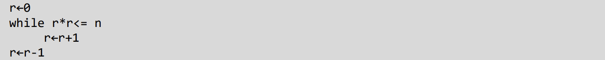
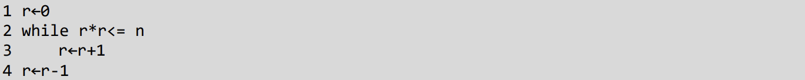
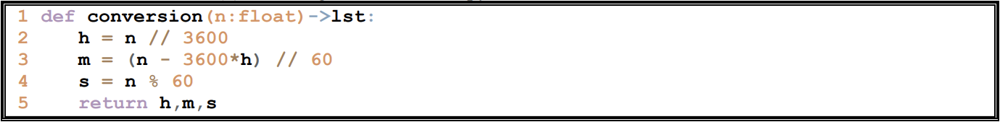
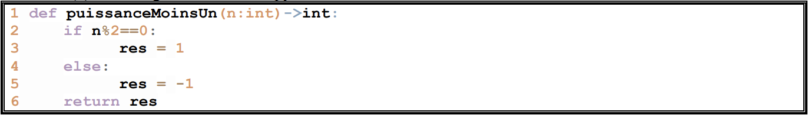
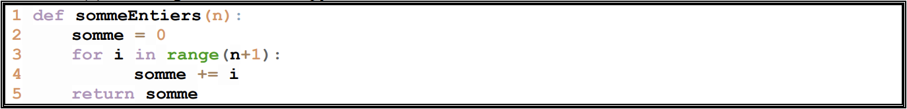
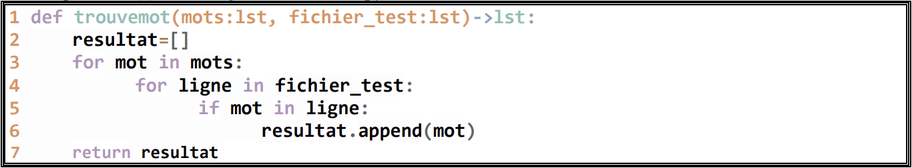
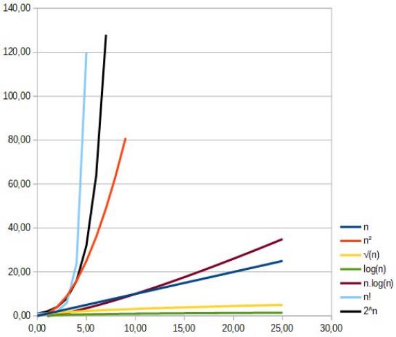
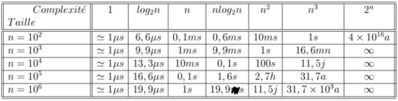

**Table des matières** 

1. [Un peu d’histoire](#_page0_x40.00_y471.92)
2. [Efficacité d’un algorithme](#_page1_x40.00_y36.92)
3. [Création d’un algorithme](#_page1_x40.00_y488.92)
4. [Complexité](#_page3_x40.00_y361.92)
5. [Exercices](#_page7_x40.00_y36.92)

L'**algorithmique** regroupe l'ensemble des règles et techniques permettant de concevoir et de structurer des algorithmes. Ces derniers sont au cœur de l'informatique, mais aussi présents dans de nombreux autres domaines : mathématiques, logistique, intelligence artificielle, etc.

> **Définition :** Un **algorithme** est une suite finie et ordonnée d’instructions permettant de résoudre un problème.

📚 *Sources : Stéphane Grandcolas, Didier Müller, Wikipedia*  


## **<H2 STYLE="COLOR:BLUE;">1. Un<a name="_page0_x40.00_y471.92"></a> peu d’histoire</H2>**


📜 Le mot **"algorithme"** provient du nom du mathématicien perse **Al Khwarizmi** (780 – 850), auteur d’un ouvrage fondamental sur la résolution des **équations linéaires et quadratiques**. Ce livre a posé les bases du calcul numérique et de l’algèbre moderne.

💡 **Évolution des algorithmes :**

1. **Moyen Âge** : Utilisation dans des méthodes mathématiques et astronomiques.

2. **17ᵉ siècle** : Développement de la machine de Pascal et du calcul différentiel (Leibniz).

3. **19ᵉ siècle** : Ada Lovelace conçoit le premier programme pour la machine analytique de Charles Babbage.

4. **20ᵉ siècle** : Alan Turing formalise les algorithmes avec sa "machine de Turing".

5. **Aujourd’hui** : Algorithmes avancés en **intelligence artificielle, cryptographie et optimisation**.

⚡ **Exemples d’algorithmes célèbres :**

- Algorithme d’Euclide (calcul du PGCD).

- Tri rapide (QuickSort).

- Recherche binaire.

- Algorithme de Dijkstra (plus court chemin dans un graphe).


## **<H2 STYLE="COLOR:BLUE;">2. Efficacité<a name="_page1_x40.00_y36.92"></a> d’un algorithme</H2>**

Un **algorithme efficace** doit être capable de résoudre un problème en **un temps raisonnable**, même lorsque la taille des données d'entrée augmente.

💭 **Exemple concret :**  
Imaginez qu’un moteur de recherche prenne plusieurs heures pour afficher des résultats. Un algorithme inefficace est inutilisable en pratique.


**💡 Comparaison d'algorithmes**

🔍 **Cas du comptage des pages d’un livre :**  
On cherche à déterminer **le nombre total de pages d’un livre**.

| **Méthode** | **Description** | **Nombre d’opérations** |
|------------|----------------|-------------------------|
| 📖 **Méthode 1** | Compter les pages une à une | **N** opérations |
| 📑 **Méthode 2** | Regarder directement le numéro de la dernière page | **1** opération |

✅ **Observation** :  

- La méthode 2 est **N fois plus rapide** que la méthode 1.  

- Si *N = 1000* pages, la méthode 1 prend **1000 fois plus de temps** que la seconde.


**📊 Pourquoi mesurer l’efficacité d’un algorithme ?**

Le **temps d'exécution** d’un programme dépend de plusieurs facteurs :

✔️ La **complexité** de l’algorithme. 

✔️ La **puissance du processeur** utilisé. 

✔️ La **qualité de l'implémentation** du programme.

✔️ La **quantité de mémoire disponible**.  

✔️ Les **autres tâches en arrière-plan**.  

⚠ **Problème** : Comparer des temps d’exécution bruts (ex. en secondes) est **peu fiable** car ces facteurs varient d’un ordinateur à l’autre.

 **📈 Comment comparer deux algorithmes ?**

Plutôt que de mesurer le **temps d'exécution**, on **compte le nombre d’opérations effectuées**.  

➡ **On obtient ainsi une mesure généralisable et indépendante du matériel.**  


## **<H2 STYLE="COLOR:BLUE;">3. Création<a name="_page1_x40.00_y488.92"></a> d’un algorithme</H2>**

Les algorithmes sont au cœur des systèmes informatiques et doivent être correctement **décrits, conçus et validés** avant d’être implémentés dans un langage de programmation.


### **<H3 STYLE="COLOR:GREEN;">3.1. Le<a name="_page1_x40.00_y516.92"></a> pseudo-code</H3>**

Le **pseudo-code** est une manière d’écrire un algorithme de façon simple, avec une syntaxe proche du langage naturel.  

Il **n’impose pas un langage de programmation spécifique** et permet de : 

✔ Décrire **clairement** la logique de l’algorithme.  

✔ Faciliter la **compréhension** entre programmeurs utilisant différents langages.  

✔ Rédiger un **plan structuré** avant l’implémentation en code.  

📌 **Exemple :**
```pseudo
Début
    Demander un nombre à l’utilisateur
    Si le nombre est positif alors
        Afficher "Nombre positif"
    Sinon
        Afficher "Nombre négatif"
Fin
```

### **<H3 STYLE="COLOR:GREEN;">3.2. Règles<a name="_page1_x40.00_y618.92"></a> d’écriture d’un algorithme</H3>**

Un **algorithme clair et bien structuré** est plus facile à comprendre, à déboguer et à améliorer.  
Lors de son exécution, il est souvent utile de **suivre l’évolution des variables** sous forme d’un tableau.  

#### **🔍 Exemple : Algorithme de calcul de racine carrée**  
```pseudo
Début
    Entrer un nombre n
    Initialiser r à 0
    Tant que r*r ≤ n faire
        r ← r + 1
    r ← r - 1
    Afficher r
Fin
```



Il faut numéroter toutes les lignes de l'algorithme. 



📊 **Trace de l’exécution avec n = 5**  
| #Ligne | n | r | Commentaire |
|--------|---|---|-------------|
| 1      | 5 | 0 | Initialisation |
| 2      | 5 | 0 | Vérification : 0×0 ≤ 5 |
| 3      | 5 | 1 | Incrémentation de r |
| 2      | 5 | 1 | Vérification : 1×1 ≤ 5 |
| 3      | 5 | 2 | Incrémentation de r |
| 2      | 5 | 2 | Vérification : 2×2 ≤ 5 |
| 3      | 5 | 3 | Incrémentation de r |
| 2      | 5 | 3 | Vérification : 3×3 > 5 (fin de boucle) |
| 4      | 5 | 2 | Correction de r |

✅ **Résultat :** La racine entière de **5 est 2**.


### **<H3 STYLE="COLOR:GREEN;">3.3. Définition<a name="_page2_x40.00_y447.92"></a> du processus itératif</H3>**

Un **processus itératif** est une méthode qui **répète une action jusqu’à une condition d’arrêt**.  

Pour concevoir un algorithme itératif, il faut :  

1️⃣ Identifier **l’itération** appliquée au problème.  

2️⃣ Déterminer si le **nombre d’itérations** est connu ou non. 

3️⃣ Définir les **conditions initiales** et les **critères d’arrêt**.  

4️⃣ Vérifier que la **condition d’arrêt** est bien atteinte.

📌 **Exemple : Dérive d’un iceberg**  

Un iceberg de **25 tonnes** perd **10 % de sa masse chaque jour**.  
On veut savoir après **combien de jours** il restera **moins d’une tonne**.

💡 **Algorithme :**
```pseudo
Début
    nombre_de_jours ← 0
    masse_restante ← 25
    Tant que masse_restante > 1 faire
        masse_restante ← masse_restante - 10% masse_restante
        nombre_de_jours ← nombre_de_jours + 1
    Afficher nombre_de_jours
Fin
```
✅ **Analyse** :

- L’algorithme **réduit la masse** de l’iceberg chaque jour.  

- **Boucle tant que la masse restante est > 1 tonne**.  

- **Nombre de jours** nécessaire affiché en sortie.


### **<H3 STYLE="COLOR:GREEN;">3.4. Correction<a name="_page3_x40.00_y125.92"></a></H3>**

Un **algorithme correct** doit respecter deux conditions :  

1️⃣ **Terminaison** → Il doit **toujours** s’arrêter après un certain nombre d’opérations.  

2️⃣ **Correction partielle** → Le résultat obtenu doit **correspondre au problème posé**.  

👉 **Correction Totale** = **Correction Partielle** + **Terminaison**  

**🔍 Exemples d’erreurs courantes :**

❌ **Boucle infinie** : Un algorithme sans condition d’arrêt.  

❌ **Erreur de logique** : L’algorithme donne un mauvais résultat.  

❌ **Dépassement de mémoire** : Mauvaise gestion des boucles et des tableaux.


## **<H2 STYLE="COLOR:BLUE;">4. Complexité<a name="_page3_x40.00_y361.92"></a></H2>**

Un algorithme est implémenté dans un langage spécifique (Java, C, Python,...) et va s'exécuter sur une machine. 

La durée d'exécution du programme va dépendre du nombre d'instructions élémentaires mobilisées lors de son exécution. On parle alors de **complexité temporelle.** 

Le programme va également mobiliser un certain nombre de ressources machines, en particulier la mémoire. On parle alors de complexité spatiale.  

Être capable d'évaluer la complexité d'un algorithme est importante, tout particulièrement, dans le cadre du traitement de données importantes (big data). Cela va permettre de sélectionner l'algorithme le plus performant en fonction des données à traiter. 

On va donc effectuer des calculs sur l’algorithme en lui-même, dans sa version "papier". Les résultats de ces calculs fourniront une **estimation du temps d’exécution de l’algorithme lors de son fonctionnement.** 

### **<H3 STYLE="COLOR:GREEN;">4.1. Complexité<a name="_page3_x40.00_y529.92"></a> temporelle</H3>**
#### <H4 STYLE="COLOR:MAGENTA;">4.1.1. Règles<a name="_page3_x40.00_y549.92"></a> de calcul</H4>

Pour calculer la complexité, il faut examiner chaque ligne de code et l'y attribuer un **coût en temps.** 

Le coût ainsi obtenu n'aura pas d'unité, il s'agit d'un nombre d'opérations dont chacune aurait le même temps d’exécution : 1. Les opérations qui vont devoir être comptabilisées sont : 

- Les affectations comptent pour 1 unité de temps: a←2 

- Les comparaisons comptent pour 1 unité de temps: 2<3  

- L'accès aux mémoires  comptent pour une 1 unité de temps et afficher pour 2 unités de temps: Lire a  Afficher a 
- Chaque opération élémentaire compte pour une 1 unité de temps : 3+2  

Déterminons le coût de la ligne de code suivante : 

a←a+1 

T(n) = 1(affectation) + 1(accès à la mémoire) + 1(addition) = 3 

On ne comptera **pas la définition des fonctions**. 

#### <H4 STYLE="COLOR:MAGENTA;">4.1.2. Algorithmes<a name="_page4_x40.00_y124.92"></a> sans structure de contrôle</H4>

**<H3 STYLE="COLOR:red;">Activité n°1.:** Le coût T(n) de cet algorithme écrit en python.</H3>**



T(n) = 1(//) + 1(affectation) + 1 (mémoire) + 1(\*) + 1(-) + 1(//) + 1(affectation) + 2 (mémoire) + 1(%) + 1 affectation + 1 (mémoire) + 3(accès mémoire) = 15 


Le coût C est constant et ne dépend pas de n, on le note alors O(1) en notation de Landau.  

O caractérise le comportement asymptotique quand n → +∞.  

#### <H4 STYLE="COLOR:MAGENTA;">4.1.3. Algorithmes sans structure conditionnelle</H4>

**<H3 STYLE="COLOR:red;">Activité n°2.:** On s’intéresse à la fonction (−1)<sup>n</sup>.  Le coût T(n) de cet algorithme écrit en python.</H3>**



T(n) = 1(comparaison) + 1(%) + 1 (mémoire) + 1(affectation) + 1(accès mémoire) = 5 

#### <H4 STYLE="COLOR:MAGENTA;">4.1.4. Algorithmes<a name="_page4_x40.00_y507.92"></a> avec structure itérative</H4>

**<H3 STYLE="COLOR:red;">Activité n°3.:** On s’intéresse à la fonction qui utilise une structure for pour calculer la somme des n premiers entiers. Le coût T(n) de cet algorithme écrit en python.</H3>**



T(n)   = 1(affectation) + (n + 1) \*[1(+) +1(affectation) +2(mémoire) +1(affectation)] + 1(accès mémoire)  

= 1 + (n + 1) \* 5 + 1  
= 2 + 5n + 5
= 5n + 7

La complexité de cet algorithme est dite **linéaire.**  

Ce sera le cas de tous les algorithmes avec un coût du type : **T(n)=an + b** où a et b sont des réels. 

Ici, le coût dépend linéairement du nombre d’éléments à traiter. On le note O(n).

#### <H4 STYLE="COLOR:MAGENTA;">4.1.5. Algorithmes<a name="_page5_x40.00_y36.92"></a> avec deux structures itératives imbriquées</H4>

**<H3 STYLE="COLOR:red;">Activité n°4.:** On considère que la taille des listes mots et fichiers\_test sont de n.  La complexité T(n) de cet algorithme écrit en python.</H3>**



T(n)  = 1(affectation)+n\*[n \*[1(comparaison)+1(affectation+1(mémoire))]+1(mémoire)  

= 1 + n \* (n \* 3) + 1  
= 2 + 3 n²  

La complexité de cet algorithme est dite **quadratique**.  

Ce sera le cas de tous les algorithmes avec un coût du type : **T(n)=an² + bn + c** où a, b et c sont des réels. 

Le coût est fonction du carré du nombre d’éléments à traiter. On le note O(n²).

### **<H3 STYLE="COLOR:GREEN;">4.2. Complexité<a name="_page5_x40.00_y322.92"></a> en espace</H3>**

La complexité en espace est une mesure de l'espace utilisé par un algorithme, exprimé comme fonction de la taille de l'entrée. L'espace compte le nombre maximum de cases mémoire utilisées simultanément pendant un calcul. 

### **<H3 STYLE="COLOR:GREEN;">4.3. Echelle<a name="_page5_x40.00_y386.92"></a> de comparaisons</H3>**

L'étude des différents algorithmes proposés dans la suite des activités (Tris, Recherche, Knn,...) permettra de mettre en évidence les différents ordres de grandeur suivants.  

|**Ordre de complexité**|**Exemples** |**Type de complexité** |
| - | - | - |
|O(1) |Ici la complexité ne dépend pas des données. Accès à une cellule d'un tableau. |constante |
|O(log(n)) |Algorithme divisant le problème par une constante k. O(log(n)) pour la recherche dichotomique  |Logarithmique |
|O(n) |Parcours de liste. |linéaire |
|O(n.log(n)) |Algorithme  divisant  le  problème  en  nombre  de  sous-problèmes constants, dont les résultats sont réutilisés par recombinaison (Ex Tri fusion). |quasi-linéaire |
|O(n²) |Algorithme  traitant  généralement  de  couples  de  données  (boucles imbriquées). Parcours d'une matrice de pixels. |quadratique |



Comparaison des temps d’exécution d’algorithmes de différentes complexités 



Si on double la taille d’un tableau : 

- Pour un algorithme de complexité n, le temps d’exécution est doublé 
- Pour un algorithme de complexité n², le temps d’exécution est quadruplé 
- Pour un algorithme de complexité log<sub>2</sub>(n), le temps d’exécution prend une unité. 

RESSOURCES : 

- Vidéo (définition de la complexité) :[ https://www.youtube.com/watch?v=exaHKrP6RsA ](https://www.youtube.com/watch?v=exaHKrP6RsA)
- Vidéo (calcul de complexités) :[ https://www.youtube.com/watch?v=clZ4q5zPBlE ](https://www.youtube.com/watch?v=clZ4q5zPBlE)

## **<H2 STYLE="COLOR:BLUE;">5. Exercices<a name="_page7_x40.00_y36.92"></a></H2>**

=> CAPYTALE Le code vous sera donné par votre enseignant

**<H3 STYLE="COLOR:red;">Exercice 1** : Calculer le coût de cet algorithme</H3>**

```
largeur <- LireEntier() 
longueur <- LireEntier() 
aire <- largeur * longueur 
perimetre <- (largeur + longueur) * 2 
Afficher aire 
Afficher perimetre 
```

**<H3 STYLE="COLOR:red;">Exercice 2** : Calculer le coût de cet algorithme</H3>**

```
nbLivres <- LireEntier() 
Si nbLivres < 10 
    prix <- nbLivres * 10 
Sinon 
    prix <- nbLivres * 9 
Afficher prix 
```

**<H3 STYLE="COLOR:red;">Exercice 3** : Calculer le coût de cet algorithme</H3>**

```
X <- 1 
Tant que X <= 100 
    Afficher "Bonjour !"    
    X <- X + 1 
```

**<H3 STYLE="COLOR:red;">Exercice 4** : Calculer le coût de cet algorithme</H3>**

```
total <- 0 
i <- 1 
Tant que i <= 100 
    total <- total + i    
    i <- i + 1 
Afficher total 
```

**<H3 STYLE="COLOR:red;">Exercice 5** : Calculer le coût de cet algorithme</H3>**

```
iMax <- LireEntier() 
total <- 0 
i <- 1 
Tant que i <= iMax 
    total <- total + i    
    i <- i + 1 
Afficher total 
```

**<H3 STYLE="COLOR:red;">Exercice 6** : Calculer le coût de cet algorithme</H3>**

```
iMax <- LireEntier() 
total <- 0 
Tant que iMax > 0 
    total <- total + iMax    
    iMax <- iMax - 1 
Afficher total 
```

**<H3 STYLE="COLOR:red;">Exercice 7** : Calculer le coût de cet algorithme</H3>**

```
taille <- LireEntier()			1
X <- 0						    2
Tant que X < taille				3
   Y <- 0					    4
   Tant que Y < taille			5
      Si X = Y					6
         Afficher "X"			7
      Sinon					    8
         Afficher "."			9		
      Y <- Y + 1				10
   Retour à la ligne			11
   X <- X + 1		            12
```