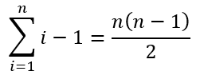

---
author: ELP
title: 06b Algorithmes de tri
---


**Table des matières** 

1. [Créer une liste de données aléatoire](#_page0_x40.00_y438.92)
2. [Le tri par sélection](#_page1_x40.00_y54.92)
3. [Tri par insertion](#_page4_x40.00_y702.92)
4. [Autres algorithmes de tris : le tri à bulles (Bubble sort) ](#_page8_x40.00_y36.92)
5. [Exercices ](#_page9_x40.00_y511.92)

## **<H2 STYLE="COLOR:BLUE;">Introduction : Qu’est-ce que trier ? Pourquoi trier ? </h2>**

Le **tri** est une opération qui consiste à organiser des données dans un certain ordre (croissant, décroissant, alphabétique, etc.). Trier des données est essentiel dans de nombreux domaines :

- Dans une **base de données**, le tri permet d’organiser rapidement des informations (par exemple, classer des noms par ordre alphabétique).
- Sur un **moteur de recherche**, les résultats sont triés en fonction de leur pertinence.
- En **informatique**, de nombreux algorithmes reposent sur des données triées pour améliorer l’efficacité des traitements (exemple : la recherche dichotomique est beaucoup plus rapide si la liste est triée).


## **<H2 STYLE="COLOR:BLUE;">1. Créer<a name="_page0_x40.00_y438.92"></a> une liste de données aléatoire</h2>**

Avant de trier une liste, il faut d'abord en générer une ! Nous allons utiliser le module `random` pour créer une liste de nombres aléatoires.

???+ question "Activité n°1 : Générer des données aléatoires"

    **Tester le code suivant :**
    
    ```python
    import random

    def genere_liste_aleatoire(N: int, n: int) -> list:
        """Génère une liste aléatoire de N éléments compris entre 0 et n."""
        return [random.randint(0, n) for _ in range(N)]

    # Création d'une liste de 50 valeurs comprises entre 0 et 100
    liste_aleatoire = genere_liste_aleatoire(50, 100)
    print(liste_aleatoire)
    ```

    ??? success "Python"
        {{ IDE() }}

    ??? success "Explication"

        - La fonction `genere_liste_aleatoire(N, n)` crée une liste de **N nombres** entre **0 et n**.

        - On utilise `random.randint(0, n)` pour s'assurer que **n est inclus** dans l’intervalle.

        - L’utilisation de `_` dans la boucle `for` indique que nous n'avons pas besoin de la valeur de l'index.


## **<H2 STYLE="COLOR:BLUE;">2. Le<a name="_page1_x40.00_y54.92"></a> tri par sélection :</h2>**
### **<H3 STYLE="COLOR:GREEN;">2.1. Le<a name="_page1_x40.00_y76.92"></a> principe</H3>**

L'idée du **tri par sélection** est simple :  

1. **On cherche le plus petit élément** du tableau et on l'échange avec le premier élément.  

2. **On cherche ensuite le deuxième plus petit élément** et on l'échange avec le deuxième élément.  

3. On continue ainsi jusqu'à ce que toute la liste soit triée.  


### **<H3 STYLE="COLOR:GREEN;">2.2. Illustration<a name="_page1_x40.00_y201.92"></a> graphique</H3>**


  

**Exemple avec 6, 1, 9, 3 :**

1. **1 est le plus petit** → on l’échange avec le 6 : **1, 6, 9, 3**

2. **3 est le deuxième plus petit** → on l’échange avec le 6 : **1, 3, 9, 6**

3. **6 est le troisième plus petit** → on l’échange avec le 9 : **1, 3, 6, 9**

4. **9 est déjà bien placé** → fin du tri.

Ce tri fonctionne en **N étapes**, où `N` est la taille du tableau.


### **<H3 STYLE="COLOR:GREEN;">2.3. Illustration<a name="_page1_x40.00_y434.92"></a> en vidéo</H3>**

🎥 **Regardez cette vidéo pour mieux comprendre :**  
[https://ladigitale.dev/digiview/#/v/668aea84a26ef](https://ladigitale.dev/digiview/#/v/668aea84a26ef)  

💡 **Remarque :** Les danseurs s'échangent après chaque comparaison, mais dans le véritable algorithme, l’échange ne se fait qu’une fois par tour.

### **<H3 STYLE="COLOR:GREEN;">2.4. Pseudo-code<a name="_page1_x40.00_y485.92"></a></H3>**

```
ALGORITHME echange (T, i, j)
        tmp <- T[i]                
        T[i] <- T[j]
        T[j] <- tmp

ALGORITHME tri_selection
    POUR i ALLANT DE 0 A N-1 FAIRE  
        mini <- i   # Indice du plus petit élément trouvé
        POUR j ALLANT DE i+1 A N FAIRE  
            SI T[j] < T[mini] ALORS  
                mini <- j  
            FIN SI
        FIN POUR
        SI mini ≠ i ALORS  
            ÉCHANGE T[i] AVEC T[mini]  
        FIN SI
    FIN POUR    
```


### **<H3 STYLE="COLOR:GREEN;">2.5. Complexité<a name="_page2_x40.00_y36.92"></a></H3>**

Analysons le nombre d’opérations effectuées :

- **La première boucle** s’exécute **N-1 fois**.

- **La deuxième boucle** exécute en moyenne **N/2 comparaisons** par itération.

➡️ Cela nous donne une **complexité de O(N²)**.

Cela signifie que **si on double la taille du tableau, le temps d’exécution est multiplié par 4**. Pour **N = 10 000**, le tri est encore rapide, mais pour **N = 1 000 000**, il devient lent.


### **<H3 STYLE="COLOR:GREEN;">2.6. Stabilité<a name="_page2_x40.00_y632.92"></a> d’un algorithme</H3>**

Un **algorithme de tri est dit stable** si **l’ordre relatif des éléments identiques est conservé** après le tri.

Prenons un exemple concret : imaginons une collection de bouteilles de différentes couleurs et de différents volumes.

Avant le tri, nous avons :


Nous souhaitons trier ces bouteilles par **ordre croissant de volume**.

**Exemple d'un tri non stable :**
Si l'algorithme **n'est pas stable**, il peut modifier l’ordre des éléments identiques (bouteilles de même volume). Par exemple, voici un tri **incorrect** car l’ordre des bouteilles de même volume a changé : 


Dans cet exemple :

- La bouteille **noire** de volume **1** est maintenant placée avant la bouteille **bleue**, alors qu’elle était **après** initialement.

- Les deux bouteilles de volume **4** ont aussi été **inversées**.

**Exemple d'un tri stable :**

Un **tri stable** conserve l’ordre relatif des éléments identiques :


Ici, les bouteilles de même volume **restent dans le même ordre** qu’au départ.

**Pourquoi est-ce important ?**

L’intérêt d’un tri stable est qu'il permet d'**appliquer plusieurs tris successifs sans perdre d’informations**. Par exemple, on peut d'abord trier une liste de personnes **par âge**, puis, dans un second temps, **par nom**, en gardant les personnes du même âge **dans le même ordre qu’avant**.
 

### **<H3 STYLE="COLOR:GREEN;">2.7. Preuve<a name="_page3_x40.00_y297.92"></a> de correction</H3>**

Un **algorithme est correct** s'il satisfait **deux propriétés** :

1. **Correction partielle** : l’algorithme fonctionne correctement à chaque étape et atteint bien son objectif.

2. **Terminaison** : l’algorithme **se termine toujours** après un nombre fini d’étapes.

#### **<H4 STYLE="COLOR:MAGENTA;">2.7.1.	Correction partielle </H4>**

Un **invariant de boucle** est une propriété qui est **vraie avant, pendant et après chaque itération**.

Dans le **tri par sélection**, l’invariant est le suivant :

> **À chaque itération `i`, les `i` premiers éléments de la liste sont triés et contiennent les `i` plus petits éléments en ordre croissant.**

**Preuve par récurrence :**

1. **Initialisation (`i = 0`)**  

   - Avant toute itération, aucun élément n’a été trié.

   - On cherche le plus petit élément et on l’échange avec `T[0]`.

   - Après cette opération, `T[0]` contient bien **le plus petit élément**.

2. **Hérédité (passage de `i` à `i+1`)**  

   - Supposons que l’invariant est vrai pour `i`.

   - À l’itération suivante, on cherche **le plus petit élément parmi `T[i:n]`** et on l’échange avec `T[i]`.

   - Comme les `i` premiers éléments étaient déjà triés, **l’invariant est maintenu**.

3. **Terminaison (`i = n-1`)**  

   - À la dernière itération, il ne reste plus qu’un seul élément `T[n-1]`, qui est déjà bien placé.

   - **Le tableau entier est donc trié.**

Ainsi, **l’algorithme est bien correct**.


#### **<H4 STYLE="COLOR:MAGENTA;">2.7.2.	Terminaison</H4>**

Un algorithme **termine toujours** si :

1. Il ne contient **pas de boucle infinie**.

2. Il effectue un **nombre fini d’itérations**.

**Analyse de la terminaison du tri par sélection**
L’algorithme utilise **deux boucles imbriquées** :

- **Boucle principale** : `for i in range(n-1)`

  - Elle s’exécute exactement `n-1` fois.
  
- **Boucle interne** : `for j in range(i+1, n)`

  - À chaque itération, le nombre d’éléments à comparer **diminue**.

On définit une **mesure de progrès** `m = n - i`, qui représente le nombre d'éléments restants à trier.

- À chaque itération, `i` augmente de `1`, donc `m` **diminue strictement**.

- Quand `m = 1`, la boucle **s’arrête**, garantissant **la fin de l’algorithme**.

➡ **Conclusion : L’algorithme termine toujours après `n-1` itérations.**


### **<H3 STYLE="COLOR:GREEN;">2.8. Implémentation<a name="_page3_x40.00_y497.92"></a> en Python</H3>**

=> CAPYTALE Le code vous sera donné par votre enseignant

???+ question "Activité n°1 : Générer des données aléatoires"

    **Tester le code suivant :**
    
    ```python
    import random

    def genere_liste_aleatoire(N: int, n: int) -> list:
        """Génère une liste aléatoire de N éléments compris entre 0 et n."""
        return [random.randint(0, n) for _ in range(N)]

    # Création d'une liste de 20 valeurs comprises entre 0 et 100
    liste_aleatoire = genere_liste_aleatoire(20, 100)
    print(liste_aleatoire)
    ```

    ??? success "Python"
        {{ IDE() }}


???+ question "Activité n°3 : Implémenter le tri par sélection"

    **Tester le code suivant :**

    ```python
    def swap(T: list, i: int, j: int) -> None:
        """ Échange les éléments T[i] et T[j] """
        # à compléter

    def selection_sort(T: list) -> list:
        """Trie la liste T par sélection"""
        # à compléter

    # Tester avec une liste aléatoire
    data = genere_liste_aleatoire(5, 20)
    print("Liste initiale :", data)
    print("Liste triée    :", selection_sort(data))
    ```

    ??? success "Explication"

        - **swap()** est une fonction utilitaire pour échanger deux éléments.

        - **selection_sort()** trie la liste en cherchant le plus petit élément à chaque tour.

        - On affiche la liste avant et après le tri.


???+ question "Activité n°4 : Tester l'efficacité du tri par sélection"

    **Tester le code suivant :**
    
    ```python
    import time

    tailles = [1_000, 2_000, 10_000]

    for taille in tailles:
        somme_des_durees = 0
        for _ in range(5):
            liste = genere_liste_aleatoire(taille, 1_000_000)
            start_time = time.perf_counter()
            selection_sort(liste)
            somme_des_durees += time.perf_counter() - start_time
        moyenne = somme_des_durees / 5
        print(f"Temps d'exécution pour {taille}: {moyenne:.6f} secondes")
    ```

    ??? success "Explication"

        - On **génère des listes aléatoires** de **1 000, 2 000 et 10 000 éléments**.

        - On **mesure le temps d’exécution moyen** du tri sur 5 exécutions.

        - **Remarque** : Le temps d’exécution augmente rapidement !


**Animation :[http://lwh.free.fr/pages/algo/tri/tri_selection.html ](http://lwh.free.fr/pages/algo/tri/tri_selection.html)**

## **<H2 STYLE="COLOR:BLUE;">3. Tri<a name="_page4_x40.00_y702.92"></a> par insertion</h2>**
### **<H3 STYLE="COLOR:GREEN;">3.1. Le<a name="_page4_x40.00_y724.92"></a> principe</H3>**

Le tri par insertion est un algorithme de **tri stable** et le plus rapide en pratique sur une entrée de petite taille. 

**Principe de l’algorithme :** Le principe du tri par insertion est de trier les éléments du tableau comme avec des cartes:

- On prend nos cartes mélangées dans notre main. 

- On crée deux ensembles de carte, l’un correspond à l’ensemble de carte triée, l’autre contient l’ensemble des cartes restantes (non triées). 

- On prend au fur et à mesure, une carte dans l’ensemble non trié et on l’insère à sa bonne place dans l’ensemble de carte triée. 

- On répète cette opération tant qu’il y a des cartes dans l’ensemble non trié. 

Dans l'algorithme, on parcourt le tableau à trier du début à la fin. Au moment où on considère le i-ème élément, les éléments qui le précèdent sont déjà triés.  

L'objectif d'une étape est donc d'insérer le i-ème élément à sa place parmi ceux qui précèdent. Il faut pour cela : 

- **trouver où l'élément** doit être inséré en le comparant aux autres,  
- puis **décaler les éléments** afin de pouvoir effectuer l'insertion.  

En pratique, ces deux actions sont fréquemment effectuées en une passe, qui consiste à faire « remonter » l'élément au fur et à mesure jusqu'à rencontrer un élément plus petit. 

### **<H3 STYLE="COLOR:GREEN;">3.2. Illustration<a name="_page5_x40.00_y290.92"></a> graphique</H3>**


Exemple : 9, 2, 7, 1 à trier en ordre croissant avec l’algorithme du tri par insertion :  

*1er tour* : 9 | **2**, 7, 1 -> à gauche la partie triée du tableau (le premier élément est considéré comme trié  puisqu'il est seul dans cette partie), à droite la partie non triée. On prend le premier élément de la partie  non triée, 2, et on l'insère à sa place dans la partie triée, c'est-à-dire à gauche de 9.  

*2ème tour* : 2, 9 | **7**, 1 -> on prend 7, et on le place entre 2 et 9 dans la partie triée.  

*3ème tour* : 2, 7, 9 | **1** -> on continue avec 1 que l’on place au début de la première partie.  

Pour insérer un élément dans la partie triée, on parcourt de droite à gauche tant que l'élément est plus  grand que celui que l'on souhaite insérer. Pour résumer l'idée de l'algorithme : La partie verte du tableau  est la partie triée, l'élément en bleu est le prochain élément non trié à placer et la partie blanche est la  partie non triée. 

### **<H3 STYLE="COLOR:GREEN;">3.3. Illustration<a name="_page5_x40.00_y491.92"></a> vidéo</H3>**

Vidéo :[ https://ladigitale.dev/digiview/#/v/668aed171ea50 ](https://ladigitale.dev/digiview/#/v/668aed171ea50)

### **<H3 STYLE="COLOR:GREEN;">3.4. Pseudo-code<a name="_page5_x40.00_y542.92"></a></H3>**

```
ALGORITHME tri_insertion
    PROCEDURE insere(T, i)            # insère tmp dans le tableau[0...i[ trié
        tmp = T[i]          			# valeur à inserer
        j <- i-1		    		# indice en cours                                                        
        TANT QUE j >= 0 et T[j] > tmp ALORS        
            T[j+1] <- T [j]         
	     # l'élément qui précède on le décale vers la droite jusqu'à laisser la place libre à tmp           
            j <- j - 1              	# on décale l'indice
        FIN TANT QUE
        T[j+1] <- tmp   			# on insère tmp

    PROCEDURE tri_insertion(T)     
        POUR i ALLANT DE 1 A n [SAUT DE 1] FAIRE         
            insere (T, i)             
            i <- i + 1                                     
        FIN POUR
```

### **<H3 STYLE="COLOR:GREEN;">3.5. Complexité<a name="_page6_x40.00_y36.92"></a></H3>**

L’algorithme du tri par insertion a une complexité de O(N²). Calculons le nombre d’instructions : 

```
                        PROCEDURE insere(T, i)                     
1                           tmp = T[i]
1                           j <- i                                                          
N-1 fois                    TANT QUE j >= 0 et T[j] > tmp ALORS        
    1                           T[j+1] <- T [j]                         
    1                           j <- j - 1                              
                            FIN TANT QUE
1                           T[j+1] <- tmp                                   
                        PROCEDURE tri_insertion(T)                                                         
N fois                      POUR i ALLANT DE 1 A n [SAUT DE 1] FAIRE         
    insere                      insere (T, i)             
    1                           i <- i + 1                                     
                            FIN POUR
```

- Procédure insere : 2 + (N – 1) x 2 + 1 = 3 + (N – 1) x 2 = 2 N + 2
- Procédure tri\_insertion : N x (2N + 2) = 2 N² + 2 N 

Pour simplifier les calculs de complexité, on s’intéresse seulement aux nombres de itérations des boucles, puisque c’est elles qui vont donner le comportement asymptotique (quand N très grand). 

*Pour aller plus loin : Exemple t = [ 4, 3, 2, 1]* 

*Le 2ème élément : le « 3 » est décalé d’un cran vers la gauche [ 3, 4, 2, 1]* 

*Le 3ème élément : le « 2 » est décalé de deux crans vers la gauche [ 2, 3, 4, 1]* 

*Le 4ème élément : le « 1 » est décalé de trois crans vers la gauche [ 1, 2, 3, 4]* 

*Pour trouver le plus petit élément, (n-1) itérations sont nécessaires, pour le 2ème plus petit élément, (n-2) itérations sont effectuées, .… Pour trouver le dernier plus petit élément, 0 itération sont effectuées.* 

*Le nombre de itérations des deux boucles est 1 + 2 + 3 = 6 c’est-à-dire* 

*Donc le pire des cas, le tableau est trié à l’envers, pour chaque valeur i on compte N - 1 passages dans la boucle for :* 



**Conclusion** : le **tri par insertion** a une complexité en temps de **O(N²) dans le pire des cas O(N) dans le meilleur des cas (tableau déjà trié).**  

Cependant des améliorations et des variantes permettent de le rendre plus rapide comme le tri shell. C’est un algorithme stable et en place (travail sur la structure et non sur la copie).

### **<H3 STYLE="COLOR:GREEN;">3.6. Preuve<a name="_page6_x40.00_y637.92"></a> de correction</H3>**

#### <H4 STYLE="COLOR:MAGENTA;">3.6.1.	Correction partielle</H4>

On veut prouver que l’algorithme **produit un tableau trié** après son exécution.

**Invariant de boucle**

On cherche un **invariant** qui est **vrai avant, pendant et après chaque itération** de la boucle principale de `insertion_sort`.

**Invariant de la boucle principale (sur `i`)**  
> **Avant chaque itération `i`, le sous-tableau `T[0:i]` est trié.**

**Preuve par récurrence**

On prouve que cet invariant est vérifié à chaque itération de la boucle.

1 **Initialisation (cas de base, `i = 1`)**  

- Avant la première itération, `T[0:1]` contient un seul élément, et un tableau à un seul élément est toujours trié. 

- Donc l’invariant est vrai avant la première itération.

2 **Hérédité (passage de `i` à `i+1`)**  

- Supposons que le sous-tableau `T[0:i]` est trié après l’itération `i`.

- L'algorithme insère `T[i]` dans `T[0:i]` de manière ordonnée à l’aide de la fonction `insert`.

- La fonction `insert` effectue des **décalages successifs** pour placer `T[i]` à la bonne position.

- Après l’insertion, le sous-tableau `T[0:i+1]` est trié.

- L’invariant est donc conservé.

3 **Terminaison (état final, `i = len(T)`)**  

- Quand `i = len(T)`, l’invariant assure que `T[0:len(T)]` est trié.

- Le tableau entier est donc trié.

✔ **Conclusion** : L’invariant est vrai à chaque étape et à la fin du tri, garantissant que l’algorithme est **correct**.


#### <H4 STYLE="COLOR:MAGENTA;">3.6.2.	Terminaison</H4>

L’algorithme doit satisfaire les conditions suivantes pour garantir qu’il termine toujours.

**Analyse de la terminaison**

L’algorithme comprend :

1 **Une boucle principale `for i in range(1, len(T))`**  

- Cette boucle parcourt `T` de `1` à `len(T)-1`, donc elle s'exécute **`len(T) - 1` fois**.

2 **Une boucle `while j >= 0 and T[j] > tmp` dans `insert`**  

- Cette boucle déplace les éléments plus grands que `T[i]` vers la droite.

- La valeur de `j` **diminue strictement à chaque itération**.

- Comme `j` commence à `i-1` et ne peut pas descendre en dessous de `0`, cette boucle a un **nombre fini d'itérations**.

**Mesure de progrès**

On définit une **mesure de progrès** `m = len(T) - i`, qui représente le nombre d'éléments restant à traiter.  

- `m` diminue strictement à chaque itération de la boucle `for`.

- Comme `m` atteint `0`, l'algorithme s'arrête toujours.

✔ **Conclusion** : L’algorithme ne peut pas entrer dans une boucle infinie et termine toujours après au plus **O(n²) itérations**.


### **<H3 STYLE="COLOR:GREEN;">3.7. Implémentation<a name="_page7_x40.00_y36.92"></a> en Python</H3>**

=> CAPYTALE Le code vous sera donné par votre enseignant

**<H3 STYLE="COLOR:red;">Activité n°5.:** Création de la liste aléatoire **avec l’activité 1** :</H3>** reprendre l’activité 1 et 2

**<H3 STYLE="COLOR:red;">Activité n°6.:** implémentation classique :</H3>** ajouter à l’activité précédente les deux fonctions suivantes :

```python
def insert(T, i):
    """ fonction qui insère la valeur T[i] à la bonne place dans le tableau"""
    # à compléter

def insertion_sort(T):
    """ fonction tri par insertion"""
    # à compléter

print("Liste triée   : ", insertion_sort(data))
```

**Remarque : on aurait pu également faire une seule fonction**  

**<H3 STYLE="COLOR:red;">Activité n°7.:** Tri par insertion et temps d’exécution :</H3>** ajouter ce script aux fonctions de l’activité précédente en mettant en commentaire les deux print précédent :

```python
import time

# on fait une moyenne sur plusieurs tris de tableau de même longueur
somme_des_durees = 0
for i in range(5):
    liste = genere_liste_aleatoire(1_000, 1_000_000)
    start_time=time.time()
    insertion_sort(liste)
    somme_des_durees = somme_des_durees + time.time() - start_time
moyenne = somme_des_durees/5
print("Temps d execution pour 1_000: %s secondes ---" % (moyenne))

somme_des_durees = 0
for i in range(5):
    liste = genere_liste_aleatoire(2_000, 1_000_000)
    start_time=time.time()
    insertion_sort(liste)
    somme_des_durees = somme_des_durees + time.time() - start_time
moyenne = somme_des_durees/5
print("Temps d execution pour 2_000: %s secondes ---" % (moyenne))

somme_des_durees = 0
for i in range(5):
    liste = genere_liste_aleatoire(10_000, 1_000_000)
    start_time=time.time()
    insertion_sort(liste)
    somme_des_durees = somme_des_durees + time.time() - start_time
moyenne = somme_des_durees/5
print("Temps d execution pour 10_000: %s secondes ---" % (moyenne))
```
On mesure la durée moyenne (sur 5 tableaux) d’exécution du tri sur des tableaux dont le nombre d’éléments est de plus en plus grand.

**Animation :[ http://lwh.free.fr/pages/algo/tri/tri_insertion.html ](http://lwh.free.fr/pages/algo/tri/tri_insertion.html)**

## **<H2 STYLE="COLOR:BLUE;">4. Autres<a name="_page8_x40.00_y36.92"></a> algorithmes de tris : le tri à bulles (Bubble sort)</h2>**

Le tri à bulles est un algorithme de tri qui consiste à faire  **remonter  progressivement les plus petits éléments d'une liste**, comme les bulles  d'air remontent à la surface d'un liquide. 


L'algorithme  parcourt  la  liste,  et  **compare  les  couples  d'éléments  successifs**.   

Lorsque deux éléments successifs ne sont pas dans l'ordre croissant, **ils  sont échangés**.   

Après chaque parcours complet de la liste, l'algorithme **recommence l'opération**. Lorsque aucun échange n'a lieu pendant un parcours, cela signifie que la liste est triée : l'algorithme peut s'arrêter. 

On optimise l’algorithme en se basant sur la propriété que le dernier élément permuté se trouve nécessairement bien trié. Il n’est alors pas besoin de parcourir la liste jusqu’à la fin : combsort (tri à peignes) 

**Conclusion** : Le tri à bulles présente une complexité en **O(N²)** dans le pire des cas (où N est la longueur de la liste), et en O(N) dans le cas où le tableau est déjà trié, ce qui le classe parmi les mauvais algorithmes de tri. Il n'est donc quasiment pas utilisé en pratique. 

Comme le tri par insertion, le tri à bulle est un tri stable. 

Illustration vidéo :[ https://ladigitale.dev/digiview/#/v/668aed8c3bab4 ](https://ladigitale.dev/digiview/#/v/668aed8c3bab4) 

```
FONCTION swap(T : tableau d'entiers, i : entier, j : entier)
    temp ← T[i]
    T[i] ← T[j]
    T[j] ← temp
FIN FONCTION

FONCTION tri_bulle(T : tableau d'entiers, n : entier)
    POUR i DE 0 À n - 2 FAIRE
        POUR j DE 0 À n - 2 - i FAIRE
            SI T[j] > T[j + 1] ALORS
                swap(T, j, j + 1)
            FIN SI
        FIN POUR
    FIN POUR
FIN FONCTION

```

=> CAPYTALE Le code vous sera donné par votre enseignant

**<H3 STYLE="COLOR:red;">Activité n°8.:** Création de la liste aléatoire **avec l’activité 1** :</H3>** reprendre l’activité 1 et 2

**<H3 STYLE="COLOR:red;">Activité n°9.:** implémentation classique </H3>** Avec la fonction echange et la fonction bubble_sort

```python
def swap(T : list, i : int, j : int) -> list:
    """ fonction permutation (à garder elle sert beaucoup!!)  """
    # à compléter

def bubble_sort(T : list) -> list:
    """ fonction tri a bulle permutation des éléments 2 à 2 en faisant remonter
    la plus grande valeur en fin de la liste  """
    # à compléter
```

**Remarque : il existe d’autres versions du tri bulle** 

**<H3 STYLE="COLOR:red;">Activité n°10.:** Tri bulle et temps d’exécution :</H3>** ajouter ce script aux fonctions de l’activité précédente en mettant en commentaire les deux print précédent :

```python
import time

# on fait une moyenne sur plusieurs tris de tableau de même longueur
somme_des_durees = 0
for i in range(5):
    liste = genere_liste_aleatoire(1_000, 1_000_000)
    start_time=time.time()
    bubble_sort(liste)
    somme_des_durees = somme_des_durees + time.time() - start_time
moyenne = somme_des_durees/5
print("Temps d execution pour 1_000: %s secondes ---" % (moyenne))

somme_des_durees = 0
for i in range(5):
    liste = genere_liste_aleatoire(2_000, 1_000_000)
    start_time=time.time()
    bubble_sort(liste)
    somme_des_durees = somme_des_durees + time.time() - start_time
moyenne = somme_des_durees/5
print("Temps d execution pour 2_000: %s secondes ---" % (moyenne))

somme_des_durees = 0
for i in range(5):
    liste = genere

_liste_aleatoire(10_000, 1_000_000)
    start_time=time.time()
    bubble_sort(liste)
    somme_des_durees = somme_des_durees + time.time() - start_time
moyenne = somme_des_durees/5
print("Temps d execution pour 10_000: %s secondes ---" % (moyenne))
```

Animation :[ http://lwh.free.fr/pages/algo/tri/tri_bulle.html ](http://lwh.free.fr/pages/algo/tri/tri_bulle.html)

## **<H2 STYLE="COLOR:BLUE;">5. Exercices<a name="_page9_x40.00_y511.92"></a></h2>**

=> CAPYTALE Le code vous sera donné par votre enseignant

**<H3 STYLE="COLOR:red;">Exercice n°1** </H3>**: Créer une fonction selection_sort_desc() qui permet trier avec l’algorithme de tri par sélection une liste aléatoire par valeurs décroissantes.

**<H3 STYLE="COLOR:red;">Exercice n°2** </H3>**: Créer une fonction selection\_sort\_asc\_partir\_fin() qui permet trier avec l’algorithme de tri par sélection une liste aléatoire par valeurs croissantes de manière à compléter l’algorithme suivant :

```python
def selection_sort_asc_partir_fin(T):
    for i in range(…, 0, …):
        maxi = …
        for j in range(…):
            if T[j]> T[…]:
                maxi = j
        if maxi !=i:
            …
    return T
```

**<H3 STYLE="COLOR:red;">Exercice n°3** </H3>**: Créer une fonction selection_sort_desc_partir_fin() qui permet trier avec l’algorithme de tri par sélection et l’algorithme de l’exercice 2, une liste aléatoire par valeurs décroissantes.

**<H3 STYLE="COLOR:red;">Exercice n°4** :</H3>** Créer une fonction bubble_sort_desc() qui permet trier avec l’algorithme de tri à bulles une liste aléatoire par valeurs décroissantes.
