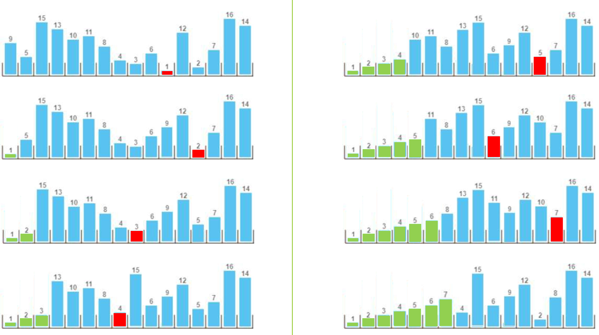
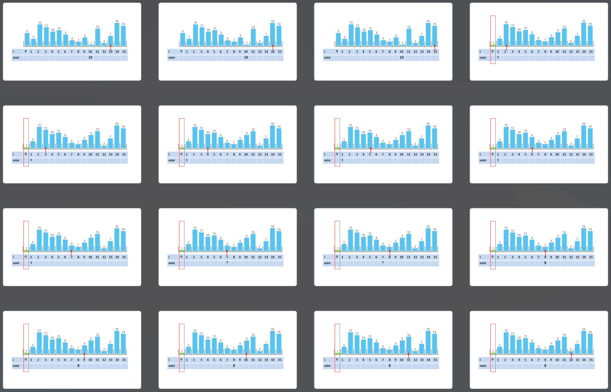

---
author: ELP
title: 06b Algorithmes de tri
---


**Table des matières** 

1. [Créer une liste de données aléatoire](#_page0_x40.00_y438.92)
2. [Le tri par sélection](#_page1_x40.00_y54.92)
3. [Tri par insertion](#_page4_x40.00_y702.92)
4. [Exercices ](#_page9_x40.00_y511.92)

---

## **<H2 STYLE="COLOR:BLUE;">Introduction : Qu’est-ce que trier ? Pourquoi trier ? </h2>**

**Trier** ou **effectuer un tri** c’est répartir les éléments en paquets correspondant à un certain critère : par exemple séparer les déchets selon leur nature, les personnes d’une assemblée selon leur sexe ou selon leur langue maternelle.

**Classer** ou **effectuer un classement** c’est mettre des éléments selon un certain ordre : par  exemple ranger les personnes d’une assemblée de la plus petite à la plus grande, ou de la  plus jeune à la plus âgée

Dans la vie quotidienne réaliser un tri ou un classement est une opération  relativement courante : 

- classer des factures par date, trier des documents par type (impôts, santé, assurance).

- Photos / téléphone : trier par date, par lieu, par personne, par album “vacances / famille”.

- Courses / cuisine : trier les aliments (frais / à consommer vite), ranger par catégories (pâtes, conserves, épices).

- Cartes / jeux : trier sa main par couleur et par valeur pour jouer plus vite.

- Bibliothèque : classer des livres par auteur, thème, ou ordre alphabétique.


- Emails : trier par expéditeur, objet, date, importance.

- École / travail : classer des élèves par note, trier des candidatures, trier des tâches par priorité.

- Transport : trier des itinéraires par durée, coût ou nombre de correspondances.


En informatique les mots **tri et trier** sont à prendre avec le **sens de classement et classer**.


---

## **<H2 STYLE="COLOR:BLUE;">1. Créer<a name="_page0_x40.00_y438.92"></a> une liste de données aléatoire</h2>**

Avant de trier une liste, il faut d'abord en générer une ! Nous allons utiliser le module `random` pour créer une liste de nombres aléatoires.

???+ question "Activité n°1 : Générer des données aléatoires"
    **Tester :**

    ```python
    import random

    def genere_liste_aleatoire(N: int, n: int) -> list:
        """Génère une liste aléatoire de N éléments compris entre 0 et n."""
        return [random.randint(0, n) for _ in range(N)]

    # Création d'une liste de 50 valeurs comprises entre 0 et 100
    liste_aleatoire = genere_liste_aleatoire(50, 100)
    print(liste_aleatoire)
    ```
    

    ??? success "Python"
        {{ IDE() }}


    ??? success "Explication"

        - La fonction `genere_liste_aleatoire(N, n)` crée une liste de **N nombres** entre **0 et n**.

        - On utilise `random.randint(0, n)` pour s'assurer que **n est inclus** dans l’intervalle.

        - L’utilisation de `_` dans la boucle `for` indique que nous n'avons pas besoin de la valeur de l'index.

---

## **<H2 STYLE="COLOR:BLUE;">2. Le<a name="_page1_x40.00_y54.92"></a> tri par sélection :</h2>**

Cette méthode de tri s’apparente à celle utilisée pour trier des copies suivant l’ordre décroissant des notes par exemple.

### **<H3 STYLE="COLOR:GREEN;">2.1. Le<a name="_page1_x40.00_y76.92"></a> principe</H3>**

L'idée du **tri par sélection** est simple :  

1. **On cherche le plus petit élément** du tableau et on l'échange avec le premier élément.  

2. **On cherche ensuite le deuxième plus petit élément** et on l'échange avec le deuxième élément.  

3. On continue ainsi jusqu'à ce que toute la liste soit triée.  

---


### **<H3 STYLE="COLOR:GREEN;">2.2. Illustration<a name="_page1_x40.00_y201.92"></a> graphique</H3>**


  
On cherche le plus grand entier puis on permute. Le plus grand est bien placé. On recommence 







**Nombre de comparaisons** :

Calculons la somme

    `S = 15 + 14 + 13 + 12 + … + 4  +  3 +  2  + 1`

Posons une autre somme dans l’autre sens

    `S =   1 +   2  +   3  +  4  +  … + 12 + 13 + 14 + 15`

Faisons la somme membre à membre

       `2S = 16 + 16 + 16 + 16 +  …  + 16 + 16 + 16 + 16`

Soit 
```
      2S = 16 x 15
        S = (16 x 15) / 2
        S = 120
```

---

### **<H3 STYLE="COLOR:GREEN;">2.3. Illustration<a name="_page1_x40.00_y434.92"></a> en vidéo</H3>**

🎥 **Regardez cette vidéo pour mieux comprendre :**  
[https://youtu.be/Ns4TPTC8whw?si=t_V-YDyirqhxmapy](https://youtu.be/Ns4TPTC8whw?si=t_V-YDyirqhxmapy)  

💡 **Remarque :** Les danseurs s'échangent après chaque comparaison, mais dans le véritable algorithme, l’échange ne se fait qu’une fois par tour.

---

### **<H3 STYLE="COLOR:GREEN;">2.4. Pseudo-code<a name="_page1_x40.00_y485.92"></a></H3>**

```
ALGORITHME echange (T, i, j)
        tmp <- T[i]                
        T[i] <- T[j]
        T[j] <- tmp

ALGORITHME tri_selection
    N <- longueur(T)
    POUR i ALLANT DE 0 A N-2 FAIRE  
        mini <- i   # Indice du plus petit élément trouvé
        POUR j ALLANT DE i+1 A N-1 FAIRE  
            SI T[j] < T[mini] ALORS  
                mini <- j  
            FIN SI
        FIN POUR
        SI mini ≠ i ALORS  
            ÉCHANGE T[i] AVEC T[mini]  
        FIN SI
    FIN POUR    
```

---


### **<H3 STYLE="COLOR:GREEN;">2.5. Complexité<a name="_page2_x40.00_y36.92"></a></H3>**

Analysons le nombre d’opérations effectuées :

- **La première boucle** s’exécute **N-1 fois**.

- **La deuxième boucle** exécute en moyenne **N/2 comparaisons** par itération.

➡️ Cela nous donne une **complexité de O(N²)**.

Cela signifie que **si on double la taille du tableau, le temps d’exécution est multiplié par 4**. Pour **N = 10 000**, le tri est encore rapide, mais pour **N = 1 000 000**, il devient lent.

---

### **<H3 STYLE="COLOR:GREEN;">2.6. Stabilité<a name="_page2_x40.00_y632.92"></a> d’un algorithme</H3>**

Un **algorithme de tri est dit stable** si **l’ordre relatif des éléments identiques est conservé** après le tri.

Prenons un exemple concret : imaginons une collection de bouteilles de différentes couleurs et de différents volumes.

Avant le tri, nous avons :


Nous souhaitons trier ces bouteilles par **ordre croissant de volume**.

---

**Exemple d'un tri non stable :**
Si l'algorithme **n'est pas stable**, il peut modifier l’ordre des éléments identiques (bouteilles de même volume). Par exemple, voici un tri **incorrect** car l’ordre des bouteilles de même volume a changé : 


Dans cet exemple :

- La bouteille **noire** de volume **1** est maintenant placée avant la bouteille **bleue**, alors qu’elle était **après** initialement.

- Les deux bouteilles de volume **4** ont aussi été **inversées**.

---

**Exemple d'un tri stable :**

Un **tri stable** conserve l’ordre relatif des éléments identiques :


Ici, les bouteilles de même volume **restent dans le même ordre** qu’au départ.

---

⚠️ **Tri par sélection** : **non stable** (dans sa version classique), car l’échange peut inverser des éléments égaux.

---

**Pourquoi est-ce important ?**

L’intérêt d’un tri stable est qu'il permet d'**appliquer plusieurs tris successifs sans perdre d’informations**. Par exemple, on peut d'abord trier une liste de personnes **par âge**, puis, dans un second temps, **par nom**, en gardant les personnes du même âge **dans le même ordre qu’avant**.
 
---

### **<H3 STYLE="COLOR:GREEN;">2.7. Preuve<a name="_page3_x40.00_y297.92"></a> de correction</H3>**

Un **algorithme est correct** s’il satisfait **deux conditions** :  

1️⃣ **Correction partielle** : Il fonctionne **correctement** à chaque étape et atteint son objectif.  

2️⃣ **Terminaison** : Il **s’arrête toujours** après un nombre fini d’opérations.  

---

#### **<H4 STYLE="COLOR:MAGENTA;">2.7.1.	Correction partielle </H4>**

On veut prouver que **l’algorithme produit un tableau trié** après son exécution.  

✅ **Invariant de boucle**  

Avant chaque itération `i`, les `i` premiers éléments sont **triés et contiennent les `i` plus petits éléments en ordre croissant**.  

---

🧩 **Preuve par récurrence**  

1️⃣ **Cas de base (`i = 0`)** :  

- Avant la première itération, aucun élément n’est trié.  

- On cherche le plus petit élément et on l’échange avec `T[0]`. 

- Après cette opération, `T[0]` est bien **le plus petit élément**.  

2️⃣ **Hérédité (`i → i+1`)** :  

- Supposons que les `i` premiers éléments sont triés. 

- À l’itération suivante, on cherche **le plus petit élément parmi `T[i:n]`** et on l’échange avec `T[i]`.  

- Comme `T[0:i]` était trié, **`T[0:i+1]` reste trié**.  

3️⃣ **Terminaison (`i = n-1`)** :  

- Il ne reste qu’un seul élément `T[n-1]`, déjà à la bonne place.  

- **Le tableau entier est trié.** ✅  

✔ **Conclusion** : L’algorithme **produit bien un tableau trié**.  

---

#### **<H4 STYLE="COLOR:MAGENTA;">2.7.2. Terminaison</H4>**

On veut prouver que l’algorithme **s’arrête toujours**.  

📌 **Analyse de la terminaison**

1️⃣ **Boucle principale `for i in range(n-1)`**  

- Elle s’exécute exactement `n-1` fois.  

2️⃣ **Boucle interne `for j in range(i+1, n)`** 

- Elle compare `n-i-1` éléments, donc **le nombre de comparaisons diminue progressivement**.  


✔ **Conclusion** : L’algorithme **termine toujours** après `n-1` itérations.

---

### **<H3 STYLE="COLOR:GREEN;">2.8. Implémentation<a name="_page3_x40.00_y497.92"></a> en Python</H3>**

=> CAPYTALE Le code vous sera donné par votre enseignant

???+ question "Activité n°2 : Générer des données aléatoires"

    **Tester le code suivant :**
    
    ```python
    import random

    def genere_liste_aleatoire(N: int, n: int) -> list:
        """Génère une liste aléatoire de N éléments compris entre 0 et n."""
        return [random.randint(0, n) for _ in range(N)]

    # Création d'une liste de 20 valeurs comprises entre 0 et 100
    liste_aleatoire = genere_liste_aleatoire(20, 100)
    print(liste_aleatoire)
    ```

    ??? success "Python"
        {{ IDE() }}

---

???+ question "Activité n°3 : Implémenter le tri par sélection"

    **Tester le code suivant :**

    ```python
    def swap(T: list, i: int, j: int) -> None:
        """ Échange les éléments T[i] et T[j] """
        # à compléter

    def selection_sort(T: list) -> list:
        """Trie la liste T par sélection"""
        # à compléter

    # Tester avec une liste aléatoire
    data = genere_liste_aleatoire(5, 20)
    print("Liste initiale :", data)
    print("Liste triée    :", selection_sort(data))
    ```

    ??? success "Explication"

        - **swap()** est une fonction utilitaire pour échanger deux éléments.

        - **selection_sort()** trie la liste en cherchant le plus petit élément à chaque tour.

        - On affiche la liste avant et après le tri.

---

???+ question "Activité n°4 : Tester l'efficacité du tri par sélection"

    **Tester le code suivant :**
    
    ```python
    import time

    tailles = [1_000, 2_000, 10_000]

    for taille in tailles:
        somme_des_durees = 0
        for _ in range(5):
            liste = genere_liste_aleatoire(taille, 1_000_000)
            start_time = time.perf_counter()
            selection_sort(liste)
            somme_des_durees += time.perf_counter() - start_time
        moyenne = somme_des_durees / 5
        print(f"Temps d'exécution pour {taille}: {moyenne:.6f} secondes")
    ```

    ??? success "Explication"

        - On **génère des listes aléatoires** de **1 000, 2 000 et 10 000 éléments**.

        - On **mesure le temps d’exécution moyen** du tri sur 5 exécutions.

        - **Remarque** : Le temps d’exécution augmente rapidement !

---

**Animation :[http://lwh.free.fr/pages/algo/tri/tri_selection.html ](http://lwh.free.fr/pages/algo/tri/tri_selection.html)**

---

## **<H2 STYLE="COLOR:BLUE;">3. Tri<a name="_page4_x40.00_y702.92"></a> par insertion</h2>**
### **<H3 STYLE="COLOR:GREEN;">3.1. Le<a name="_page4_x40.00_y724.92"></a> principe</H3>**

Le **tri par insertion** est un algorithme de **tri stable**, souvent utilisé pour de **petites listes** car il est **rapide** lorsque l'entrée est presque triée.  

🃏 **Comparaison avec un jeu de cartes**

Le principe du tri par insertion peut être comparé à l'organisation d'un jeu de cartes :  

1️⃣ On prend nos cartes mélangées en main. 

2️⃣ On sépare nos cartes en **deux parties** :  

   - 📌 **Une partie triée** (au début, elle ne contient que la première carte).  

   - 📌 **Une partie non triée** (toutes les autres cartes). 

3️⃣ À chaque tour, on **prend une carte** de la partie non triée et on l'insère **à sa place** dans la partie triée.

4️⃣ On continue jusqu'à ce que toutes les cartes soient triées.


---

### **<H3 STYLE="COLOR:GREEN;">3.2. Illustration<a name="_page5_x40.00_y290.92"></a> graphique</H3>**

Choisir tri par insertion :

[Animation tri par insertion](https://interstices.info/les-algorithmes-de-tri/)

A chaque étape on insère un nouvel élément dans la partie triée


---

### **<H3 STYLE="COLOR:GREEN;">3.3. Illustration<a name="_page5_x40.00_y491.92"></a> vidéo</H3>**

💡 **Regardez cette vidéo** pour mieux comprendre : 

📌 [Tri par Insertion - Animation](https://ladigitale.dev/digiview/#/v/668aed171ea50)

---

### **<H3 STYLE="COLOR:GREEN;">3.4. Pseudo-code<a name="_page5_x40.00_y542.92"></a></H3>**

📌 L'algorithme fonctionne en **deux étapes** :  

1️⃣ **Chercher la bonne position** de l'élément à insérer.
 
2️⃣ **Décaler** les autres éléments pour l'insérer.

```
ALGORITHME tri_insertion
    PROCEDURE insere(T, i)  
        tmp = T[i]  # Valeur à insérer
        j <- i-1  # Position précédente  
        
        TANT QUE j >= 0 et T[j] > tmp ALORS  
            T[j+1] <- T [j]  # Décale les éléments  
            j <- j - 1  
        FIN TANT QUE  
        
        T[j+1] <- tmp  # Insère la valeur  

    PROCEDURE tri_insertion(T)
        n <- longueur(T)  
        POUR i ALLANT DE 1 A n-1 FAIRE  
            insere (T, i)  
        FIN POUR
```

---

### **<H3 STYLE="COLOR:GREEN;">3.5. Complexité<a name="_page6_x40.00_y36.92"></a></H3>**

Le **nombre d'itérations** dépend de la situation initiale du tableau.  

| Cas | Nombre d'itérations | Complexité |
|------|-----------------|--------------|
| ✅ **Meilleur cas** (tableau déjà trié) | **N** | O(N) |
| ❌ **Pire cas** (tableau trié à l'envers) | **N²** | O(N²) |

📌 **Conclusion :**  

- **Très efficace** pour de petits tableaux **ou presque triés**.  

- **Moins performant** sur de **grands tableaux** à cause de O(N²). 

---


### **<H3 STYLE="COLOR:GREEN;">3.6. Preuve<a name="_page6_x40.00_y637.92"></a> de correction</H3>**

#### <H4 STYLE="COLOR:MAGENTA;">3.6.1.	Correction partielle</H4>

On veut prouver que **l'algorithme donne un tableau trié** à la fin de son exécution.  

✅ **Invariant de boucle**  
Avant chaque itération `i`, le sous-tableau `T[0:i]` est **trié**.  

🧩 **Preuve par récurrence**  
1️⃣ **Cas de base (`i = 1`)** : `T[0:1]` contient un seul élément → **toujours trié**. ✅  

2️⃣ **Hérédité (`i → i+1`)** : `T[i]` est inséré à la bonne place dans `T[0:i]`, qui est trié → **`T[0:i+1]` reste trié**.  

3️⃣ **Terminaison (`i = len(T)`)** : `T[0:len(T)]` est entièrement trié.  

✔ **Conclusion** : L'algorithme **produit bien un tableau trié** à la fin.  

---

#### <H4 STYLE="COLOR:MAGENTA;">3.6.2.	Terminaison</H4>

L’algorithme **ne peut pas boucler indéfiniment** et **s’arrête toujours**.  

1️⃣ **Boucle `for i in range(1, len(T))`** : s’exécute **`len(T) - 1` fois**.  

2️⃣ **Boucle `while j >= 0 and T[j] > tmp` dans `insert`** : `j` **diminue strictement**, donc la boucle **while** s'arrête forcément.
 

✔ **Conclusion** : L’algorithme **se termine toujours** après au plus **O(n²) itérations**.

---

### **<H3 STYLE="COLOR:GREEN;">3.7. Implémentation<a name="_page7_x40.00_y36.92"></a> en Python</H3>**

=> CAPYTALE Le code vous sera donné par votre enseignant

Nous allons maintenant **coder** le tri par insertion.

???+ question "Activité n°5 : Création d’une Liste Aléatoire"
    
    🔹 **Créer une liste aléatoire à trier :**  
    
    ```python
    import random
    def genere_liste_aleatoire(N, n):
        """Génère une liste aléatoire de N éléments compris entre 0 et n"""
        return [random.randint(0, n) for _ in range(N)]

    liste = genere_liste_aleatoire(10, 100)
    print("Liste aléatoire :", liste)
    ```

    ??? success "Python"
        {{ IDE() }}

---

???+ question "Activité n°6 : Implémentation du Tri par Insertion"
    
    🔹 **Compléter le code ci-dessous :**  
    
    ```python
    def insert(T, i):
        """Insère la valeur T[i] à la bonne place dans la partie triée."""
        # à compléter

    def insertion_sort(T):
        """Tri par insertion."""
        # à compléter

    liste_triee = insertion_sort(liste)
    print("Liste triée :", liste_triee)
    ```

---

**Remarque : on aurait pu également faire une seule fonction**  


On mesure **le temps de tri** en fonction de la taille du tableau.

---

???+ question "Activité n°7 : Mesurer le Temps d’Exécution"
    
    🔹 **Tester la rapidité du tri :**  
    
    ```python
    import time

    tailles = [1_000, 2_000, 10_000]
    for taille in tailles:
        somme_des_durees = 0
        for _ in range(5):
            liste = genere_liste_aleatoire(taille, 1_000_000)
            start_time = time.perf_counter()
            insertion_sort(liste)
            somme_des_durees += time.perf_counter() - start_time
        moyenne = somme_des_durees / 5
        print(f"Temps pour {taille} éléments : {moyenne:.4f} secondes")
    ```

---

📌 **Remarque :**  

- Un **petit tableau** sera trié **rapidement**.  

- Un **grand tableau** prendra **plus de temps** (O(N²)).  

**Animation :[ http://lwh.free.fr/pages/algo/tri/tri_insertion.html ](http://lwh.free.fr/pages/algo/tri/tri_insertion.html)**

---


## **<H2 STYLE="COLOR:BLUE;">4. Exercices<a name="_page9_x40.00_y511.92"></a></h2>**

=> CAPYTALE Le code vous sera donné par votre enseignant

!!! abstract "Exercice n°1 :"

    Créer une fonction selection_sort_desc() qui permet trier avec l’algorithme de tri par sélection une liste aléatoire par valeurs décroissantes.

!!! abstract "Exercice n°2 :" 

    Créer une fonction selection\_sort\_asc\_partir\_fin() qui permet trier avec l’algorithme de tri par sélection une liste aléatoire par valeurs croissantes de manière à compléter l’algorithme suivant :

    ```python
    def selection_sort_asc_partir_fin(T):
        for i in range(…, 0, …):
            maxi = …
            for j in range(…):
                if T[j]> T[…]:
                    maxi = j
            if maxi !=i:
                …
        return T
    ```

!!! abstract "Exercice n°3 :" 

    Créer une fonction selection_sort_desc_partir_fin() qui permet trier avec l’algorithme de tri par sélection et l’algorithme de l’exercice 2, une liste aléatoire par valeurs décroissantes.


