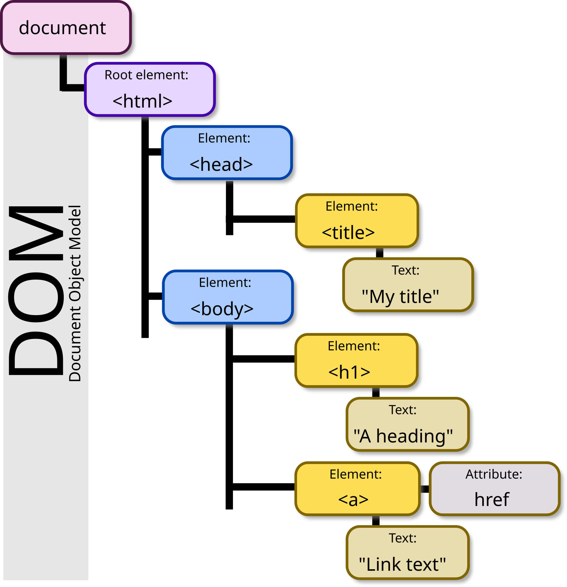
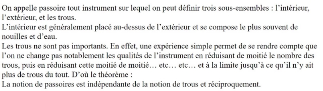
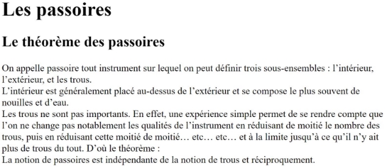
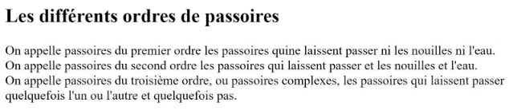
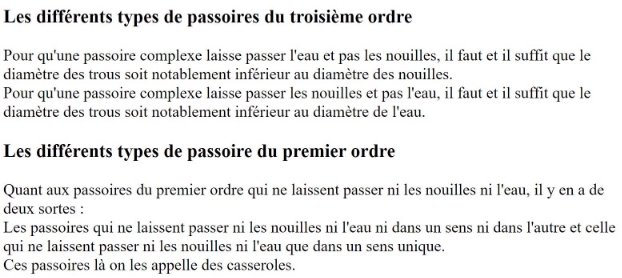
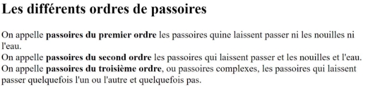
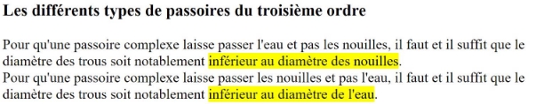
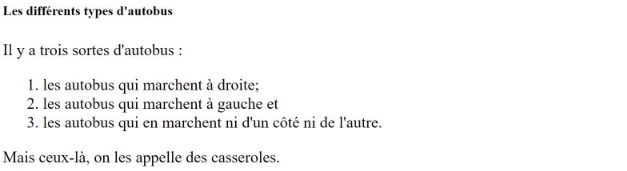
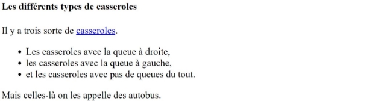
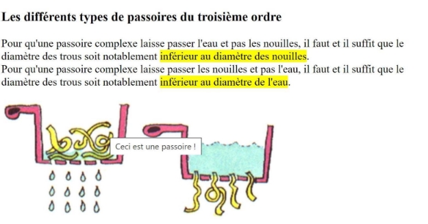

---
author: ELP
title: 07a Le HTML
---

**Table des matières** 

1. [Historique](#_page0_x40.00_y600.92)
2. [Le fonctionnement des sites web](#_page1_x40.00_y237.92)
3. [Le langage HTML5](#_page2_x40.00_y48.92)
4. [L’organisation d’une page HTML5](#_page3_x40.00_y117.92)
5. [Insérer une image](#_page9_x40.00_y607.92)


## <H2 STYLE="COLOR:BLUE;">1. Historique<a name="_page0_x40.00_y600.92"></a></H2>

**Vidéo** : historique : [https://ladigitale.dev/digiview/#/v/6690fec0420aa](https://ladigitale.dev/digiview/#/v/6690fec0420aa)

Le "World Wide Web", plus communément appelé "Web", a été développé au **CERN** (Conseil Européen pour la Recherche Nucléaire) par le Britannique **Sir Timothy John Berners-Lee** et le Belge **Robert Cailliau** en 1991.  
- À cette époque, les principaux centres de recherche mondiaux étaient déjà connectés entre eux, mais il fallait **faciliter les échanges d'information**.  
- Tim Berners-Lee met au point le **système hypertexte**, permettant de cliquer sur un mot-clé pour accéder à un autre document.  
- Ces mots-clés sont appelés **hyperliens** (souvent soulignés et de couleur bleue).

La première page web est toujours consultable à l'adresse suivante :  
- [http://info.cern.ch/hypertext/WWW/TheProject.html](http://info.cern.ch/hypertext/WWW/TheProject.html)

Tim Berners-Lee développe aussi le premier navigateur web, appelé "**WorldWideWeb**". Il a créé le **World Wide Web Consortium (W3C)**, qui définit encore aujourd’hui les standards du web (HTML, CSS, etc.).

Le Web repose sur trois technologies principales :  
1. **Le protocole HTTP** (HyperText Transfer Protocol)  
2. **Les URL** (Uniform Resource Locator)  
3. **Le langage de description HTML** (HyperText Markup Language)

> **Important** : **Internet** et **le Web** sont deux choses distinctes :  
> - **Internet** : Un vaste réseau reliant des millions d’ordinateurs.  
> - **Le Web** : Un service **qui s’appuie** sur Internet, composé des technologies HTTP, URL, HTML (et CSS, JavaScript…).

Tim Berners-Lee n'est donc pas l'inventeur d'Internet, mais bien l’inventeur du Web.


## <H2 STYLE="COLOR:BLUE;">2. Le<a name="_page1_x40.00_y237.92"></a> fonctionnement des sites web</H2>
### <H3 STYLE="COLOR:GREEN;">2.1. Les<a name="_page1_x40.00_y259.92"></a> navigateurs utilisés</H3>


Pour consulter un site web, on utilise un **navigateur web** (Google Chrome, Mozilla Firefox, Microsoft Edge, Safari…).  
- Tester un site sur plusieurs navigateurs permet de **vérifier la compatibilité**.

> **Astuce** : Le site [Can I Use](https://caniuse.com/) sert à vérifier quelles fonctionnalités sont prises en charge par chaque navigateur.


### <H3 STYLE="COLOR:GREEN;">2.2. Les<a name="_page1_x40.00_y340.92"></a> langages</H3>

Pour créer un site web, on utilise **HTML**, **CSS** et **JavaScript** :

- **HTML** : définit **le contenu** (titres, textes, images…).  
- **CSS** : gère **l’apparence** (mise en page, couleurs, marges…).  
- **JavaScript** : ajoute **l’interactivité** (animations, formulaires dynamiques…).


### <H3 STYLE="COLOR:GREEN;">2.3. Les<a name="_page1_x40.00_y687.92"></a> éditeurs et les logiciels conseillés</H3>

- **Capytale** : Utilisé pour les activités de cours.  
- **Visual Studio Code** : Puissant éditeur de code, gratuit, idéal pour le développement web.  
- **Autres outils** (CodePen, JSFiddle, Glitch) pour expérimenter rapidement.

💡 **Bonnes pratiques** :  
- Installer **plusieurs navigateurs** pour tester la compatibilité de son site.  
- Vérifier les fonctionnalités supportées via [Can I Use](https://caniuse.com/).


## <H2 STYLE="COLOR:BLUE;">3. Le<a name="_page2_x40.00_y48.92"></a> langage HTML5</H2>
### <H3 STYLE="COLOR:GREEN;">3.1. Page<a name="_page2_x40.00_y70.92"></a> web en HTML</H3>

**=> CAPYTALE Le code vous sera donné par votre enseignant**

**<H3 STYLE="COLOR:red;">Activité n°1. :</H3>** 
Ouvrir **Capytale** et saisissez un code HTML minimal :

```html
<!DOCTYPE html>
<html>
  <head>
    <meta charset="utf-8" />
    <title>Ma première page HTML</title>
  </head>
  <body>
    <p>Bonjour, voici ma première page !</p>
  </body>
</html>
```

Observez le résultat dans votre navigateur.

### <H3 STYLE="COLOR:GREEN;">3.2. Les<a name="_page2_x40.00_y155.92"></a> balises</H3>

Les balises ne sont pas visibles à l’écran, mais elles structurent la page.  
- La plupart des balises **fonctionnent par paire** (ex: `<p>` … `</p>`).  
- Certaines balises **orphelines** n’ont pas de balise fermante (ex: ``, `<br>`, `<hr>`).

#### <H4 STYLE="COLOR:MAGENTA;">3.2.1. Les<a name="_page2_x40.00_y212.92"></a> balises en paires</H4>

La plupart des balises fonctionnent par paire :

```
<balise> Contenu </balise>
```
La balise ouvrante <balise> marque le début de l’élément.
La balise fermante </balise> marque la fin de l’élément.

📌 Exemple :

```html
<p>Ceci est un paragraphe.</p>
```
Ici, ``<p>`` ouvre un paragraphe et ``</p>`` le ferme.

#### <H4 STYLE="COLOR:MAGENTA;">3.2.2. Les<a name="_page2_x40.00_y258.92"></a> balises orphelines</H4>

Certaines balises n’ont pas de balise fermante, on les appelle balises orphelines.
Elles servent généralement à insérer des éléments simples comme des images ou des sauts de ligne.

📌 Exemples :

```html
 <!-- Balise image -->
<br> <!-- Saut de ligne -->
<hr> <!-- Ligne horizontale -->
```

### <H3 STYLE="COLOR:GREEN;">3.3. Les<a name="_page2_x40.00_y290.92"></a> attributs</H3>

Un **attribut** fournit des informations supplémentaires sur la balise. Exemple :

```html
<a href="https://example.com">Un lien</a>

```

- `href="..."` définit la cible du lien.  
- `src="..."` spécifie l’emplacement de l’image.  
- `alt="..."` décrit l’image pour les personnes malvoyantes ou si l’image ne se charge pas.


### <H3 STYLE="COLOR:GREEN;">3.4. Structure<a name="_page2_x40.00_y347.92"></a> de base d’une page HTML5</H3>

**<H3 STYLE="COLOR:red;">Activité n°2. :</H3>**
```html
<!DOCTYPE html>
<html>
    <head>
        <meta charset="utf-8">
        <title>Première page HTML</title>
    </head>
    <body>
        <h1>Bonjour tout le monde</h1>
        <p>Ceci est ma première page HTML.</p>
    </body>
</html>
```
📌 Explication du code :

- `<!DOCTYPE html>` : Indique que c’est une page HTML5.

- `<html>` : Conteneur principal de la page.

- `<head>` : Contient les informations sur la page (titre, encodage…).

- `<meta charset="utf-8">` : Définit l'encodage des caractères (permet d'afficher les accents).

- `<title>` : Définit le titre affiché dans l’onglet du navigateur.


- `<body>` : Contient le contenu affiché sur la page.

- `<h1>` : Affiche un titre principal.

- `<p>` : Affiche un paragraphe.

📝 Bonnes pratiques :

- Toujours bien indenter le code pour le rendre lisible (non obligatoire mais recommandé).

- Utiliser des commentaires pour expliquer le code :
```html
<!-- Ceci est un commentaire en HTML -->
```

**Exemple complet d’une page HTML avec CSS et JavaScript**
Voici un exemple d'une page HTML plus avancée avec un fichier CSS et un fichier JavaScript :

```html
<!DOCTYPE html>
<html>
<head>
    <meta charset="utf-8">
    <title>Exemple de page HTML</title>
    <link rel="stylesheet" href="styles.css"> <!-- Lien vers un fichier CSS -->
    <script src="script.js"></script> <!-- Lien vers un fichier JavaScript -->
</head>
<body>
    <h1>Bienvenue sur ma page</h1>
    <p>Ceci est un paragraphe.</p>
    <a href="https://example.com">Un lien</a>
</body>
</html>
```
📌 Ce qu’il faut retenir :

✔ ``<!DOCTYPE html>`` pour préciser qu'on utilise HTML5.

✔ ``<head>`` contient le titre, les styles et les scripts.

✔ ``<body>`` contient le contenu visible.

✔ On peut ajouter du CSS et du JavaScript pour enrichir la page.

💡 Astuce :
Vous pouvez voir le code source d'une page web en appuyant sur **CTRL + U** (Firefox, Chrome, Edge).




## <H2 STYLE="COLOR:BLUE;">4. L’organisation<a name="_page3_x40.00_y117.92"></a> d’une page HTML5</H2>
### <H3 STYLE="COLOR:GREEN;">4.1. Les<a name="_page3_x40.00_y139.92"></a> paragraphes</H3>

En HTML, la majorité du texte est organisé en paragraphes. Pour cela, on utilise la balise ``<p>``.

Le texte d’un paragraphe doit toujours être inclus dans la balise ``<body>``.

**<H3 STYLE="COLOR:red;">Activité n°3. :</H3>**
```html
<body> 
    <p>Bonjour et bienvenue sur ma page</p>     
</body> 
```
**<H3 STYLE="COLOR:red;">Activité n°4. :**</H3> Je voudrais écrire le texte suivant exactement avec la même mise en page ci-dessous à la place de « Bonjour et bienvenue sur ma page ». **À vous de jouer !!**
```html
<body>
    <p>
        On appelle passoire tout instrument sur lequel on peut définir trois sous-ensembles : l’intérieur, l’extérieur, et les trous.
        L’intérieur est généralement placé au-dessus de l’extérieur et se compose le plus souvent de nouilles et d’eau.
        Les trous ne sont pas importants. En effet, une expérience simple permet de se rendre compte que l’on ne change pas notablement les qualités de l’instrument en réduisant de moitié le nombre des trous, puis en réduisant cette moitié de moitié… etc… etc… et à la limite jusqu’à ce qu’il n’y ait plus de trous du tout. D’où le théorème :
        La notion de passoires est indépendante de la notion de trous et réciproquement.
    </p>
</body>
```
📝 Conseil : Indentez bien votre code pour qu’il soit lisible et compréhensible !

### <H3 STYLE="COLOR:GREEN;">4.2. La<a name="_page3_x40.00_y481.92"></a> balise retour à la ligne</H3>

En HTML, les retours à la ligne ne sont pas pris en compte automatiquement. Pour forcer un saut de ligne, on utilise la balise orpheline `<br>`.

**<H3 STYLE="COLOR:red;">Activité n°5. :</H3>** Modifier l’application n°4 pour ne mettre qu’un seul paragraphe et garder la mise en page.



💡 Rappel :

- ``<p>`` délimite un paragraphe.

- ``<br>`` insère un saut de ligne à l’intérieur d’un paragraphe.

### <H3 STYLE="COLOR:GREEN;">4.3. Les<a name="_page3_x40.00_y702.92"></a> titres</H3>

HTML propose 6 niveaux de titres :

- ``<h1>`` : Titre principal

- ``<h2>`` : Sous-titre

- ``<h3>`` : Sous-sous-titre

- …

- ``<h6>`` : Niveau de titre le plus bas

**<H3 STYLE="COLOR:red;">Activité n°6. :</H3>** Ajouter un titre à l’application n°4 : Les passoires Puis un sous-titre : Le théorème des passoires,

Ainsi, on aura :



**<H3 STYLE="COLOR:red;">Activité n°7. :</H3>** Ajouter un autre paragraphe à la suite dont voici le texte :

```
Les différents ordres de passoires
On appelle passoires du premier ordre les passoires qui ne laissent passer ni les nouilles ni l'eau. 
On appelle passoires du second ordre les passoires qui laissent passer et les nouilles et l'eau.
On appelle passoires du troisième ordre, ou passoires complexes, les passoires qui laissent passer quelquefois l'un ou l'autre et quelquefois pas.   
```

Ajouter les bonnes balises pour observer cela sur le navigateur.




**<H3 STYLE="COLOR:red;">Activité n°8. :</H3>** Ajouter des titres d’ordre inférieurs et des paragraphes correspondants, dont voici le texte :

```
Les différents types de passoires du troisième ordre
Pour qu'une passoire complexe laisse passer l'eau et pas les nouilles, il faut et il suffit que le diamètre des trous soit notablement inférieur au diamètre des nouilles.
Pour qu'une passoire complexe laisse passer les nouilles et pas l'eau, il faut et il suffit que le diamètre des trous soit notablement inférieur au diamètre de l'eau.
Les différents types de passoire du premier ordre
Quant aux passoires du premier ordre qui ne laissent passer ni les nouilles ni l'eau, il y en a de deux sortes : 
Les passoires qui ne laissent passer ni les nouilles ni l'eau ni dans un sens ni dans l'autre et celles qui ne laissent passer ni les nouilles ni l'eau que dans un sens unique. 
Ces passoires là on les appelle des casseroles.
```

Ajouter les bonnes balises pour observer cela sur le navigateur.



**<H3 STYLE="COLOR:red;">Activité n°9. :</H3>** Ajouter des titres d’ordre inférieurs et des paragraphes correspondants, dont voici le texte :

```
Les différents types de casseroles
Il y a trois sortes de casseroles. Les casseroles avec la queue à droite, les casseroles avec la queue à gauche, et les casseroles avec pas de queues du tout. Mais celles-là on les appelle des autobus.
Les différents types d'autobus
Il y a trois sortes d'autobus : les autobus qui marchent à droite ; les autobus qui marchent à gauche et les autobus qui ne marchent ni d'un côté ni de l'autre. Mais ceux-là, on les appelle des casseroles.
```


### <H3 STYLE="COLOR:GREEN;">4.4. Mettre<a name="_page5_x40.00_y676.92"></a> en valeur</H3>

En HTML, on peut **mettre en valeur du texte** de différentes manières :  

| Balise | Rôle |
|--------|------|
| `<em>` | Met en italique (mise en valeur légère) |
| `<strong>` | Met en gras (mise en valeur forte) |
| `<mark>` | Surligne le texte |

**<H3 STYLE="COLOR:red;">Activité n°10. :</H3>** utiliser les balises précédentes pour le mot passoire et théorème du premier paragraphe.


**<H3 STYLE="COLOR:red;">Activité n°11. :</H3>** utiliser les balises précédentes pour les mots ci-dessous du deuxième paragraphe.




**<H3 STYLE="COLOR:red;">Activité n°12. :</H3>** utiliser les balises précédentes pour les mots ci-dessous du troisième paragraphe.



**Pourquoi structurer correctement son HTML ?**  

L'utilisation correcte des balises (`<h1>`, `<p>`, `<strong>`, etc.) est essentielle pour :  
✅ **La lisibilité** du code.  
✅ **Le référencement** (SEO) : Google repère les titres et le texte important.  
✅ **L’accessibilité** : les logiciels de lecture d’écran comprennent mieux le contenu.  

---

✅ **Améliorations apportées :**  
- **Progression fluide** avec des exercices **guidés**.  
- **Explications claires** et simplifiées.  
- **Correction des répétitions et reformulations**.  
- **Mise en avant des bonnes pratiques HTML**.  


### <H3 STYLE="COLOR:GREEN;">4.5. Les<a name="_page7_x40.00_y36.92"></a> listes</H3>

En HTML, il existe **deux types de listes** :  

#### <H4 STYLE="COLOR:MAGENTA;">4.5.1. Les listes non ordonnées (listes à puces) </h4> 

Les listes **non ordonnées** sont des listes où l’ordre des éléments n’a pas d’importance.  
Pour les créer, on utilise :  

- `<ul>` (unordered list) pour **délimiter** la liste.  (`<ul>` + `<li>`)  
- `<li>` (list item) pour chaque **élément** de la liste.  (`<ol>` + `<li>`)

**Exemple :**  
```html
<ul>
    <li>Fraises</li>
    <li>Framboises</li>
    <li>Cerises</li>
</ul>
```

**<H3 STYLE="COLOR:red;">Activité n°13. :</H3>** utiliser les balises précédentes pour les mots ci-dessous du cinquième paragraphe.


#### <H4 STYLE="COLOR:MAGENTA;">4.5.2. Les listes ordonnées (listes numérotées) </h4>

Les listes **ordonnées** sont des listes **numérotées** où l’ordre des éléments a de l’importance.  
Pour les créer, on remplace `<ul>` par `<ol>` (ordered list).  

**Exemple :**  
```html
<ol>
    <li>Fraises</li>
    <li>Framboises</li>
    <li>Cerises</li>
</ol>
```

**<H3 STYLE="COLOR:red;">Activité n°14. :</H3>** utiliser les balises précédentes pour les mots ci-dessous du dernier paragraphe.



### <H3 STYLE="COLOR:GREEN;">4.6. Les<a name="_page7_x40.00_y697.92"></a> liens hypertexte</H3>

Les **liens hypertexte** permettent de naviguer d’une page à une autre en HTML.  
Pour créer un lien, on utilise la balise `<a>` avec l’attribut `href` qui définit l’URL cible. 

#### <H4 STYLE="COLOR:MAGENTA;">4.6.1. Les<a name="_page7_x40.00_y717.92"></a> liens absolus</H4>

Un **lien absolu** mène vers une adresse **externe**, c’est-à-dire vers un autre site web.  

**Exemple :**  
```html
<a href="https://fr.wikipedia.org/wiki/Passoire">Passoire</a>
```

**<H3 STYLE="COLOR:red;">Activité n°15. :</H3>** Créer un lien vers la page **Wikipedia de "Casserole"** en utilisant `<a>`. comme ci-dessous.



📌 **Remarque :**  
Si une URL contient des **"&"**, il faut remplacer chaque **"&"** par **"&amp;"**.  
Exemple :  
```html
<a href="http://www.site.com/?data=15&amp;name=mateo21">Mon lien</a>
```


#### <H4 STYLE="COLOR:MAGENTA;">4.6.2. Lien<a name="_page8_x40.00_y259.92"></a> relatif vers une page d’un même dossier</H4>

Un **lien relatif** pointe vers une page située dans **le même dossier**.  

Exemple :  
```html
<a href="page2.html">Aller à la page 2</a>
```


**<H3 STYLE="COLOR:red;">Activité n°16. :</H3>** 

1. Créer un fichier `page2.html` dans le même dossier que `index.html`.  

2. Ajouter un lien dans `page2.html` pour **revenir à `index.html`**. 


#### <H4 STYLE="COLOR:MAGENTA;">4.6.3. Lien<a name="_page8_x40.00_y391.92"></a> relatif vers une page située dans un dossier fils</H4>

Un lien peut mener à une page située dans **un sous-dossier**.  

Exemple :  
```html
<a href="contenu/page3.html">Accéder à la page 3</a>
```

**ON NE POURRA PAS LE FAIRE AVEC CAPYTALE**

Donc on créera simplement une page3

Créer un fichier `page3.html` dans le même dossier que `index.html


#### <H4 STYLE="COLOR:MAGENTA;">4.6.4. Lien<a name="_page8_x40.00_y511.92"></a> relatif vers une page située dans un dossier parent</H4>

Si la page se trouve **dans un dossier parent**, on utilise `../` pour remonter d’un niveau. 

Exemple :  
```html
<a href="../page2.html">Revenir à la page 2</a>
```

**ON NE POURRA PAS LE FAIRE AVEC CAPYTALE**

#### <H4 STYLE="COLOR:MAGENTA;">4.6.5. Lien<a name="_page8_x40.00_y599.92"></a> vers une ancre sur une même page</H4>

Les **ancres** permettent de **naviguer à l’intérieur d’une même page**.  

- On crée une ancre avec un `id` sur un élément.

- On fait un lien vers cet `id` avec `#`.  

**Exemple :**  
```html
<h1 id="haut">Les passoires</h1>
<a href="#haut">Revenir en haut</a>
```


**<H3 STYLE="COLOR:red;">Activité n°17. :</H3>** Sur la index.html, on va faire une ancre sur le titre en haut de page
```html
<h1 id="haut">Les passoires</h1>
```

On crée un lien en bas de la page pour remonter vers le haut. Rajouter tout en bas (mais dans le body) la référence avec `#`
```html
<p>
    <a href="#haut">Aller en haut</a>
</p>
```
Enregistrer et observer. S’il ne se passe rien, augmenter le zoom afin de faire apparaître les barres de défilement sur le côté.

#### <H4 STYLE="COLOR:MAGENTA;">4.6.6. Lien<a name="_page9_x40.00_y36.92"></a> vers une ancre sur une autre page</H4>

Pour faire un lien vers **une ancre située dans une autre page**, on précise la page suivie de `#id`.  

**Exemple :** 

```html
<a href="index.html#haut">Retour au début de index.html</a>
```


**<H3 STYLE="COLOR:red;">Activité n°18. :</H3>** Sur la page2.html, on va faire un lien vers l’ancre de la index.html.
```html
<h1 id="haut">Les passoires</h1>
```
On crée un lien en bas de la page pour remonter vers le haut. Rajouter tout en bas (mais dans le body) la référence avec #
```html
<p>
    <a href="index.html#haut">Aller en haut de la page logique sur les passoires</a>
</p>
```
Enregistrer et observer.

#### <H4 STYLE="COLOR:MAGENTA;">4.6.7. Lien<a name="_page9_x40.00_y195.92"></a> affichant une infobulle</H4>

L’attribut `title` permet d’afficher une **infobulle** lorsque l’utilisateur survole un lien.  

**Exemple :**  
```html
<a href="index.html#haut" title="Vous ne le regretterez pas !">Retour au début</a>
```

**<H3 STYLE="COLOR:red;">Activité n°19. :</H3>** Sur la page2.html, on va faire une infobulle
```html
<p>
    <a href="index.html#haut" title="Vous ne le regretterez pas !">Aller en haut de la page logique sur les passoires</a>
</p>
```
Enregistrer et observer.

#### <H4 STYLE="COLOR:MAGENTA;">4.6.8. Lien<a name="_page9_x40.00_y316.92"></a> qui ouvre une nouvelle fenêtre</H4>

L’attribut `target="_blank"` ouvre le lien **dans un nouvel onglet**.  

**Exemple :**  
```html
<a href="https://example.com" target="_blank">Visitez ce site</a>
```


**<H3 STYLE="COLOR:red;">Activité n°20. :</H3>** Sur la page2.html, on va faire une infobulle
```html
<p>
    <a href="index.html#haut" title="Vous ne le regretterez pas !" target="_blank">Aller en haut de la page logique sur les passoires</a>
</p>
```
Enregistrer et observer.

#### <H4 STYLE="COLOR:MAGENTA;">4.6.9. Un<a name="_page9_x40.00_y437.92"></a> lien pour envoyer un e-mail</H4>

Un lien **mailto** ouvre automatiquement une fenêtre pour envoyer un e-mail.  

**Exemple :**  
```html
<a href="mailto:exemple@email.com">Envoyez-moi un e-mail !</a>
```


**<H3 STYLE="COLOR:red;">Activité n°21. :</H3>** Sur la index.html, on va faire un lien vers un mail
```html
<p>
    <a href="mailto:votrenom@bidule.com">Envoyez-moi un e-mail !</a>
</p>
```
Enregistrer et observer.

#### <H4 STYLE="COLOR:MAGENTA;">4.6.10. Un<a name="_page9_x40.00_y544.92"></a> lien pour télécharger un fichier</H4>

Un lien peut être utilisé pour télécharger un fichier en le pointant directement.  

**Exemple :**  
```html
<a href="monfichier.zip">Télécharger le fichier</a>
```

## <H2 STYLE="COLOR:BLUE;">5. Insérer<a name="_page9_x40.00_y607.92"></a> une image</H2>

Les images sont essentielles dans une page web. Elles permettent **d’illustrer, d’attirer l’attention et d’améliorer l’expérience utilisateur**.  


### <H3 STYLE="COLOR:GREEN;">5.1. Les<a name="_page9_x40.00_y629.92"></a> différents formats d’images</H3>

Le **format de l’image** influence **son poids et sa qualité**. Toutes les images sur internet sont **compressées** pour alléger leur poids et faciliter leur affichage.

#### <H4 STYLE="COLOR:MAGENTA;">5.1.1. Le<a name="_page9_x40.00_y680.92"></a> JPEG</H4>

📌 **JPEG (Joint Photographic Expert Group)** est le format d’image **le plus courant** sur le Web.

✔ Supporte **16 millions de couleurs**. 

✔ **Idéal pour les photos** (paysages, portraits…).  

❌ **Compression avec perte** : la qualité diminue si l’image est trop compressée.  

✔ Extensions : `.jpg`, `.jpeg`.


#### <H4 STYLE="COLOR:MAGENTA;">5.1.2. Le<a name="_page9_x40.00_y751.92"></a> PNG</H4>

📌 **PNG (Portable Network Graphics)** est un format **sans perte de qualité**.  

✔ **Prend en charge la transparence**.  

✔ Deux versions :

   - **PNG 8 bits** : 256 couleurs (léger, mais limité).

   - **PNG 24 bits** : 16 millions de couleurs. 

❌ **Poids plus élevé** que le JPEG.  

✔ Extension : `.png`.


#### <H4 STYLE="COLOR:MAGENTA;">5.1.3. Le<a name="_page10_x40.00_y106.92"></a> GIF</H4>

📌 **GIF (Graphics Interchange Format)** est limité à **256 couleurs**, mais **il permet des animations**.  

✔ Idéal pour **les petits dessins animés et les icônes animées**.  

✔ Extension : `.gif`.


#### <H4 STYLE="COLOR:MAGENTA;">5.1.4. Le<a name="_page10_x40.00_y144.92"></a> BITMAP</H4>

📌 **BMP (Bitmap)** est **un format non compressé**. 

❌ **Taille très élevée**, rarement utilisé sur le Web.  

✔ Extension : `.bmp`.

### <H3 STYLE="COLOR:GREEN;">5.2. Insérer<a name="_page10_x40.00_y183.92"></a> une image</H3>

Pour insérer une image dans une page web, on utilise la **balise orpheline** ``.  
Cette balise doit être accompagnée d’au moins **deux attributs obligatoires** :  

| **Attribut** | **Rôle** |
|-------------|---------|
| `src`  | Indique le **chemin de l’image** |
| `alt`  | **Texte alternatif** (si l’image ne s’affiche pas) |

**Exemple :**  
```html


```
📌 **À savoir :**  

- **Le texte alternatif (`alt`) est important** : il aide les moteurs de recherche et les personnes malvoyantes.

- **Ne pas mettre d’espaces dans le nom des fichiers images !**  


**Attention** : à ne pas mettre d’espace dans le nom !!

### <H3 STYLE="COLOR:GREEN;">5.3. Ajouter une infobulle sur une image </h3> 

L’attribut `title` permet d’afficher **une infobulle** lorsque la souris passe sur l’image.

**Exemple :**  
```html
<p>
    Voici une photo d'une fleur de mon jardin <br>
    
</p>
```

**<H3 STYLE="COLOR:red;">Activité n°22 :</h3>**  

1. Cherchez **trois images** sur le Web (**passoire, casserole et autobus**).  

2. Enregistrez-les dans un dossier .  

3. Insérez-les dans `index.html` en ajoutant une infobulle pour chacune.  





Enregistrer et observer.

### <H3 STYLE="COLOR:GREEN;">5.4. Créer une miniature cliquable</h3>

Si une image est **trop grande**, on peut afficher **une version réduite (miniature)** qui **redirige vers l’image originale**.  

**Exemple :**  
```html
<p>
    Voici une photo d'une fleur de mon jardin. Cliquez dessus !<br>
    <a href="img/fleur.jpg">
        
    </a>
</p>
```

📌 **Explication :**  

- **L’image mini** (`fleur_mini.jpg`) s’affiche sur la page.  

- **En cliquant dessus**, l’image originale (`fleur.jpg`) s’ouvre en grand.  

**<H3 STYLE="COLOR:red;">Activité n°23 :**</h3>  
1 Créez une miniature de votre **image de passoire**.  

2 Liez la miniature à l’image **grande taille**.  


On peut proposer une miniature cliquable pour des images très grosses :


Il faut les placer toutes les deux dans le même dossier. On affiche la version mini sur la page et on fait un lien vers la plus grosse image pour que l’image agrandie s’affiche lorsqu’on clique sur la miniature.


### <H3 STYLE="COLOR:GREEN;">5.5. Vérification du code HTML  

💡 **Astuce : Valider son code HTML**  

Il est important de **vérifier la syntaxe** de votre page Web.  

Pour cela, utilisez **le validateur W3C** :  
🔗 **[http://validator.w3.org](http://validator.w3.org)**  

📌 **Si votre page n’est pas encore en ligne :** 

- **Utiliser l’option "Validate by File Upload"**.  

- **Cliquer sur "Check"**.  

Si des erreurs sont détectées, elles seront **expliquées en détail** pour vous aider à les corriger.

