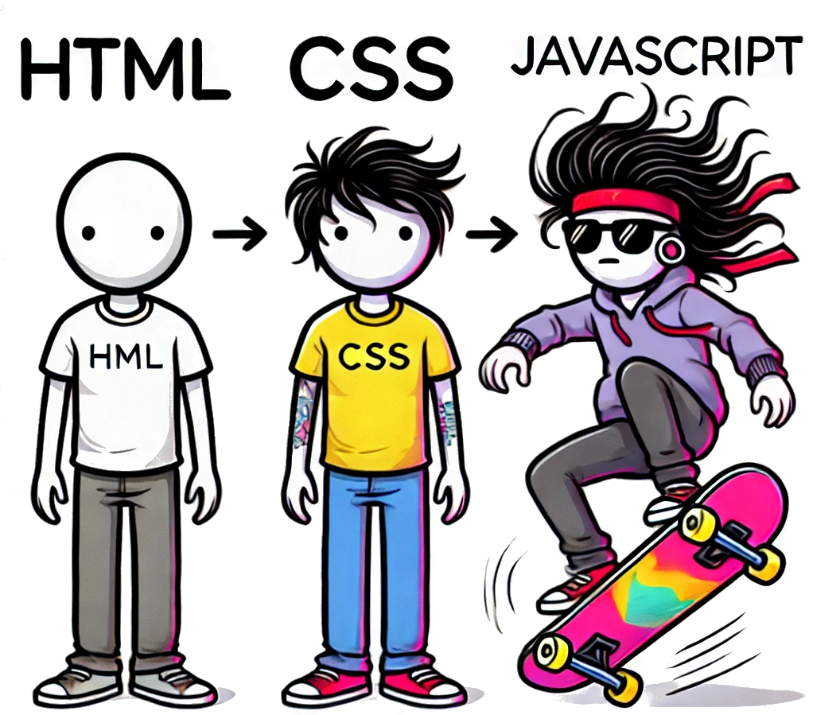
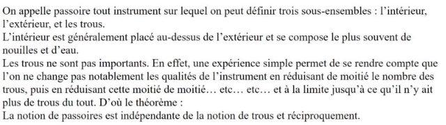
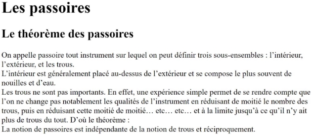
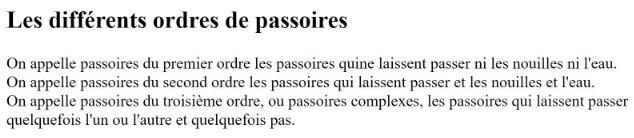
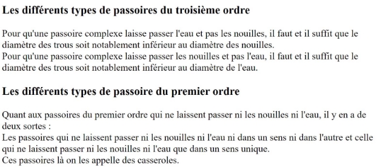
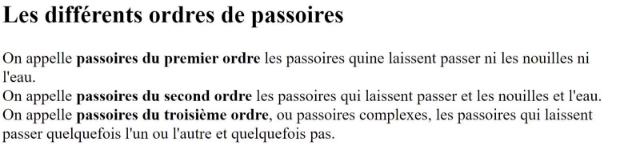
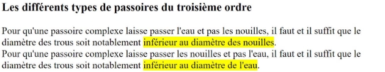
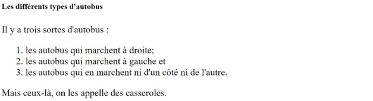
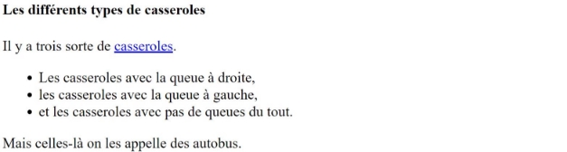
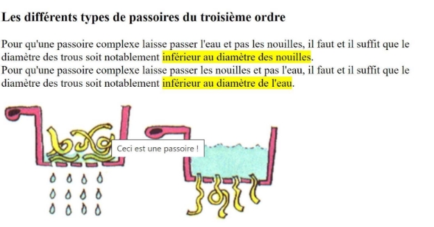

**Table des matières**

1. [Historique](#historique)
2. [Le fonctionnement des sites web](#fonctionnement)
3. [Le langage HTML5](#html5)
4. [L'organisation d'une page HTML5](#organisation)
5. [Insérer une image](#images)

---

## 1. Historique { #historique }

🔎 **Vidéo explicative**  
🎥 [Regarder l'historique du Web](https://ladigitale.dev/digiview/#/v/6690fec0420aa)

Le **World Wide Web** (souvent appelé **Web**) a été développé en **1991** au **CERN** (Conseil Européen pour la Recherche Nucléaire) par :

- **Tim Berners-Lee** 🇬🇧 (informaticien britannique)

- **Robert Cailliau** 🇧🇪 (ingénieur belge)

💡 **Pourquoi ?**

➡ À cette époque, les chercheurs étaient déjà connectés entre eux, mais **l'échange d'informations était compliqué**.

➡ Tim Berners-Lee invente alors le **système hypertexte**, qui permet de cliquer sur des **hyperliens** pour passer d'un document à un autre.

📌 **Première page web** — encore visible ici :  
🔗 [http://info.cern.ch/hypertext/WWW/TheProject.html](http://info.cern.ch/hypertext/WWW/TheProject.html)

📌 **Le Web repose sur trois technologies principales** :

1. **Le protocole HTTP** (HyperText Transfer Protocol)

2. **Les URL** (Uniform Resource Locator)

3. **Le langage HTML** (HyperText Markup Language)

> ❗ **Attention !** Le Web et Internet sont **deux choses différentes** :
> - **Internet** est un **réseau mondial** reliant des millions d'ordinateurs.
> - **Le Web** est **un service** qui repose sur Internet, utilisant HTTP, URL et HTML.

Tim Berners-Lee est l'inventeur du **Web**, mais **pas d'Internet**.

---

## 2. Le fonctionnement des sites web { #fonctionnement }

### 2.1. Les navigateurs utilisés

Un site web est **affiché** grâce à un **navigateur web**. Les plus connus sont Google Chrome, Mozilla Firefox, Microsoft Edge et Safari.

💡 Tous les navigateurs **n'interprètent pas** les sites **de la même manière**. Il faut s'assurer que le site fonctionne partout !

> **Outil utile** : 🔗 [Can I Use](https://caniuse.com/) — pour vérifier la compatibilité HTML/CSS/JS selon les navigateurs.


### 2.2. Les langages

Un site web est **construit avec trois langages** principaux :

| Langage | Rôle |
|---------|------|
| **HTML** (*HyperText Markup Language*) | Structure le contenu (titres, textes, images, liens…) |
| **CSS** (*Cascading Style Sheets*) | Met en forme (couleurs, marges, disposition…) |
| **JavaScript** | Ajoute des fonctionnalités dynamiques (effets visuels, formulaires interactifs…) |

✅ **HTML** → Structure le contenu  

✅ **CSS** → Définit l'apparence  

✅ **JavaScript** → Ajoute de l'interactivité

{ width=400px .center }

### 2.3. Les éditeurs et logiciels conseillés

- **Capytale** → Pour réaliser les exercices et tester le code en ligne.

- **Visual Studio Code** (VS Code) → Éditeur de code professionnel, gratuit et puissant.

📌 **Bonnes pratiques** :  

✔ Installer **plusieurs navigateurs** pour tester un site.  

✔ Vérifier la compatibilité avec 🔗 [Can I Use](https://caniuse.com/).

---

## 3. Le langage HTML5 { #html5 }

### 3.1. Page web en HTML

**=> CAPYTALE — Le code vous sera donné par votre enseignant**

<p style="color:red;">=> seules les activités sont à faire sur Capytale (pas les exemples)</p>

???+ question "Activité n°1."

    ✅ Ouvrir **Capytale** et saisir ce code HTML minimal :

    ```html
    <!DOCTYPE html>
    <html>
    <head>
        <meta charset="utf-8">
        <title>Ma première page HTML</title>
    </head>
    <body>
        <p>Bonjour, voici ma première page web !</p>
    </body>
    </html>
    ```
    ➡ Observer le résultat.

### 3.2. Les balises

Un fichier **HTML** est composé de **balises** qui définissent les éléments de la page.

| Type de balise | Exemple | Description |
|---------------|---------|-------------|
| **Balises en paires** | `<p> ... </p>` | Début (`<p>`) et fin (`</p>`) |
| **Balises orphelines** | `<br>` `` | Pas besoin de balise fermante |

**Exemple de balise en paire :**
```html
<p>Ceci est un paragraphe.</p>
```

**Exemple de balise orpheline :**
```html

<br> <!-- Saut de ligne -->
```

### 3.3. Les attributs

Les **attributs** ajoutent des informations aux balises.

```html
<a href="https://example.com">Un lien</a>

```

| Attribut | Rôle |
|----------|------|
| `href="..."` | Définit le lien d'une balise `<a>` |
| `src="..."` | Définit l'image affichée avec `` |
| `alt="..."` | Texte alternatif si l'image ne s'affiche pas (important pour l'accessibilité) |

### 3.4. Structure de base d'une page HTML5

???+ question "Activité n°2."

    ✅ Recopier ce code et l'afficher dans le navigateur :

    ```html
    <!DOCTYPE html>
    <html>
        <head>
            <meta charset="utf-8">
            <title>Première page HTML</title>
        </head>
        <body>
            <h1>Bonjour tout le monde</h1>
            <p>Ceci est ma première page HTML.</p>
        </body>
    </html>
    ```

📌 **Explication du code** :

| Élément | Rôle |
|---------|------|
| `<!DOCTYPE html>` | Indique qu'on utilise HTML5 |
| `<html>` | Contient toute la page |
| `<head>` | Métadonnées (titre, encodage…) |
| `<meta charset="utf-8">` | Gère les accents et caractères spéciaux |
| `<title>` | Titre affiché dans l'onglet du navigateur |
| `<body>` | Contenu visible de la page |
| `<h1>` | Titre principal |
| `<p>` | Paragraphe de texte |


📝 **Bonnes pratiques** :

- Toujours bien **indenter** le code pour le rendre lisible.

- Utiliser des **commentaires** pour expliquer le code :

```html
<!-- Ceci est un commentaire en HTML -->
```

---

## 4. L'organisation d'une page HTML5 { #organisation }

### 4.1. Les paragraphes

En HTML, le texte est structuré sous forme de **paragraphes** avec la balise `<p>`.

✔️ **Un paragraphe doit toujours être inclus dans `<body>`**.

???+ question "Activité n°3."

    Créer un paragraphe simple ici entre les balises `<body>` et `</body>` :

    ```html
    <!DOCTYPE html>
    <html>
        <head>
            <meta charset="utf-8">
            <title>Les passoires</title>
        </head>
        <body>
            <p>Bonjour et bienvenue sur ma page.</p>   
        </body>
    </html>
    ```

<p style="color:red;">📌 À partir de cette activité on ne va modifier <strong>QUE le body</strong> !!</p>

???+ question "Activité n°4."

    Écrire le texte suivant avec la même mise en page ci-dessous à la place de « Bonjour et bienvenue sur ma page »:

    ```html
    <body>
        <p>
            On appelle passoire tout instrument sur lequel on peut définir trois sous-ensembles :
            l'intérieur, l'extérieur, et les trous.
            L'intérieur est généralement placé au-dessus de l'extérieur et se compose le plus souvent
            de nouilles et d'eau.
            Les trous ne sont pas importants. En effet, une expérience simple permet de se rendre compte
            que l'on ne change pas notablement les qualités de l'instrument en réduisant de moitié le
            nombre des trous, puis en réduisant cette moitié de moitié… etc… et à la limite jusqu'à ce
            qu'il n'y ait plus de trous du tout. D'où le théorème :
            La notion de passoires est indépendante de la notion de trous et réciproquement.
        </p>
    </body>
    ```

📝 Conseil : Indentez bien votre code pour qu'il soit lisible et compréhensible !

### 4.2. La balise retour à la ligne `<br>`

En HTML, les **retours à la ligne ne sont pas pris en compte automatiquement**.

➡️ Il faut utiliser la **balise orpheline** `<br>` pour forcer un saut de ligne.

???+ question "Activité n°5."

    Modifier l'activité précédente pour **garder la mise en page** avec `<br>`.

    

### 4.3. Les titres

HTML propose **6 niveaux de titres**, du plus important (`<h1>`) au moins important (`<h6>`).

| Balise | Niveau |
|--------|--------|
| `<h1>` | Titre principal |
| `<h2>` | Sous-titre |
| `<h3>` | Sous-sous-titre |
| … | … |
| `<h6>` | Niveau le plus bas |

???+ question "Activité n°6."

    Ajouter un titre **Les passoires** puis un sous-titre **Le théorème des passoires**.

    

???+ question "Activité n°7."

    Ajouter un autre paragraphe à la suite :

    ```
    Les différents ordres de passoires
    On appelle passoires du premier ordre les passoires qui ne laissent passer ni les nouilles ni l'eau.
    On appelle passoires du second ordre les passoires qui laissent passer et les nouilles et l'eau.
    On appelle passoires du troisième ordre, ou passoires complexes, les passoires qui laissent passer
    quelquefois l'un ou l'autre et quelquefois pas.
    ```

    Ajouter les bonnes balises pour observer cela sur le navigateur.

    

???+ question "Activité n°8."

    Ajouter des titres d'ordre inférieurs et les paragraphes correspondants :

    ```
    Les différents types de passoires du troisième ordre
    Pour qu'une passoire complexe laisse passer l'eau et pas les nouilles, il faut et il suffit que
    le diamètre des trous soit notablement inférieur au diamètre des nouilles.
    Pour qu'une passoire complexe laisse passer les nouilles et pas l'eau, il faut et il suffit que
    le diamètre des trous soit notablement inférieur au diamètre de l'eau.
    Les différents types de passoire du premier ordre
    Quant aux passoires du premier ordre qui ne laissent passer ni les nouilles ni l'eau, il y en a
    de deux sortes : Les passoires qui ne laissent passer ni les nouilles ni l'eau ni dans un sens ni
    dans l'autre et celles qui ne laissent passer ni les nouilles ni l'eau que dans un sens unique.
    Ces passoires là on les appelle des casseroles.
    ```

    jouter les bonnes balises pour observer cela sur le navigateur.

    

???+ question "Activité n°9."

    Ajouter encore :

    ```
    Les différents types de casseroles
    Il y a trois sortes de casseroles. Les casseroles avec la queue à droite, les casseroles avec la
    queue à gauche, et les casseroles avec pas de queues du tout. Mais celles-là on les appelle des autobus.
    Les différents types d'autobus
    Il y a trois sortes d'autobus : les autobus qui marchent à droite ; les autobus qui marchent à
    gauche et les autobus qui ne marchent ni d'un côté ni de l'autre. Mais ceux-là, on les appelle des casseroles.
    ```

    

### 4.4. Mettre en valeur

| Balise | Effet |
|--------|-------|
| `<em>` | Italique (mise en valeur légère) |
| `<strong>` | Gras (mise en valeur forte) |
| `<mark>` | Surligné |

???+ question "Activité n°10."

    Utiliser les balises précédentes pour le mot **passoire** et **théorème** du premier paragraphe.

    

???+ question "Activité n°11."

    Utiliser les balises précédentes pour les mots du deuxième paragraphe.

    

???+ question "Activité n°12."

    Utiliser les balises précédentes pour les mots du troisième paragraphe.

    

**Pourquoi structurer correctement son HTML ?**

✅ **Lisibilité** du code.  

✅ **Référencement** (SEO) : Google repère les titres et le texte important.  

✅ **Accessibilité** : les logiciels de lecture d'écran comprennent mieux le contenu.

### 4.5. Les listes

#### 4.5.1. Les listes non ordonnées (listes à puces)

Pour les créer, on utilise :

- `<ul>` (unordered list) pour **délimiter** la liste.

- `<li>` (list item) pour chaque **élément** de la liste.

```html
<ul>
    <li>Fraises</li>
    <li>Framboises</li>
    <li>Cerises</li>
</ul>
```

???+ question "Activité n°13."

    Utiliser les balises précédentes pour le cinquième paragraphe.

    

#### 4.5.2. Les listes ordonnées (listes numérotées)

Les listes **ordonnées** sont des listes **numérotées**. On remplace `<ul>` par `<ol>` (ordered list).

```html
<ol>
    <li>Fraises</li>
    <li>Framboises</li>
    <li>Cerises</li>
</ol>
```

???+ question "Activité n°14."

    Utiliser les balises précédentes pour le dernier paragraphe.

    

### 4.6. Les liens hypertexte

Les **liens hypertexte** se créent avec la balise `<a>` et l'attribut `href`.

#### 4.6.1. Les liens absolus

Un **lien absolu** mène vers une adresse **externe** (un autre site web).

```html
<a href="https://fr.wikipedia.org/wiki/Passoire">Passoire</a>
```

???+ question "Activité n°15."

    Créer un lien vers la page **Wikipedia de "Casserole"**.

    

📌 **Remarque** : Si une URL contient des `&`, remplacer chaque `&` par `&amp;` :
```html
`<a href="http://www.site.com/?data=15&amp;name=mateo21">`Mon lien</a>
```

#### 4.6.2. Lien relatif vers une page du même dossier

```html
<a href="page2.html">Aller à la page 2</a>
```

???+ question "Activité n°16."

    **ATTENTION** : sur Capytale, utiliser le `+` dans la partie "Fichiers" pour ajouter une page !

    1. Créer un fichier `page2.html` dans le même dossier que `index.html`.
    
    2. Ajouter un lien dans `page2.html` pour **revenir à `index.html`**.

#### 4.6.3. Lien relatif vers un sous-dossier

**ON NE POURRA PAS LE FAIRE AVEC CAPYTALE**

```html
<a href="contenu/page3.html">Accéder à la page 3</a>
```

Sur Capytale, créer simplement un fichier `page3.html` dans le même dossier.

#### 4.6.4. Lien relatif vers un dossier parent

**ON NE POURRA PAS LE FAIRE AVEC CAPYTALE**

```html
<a href="../page2.html">Revenir à la page 2</a>
```

#### 4.6.5. Lien vers une ancre sur la même page

Les **ancres** permettent de **naviguer à l'intérieur d'une même page**.

```html
<h1 id="haut">Les passoires</h1>
<a href="#haut">Revenir en haut</a>
```

???+ question "Activité n°17."

    Sur `index.html`, créer une ancre sur le titre :
    ```html
    <h1 id="haut">Les passoires</h1>
    ```

    Ajouter tout en bas (dans le body) un lien de retour en haut :
    ```html
    <p>
        <a href="#haut">Aller en haut</a>
    </p>
    ```
    Enregistrer et observer. (Si rien ne se passe, augmenter le zoom pour faire apparaître les barres de défilement.)

#### 4.6.6. Lien vers une ancre sur une autre page

```html
<a href="index.html#haut">Retour au début de index.html</a>
```

???+ question "Activité n°18."

    Sur `page2.html`, ajouter un lien vers l'ancre de `index.html` :
    ```html
    <p>
        <a href="index.html#haut">Aller en haut de la page logique sur les passoires</a>
    </p>
    ```
    Enregistrer et observer.

---

## 5. Insérer une image { #images }

### 5.1. Les différents formats d'images

| **Format** | **Caractéristiques** | **Extensions** |
|------------|----------------------|---------------|
| **JPEG** | Compression avec perte, idéal pour photos | `.jpg`, `.jpeg` |
| **PNG** | Sans perte, supporte la transparence | `.png` |
| **GIF** | Animations, 256 couleurs max | `.gif` |
| **BMP** | Pas de compression, fichiers très lourds | `.bmp` |

✔ **JPEG** pour les **photos**.  

✔ **PNG** pour les **logos et images avec transparence**.  

✔ **GIF** pour les **animations**.

### 5.2. Insérer une image

On utilise la balise **orpheline** `` avec deux attributs obligatoires :

| **Attribut** | **Description** |
|-------------|----------------|
| `src` | Chemin ou URL de l'image |
| `alt` | Texte alternatif (accessibilité, affichage si l'image ne charge pas) |

```html

```

📌 **Bonnes pratiques** :  

✔ Éviter les noms d'images avec des espaces.  

✔ Toujours renseigner l'attribut `alt`.

### 5.3. Ajouter une infobulle sur une image

```html

```

???+ question "Activité n°19."

    1. Chercher **trois images** sur le Web (**passoire, casserole et autobus**).

    **ATTENTION** : sur Capytale, utiliser la flèche à droite de "Fichiers" pour importer les images.

    2. Les enregistrer à la racine du projet.
    3. Les insérer dans `index.html` en ajoutant une infobulle pour chacune.

    

    

    

### 5.4. Vérification du code HTML

**Pourquoi valider son code HTML ?**

✔ Éviter les erreurs d'affichage.  

✔ Améliorer le référencement SEO.  

✔ Faciliter la compatibilité avec tous les navigateurs.

💡 **Utiliser le validateur W3C** : 🔗 [https://validator.w3.org](https://validator.w3.org)
