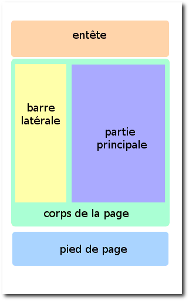

**Table des matières**

1. [La petite histoire du CSS](#histoire)
2. [Où écrit-on le CSS ?](#ou-ecrire)
3. [Appliquer un style](#appliquer)
4. [Formater du texte](#formater)
5. [Ajouter de la couleur et un fond](#couleur)
6. [Créer des bordures](#bordures)
7. [Les apparences dynamiques](#dynamiques)
8. [Les tableaux](#tableaux)
9. [Le modèle des boîtes](#boites)
10. [Squelette de base HTML–CSS](#squelette)

---

Le CSS est un langage utilisé pour décrire l'apparence et la mise en forme des pages web. Alors que le HTML structure le contenu (titres, paragraphes, images, etc.), le CSS permet de définir son **style** : couleurs, taille des polices, agencement des éléments, marges, etc. Grâce au CSS, on sépare la structure du contenu de sa présentation.

**<p style="color:red;">Attention : dans ce cours, le code HTML va dans la page `.html` et le code CSS dans la page `style.css`. Soyez vigilant !</p>**

---

## 1. La petite histoire du CSS { #histoire }

Le **CSS (Cascading Style Sheets)** permet de personnaliser **l'apparence visuelle** d'un site web : couleurs, polices, bordures, marges, mise en page…

**Pourquoi a-t-on créé le CSS ?**

Avant CSS, les styles étaient inclus **directement dans le code HTML**, ce qui rendait les modifications difficiles (il fallait changer chaque page une par une).

✔ Le CSS est apparu pour **séparer la mise en forme du contenu**.  

✔ Un **fichier CSS unique** permet de modifier l'apparence de **tout un site en une seule fois**.

---

## 2. Où écrit-on le CSS ? { #ou-ecrire }

On peut écrire du CSS à **trois endroits différents** :

| **Méthode** | **Explication** | **Recommandation** |
|-------------|---------------|---|
| **Fichier externe (`.css`)** | CSS dans un fichier **séparé** (`style.css`) | ✅ **Méthode recommandée** |
| **Dans l'en-tête (`<head>`)** | CSS entre `<style>...</style>` | ⚠ À éviter sauf dépannage |
| **Directement dans une balise** | Attribut `style` dans une balise HTML | ❌ Mauvaise pratique |

📌 **Exemple d'arborescence d'un site web** :

```
/mon-site/
│── index.html
│── page2.html
│── page3.html
│── style.css
│── images/
│   ├── image1.jpg
```

???+ question "Activité n°1."

    Dans **`index.html`**, ajouter le lien vers `style.css` dans la section `<head>` :

    ```html
    <head>
        <meta charset="utf-8">
        <title>Logique sur les passoires</title>
        <link rel="stylesheet" href="style.css">
    </head>
    ```

    Puis ajouter dans une page **`style.css`** :

    ```css
    body {
        background-color: lightblue;
    }
    ```

    ✅ Enregistrer et observer `index.html`.

???+ question "Activité n°2."

    Lier le fichier CSS à `page2.html` en ajoutant la même ligne dans `<head>` :

    ```html
    <link rel="stylesheet" href="style.css">
    ```

    ✅ Enregistrer et observer `page2.html`.

???+ question "Activité n°3."

    Faire la même chose pour `page3.html`.

---

## 3. Appliquer un style { #appliquer }

### 3.1. Structure d'une règle CSS

Une règle CSS est composée de **trois éléments** :

| Élément | Rôle |
|---------|------|
| **Sélecteur** | Désigne les éléments HTML à modifier (`p`, `h1`, `.classe`, `#id`…) |
| **Propriétés CSS** | Définissent l'effet appliqué (`color`, `font-size`, `background`…) |
| **Valeurs** | Spécifient comment appliquer la propriété (`red`, `16px`, `bold`…) |

### 3.2. Appliquer un style à une balise HTML

On peut appliquer un style à **toutes** les balises d'un même type :

```css
p {
    color: blue;
    font-size: 16px;
}
```

💡 **Tous les paragraphes `<p>` auront un texte bleu et une taille de 16px**.

???+ question "Activité n°4."

    Modifier les couleurs des balises `<em>` et `<strong>` dans `style.css` :

    ```css
    em {
        color: red;
    }
    strong {
        color: rgb(35, 241, 241);
    }
    ```

    ✅ Enregistrer et observer `index.html`.

### 3.3. Appliquer un style à plusieurs balises simultanément

```css
h1, h2, h3, h4, h5 {
    color: purple;
}
```

???+ question "Activité n°5."

    Appliquer cette règle dans `style.css` et observer le résultat.

### 3.4. Les commentaires

```css
/* Ceci est un commentaire */
```

💡 Utiliser des commentaires pour **expliquer et organiser le code CSS**.

### 3.5. Classes et identifiants (`class` et `id`)

Parfois, on veut appliquer un style uniquement à **certains éléments** sans affecter tous ceux du même type.

| **Attribut** | **Rôle** | **Utilisation** |
|-------------|---------|---|
| `class` | Applique un style **à plusieurs éléments** | Utilisé souvent |
| `id` | Applique un style **à un seul élément unique** | Un seul usage par page |

#### 3.5.1. Définir une classe (`class`)

```html
<p class="important">Ce texte est important.</p>
```
```css
.important {
    color: red;
    font-weight: bold;
}
```

💡 Une classe doit toujours être précédée d'un **point (`.`)** en CSS.

???+ question "Activité n°6."

    Dans `index.html`, encadrer le théorème avec une balise `<p>` ayant une **classe** :

    ```html
    <p class="theoreme">…………………………………………..</p>
    ```

    Dans `style.css`, ajouter :

    ```css
    .theoreme {
        color: red;
        font-style: italic;
    }
    ```

    ✅ Enregistrer et observer `index.html`.

#### 3.5.2. Définir un identifiant (`id`)

```html
<h1 id="titre">Mon titre</h1>
```
```css
#titre {
    color: blue;
    text-align: center;
}
```

➡ Un ID doit toujours être précédé d'un **dièse (`#`)** en CSS.

💡 `class` peut être utilisé **plusieurs fois** sur la page. `id` est **unique** et ne doit être utilisé qu'une seule fois.

### 3.6. Les balises neutres `<div>` et `<span>`

- `<div>` regroupe un ensemble d'éléments pour appliquer un style (crée un **bloc**).

- `<span>` applique un style à une partie de texte **sans retour à la ligne** (reste **en ligne**).

```html
<p>La notion de <span class="passoire">passoires</span> est indépendante de la notion de trous.</p>
```
```css
.passoire {
    font-weight: bold;
    background-color: yellow;
}
```

???+ question "Activité n°7."

    Dans `index.html`, modifier le texte du théorème :

    ```html
    <p>La notion de <span class="passoire">passoires</span> est indépendante de la notion de trous.</p>
    ```

    Dans `style.css`, ajouter :

    ```css
    .passoire {
        font-weight: bold;
        background-color: yellow;
    }
    ```

    ✅ Enregistrer et observer `index.html`.

    

---

## 4. Formater du texte { #formater }

### 4.1. Modifier la taille du texte (`font-size`)

| Type | Unités | Exemple |
|------|--------|---------|
| **Absolue** | `px`, `cm`, `mm` | `font-size: 16px;` |
| **Relative** | `%`, `em`, `rem` | `font-size: 120%;` |

✔ **Préférez les tailles relatives** pour s'adapter aux différents écrans.

```css
p {
    font-size: 120%;
}
```

???+ question "Activité n°8."

    Dans `style.css`, ajouter la règle ci-dessus et observer le résultat.

    

### 4.2. Modifier la police (`font-family`)

```css
p {
    font-family: "Trebuchet MS", Arial, sans-serif;
}
```

✔ On spécifie **plusieurs polices** en cas de non-disponibilité sur l'ordinateur de l'utilisateur.

???+ question "Activité n°9."

    Modifier la feuille de style pour que les paragraphes utilisent la police **Trebuchet MS**.

    

    ✅ Enregistrer et observer `index.html`.

### 4.3. Appliquer des styles (italique, gras, souligné)

| Effet | Propriété CSS | Valeurs |
|-------|--------------|---------|
| **Italique** | `font-style` | `normal`, `italic` |
| **Gras** | `font-weight` | `normal`, `bold` |
| **Souligné** | `text-decoration` | `none`, `underline`, `line-through` |

```css
p {
    font-style: italic;
    font-weight: bold;
    text-decoration: underline;
}
```

📌 **Attention** : évitez d'abuser du soulignement, souvent associé aux liens hypertexte.

### 4.4. Aligner du texte (`text-align`)

| Valeur | Effet |
|--------|-------|
| `left` | Aligné à gauche (par défaut) |
| `center` | Centré |
| `right` | Aligné à droite |
| `justify` | Justifié (alignement des deux côtés) |

```css
p {
    text-align: justify;
}
```

Pour **centrer une image** :

```css
img {
    display: block;
    margin: auto;
}
```

???+ question "Activité n°10."

    Modifier la feuille de style pour que les paragraphes soient **justifiés** et les images **centrées**.

    

    ✅ Enregistrer et observer `index.html`.

---

## 5. Ajouter de la couleur et un fond { #couleur }

### 5.1. Modifier la couleur du texte (`color`)

| Méthode | Exemple |
|---------|---------|
| **Nom de couleur** | `color: red;` |
| **Code hexadécimal** | `color: #FF5A28;` |
| **Code RGB** | `color: rgb(240, 96, 204);` |

💡 **Outils pratiques** : 🎨 [HTML Color Codes](https://htmlcolorcodes.com/fr/) · 🎨 [Color Picker](http://www.colorpicker.com/)

???+ question "Activité n°11."

    Ajouter dans `style.css` :

    ```css
    body {
        background-color: #F3E0C5;
    }
    ```

    Expérimenter avec d'autres valeurs :
    ```css
    body {
        background-color: rgb(255, 0, 0);
    }
    ```
    ```css
    p {
        background-color: rgba(255, 0, 0, 0.5);
    }
    ```

    ✅ Enregistrer et observer.

### 5.2. Ajouter une image d'arrière-plan (`background-image`)

```css
body {
    background-image: url("paper.gif");
}
```

???+ question "Activité n°12."

    1. Trouver une **image neutre** et la nommer `paper.gif`.
    2. L'ajouter dans le même dossier que le fichier CSS.
    3. Modifier `style.css` pour l'appliquer en fond.

    ✅ Enregistrer et observer `index.html`.

---

## 6. Créer des bordures { #bordures }

### 6.1. Ajouter des bordures (`border`)

La propriété `border` prend **trois paramètres** : largeur, style, couleur.

| Paramètre | Description | Exemple |
|-----------|-------------|---------|
| **Largeur** | Épaisseur en `px` | `3px` |
| **Style** | Type de bordure | `solid`, `dashed`, `dotted` |
| **Couleur** | Couleur de la bordure | `red`, `#FF5733` |

```css
h1 {
    border: 3px dashed blue;
}
```

On peut appliquer une bordure sur **un seul côté** : `border-top`, `border-bottom`, `border-left`, `border-right`.

### 6.2. Bordures arrondies (`border-radius`)

```css
div {
    border: 2px solid black;
    border-radius: 10px;
}
```

???+ question "Activité n°13."

    Dans `style.css`, ajouter au théorème :

    ```css
    .theoreme {
        border: 4px solid #FF5733;
        border-radius: 15px;
        text-align: center;
        padding: 10px;
        width: 50%;
        margin: auto;
    }
    ```

    ✅ Enregistrer et observer `index.html`.

    

### 6.3. Ajouter des ombres (`box-shadow` et `text-shadow`)

```css
p {
    box-shadow: 6px 6px 10px rgba(0, 0, 0, 0.3);
}

h1 {
    text-shadow: 3px 3px 5px gray;
}
```

???+ question "Activité n°14."

    Ajouter une ombre au théorème :

    ```css
    .theoreme {
        box-shadow: 5px 5px 10px rgba(0, 0, 0, 0.3);
    }
    ```

    ✅ Enregistrer et observer.

---

## 7. Les apparences dynamiques { #dynamiques }

Le CSS permet de **modifier l'apparence des éléments en fonction des interactions** de l'utilisateur.

| Pseudo-classe | Effet |
|--------------|-------|
| `:hover` | Changement au survol de la souris |
| `:active` | Changement au moment du clic |
| `:visited` | Changement sur un lien déjà visité |

### 7.1. Changement de style au survol (`:hover`)

```css
a {
    text-decoration: none;
    color: red;
    font-style: italic;
}

a:hover {
    text-decoration: underline;
    color: green;
}
```

➡ Les liens sont **rouges** par défaut. Au survol, ils deviennent **verts et soulignés**.

### 7.2. Changement de style au clic (`:active`)

```css
a:active {
    background-color: #FFCC66;
}
```

### 7.3. Modifier l'apparence d'un lien déjà visité (`:visited`)

```css
a:visited {
    color: #AAA;
}
```

---

## 8. Les tableaux { #tableaux }

### 8.1. Un tableau simple

📌 **HTML** :
```html
<table>
   <tr>
       <td>Carmen</td>
       <td>33 ans</td>
       <td>Espagne</td>
   </tr>
   <tr>
       <td>Michelle</td>
       <td>26 ans</td>
       <td>États-Unis</td>
   </tr>
</table>
```

📌 **CSS** :
```css
table {
    border-collapse: collapse;
}

td {
    border: 1px solid black;
    padding: 5px;
}
```

### 8.2. Ajouter une ligne d'en-tête (`<th>`)

📌 **HTML** :
```html
<tr>
    <th>Nom</th>
    <th>Âge</th>
    <th>Pays</th>
</tr>
```

📌 **CSS** :
```css
th {
    background-color: lightgray;
}
```

???+ question "Activité n°15."

    1. Ajouter un tableau résumé à la fin de `index.html`.
    2. Modifier `style.css` pour l'afficher proprement :

    ```css
    table {
        width: 80%;
        border-collapse: collapse;
        margin: auto;
    }

    th, td {
        border: 1px solid black;
        padding: 10px;
        text-align: center;
    }

    th {
        background-color: #EEE;
    }
    ```

    ✅ Enregistrer et observer `index.html`.

    
---

## 9. Le modèle des boîtes { #boites }

En CSS, **tous les éléments sont des boîtes** composées de quatre zones :

| Propriété CSS | Description |
|--------------|-------------|
| `width` et `height` | Largeur et hauteur du contenu |
| `padding` | Espace intérieur entre le contenu et la bordure |
| `border` | Bordure (épaisseur, style, couleur) |
| `margin` | Espace extérieur autour de l'élément |

```css
p {
    width: 350px;
    border: 1px solid black;
    text-align: justify;
    padding: 12px;
    margin: 50px;
}
```

**Centrer un élément avec `margin: auto`** :

```css
p {
    width: 350px;
    margin: auto;
}
```

---

## 10. Squelette de base HTML–CSS { #squelette }

La plupart des pages web suivent une **structure de base** composée de cinq blocs principaux :



📌 **HTML** :
```html
<!DOCTYPE html>
<html>
<head>
    <title>Titre de la page</title>
    <link rel="stylesheet" href="style.css">
</head>
<body>
    <div class="header">En-tête</div>
    <div class="nav">Navigation</div>
    <div class="content">Contenu</div>
    <div class="aside">Contexte</div>
    <div class="footer">Pied de page</div>
</body>
</html>
```

📌 **CSS** :
```css
.header, .nav, .content, .aside, .footer {
    padding: 20px;
    margin: 10px;
    border: 1px solid black;
}
```

➡ Ce modèle est **réutilisable pour structurer tout site web**.
