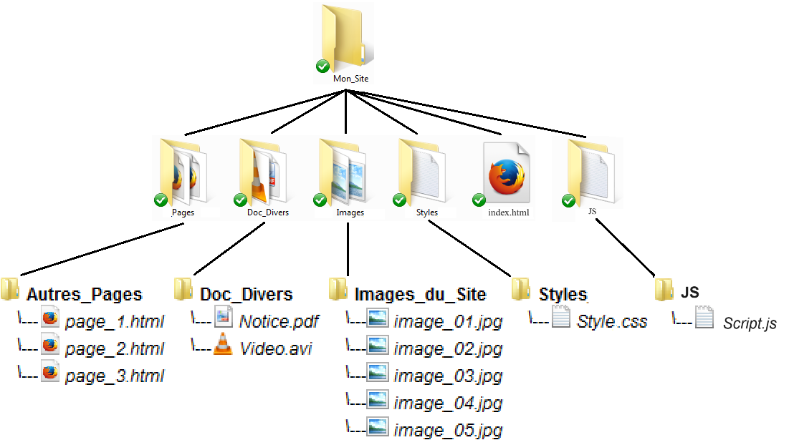

---
author: ELP
title: 07b Le CSS
--- 

**Table des matières** 

1. [La petite histoire du CSS ](#_page0_x40.00_y671.92)
2. [Ou écrit-on le CSS ? ](#_page1_x40.00_y36.92)
3. [Appliquer un style](#_page1_x40.00_y534.92)
4. [Formater du texte](#_page4_x40.00_y36.92)
5. [Ajouter de la couleur et un fond](#_page6_x40.00_y36.92)
6. [Habillage](#_page8_x40.00_y542.92)
7. [Créer des bordures et des ombres](#_page9_x40.00_y302.92)
8. [Les apparences dynamiques](#_page10_x40.00_y621.92)
9. [Les tableaux](#_page11_x40.00_y351.92)
10. [Le modèle des boites](#_page13_x40.00_y36.92)
11. [Le positionnement](#_page15_x40.00_y36.92)
12. [Squelette de base HTML – CSS8](#_page17_x40.00_y239.92)


## **<H2 STYLE="COLOR:BLUE;">1. La<a name="_page0_x40.00_y671.92"></a> petite histoire du CSS**</H2>

Le **CSS (Cascading Style Sheets)** permet de personnaliser **l’apparence visuelle** d’un site web.  
Grâce à CSS, on peut modifier :  

✔ **Les couleurs** du texte et du fond, 

✔ **La police et la taille des caractères**,  

✔ **Les bordures et les marges**,  

✔ **La mise en page** (menus, en-tête, colonnes, pied de page…).  


**🔍 Pourquoi a-t-on créé le CSS ?**  

📌 **Avant CSS :**  

- Seul **HTML** existait pour afficher le contenu, mais **sans mise en page avancée**.  

- Les styles étaient inclus **directement dans le code HTML**, ce qui rendait les modifications difficiles.  

💡 **Problème :**  

❌ Le HTML **mélangeait contenu et mise en forme**.  

❌ Pour modifier la mise en page, il fallait **changer chaque page une par une**.  

💡 **Solution :**  

✔ **Le CSS est apparu pour séparer la mise en forme du contenu.**  

✔ Un **fichier CSS unique** permet de modifier l’apparence de **tout un site en une seule fois**.  

📌 **Avantages :**  

✅ **Gain de temps** : Une seule modification CSS affecte toutes les pages.  

✅ **Code plus clair et organisé**.  

✅ **Sites plus faciles à maintenir et à modifier**.  


## **<H2 STYLE="COLOR:BLUE;">2. Ou<a name="_page1_x40.00_y36.92"></a> écrit-on le CSS ?**</H2>


On peut écrire du CSS à **trois endroits différents** :  

| **Méthode** | **Explication** | **Recommandation** |
|-------------|---------------|--------------------|
| **Fichier externe (`.css`)** | Le CSS est écrit dans un fichier **séparé** (`style.css`). | ✅ **Méthode recommandée** (bonne pratique) |
| **Dans l’en-tête (`<head>`)** | Le CSS est ajouté **dans la page HTML**, entre `<style>...</style>`. | ⚠ **À éviter sauf pour du dépannage** |
| **Directement dans une balise** | Le CSS est ajouté avec **l’attribut `style`** dans une balise HTML. | ❌ **Mauvaise pratique** (code difficile à maintenir) |


**📌 Exemple d’arborescence d’un site web**  

```
/mon-site/
│── index.html
│── page2.html
│── page3.html
│── style.css   ← Notre fichier CSS
│── images/
│   ├── image1.jpg
│   ├── image2.jpg
```

 

ou :



📌 **Bonnes pratiques** : 

- **Mettre le CSS dans un fichier externe** (`style.css`) pour une meilleure organisation.  

- **Éviter de mettre du CSS directement dans le HTML**. 

**<H3 STYLE="COLOR:red;">Activité n°1.:</H3>** **

Dans le fichier **`index.html`**, ajoutez le lien vers `style.css` dans la section `<head>` :  

```html
<!DOCTYPE html>
<html>
<head>
    <meta charset="utf-8">
    <title>Logique sur les passoires</title>
    <link rel="stylesheet" href="style.css">
</head>
<body>
    <h1>Bienvenue sur mon site</h1>
    <p>Voici ma première page avec du CSS !</p>
</body>
</html>
```

📌 **Explication :**  

✔ La balise `<link>` permet de relier notre fichier HTML à la feuille de style `style.css`. 

✔ Désormais, **toute la mise en forme sera gérée depuis ce fichier CSS externe**.  

✅ **Enregistrer et observer `index.html`.**  


**<H3 STYLE="COLOR:red;">Activité n°2.:</H3>** 

Lier le fichier CSS à `page2.html`**  

Ajoutez la même ligne dans `page2.html` :  

```html
<link rel="stylesheet" href="style.css">
```

✅ **Enregistrer et observer `page2.html`.**  


**<H3 STYLE="COLOR:red;">Activité n°3.:</H3>** Faire un lien vers le fichier CSS dans `page3.html`**  

1. **Ouvrir `page3.html`**  
2. **Ajouter le lien vers `style.css`**  
3. **Enregistrer et observer les modifications sur les pages `page2.html` et `page3.html`.**  


**📌 Pourquoi utiliser un fichier CSS externe ?**  

✔ **Un seul fichier CSS pour tout le site** :  

   - Si vous changez la couleur du texte dans `style.css`, **toutes les pages sont mises à jour automatiquement !**  

✔ **Facilité de maintenance** :  

   - Pas besoin de modifier chaque fichier HTML individuellement.  

📌 **Conclusion :**  

Utiliser un **fichier CSS externe** est **la meilleure pratique** pour créer un site **bien organisé et facilement modifiable**. 🚀  


 

## **<H2 STYLE="COLOR:BLUE;">3. Appliquer<a name="_page1_x40.00_y534.92"></a> un style**</H2> 

Le **CSS** permet de **personnaliser l'apparence** des éléments d'une page web en définissant des styles appliqués à des balises HTML.

### **<H3 STYLE="COLOR:GREEN;">3.1. Structure d'une règle CSS**</H3>

Une règle CSS est composée de **trois éléments** :  

| Élément | Rôle |
|---------|------|
| **Sélecteur** | Désigne les éléments HTML à modifier (ex : `p`, `h1`, `.classe`, `#id`…) |
| **Propriétés CSS** | Définissent l’effet appliqué (ex : `color`, `font-size`, `background`) |
| **Valeurs** | Spécifient comment appliquer la propriété (ex : `red`, `16px`, `bold`) |


 

### **<H3 STYLE="COLOR:GREEN;">3.2. Appliquer un style<a name="_page2_x40.00_y67.92"></a> à une balise HTML**</H3>

On peut appliquer un style à **toutes** les balises d’un même type en écrivant simplement le nom de la balise dans le fichier CSS.

📌 **Exemple :** Modifier l'apparence des paragraphes (`<p>`)  

```css
p {
    color: blue;   /* Texte en bleu */
    font-size: 16px;  /* Taille du texte en 16 pixels */
}
```

💡 **Explication** :  

✔ **Tous les paragraphes `<p>` auront un texte bleu et une taille de 16px**.


**<H3 STYLE="COLOR:red;">Activité n°4.:</H3>** Modifier les couleurs des mots entre `<em>` et `<strong>`**  

1. **Ajoutez ces styles dans `style.css`** :  
```css
em {
    color: red;
}
strong {
    color: rgb(35, 241, 241);
}
```
2. **Enregistrer et observer `index.html`**.

✅ **Résultat attendu :**  

- Les textes entourés de `<em>` deviennent rouges. 

- Les textes entre `<strong>` prennent une couleur bleu-cyan.

### **<H3 STYLE="COLOR:GREEN;">3.3. Appliquer un style à plusieurs balises simultanément**</H3>

On peut appliquer un même style à **plusieurs balises** en les listant, séparées par une virgule.

📌 **Exemple : Appliquer une couleur violette aux titres (`h1` à `h5`)**  
```css
h1, h2, h3, h4, h5 {
    color: purple;
}
```

💡 **Explication** :  
✔ Tous les titres `<h1>` à `<h5>` deviennent violets.  


**<H3 STYLE="COLOR:red;">Activité n°5.:</H3>** Appliquer un style aux titres**  

1. **Ajoutez cette règle dans `style.css`** :  
```css
h1, h2, h3, h4, h5 {
    color: purple;
}
```
2. **Enregistrer et observer `index.html`**.


📌 **Note :**  

- En listant plusieurs sélecteurs séparés par une **virgule**, on applique un style à plusieurs éléments en même temps.  

### **<H3 STYLE="COLOR:GREEN;">3.4. Les<a name="_page2_x40.00_y258.92"></a> commentaires**</H3> 

Les **commentaires CSS** permettent d'ajouter des explications dans le code sans affecter l'affichage.

📌 **Syntaxe d’un commentaire en CSS** :  
```css
/* Ceci est un commentaire */
```

💡 **Bonne pratique** :  

✔ Utiliser des commentaires pour **expliquer et organiser le code CSS**.


### **<H3 STYLE="COLOR:GREEN;">3.5. Utiliser des classes et des identifiants (`class` et `id`)<a name="_page2_x40.00_y309.92"></a> **</H3> 

Parfois, on veut **appliquer un style uniquement à certains éléments** sans affecter tous ceux du même type.  

On utilise alors **les classes (`class`)** et **les identifiants (`id`)**.

| **Attribut** | **Rôle** | **Utilisation** |
|-------------|---------|--------------|
| `class` | Applique un style **à plusieurs éléments** | **Utilisé souvent** |
| `id` | Applique un style **à un seul élément unique** | **Un seul usage par page** |


#### <H4 STYLE="COLOR:MAGENTA;">3.3.1. Définir une <a name="_page2_x40.00_y406.92"></a>classe (`class`)</H4>

📌 **Exemple : Appliquer un style aux éléments avec la classe `.important`**  
```html
<p class="important">Ce texte est important.</p>
```
```css
.important {
    color: red;
    font-weight: bold;
}
```
💡 **Explication** : 

✔ Tous les éléments ayant **class="important"** seront **en rouge et en gras**.


➡ Une classe doit toujours être précédée d’un **point (`.`)** en CSS.

**<H3 STYLE="COLOR:red;">Activité n°6.:</H3>** **Dans `index.html`**, encadrer le théorème avec une balise `<p>` en lui attribuant une **classe** 

```html
    <p class ="theoreme"> …………………………………………..</p>
```


**Dans `style.css`**, ajouter :
```css
.theoreme {
    color: red;
    font-style: italic;
}
```

✅ **Enregistrer et observer `index.html`**.


#### <H4 STYLE="COLOR:MAGENTA;">3.3.2. Définir un identifiant (`id`)<a name="_page2_x40.00_y639.92"></a></H4> 

📌 **Exemple : Appliquer un style à un élément unique avec `id="titre"`**  
```html
<h1 id="titre">Mon titre</h1>
```
```css
#titre {
    color: blue;
    text-align: center;
}
```


➡ Un ID doit toujours être précédé d’un **dièse (`#`)** en CSS.

💡 **Différences entre `class` et `id`** :  

✔ **`class` peut être utilisé plusieurs fois sur la page**.  

✔ **`id` est unique et ne doit être utilisé qu’une seule fois**.


### **<H3 STYLE="COLOR:GREEN;">3.6. Les<a name="_page3_x40.00_y36.92"></a> balises neutres `<div>` et `<span>`**</H3> 

📌 **Pourquoi les utiliser ?**  

- `<div>` regroupe un ensemble d’éléments pour appliquer un style.  

- `<span>` applique un style à une partie de texte sans retour à la ligne.  

📌 **Exemple :**  
```html
<p>La notion de <span class="passoire">passoires</span> est indépendante de la notion de trous.</p>
```
```css
.passoire {
    font-weight: bold;
    background-color: yellow;
}
```

💡 **Explication** :  

✔ **Le mot "passoires" est mis en surbrillance (fond jaune, texte en gras)**.  


**<H3 STYLE="COLOR:red;">Activité n°7.:</H3>** 

1 **Dans `index.html`**, modifier le texte du théorème :
```html
<p>La notion de <span class="passoire">passoires</span> est indépendante de la notion de trous.</p>
```

2 **Dans `style.css`**, ajouter :
```css
.passoire {
    font-weight: bold;
    background-color: yellow;
}
```

✅ **Enregistrer et observer `index.html`**.

📌 **Explication :**

- `<span>` **n’ajoute pas de retour à la ligne**.

- Il permet de modifier uniquement le mot **"passoires"**.


**Exemple : Différence entre `<div>` et `<span>`**  

**Avec `<div>` (bloc)** :
```html
<div class="citation">
    <p>« Un grand pouvoir implique de grandes responsabilités. »</p>
</div>
```
```css
.citation {
    border: 2px solid black;
    padding: 10px;
    background-color: lightgray;
}
```

**Avec `<span>` (inline)** :
```html
<p>Ce mot est <span class="rouge">rouge</span> !</p>
```
```css
.rouge {
    color: red;
    font-weight: bold;
}
```

📌 **À retenir :**

- `<div>` sert à **structurer** la mise en page.

- `<span>` sert à **modifier une partie du texte** sans créer de nouveau bloc.


### **<H3 STYLE="COLOR:GREEN;">3.7. Les<a name="_page3_x40.00_y425.92"></a> sélecteurs avancés**</H3> 

📌 **Sélecteur universel `*`** : Applique un style à **toutes les balises**.  
```css
* {
    margin: 0;
    padding: 0;
}
```

📌 **Sélecteur descendant** : Sélectionne une **balise située à l’intérieur** d’une autre.  
```css
h3 em {
    color: red;
}
```
💡 **Explication** :  

✔ **Les `<em>` à l’intérieur d’un `<h3>` seront rouges.**  

📌 **Sélecteur adjacent `+`** : Cible un élément **juste après** un autre.  

```css
h3 + p {
    font-weight: bold;
}
```
💡 **Explication** :  

✔ **Le premier `<p>` après un `<h3>` sera en gras.**  

📌 **Sélecteur d’attribut `[attribut]`** : Cible les balises ayant **un attribut spécifique**.  

```css
a[title] {
    text-decoration: underline;
}
```
💡 **Explication** :  

✔ **Tous les liens (`<a>`) ayant un attribut `title` seront soulignés.**  


✏️ **Consultez la documentation complète**

➡ Pour plus d’exemples, voir : [Sélecteurs CSS W3C](https://www.w3.org/Style/CSS-selectors-updates/WD-CSS-selectors-20010126.fr.html#selectors).


## **<H2 STYLE="COLOR:BLUE;">4. Formater<a name="_page4_x40.00_y36.92"></a> du texte**</H2>

Le CSS permet de **modifier l’apparence du texte** : **taille, police, alignement, style (gras, italique, souligné)**.


### **<H3 STYLE="COLOR:GREEN;">4.1. Modifier la taille du texte (`font-size`)<a name="_page4_x40.00_y58.92"></a>**</H3> 

La taille du texte est définie avec la propriété `font-size`.  

Il existe **deux types de tailles** :

| Type | Unités | Exemple |
|------|--------|---------|
| **Absolue** | `px`, `cm`, `mm` | `font-size: 16px;` |
| **Relative** | `%`, `em`, `rem`, `small`, `large` | `font-size: 120%;` |

📌 **Recommandation** :  

✔ **Préférez les tailles relatives** (`%`, `em`, `rem`) pour **s’adapter aux écrans**.  

✔ L’unité **`em`** correspond à la taille relative par rapport à l’élément parent.  

✔ L’unité **`rem`** correspond à la taille relative par rapport à la racine du document.  

📌 **Exemple :**  

```css
p {
    font-size: 120%;  /* La taille du texte est augmentée de 20% par rapport à la valeur par défaut */
}
```

**<H3 STYLE="COLOR:red;">Activité n°8.:</H3>** Dans `style.css`, ajoutez :
```css
p {
    font-size: 120%;
}
```
✅ **Enregistrer et observer `index.html`**.

✅ **Résultat attendu :**  

- Tous les paragraphes `<p>` auront une taille de **120%** de la taille normale.


### **<H3 STYLE="COLOR:GREEN;">4.2. <a name="_page4_x40.00_y513.92"></a> Modifier la police (`font-family`)**</H3> 

La police des caractères est définie avec `font-family`.  

On peut spécifier **plusieurs polices** pour assurer la compatibilité avec les navigateurs.

📌 **Exemple :**  
```css
p {
    font-family: "Trebuchet MS", Arial, sans-serif;
}
```

📌 **Ordre de préférence** :  

✔ `"Trebuchet MS"` → Première police souhaitée.  

✔ `Arial` → Alternative si la première police est absente.  

✔ `sans-serif` → Police générique au cas où aucune des précédentes n'est disponible.  


**<H3 STYLE="COLOR:red;">Activité n°9.:</H3>** Modifier la feuille de style pour que les paragraphes est une police en Trebuchet MS. 


✅ **Enregistrer et observer `index.html`**.

### **<H3 STYLE="COLOR:GREEN;">4.3. Appliquer des styles (italique, gras, souligné)<a name="_page5_x40.00_y342.92"></a>**</H3> 

| Effet | Propriété CSS | Valeurs |
|-------|--------------|---------|
| **Italique** | `font-style` | `normal`, `italic` |
| **Gras** | `font-weight` | `normal`, `bold`, `lighter`, `bolder` |
| **Souligné** | `text-decoration` | `none`, `underline`, `overline`, `line-through` |

📌 **Exemple :**  
```css
p {
    font-style: italic;     /* Texte en italique */
    font-weight: bold;      /* Texte en gras */
    text-decoration: underline;  /* Texte souligné */
}
```

📌 **Recommandation** :

✔ **Évitez d’abuser du soulignement (`text-decoration: underline;`)**, car il est souvent utilisé pour les liens hypertexte.  


### **<H3 STYLE="COLOR:GREEN;">4.4. Aligner du texte (`text-align`)<a name="_page5_x40.00_y410.92"></a>**</H3> 

| Valeur | Effet |
|--------|-------|
| `left` | Aligné à gauche (par défaut) |
| `center` | Centré |
| `right` | Aligné à droite |
| `justify` | Justifié (alignement des deux côtés) |

📌 **Exemple : Justifier le texte**  
```css
p {
    text-align: justify;
}
```
📌 **Exemple : Centrer une image**  
```css
img {
    display: block;
    margin: auto;
}
```

📌 **Explication** :  

✔ `display: block;` transforme l’image en élément **bloquant** (par défaut, les images sont en `inline`).  

✔ `margin: auto;` permet **de centrer l’image horizontalement**.  


**<H3 STYLE="COLOR:red;">Activité n°10.:</H3>** Modifier la feuille de style pour que les paragraphes soient justifiés et centré les images (penser à mettre des nom aux balises des images sur la index) 


✅ **Enregistrer et observer `index.html`**.

✅ **Résultat attendu :**  

✔ **Les paragraphes sont justifiés**.  

✔ **Les images sont centrées** sur la page.

## **<H2 STYLE="COLOR:BLUE;">5. Ajouter<a name="_page6_x40.00_y36.92"></a> de la couleur et un fond**</H2> 

Le CSS permet **d'améliorer l'apparence d'une page web** en modifiant **les couleurs du texte et du fond**.


### **<H3 STYLE="COLOR:GREEN;">5.1. Modifier la couleur du texte (`color`)<a name="_page6_x40.00_y58.92"></a>**</H3> 

La propriété `color` permet **de définir la couleur du texte**.  

📌 **Trois façons de définir une couleur :**  

| Méthode | Exemple |
|---------|---------|
| **Nom de couleur** | `color: red;` |
| **Code hexadécimal** | `color: #FF5A28;` |
| **Code RGB** | `color: rgb(240,96,204);` |

💡 **Outils pratiques pour choisir une couleur :**  

🎨 [HTML Color Codes](https://htmlcolorcodes.com/fr/)  

🎨 [Color Picker](http://www.colorpicker.com/)  


📌 **Exemple :**  
```css
p {
    color: #FF5A28;  /* Texte en orange */
}
```


**<H3 STYLE="COLOR:red;">Activité n°11.:</H3>** Ajoutez cette règle dans `style.css` :
```css
body {
    background-color: #F3E0C5;
}
```

📌 **Expérimentez** en essayant ces variantes :  
```css
body {
    background-color: rgb(255, 0, 0); /* Rouge */
}
```
```css
p {
    background-color: rgba(255, 0, 0, 0.5); /* Fond rouge semi-transparent */
}
```

✅ **Enregistrer et observer `index.html`**.


### **<H3 STYLE="COLOR:GREEN;">5.2. Ajouter une image d’arrière-plan (`background-image`)<a name="_page6_x40.00_y498.92"></a>**</H3> 


La propriété `background-image` permet d’ajouter une **image de fond** à une page.

📌 **Syntaxe de base :**
```css
body {
    background-image: url("paper.gif");
}
```


**<H3 STYLE="COLOR:red;">Activité n°12.:</H3>** 
1 Trouvez une **image neutre** et nommez-la `paper.gif`. 

2 Ajoutez-la dans le **même dossier** que votre fichier CSS.  

3 Modifiez `style.css` pour appliquer l’image en fond :
```css
body {
    background-image: url("paper.gif");
}
```

✅ **Enregistrer et observer `index.html`**.


##### <H4 STYLE="COLOR:MAGENTA;">5.2.1. Répétition de l’arrière-plan (`background-repeat`)</H4>

Par défaut, une image de fond est **répétée** en mosaïque.  

📌 **Contrôler la répétition du fond avec `background-repeat` :**  
```css
background-repeat: no-repeat; /* Aucune répétition */
background-repeat: repeat-x; /* Répétition horizontale */
background-repeat: repeat-y; /* Répétition verticale */
background-repeat: repeat; /* Par défaut, en mosaïque */
```


##### <H4 STYLE="COLOR:MAGENTA;">5.2.2. Position de l’arrière-plan (`background-position`)</H4>

On utilise `background-position` pour **placer l’image** dans la page.

📌 **Exemple :**
```css
background-position: right top; /* En haut à droite */
background-position: center; /* Centré */
```


##### <H4 STYLE="COLOR:MAGENTA;">5.2.3. Fixer ou défiler l’arrière-plan (`background-attachment`)</H4> 


La propriété `background-attachment` permet **de fixer ou faire défiler l’image de fond**.

📌 **Exemple :**
```css
background-attachment: fixed; /* L’image reste fixe */
background-attachment: scroll; /* L’image défile avec la page */
```


##### <H4 STYLE="COLOR:MAGENTA;">5.2.4. Propriétés abrégées de l’arrière-plan (`background`)</H4> 

On peut **regrouper toutes ces propriétés** en une seule ligne :

```css
body {
    background-color: #ffffff;
    background-image: url("img_tree.png");
    background-repeat: no-repeat;
    background-position: right top;
    background-attachment: fixed;
}
```


On peut écrire une propriété abrégée dans une seule déclaration 

```css
body {
    background: #ffffff url("img_tree.png") no-repeat right top fixed;
  }
```

📌 **Ordre des valeurs :** `couleur`, `image`, `répétition`, `position`, `défilement`.

##### <H4 STYLE="COLOR:MAGENTA;">5.2.5. Ajouter plusieurs images d’arrière-plan</H4> 

Depuis CSS3, il est possible **d’empiler plusieurs images de fond**.

📌 **Exemple :**
```css
body {
    background: url("soleil.png") fixed no-repeat top right,
                url("neige.png") fixed;
}
```
📌 **Explication :**  

- **La première image s'affiche au-dessus des autres**.

- L’ordre des images **est important**.


La première image de cette liste sera placée par-dessus les autres. Attention donc, l'ordre de déclaration des images a son importance : si vous inversez le soleil et la neige dans le code CSS précédent, vous ne verrez plus le soleil ! 

## **<H2 STYLE="COLOR:BLUE;">6. Habillage  (`float`)<a name="_page8_x40.00_y542.92"></a>**</H2> 

La propriété `float` permet **de positionner une image à gauche ou à droite du texte**.


### **<H3 STYLE="COLOR:GREEN;"> **6.1. Flotter un élément à gauche ou à droite</h3>**  

📌 **Exemple :**
```html
<p>
    
</p>
```
```css
.imageflottante {
    float: left;
    margin-right: 10px;
}
```

➡ L’image sera **alignée à gauche** avec un **espace de 10px à droite**.


### **<H3 STYLE="COLOR:GREEN;"> **6.2. Stopper l’effet `float` avec `clear`</h3>**  

Si on ne stoppe pas le `float`, **le texte continue à s’enrouler autour de l’image**.  

La propriété `clear` permet **de forcer un retour à la ligne**.

📌 **Exemple :**
```html
<p></p>
<p>Texte écrit à côté de l'image.</p>
<p class="dessous">Texte écrit sous l'image.</p>  
```
```css
.imageflottante {
    float: left;
}
.dessous {
    clear: both;
}
```

📌 **Explication :**  
| Valeur | Effet |
|--------|-------|
| `clear: left;` | Le texte reprend après une image flottant à gauche. |
| `clear: right;` | Le texte reprend après une image flottant à droite. |
| `clear: both;` | Le texte reprend après **toutes** les images flottantes. |


## **<H2 STYLE="COLOR:BLUE;">7. Créer<a name="_page9_x40.00_y302.92"></a> des bordures et des ombres**</H2> 

Les **bordures** et les **ombres** permettent d'améliorer la mise en page des éléments en les encadrant ou en leur ajoutant un effet de relief.

### **<H3 STYLE="COLOR:GREEN;">7.1. Ajouter des bordures (`border`)<a name="_page9_x40.00_y324.92"></a>**</H3> 

La propriété `border` permet d'ajouter une bordure autour d'un élément HTML.  

Elle prend **trois paramètres** :  

| Paramètre | Description | Exemple |
|-----------|-------------|---------|
| **Largeur** | Épaisseur de la bordure (en `px`, `em`, etc.) | `3px` |
| **Style** | Type de bordure | `solid`, `dashed`, `dotted`, `double`… |
| **Couleur** | Couleur de la bordure | `red`, `#FF5733`, `rgb(255,0,0)` |

📌 **Exemple :**  
```css
h1 {
    border: 3px dashed blue;
}
```
➡ **Résultat** : Un `<h1>` avec une **bordure bleue en tirets** de `3px`.


**Bordures spécifiques (un seul côté)**  

On peut appliquer une bordure uniquement sur **un côté** :

| Propriété | Effet |
|-----------|-------|
| `border-top` | Bordure en haut |
| `border-bottom` | Bordure en bas |
| `border-left` | Bordure à gauche |
| `border-right` | Bordure à droite |

📌 **Exemple :**  
```css
p {
    border-bottom: 2px solid black;
}
```
➡ **Résultat** : Un **trait noir sous chaque paragraphe**.


### **<H3 STYLE="COLOR:GREEN;">7.2. Bordures<a name="_page10_x40.00_y115.92"></a> arrondies**</H3> 

La propriété `border-radius` permet d’arrondir les angles d’un élément.

📌 **Exemple :**
```css
div {
    border: 2px solid black;
    border-radius: 10px;
}
```

➡ **Résultat** : Un encadrement **avec des coins arrondis de 10px**.
 

**<H3 STYLE="COLOR:red;">Activité n°13.:</H3>** Ajouter une bordure au théorème**  

Dans `style.css`, ajoutez :
```css
.theoreme {
    border: 4px solid #FF5733; /* Bordure orange */
    border-radius: 15px; /* Coins arrondis */
    text-align: center; /* Centrer le texte */
    padding: 10px; /* Espacement intérieur */
    width: 50%;
    margin: auto; /* Centrer le bloc */
}
```

✅ **Enregistrer et observer `index.html`**.


### **<H3 STYLE="COLOR:GREEN;">7.3. Ajouter des ombres (`box-shadow` et `text-shadow`)<a name="_page10_x40.00_y299.92"></a>**</H3> 

Les **ombres** permettent d’ajouter du **relief** aux éléments.  

**📌 Ombre sur un élément (`box-shadow`)**  
```css
p {
    box-shadow: 6px 6px 10px rgba(0, 0, 0, 0.3);
}
```
➡ **Résultat** : Un **effet d'ombre douce** sur les `<p>`.

---

**📌 Ombre sur un texte (`text-shadow`)**  
```css
h1 {
    text-shadow: 3px 3px 5px gray;
}
```
➡ **Résultat** : Un **effet d’ombre sur le texte `<h1>`**.


**<H3 STYLE="COLOR:red;">Activité n°14.:</H3>** ### ✏️ **Activité n°14 : Ajouter une ombre au théorème**  

Dans `style.css`, ajoutez :
```css
.theoreme {
    box-shadow: 5px 5px 10px rgba(0, 0, 0, 0.3);
}
```

✅ **Enregistrer et observer `index.html`**.


## **<H2 STYLE="COLOR:BLUE;">8. Les<a name="_page10_x40.00_y621.92"></a> apparences dynamiques**</H2> 


Le CSS permet **de modifier l’apparence des éléments en fonction des interactions de l’utilisateur**.

| Pseudo-classe | Effet |
|--------------|--------|
| `:hover` | Changement au survol de la souris |
| `:active` | Changement au moment du clic |
| `:focus` | Changement quand l’élément est sélectionné |
| `:visited` | Changement sur un lien déjà visité |


### **<H3 STYLE="COLOR:GREEN;">8.1. <a name="_page11_x40.00_y36.92"></a>Changement de style au survol (`:hover`)**</H3> 

📌 **Exemple :**
```css
a {
    text-decoration: none;
    color: red;
    font-style: italic;
}

a:hover {
    text-decoration: underline;
    color: green;
}
```
➡ **Résultat** :  

- Les **liens sont rouges** par défaut.  

- Quand on **passe la souris**, ils deviennent **verts et soulignés**.


### **<H3 STYLE="COLOR:GREEN;">8.2. Changement de style au clic (`:active`)<a name="_page11_x40.00_y195.92"></a>**</H3> 

📌 **Exemple :**
```css
a:active {
    background-color: #FFCC66;
}
```
➡ **Résultat** : Lien **coloré en orange au moment du clic**.

---

### **<H3 STYLE="COLOR:GREEN;">8.3. Modifier l’apparence d’un lien déjà visité (`:visited`)** </h3> 

📌 **Exemple :**
```css
a:visited {
    color: #AAA;
}
```
➡ **Résultat** : **Les liens déjà visités** apparaissent en **gris**.


## **<H2 STYLE="COLOR:BLUE;">9. <a name="_page11_x40.00_y351.92"></a>Améliorer les tableaux en CSS**</H2>


Les tableaux en HTML peuvent être améliorés avec CSS.


### **<H3 STYLE="COLOR:GREEN;">9.1. Un<a name="_page11_x40.00_y389.92"></a> tableau simple (`border-collapse`)**</H3> 

📌 **HTML :**
```html
<table>
   <tr>
       <td>Carmen</td>
       <td>33 ans</td>
       <td>Espagne</td>
   </tr>
   <tr>
       <td>Michelle</td>
       <td>26 ans</td>
       <td>États-Unis</td>
   </tr>
</table>
```

📌 **CSS :**
```css
table {
    border-collapse: collapse;
}

td {
    border: 1px solid black;
    padding: 5px;
}
```


### **<H3 STYLE="COLOR:GREEN;">9.2. Ajouter une ligne d’en-tête (`<th>`)<a name="_page11_x40.00_y705.92"></a>**</H3> 

📌 **HTML :**
```html
<tr>
    <th>Nom</th>
    <th>Âge</th>
    <th>Pays</th>
</tr>
```

📌 **CSS :**
```css
th {
    background-color: lightgray;
}
```


### **<H3 STYLE="COLOR:GREEN;">9.3. Ajouter un titre<a name="_page12_x40.00_y36.92"></a> du tableau**</H3> 

📌 **HTML :**
```html
<table>
   <caption>Informations des utilisateurs</caption>
</table>
```

📌 **CSS :**
```css
caption {
    font-weight: bold;
    caption-side: bottom;
}
```

### **<H3 STYLE="COLOR:GREEN;">9.4. Fusionner<a name="_page12_x40.00_y120.92"></a> des cellules**</H3>


Il existe des balises HTML qui permettent de  définir les trois « zones » du tableau :  

- l'en-tête (en haut) : il se définit avec  les balises ```<thead></thead>```; 

- le corps (au centre) : il se définit avec  les balises ```<tbody></tbody>```; 

- le  pied  du  tableau  (en  bas)  :  il  se  définit  avec  les  balises  ```<tfoot></tfoot>```*.*  

### **<H3 STYLE="COLOR:GREEN;">9.5. Fusionner<a name="_page12_x40.00_y268.92"></a>**</H3>   

📌 **HTML :**
```html
<tr>
    <td colspan="2">Fusion de deux colonnes</td>
</tr>
<tr>
    <td rowspan="2">Fusion de deux lignes</td>
</tr>
```


**<H3 STYLE="COLOR:red;">Activité n°15.:</H3>** 

1. **Ajoutez un tableau résumé à la fin de `index.html`**.

2. **Modifiez `style.css` pour obtenir un style similaire à l’exemple ci-dessous.**

📌 **CSS recommandé :**
```css
table {
    width: 80%;
    border-collapse: collapse;
    margin: auto;
}

th, td {
    border: 1px solid black;
    padding: 10px;
    text-align: center;
}

th {
    background-color: #EEE;
}
```

✅ **Enregistrer et observer `index.html`**.


## **<H2 STYLE="COLOR:BLUE;">10. Le<a name="_page13_x40.00_y36.92"></a> modèle des boites**</H2>

En CSS, **tous les éléments sont des boîtes**.  
Chaque boîte est composée de **quatre zones principales** :

| Propriété CSS | Description |
|--------------|-------------|
| `width` et `height` | Définissent la largeur et la hauteur du contenu |
| `padding` | Définit l’espace intérieur entre le contenu et la bordure |
| `border` | Définit la bordure (épaisseur, style, couleur) |
| `margin` | Définit l’espace extérieur autour de l’élément |

📌 **Exemple :**
```css
p {
    width: 350px;
    border: 1px solid black;
    text-align: justify;
    padding: 12px;
    margin: 50px;
}
```


**Centrer un élément avec `margin: auto`**  

📌 **Exemple :**
```css
p {
    width: 350px;
    margin: auto;
}
```
➡ L’élément sera **centré horizontalement**.


**Gérer le dépassement de texte avec `overflow`**  

| Valeur | Effet |
|--------|-------|
| `visible` | Le texte dépasse de la boîte |
| `hidden` | Le texte est coupé s’il dépasse |
| `scroll` | Ajoute une barre de défilement si nécessaire |
| `auto` | Ajoute une barre de défilement uniquement si nécessaire |

📌 **Exemple :**

```css
div {
    width: 200px;
    height: 100px;
    overflow: scroll;
}
```


## **<H2 STYLE="COLOR:BLUE;">11. Le<a name="_page15_x40.00_y36.92"></a> positionnement**</H2> 

La propriété `position` permet **de placer précisément un élément** dans une page.

### **<H3 STYLE="COLOR:GREEN;">11.1. Les<a name="_page15_x40.00_y58.92"></a> positionnements absolu, fixe et relatif**</H3> 

| Valeur | Effet |
|--------|-------|
| `absolute` | Positionne l’élément **par rapport au parent** |
| `fixed` | L’élément **reste fixe même lors du défilement** |
| `relative` | Décale l’élément **par rapport à sa position normale** |

📌 **Exemple :**
```css
div {
    position: absolute;
    top: 50px;
    left: 100px;
}
```
➡ L’élément sera placé **50px du haut et 100px de la gauche**.


*Gérer la superposition avec `z-index`**  

Si plusieurs éléments se chevauchent, la propriété `z-index` détermine **l’ordre d’affichage**.

📌 **Exemple :**
```css
div {
    position: absolute;
    z-index: 10;
}
```
➡ **Plus la valeur est grande, plus l’élément est au premier plan.**


 

L'élément ayant la valeur de ```z-index``` la plus élevée sera placé par-dessus les autres, comme le montre la figure ci-contre. 

### **<H3 STYLE="COLOR:GREEN;">11.2. Le<a name="_page15_x40.00_y697.92"></a> positionnement inline-block**</H3> 


La propriété `display` permet de modifier l’affichage d’un élément.

| Valeur | Effet |
|--------|-------|
| `inline` | Les éléments se placent **côte à côte** |
| `block` | Les éléments se placent **les uns en-dessous des autres** |
| `inline-block` | Comme `inline`, mais avec la possibilité de **modifier la taille** |

📌 **Exemple :**
```css
nav {
    display: inline-block;
    width: 150px;
    border: 1px solid black;
    vertical-align: top;
}
```

➡ **Les éléments restent alignés horizontalement, mais peuvent être redimensionnés**.


Donnons le code HTML correspondant...  
```html
<!DOCTYPE html>
<html>
    <head>
        <meta charset="utf-8" />
        <link rel="stylesheet" href="style.css" />
        <title>Zozor - Le Site Web</title>
    </head>
    <body>
        <header>
            <h1>Zozor</h1>
            <h2>Carnets de voyage**</H2>
        </header>
        
        <nav>
            <ul>
                <li><a href="accueil.html">Accueil</a></li>
                <li><a href="blog.html">Blog</a></li>
                <li><a href="cv.html">CV</a></li>
            </ul>
        </nav>
        
        <section>
            <aside>
                <h1>À propos de l'auteur</h1>
                <p>C'est moi, Zozor ! Je suis né un 23 novembre 2005.</p>
            </aside>
            <article>                
                <h1>Je suis un grand voyageur</h1>
                <p>Bla bla bla bla (texte de l'article)</p>
            </article>
        </section>
        
        <footer>
            <p>Copyright Zozor - Tous droits réservés
            <a href="mailto:zorro@monsite.org">Me contacter !</a></p>
        </footer>
    </body>
</html>
```

...et le code CSS associé. 
```css
nav
{
    display: inline-block;
    width: 150px;
    border: 1px solid black;
    vertical-align: top;
}
section
{
    display: inline-block;    
    border: 1px solid blue;
    vertical-align: top;
}

```
 

 

## **<H2 STYLE="COLOR:BLUE;">12. Squelette<a name="_page17_x40.00_y239.92"></a> de base HTML – CSS**</H2> 

La plupart des sites web suivent une **structure de base** composée de **cinq blocs principaux** :


📌 **HTML :**
```html
<!DOCTYPE html>
<html>
<head>
    <title>Titre de la page</title>
    <link rel="stylesheet" href="style.css">
</head>
<body>
    <div class="header">En-tête</div>
    <div class="nav">Navigation</div>
    <div class="content">Contenu</div>
    <div class="aside">Contexte</div>
    <div class="footer">Pied de page</div>
</body>
</html>
```

📌 **CSS :**
```css
.header, .nav, .content, .aside, .footer {
    padding: 20px;
    margin: 10px;
    border: 1px solid black;
}
```

➡ **Ce modèle est réutilisable pour structurer tout site web.**

