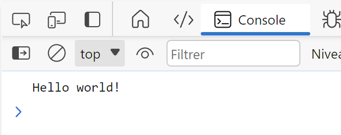

**Table des matières**

1. [Qu'est-ce que JavaScript et à quoi sert-il ?](#intro)
2. [Comment utiliser JavaScript avec HTML et CSS ?](#utiliser)
3. [Boîtes de dialogue](#boites)
4. [La console](#console)
5. [Les variables](#variables)
6. [Les conditions](#conditions)
7. [Les opérateurs logiques](#logiques)
8. [Les fonctions](#fonctions)
9. [Modeler des pages web avec JS](#dom)
10. [Interactions avec l'utilisateur](#interactions)
11. [Exercices](#exercices)

---

## 1. Qu'est-ce que JavaScript et à quoi sert-il ? { #intro }

JavaScript est un langage de programmation utilisé **côté client** pour ajouter des fonctionnalités interactives aux pages web.

📌 **Caractéristiques principales** :

✔ **Langage client-side** → Exécuté directement par le navigateur de l'utilisateur.  

✔ **Polyvalent** → Fonctionne sur tous les navigateurs web.  

✔ **Interactivité** → Manipulation en temps réel du contenu HTML et CSS.

**Comment fonctionne JavaScript dans une page web ?**

1. Le navigateur récupère le code HTML/CSS/JS depuis un serveur web.

2. Le moteur JavaScript du navigateur interprète et exécute le script.

3. Les modifications sont appliquées en temps réel (animations, formulaires, boutons dynamiques…).

➡ JavaScript **ne nécessite pas de serveur** pour fonctionner, il est directement exécuté **dans le navigateur**.


---

## 2. Comment utiliser JavaScript avec HTML et CSS ? { #utiliser }

### 2.1. Intégration dans le code HTML

On peut intégrer du JavaScript **directement dans le HTML**, entre les balises `<script>...</script>`.

```html
<!DOCTYPE html>
<html>
  <body>
    <button onclick="afficherMessage()">Cliquez-moi</button>
    <script>
      function afficherMessage() {
        alert("Bonjour ! Vous avez cliqué sur le bouton.");
      }
    </script>
  </body>
</html>
```

✅ En cliquant sur le bouton, une **alerte apparaît** avec un message.

### 2.2. Fichier JavaScript externalisé

Pour une **meilleure organisation**, on sépare le JavaScript dans un fichier `.js` externe.

📌 **HTML (`index.html`)** :
```html
<body>
    <h1>Bienvenue sur ma page</h1>
    <button id="monBouton">Cliquez-moi</button>
    <script src="script.js"></script>
</body>
```

📌 **JavaScript (`script.js`)** :
```js
document.getElementById("monBouton").addEventListener("click", function() {
    alert("Bonjour ! Vous avez cliqué sur le bouton.");
});
```

???+ question "Activité n°1."

    1. Dans `index.html`, ajouter juste avant `</body>` :
    ```html
    <script src="script.js"></script>
    ```
    2. Créer un fichier `script.js`.
    3. Ajouter ce code dans `script.js` :
    ```js
    document.getElementById("monBouton").addEventListener("click", function() {
        alert("Vous avez cliqué !");
    });
    ```
    4. Dans `index.html`, ajouter un bouton dans le `<body>` :
    ```html
    <button id="monBouton">Cliquez-moi</button>
    ```
    5. Enregistrer et tester dans un navigateur.

📌 **Pourquoi utiliser un fichier JavaScript externe ?**

✔ **Meilleure organisation** → Séparation HTML, CSS, JavaScript.  

✔ **Réutilisation** → Un seul fichier `.js` pour plusieurs pages.  

✔ **Chargement plus rapide** → Le navigateur met en cache les fichiers `.js`.

---

## 3. Boîtes de dialogue { #boites }

JavaScript propose **trois types de boîtes de dialogue** :

| Type de boîte | Utilisation | Exemple |
|--------------|------------|---------|
| `alert()` | Affiche un **message d'information** | `alert("Bonjour !");` |
| `confirm()` | Demande une **confirmation (Oui/Non)** | `confirm("Voulez-vous continuer ?");` |
| `prompt()` | Demande **une saisie** à l'utilisateur | `prompt("Quel est votre nom ?");` |

???+ question "Activité n°2."

    Créer un fichier `exo_JS.html` avec ce code :

    ```html
    <!DOCTYPE html>
    <html lang="fr">
    <head>
        <meta charset="utf-8" />
        <title>Page de tests JavaScript</title>
    </head>
    <body>
        <h1>Page de tests du code JavaScript</h1>
    </body>
    </html>
    ```

    ✅ Enregistrer et ouvrir dans un navigateur.

???+ question "Activité n°3."

    Dans `exo_JS.html`, ajouter dans `<body>` :
    ```html
    <script>
        alert('Hello world!');
    </script>
    ```
    ✅ Une **boîte d'alerte** doit apparaître avec le message `"Hello world!"`.

???+ question "Activité n°4."

    Modifier `exo_JS.html` pour utiliser un **fichier externe `exo.js`** :
    ```html
    <body>
        <h1>Page de tests du code JavaScript</h1>
        <script src="exo.js"></script>
    </body>
    ```
    Créer un nouveau fichier `exo.js` dans le même dossier.

???+ question "Activité n°5."

    Dans `exo.js`, ajouter :
    ```js
    alert('Hello world!');
    ```
    Supprimer l'ancien `<script>` dans `exo_JS.html`.

    ✅ L'alerte s'affiche toujours, mais depuis `exo.js`.

**Pour toutes les activités suivantes** : passer les lignes précédentes en commentaire avec `//` ou `/* ... */`.

---

## 4. La console { #console }

La **console JavaScript** permet d'afficher des messages pour **déboguer** un programme.

???+ question "Activité n°6."

    Dans `exo.js`, remplacer `alert()` par :
    ```js
    console.log('Hello world!');
    ```
    Ouvrir la console dans le navigateur :
    - **Firefox / Edge** : `Ctrl + Maj + I` puis onglet **Console**
    - **Chrome** : `F12` puis onglet **Console**

    ➡ `"Hello world!"` doit s'afficher dans la console.

📌 **Pourquoi utiliser `console.log()` ?**

✔ Affiche des messages **sans interrompre la page** (contrairement à `alert()`).  

✔ Permet de **tester et corriger** du code facilement.  

✔ Utile pour voir la **valeur des variables** en cours d'exécution.

```js
let nom = "Alice";
console.log("Bonjour " + nom + " !");
// Affiche : Bonjour Alice !
```



---

## 5. Les variables { #variables }

### 5.1. Déclarer une variable

Une variable est **un espace mémoire** permettant de stocker une valeur.

| Mot-clé | Portée | Peut être modifiée ? |
|---------|--------|---------------------|
| `var` | Globale ou locale | ✅ Oui |
| `let` | Bloc (limité à `{}`) | ✅ Oui |
| `const` | Bloc (limité à `{}`) | ❌ Non |

```js
var maVariable1 = 10;
let maVariable2 = "Bonjour";
const MA_CONSTANTE = 3.14;
```

???+ question "Activité n°7."

    Dans `exo.js`, ajouter :
    ```js
    var myVariable = 5.5;
    alert(myVariable);
    ```
    ➡ Une boîte d'alerte affiche **5.5**.

    


    Remplacer ensuite `alert()` par `console.log()` et observer dans la console.

### 5.2. Les types de variables

JavaScript est **typé dynamiquement** (on n'a pas besoin de préciser le type).

| Type | Exemple |
|------|---------|
| `Number` | `let age = 25;` |
| `String` (texte) | `let nom = "Alice";` |
| `Boolean` (vrai/faux) | `let estConnecte = true;` |

### 5.3. Les chaînes de caractères

???+ question "Activité n°8."

    Dans `exo.js`, ajouter :
    ```js
    var message1 = "Ceci est un \"petit\" test.";
    var message2 = 'Un autre "petit" test (attention à l\'apostrophe).';
    console.log(message1);
    console.log(message2);
    ```

📌 **Caractères spéciaux utiles** :

- `\"` ou `\'` → guillemets/apostrophe dans une chaîne
- `\n` → retour à la ligne
- `\t` → tabulation

### 5.4. Les calculs

```js
var a = 10, b = 3;
console.log(a + b);  // 13
console.log(a - b);  // 7
console.log(a * b);  // 30
console.log(a / b);  // 3.33
console.log(a % b);  // 1 (modulo = reste de la division)
```

???+ question "Activité n°9."

    Dans `exo.js`, ajouter :
    ```js
    var divisor = 3, result1, result2, result3;
    result1 = (16 + 8) / 2 - 2;
    result2 = result1 / divisor;
    result3 = result1 % divisor;

    console.log(result2);
    console.log(result3);
    ```

### 5.5. La concaténation

```js
let salutation = "Bonjour";
let nom = "Alice";
console.log(salutation + " " + nom);  // Bonjour Alice
```

???+ question "Activité n°10."

    Dans `exo.js`, ajouter :
    ```js
    var hi = 'Bonjour ', name = 'toi', result;
    result = hi + name;
    console.log(result);
    ```
    ➡ Résultat : `Bonjour toi`

### 5.6. Interagir avec l'utilisateur (`prompt`)

```js
var userName = prompt('Entrez votre prénom :');
console.log("Bonjour " + userName);
```

???+ question "Activité n°11."

    Dans `exo.js`, ajouter :
    ```js
    var start = 'Bonjour ', name, end = ' !', result;
    name = prompt('Quel est votre prénom ?');
    result = start + name + end;
    console.log(result);
    ```
    ➡ Résultat : `Bonjour [Prénom] !`

    


### 5.7. Convertir une entrée en nombre (`parseInt` et `parseFloat`)

📌 **Problème** : `prompt()` **retourne toujours du texte**.  

📌 **Solution** : Convertir avec `parseInt()` (entier) ou `parseFloat()` (décimal).

```js
var age = prompt("Quel est votre âge ?");
console.log(parseInt(age) + 5);
```

???+ question "Activité n°12."

    Dans `exo.js`, ajouter :
    ```js
    var first, second, result;
    first = prompt('Entrez le premier chiffre :');
    second = prompt('Entrez le second chiffre :');
    result = parseInt(first) + parseInt(second);
    console.log(result);
    ```
    ➡ L'utilisateur entre deux nombres, la somme s'affiche dans la console.

---

## 6. Les conditions { #conditions }

### 6.1. Les opérateurs de comparaison

Les opérateurs classiques sont `==`, `!=`, `<`, `<=`, `>`, `>=`.

Pour comparer **aussi le type** des variables, on utilise `===` et `!==` :

???+ question "Activité n°13."

    ```js
    var number = 4, text = '4', result;

    result = number == text;
    console.log(result); // true (mêmes valeurs, types différents ignorés)

    result = number === text;
    console.log(result); // false (types différents)
    ```

### 6.2. La structure `if / else`

```js
if ( /* condition */ ) {
    // Du code…
} else if ( /* condition */ ) {
    // Du code…
} else {
    // Du code…
}
```

???+ question "Activité n°14."

    ```js
    var userName = prompt('Entrez votre prénom :');

    if (2 < 8 && 8 >= 4) {
        console.log('La condition est bien vérifiée.');
    }
    console.log(userName);
    ```

???+ question "Activité n°15."

    La fonction `confirm()` retourne un booléen :

    ```js
    if (confirm('Voulez-vous exécuter le code JavaScript de cette page ?')) {
        console.log('Le code a bien été exécuté !');
    }
    ```

---

## 7. Les opérateurs logiques { #logiques }

- L'opérateur **ET** se note `&&`
- L'opérateur **OU** se note `||` (Alt Gr + 6)
- L'opérateur **NON** se note `!`

---

## 8. Les fonctions { #fonctions }

Une fonction est un **bloc de code réutilisable** qui exécute une tâche précise.

```js
function nomDeLaFonction(arguments) {
    // Code exécuté par la fonction
}
```

???+ question "Activité n°16. — Fonction sans argument"

    ```js
    function showMessage() {
        console.log("Ceci est une fonction sans argument !");
    }

    showMessage(); // On exécute la fonction
    ```

???+ question "Activité n°17. — Fonction avec argument"

    ```js
    function greetUser(name) {
        console.log("Bonjour " + name + " !");
    }

    greetUser("Alice"); // Affiche : Bonjour Alice !
    greetUser("Bob");   // Affiche : Bonjour Bob !
    ```

???+ question "Activité n°18. — Fonction avec `prompt()`"

    ```js
    function askName() {
        let userName = prompt("Quel est votre prénom ?");
        console.log("Bonjour " + userName + " !");
    }

    askName();
    ```

???+ question "Activité n°19. — Fonction avec `return`"

    ```js
    function addition(a, b) {
        return a + b;
    }

    let resultat = addition(5, 7);
    console.log("Résultat : " + resultat); // Affiche 12
    ```

⚠️ **Un `return` met fin à l'exécution de la fonction !** Le code après `return` ne s'exécutera jamais.

---

## 9. Modeler des pages web avec JS { #dom }

Le **Document Object Model (DOM)** est une interface qui permet à JavaScript d'**interagir avec une page HTML** et de modifier son contenu ou son apparence en temps réel.

### 9.1. Sélectionner un élément par son ID

??+ question "Activité n°20 :" 

    📌 **Sélection d'un élément par son ID**

    La méthode `getElementById()` permet de récupérer un élément HTML unique à partir de son **ID**.
    Créer une page test.html

    ```html
    <body>
        <p id="titre">Je suis un titre</p>
        <script>
            var titre = document.getElementById("titre");
            titre.style.color = "blue";
        </script>
    </body>
    ```


### 9.2. Sélectionner des éléments par leur classe

???+ question "Activité n°21 :"

    📌 **Sélection des éléments par leur classe**

    La méthode `getElementsByClassName()` permet de récupérer **plusieurs éléments** qui partagent une même classe.
    Dans une page test.html

    ```html
    <body>
        <p class="paragraphe">Premier paragraphe</p>
        <p class="paragraphe">Deuxième paragraphe</p>
        <script>
            var paragraphes = document.getElementsByClassName("paragraphe");
            for (var i = 0; i < paragraphes.length; i++) {
                paragraphes[i].style.backgroundColor = "yellow";
            }
        </script>
    </body>
    ```


### 9.3. Changer la couleur d'un texte au clic

???+ question "Activité n°22."

    **1. Créer `interaction.html`** :
    ```html
    <!DOCTYPE html>
    <html lang="fr">
    <head>
        <meta charset="UTF-8">
        <title>Interaction avec JS</title>
    </head>
    <body>
        <h1>Voici un titre</h1>
        <p id="important">Ceci est un texte important.</p>
        <button onclick="changeCouleur()">Cliquez ici</button>
        <script src="interaction.js"></script>
    </body>
    </html>
    ```

    


    **2. Créer `interaction.js`** :
    ```js
    function changeCouleur() {
        var paragraphe = document.getElementById("important");
        paragraphe.style.color = "red";
    }
    ```

    ✅ En cliquant sur le bouton, le texte devient **rouge**.

    


### 9.4. Ajouter une classe CSS dynamiquement

???+ question "Activité n°23."

    **1. Créer `interaction.css`** :
    ```css
    .rouge {
        color: red;
        font-size: 30px;
    }
    ```

    


    **2. Lier le fichier CSS dans `interaction.html`** :
    ```html
    <link rel="stylesheet" href="interaction.css">
    ```

    **3. Modifier `interaction.js`** :
    ```js
    function changeCouleur() {
        var paragraphe = document.getElementById("important");
        paragraphe.classList.add("rouge");
    }
    ```

    **4. Ajouter un bouton de réinitialisation dans `interaction.html`** :
    ```html
    <button onclick="resetCouleur()">Réinitialiser</button>
    ```

    **5. Ajouter la fonction dans `interaction.js`** :
    ```js
    function resetCouleur() {
        var paragraphe = document.getElementById("important");
        paragraphe.classList.remove("rouge");
    }
    ```

    ✅ **Avantage** : on sépare la logique (JS) du design (CSS).

    


     

### 9.5. Modifier le contenu HTML (`innerHTML`)

???+ question "Activité n°24 :"

    📌 **Remplacer le contenu d’un élément**

    Dans une page test.html

    ```html
    <body>
        <h1 id="titre">Ancien titre</h1>
        <script>
            var titre = document.getElementById("titre");
            titre.innerHTML = "Nouveau titre";
        </script>
    </body>
    ```

???+ question "Activité n°25 :"

    📌 **Ajouter du texte à un élément existant**
    ```html
    <body>
        <p id="paragraphe">Texte original.</p>
        <script>
            var paragraphe = document.getElementById("paragraphe");
            paragraphe.innerHTML += " Texte ajouté.";
        </script>
    </body>
    ```

### 9.6. Modifier le style directement (`style`)


???+ question "Activité n°26 :"
    
    📌 **Changer plusieurs styles en même temps**

    Dans une page test.html

    ```html
    <body>
        <p id="element">Paragraphe stylisé</p>
        <script>
            var element = document.getElementById("element");
            element.style.backgroundColor = "yellow";
            element.style.color = "blue";
            element.style.fontSize = "20px";
        </script>
    </body>
    ```

### 9.7. Ajouter des événements dynamiquement

???+ question "Activité n°27 :"

    📌 **Détecter un clic sur un bouton**

    Dans une page test.html

    ```html
    <body>
        <button id="bouton">Cliquez-moi</button>
        <script>
            var bouton = document.getElementById("bouton");
            bouton.addEventListener("click", function() {
                console.log("Le bouton a été cliqué !");
            });
        </script>
    </body>
    ```

---

## 10. Interactions avec l'utilisateur { #interactions }

Les **événements** en JavaScript permettent de réagir aux actions de l'utilisateur.

### 10.1. Liste des événements principaux

| **Événement** | **Description** |
|--------------|----------------|
| `click` | L'utilisateur clique sur un élément. |
| `dblclick` | Double-clique sur un élément. |
| `mouseover` | La souris passe au-dessus d'un élément. |
| `mouseout` | La souris sort d'un élément. |
| `keydown` | Une touche du clavier est enfoncée. |
| `keyup` | Une touche du clavier est relâchée. |
| `focus` | Un champ de formulaire reçoit le focus. |
| `blur` | Un champ de formulaire perd le focus. |
| `change` | La valeur d'un champ change. |
| `submit` | Un formulaire est soumis. |

👉 Liste complète : 🔗 [Événements JavaScript](https://www.devenir-webmaster.com/tuto/javascript/gestion-des-evenements/)

### 10.2. Manipuler les événements

**Dans toute la suite** : créer un fichier `evenement.html`.

???+ question "Activité n°28."

    📌 Exécuter une alerte lors d'un clic :

    ```html
    <body>
        <span onclick="alert('Hello')">Cliquez ici !</span>
    </body>
    ```

???+ question "Activité n°29."

    📌 Utiliser `addEventListener()` pour un clic sur un bouton :

    ```html
    <body>
        <button id="bouton">Cliquez ici !</button>
        <script>
            var bouton = document.getElementById("bouton");
            bouton.addEventListener("click", function() {
                console.log("Bouton cliqué !");
            });
        </script>
    </body>
    ```

???+ question "Activité n°30."

    📌 Changer la couleur d'un élément au survol de la souris :

    ```html
    <body>
        <p id="maDiv">Passez la souris ici !</p>
        <script>
            var div = document.getElementById("maDiv");
            div.addEventListener("mouseover", function() {
                div.style.backgroundColor = "red";
            });
        </script>
    </body>
    ```

???+ question "Activité n°31."

    📌 Détecter la touche appuyée sur le clavier :

    ```html
    <body>
        <p>Appuyez sur une touche...</p>
        <script>
            document.addEventListener("keydown", function(event) {
                console.log("Touche pressée : " + event.key);
            });
        </script>
    </body>
    ```

### 10.3. Le mot-clé `this`

`this` **référence l'élément HTML qui a déclenché l'événement**.

???+ question "Activité n°32."

    📌 Modifier un champ de texte au focus et blur :

    ```html
    <body>
        <input type="text" id="input" size="50" value="Cliquez ici"
            onfocus="this.value = 'Écrivez quelque chose...'"
            onblur="this.value = 'Cliquez ici !'">
    </body>
    ```

### 10.4. Ajouter plusieurs événements à un même élément

???+ question "Activité n°33."

    📌 **Ajouter plusieurs événements avec `addEventListener()`**

    ```html
    <body>
        <button id="clickIt">Cliquez ici !</button>
        <p id="hoverPara">Passez la souris sur ce texte !</p>
        <b id="effect"></b>

        <script>
            const bouton = document.getElementById("clickIt");
            const texte = document.getElementById("hoverPara");

            bouton.addEventListener("click", RespondClick);
            texte.addEventListener("mouseover", RespondMouseOver);
            texte.addEventListener("mouseout", RespondMouseOut);

            function RespondClick() {
                document.getElementById("effect").innerHTML += "Clic détecté !<br>";
            }
            function RespondMouseOver() {
                document.getElementById("effect").innerHTML += "MouseOver détecté !<br>";
            }
            function RespondMouseOut() {
                document.getElementById("effect").innerHTML += "MouseOut détecté !<br>";
            }
        </script>
    </body>
    ```

---

## 11. Exercices { #exercices }

=> CAPYTALE — Le code vous sera donné par votre enseignant

> 💡 **Rappel** : dans les exercices 1 à 3 vous travaillez avec les fichiers du site des **passoires** créé en HTML (07a) et mis en forme en CSS (07b). C'est l'aboutissement du projet web : on y ajoute maintenant de l'interactivité avec JavaScript.

!!! abstract "Exercice 1 : Jeu de devinette de nombre"

    **But du jeu** : L'utilisateur doit deviner un nombre aléatoire entre 1 et 100.

    **Code HTML (`exo1.html`)** :
    ```html
    <!DOCTYPE html>
    <html lang="fr">
    <head>
        <meta charset="UTF-8">
        <title>Jeu de Devinette</title>
    </head>
    <body>
        <h1>Devinez le nombre</h1>
        <p>Je pense à un nombre entre 1 et 100. Pouvez-vous le deviner ?</p>
        <input type="number" id="guess" placeholder="Entrez votre supposition">
        <button id="submitGuess">Soumettre</button>
        <p id="result"></p>
        <script src="exo1.js"></script>
    </body>
    </html>
    ```

    **Code JavaScript à trous (`exo1.js`)** :
    ```js
    // Question 1 : Générer un nombre aléatoire entre 1 et 100
    // Indice : Utiliser Math.random() et Math.floor()
    let randomNumber = ...(... * 100) + 1;

    let guesses = 0;

    // Question 2 : Comment ajouter un événement de clic au bouton "Soumettre" ?
    document.getElementById('submitGuess').addEventListener(..., function() {

        let userGuess = parseInt(document.getElementById('guess').value);
        guesses++;

        // Question 3 : Où afficher le résultat ?
        let result = document.getElementById(...);

        // Question 4 : Vérifier si la supposition est correcte
        if (... === randomNumber) {
            result.textContent = `Félicitations ! Vous avez deviné en ${guesses} essais.`;
        } else if (userGuess < randomNumber) {
            // Question 5 : Message si trop bas
            result.textContent = ...;
        } else {
            // Question 6 : Message si trop haut
            result.textContent = ...;
        }
    });
    ```

!!! abstract "Exercice 2 : Calculatrice de base"

    **Code HTML (`exo2.html`)** :
    ```html
    <!DOCTYPE html>
    <html lang="fr">
    <head>
        <meta charset="UTF-8">
        <title>Calculatrice</title>
    </head>
    <body>
        <h1>Calculatrice Simple</h1>
        <input type="number" id="num1" placeholder="Nombre 1">
        <input type="number" id="num2" placeholder="Nombre 2">
        <select id="operation">
            <option value="add">Addition</option>
            <option value="subtract">Soustraction</option>
            <option value="multiply">Multiplication</option>
            <option value="divide">Division</option>
        </select>
        <button id="calculate">Calculer</button>
        <p id="result"></p>
        <script src="exo2.js"></script>
    </body>
    </html>
    ```

    **Code JavaScript à trous (`exo2.js`)** :
    ```js
    // Question 1 : Ajouter un événement de clic au bouton "Calculer"
    document.getElementById(...).addEventListener('click', function() {

        // Question 2 : Récupérer les valeurs des champs et les convertir en nombres
        let num1 = parseFloat(document.getElementById(...).value);
        let num2 = parseFloat(document.getElementById(...).value);

        // Question 3 : Récupérer l'opération sélectionnée
        let operation = document.getElementById(...).value;

        // Question 4 : Déclarer la variable résultat
        let ...;

        if (operation === 'add') {
            result = num1 + num2;
        } else if (operation === 'subtract') {
            result = num1 - num2;
        } else if (operation === 'multiply') {
            result = num1 * num2;
        } else if (operation === 'divide') {
            result = num1 / num2;
        }

        // Question 5 : Afficher le résultat
        document.getElementById(...).textContent = 'Résultat : ' + result;
    });
    ```

!!! abstract "Exercice 3 : Liste de tâches (To-Do List)"

    **Code HTML (`exo3.html`)** :
    ```html
    <!DOCTYPE html>
    <html lang="fr">
    <head>
        <meta charset="UTF-8">
        <title>Liste de Tâches</title>
    </head>
    <body>
        <h1>Liste de Tâches</h1>
        <input type="text" id="taskInput" placeholder="Nouvelle tâche">
        <button id="addTask">Ajouter</button>
        <ul id="taskList"></ul>
        <script src="exo3.js"></script>
    </body>
    </html>
    ```

    **Code JavaScript à trous (`exo3.js`)** :
    ```js
    // Question 1 : Ajouter un événement de clic au bouton "Ajouter"
    document.getElementById('addTask').addEventListener(..., function() {

        // Question 2 : Récupérer la valeur du champ de saisie
        let taskInput = document.getElementById('taskInput');
        let taskText = taskInput....;

        taskInput.value = '';

        // Question 3 : Créer un nouvel élément de liste
        let li = document.createElement(...);
        li.textContent = taskText;

        // Question 4 : Créer un bouton "Compléter"
        let completeButton = document.createElement(...);
        completeButton.textContent = 'Compléter';
        completeButton.addEventListener('click', function() {
            li.style.textDecoration = 'line-through';
        });

        // Question 5 : Créer un bouton "Supprimer"
        let deleteButton = document.createElement(...);
        deleteButton.textContent = 'Supprimer';
        deleteButton.addEventListener('click', function() {
            li.remove();
        });

        // Question 6 : Ajouter les boutons à l'élément de liste
        li.appendChild(...);
        li.appendChild(...);

        // Question 7 : Ajouter l'élément à la liste
        document.getElementById(...).appendChild(li);
    });
    ```


