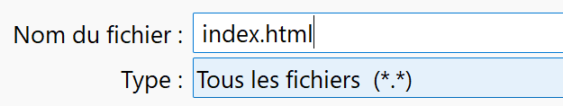
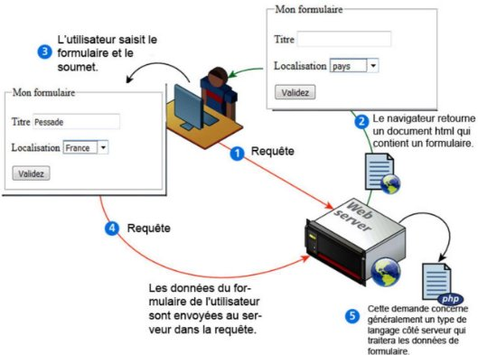
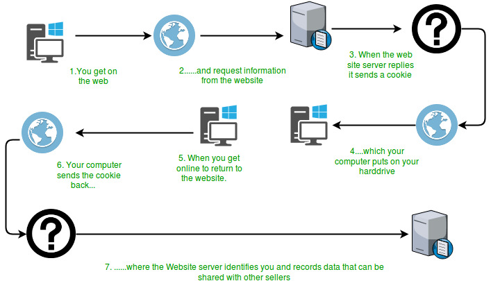
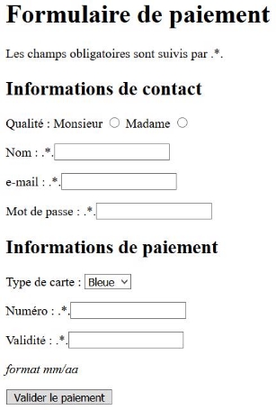

**Table des matières**

1. [Les méthodes HTTP : GET et POST](#get-post)
2. [Les éléments d'un formulaire HTML](#elements)
3. [Client et serveur : qui fait quoi ?](#client-serveur)
4. [Exercices](#exercices)

---


Dans les chapitres précédents, nous avons appris à créer des pages web avec HTML, CSS et JavaScript. Mais comment une page web **envoie-t-elle des données** à un serveur ? C'est le rôle des **formulaires HTML**, qui s'appuient sur le **protocole HTTP** pour transmettre les informations saisies par l'utilisateur.

Ce chapitre fait le lien avec le **chapitre 8 sur les réseaux** : on verra concrètement comment une requête HTTP transporte des données, et pourquoi il existe deux méthodes d'envoi très différentes. Pour approfondir le fonctionnement du protocole HTTP, des adresses IP et du routage, voir le **chapitre 08 — Les réseaux**.

---

## 1. Les méthodes HTTP : GET et POST { #get-post }

### 1.1. Rappel sur les URL

Lorsqu'un utilisateur saisit une URL dans son navigateur, celle-ci peut contenir des **paramètres** :

```
protocole://nom-de-domaine/chemin?paramètre1=valeur1&paramètre2=valeur2
```

💡 **Exemple concret** :

```
https://fr.wikipedia.org/w/index.php?search=informatique
```

➡️ Le navigateur envoie au serveur Wikipedia le paramètre `search=informatique` : c'est lui qui effectue la recherche.

???+ question "Activité n°1 : Observer le passage de paramètres dans une URL"

    1. Aller sur [Wikipedia](https://fr.wikipedia.org/)

    2. Taper **"informatique"** dans la barre de recherche et valider

    3. Observer et noter l'URL générée
    
    4. Comparer ces deux URLs :

        - `https://fr.wikipedia.org/w/index.php?search=informatique`

        - `https://fr.wikipedia.org/wiki/Informatique#Algorithmique`

    ❓ **Que remarquez-vous ?**

    ??? success "Solution"

        - La première URL utilise un **paramètre de requête** (`?search=informatique`) : le navigateur envoie une requête **GET** au serveur, qui effectue la recherche et renvoie une page.
        
        - La deuxième URL cible directement une **page existante** et l'ancre `#Algorithmique` permet de naviguer à l'intérieur de cette page — tout se passe **côté client**, sans requête au serveur.

        **Conclusion** : `?parametre=valeur` → données envoyées au serveur ; `#ancre` → navigation dans la page côté navigateur.

### 1.2. La méthode GET

Lorsqu'un formulaire utilise la méthode **GET**, les données sont **ajoutées directement dans l'URL**.

```html
<form method="GET" action="/search">
    <input type="text" name="query" placeholder="Rechercher">
    <button type="submit">Rechercher</button>
</form>
```

➡️ Exemple d'URL générée après envoi :
```
https://www.example.com/search?query=informatique
```

⚠️ **Problème** : les données sont **visibles dans l'URL**. Elles peuvent être stockées dans l'historique du navigateur, partagées ou interceptées.

### 1.3. La méthode POST

Lorsqu'un formulaire utilise la méthode **POST**, les données sont envoyées **dans le corps de la requête HTTP**, invisibles dans l'URL.

```html
<form method="POST" action="/login">
    <input type="text" name="username" placeholder="Nom d'utilisateur">
    <input type="password" name="password" placeholder="Mot de passe">
    <button type="submit">Se connecter</button>
</form>
```

✅ L'URL **ne change pas** après l'envoi. Les données ne sont pas visibles dans la barre d'adresse.

📄 **Exemple de requête HTTP POST envoyée** :

```
POST /login HTTP/1.1
Host: monsite.com
Content-Type: application/x-www-form-urlencoded
Content-Length: 32

user=dupont&password=azerty
```

???+ question "Activité n°2 : Créer un formulaire et observer l'URL générée avec GET"

    1. Ouvrir un éditeur de texte (Bloc-notes sous Windows, TextEdit sur Mac)
    2. Copier le code suivant :

    ```html
    <!DOCTYPE html>
    <html lang="fr">
    <head>
        <meta charset="UTF-8">
        <title>Requête</title>
    </head>
    <body>
        <form method="GET" action="./login">
            <input name="user" type="text" required placeholder="Nom d'utilisateur">
            <input name="password" type="password" required placeholder="Mot de passe">
            <button type="submit">Login</button>
        </form>
    </body>
    </html>
    ```

    3. Enregistrer sous `index.html` (**choisir "Tous les fichiers"** dans le type)

    

    4. Ouvrir dans un navigateur

    ??? success "Solution"

        Ce formulaire fonctionne en **GET** : les données sont ajoutées à l'URL. C'est utile pour des recherches ou des filtres, mais **pas pour des données sensibles**.

???+ question "Activité n°3 : Observer l'URL générée"

    Remplir le formulaire avec :

    - 👤 **Nom d'utilisateur** : `Dupont`

    - 🔑 **Mot de passe** : `azerty`

    ➡ Après clic sur "Login", l'URL affiche :

    ```
    ./login?user=Dupont&password=azerty
    ```

    🛑 **Problème identifié** : le mot de passe est **visible dans l'URL**. Risque de fuite, stockage dans l'historique, partage involontaire…

???+ question "Activité n°4 : Passer à la méthode POST"

    1. Modifier l'attribut `method` dans le formulaire :

    ```html
    <form method="POST" action="./login">
    ```

    2. Recharger la page, remplir le formulaire et observer :

        - L'**URL reste la même**

        - Les données sont **envoyées dans le corps de la requête**, donc **non visibles** dans l'URL

    ??? success "Solution"

        La méthode **POST** est donc plus adaptée aux formulaires contenant des informations confidentielles (mots de passe, identifiants, données personnelles…).

### 1.4. Récapitulatif GET vs POST

| Critère | **GET** | **POST** |
|---------|---------|----------|
| **Visibilité des données** | ✔️ Dans l'URL | ❌ Dans le corps de la requête |
| **Sécurité** | ❌ Faible | ✅ Plus sécurisé |
| **Taille des données** | ⚠️ Limitée (~2Ko) | ✅ Plus grande |
| **Stockage dans l'historique** | ✔️ Oui | ❌ Non |
| **Exemples d'usage** | 🔍 Recherche, filtres | 🔐 Login, paiement, contact |

💡 **Bonne pratique** : toujours utiliser **`POST`** pour transmettre des mots de passe ou des données personnelles.

---

!!! info "🧠 Capytale : Utiliser le code du chapitre 07a"


## 2. Les éléments d'un formulaire HTML { #elements }

Un formulaire HTML est délimité par la balise `<form>` et peut contenir de nombreux éléments de saisie.

**Dans les activités suivantes**, on utilisera la méthode **GET** pour pouvoir observer directement les données dans l'URL.

### 2.1. Tableau des balises de formulaire

| **Balise** | **Rôle** |
|-----------|---------|
| `<form>` | Conteneur du formulaire |
| `<input>` | Champ de saisie (de nombreux types) |
| `<label>` | Étiquette associée à un champ |
| `<button>` | Bouton cliquable |
| `<select>` | Liste déroulante |
| `<option>` | Option dans une liste déroulante |
| `<optgroup>` | Groupe d'options dans une liste |
| `<textarea>` | Zone de texte multiligne |
| `<fieldset>` | Regroupe des éléments liés |
| `<legend>` | Titre d'un groupe de champs |

### 2.2. Les types de champs `<input>`

| `type` | Rôle |
|--------|------|
| `text` | Saisie libre (ex : prénom) |
| `password` | Masque le texte saisi |
| `radio` | Un seul choix possible dans un groupe |
| `checkbox` | Plusieurs choix possibles |
| `submit` | Envoie le formulaire |
| `reset` | Réinitialise les champs |
| `button` | Ne fait rien sans JavaScript |

???+ question "Activité n°5 : Découverte d'un formulaire HTML"

    1. Créer un fichier dans un éditeur de texte

    2. Copier-coller le code suivant :

    ```html
    <!DOCTYPE html>
    <html lang="fr">
    <head>
        <meta charset="UTF-8">
        <title>Formulaire de test</title>
    </head>
    <body>
        <form method="get" action="">
            <fieldset>
                <legend>Mon formulaire</legend>

                <p>
                    <label>Titre :</label>
                    <input type="text" name="titre">
                </p>

                <p>
                    <label>Localisation :</label>
                    <select name="lieu">
                        <option>pays</option>
                        <option>Canada</option>
                        <option>Finlande</option>
                        <option>France</option>
                    </select>
                </p>

                <input type="submit" value="Validez">
            </fieldset>
        </form>
    </body>
    </html>
    ```

    3. Enregistrer sous `formulaire.html`

    

    4. Ouvrir dans un navigateur

    5. **Questions d'exploration :**

    a. Remplir le champ "Titre" et choisir un pays, puis cliquer sur "Validez". Que vois-tu dans l'URL ?

    b. Que signifient les mots qui apparaissent après le `?` (ex : `?titre=Test&lieu=France`) ?

    c. Modifier `method="get"` en `method="post"` et recommencer. Que remarques-tu cette fois dans l'URL ?

    ??? success "Solution"

        **a.** La page se recharge et l'URL est modifiée, par exemple : `formulaire.html?titre=Bonjour&lieu=Canada`

        **b.** Ce sont les **données transmises par le formulaire** :
        - `titre=Bonjour` → correspond au champ `<input name="titre">`
        - `lieu=Canada` → correspond au `<select name="lieu">`
        - Le `&` sépare les différents paramètres.
        
        🧠 **Règle** : l'attribut `name` détermine le **nom du paramètre** ; la valeur saisie ou sélectionnée devient la **valeur du paramètre**.

        **c.** Avec `method="post"`, l'URL **reste la même**. Les données sont envoyées dans le corps de la requête HTTP, donc non visibles dans la barre d'adresse.

???+ question "Activité n°6 : Formulaire avec différents types de champs"

    1. Créer un fichier `formulaire2.html`

    2. Copier-coller ce code :

    ```html
    <!DOCTYPE html>
    <html lang="fr">
    <head>
        <meta charset="UTF-8">
        <title>Formulaire 2</title>
    </head>
    <body>
        <form method="get" action="">
            <p>
                Prénom : <input type="text" name="prenom">
            </p>

            <p>
                Mot de passe : <input type="password" name="psw">
            </p>

            <p>
                Genre :<br>
                <input type="radio" name="genre" value="homme"> homme<br>
                <input type="radio" name="genre" value="femme" checked> femme<br>
                <input type="radio" name="genre" value="non"> ne souhaite pas répondre
            </p>

            <p>
                Véhicules :<br>
                <input type="checkbox" name="vehicule" value="velo" checked> J'ai un vélo<br>
                <input type="checkbox" name="vehicule" value="auto"> J'ai une voiture
            </p>

            <input type="submit" value="Valider">
        </form>
    </body>
    </html>
    ```

    3. **Questions de compréhension :**

    a. Remplir le champ prénom, choisir un genre, sélectionner les moyens de transport, puis cliquer sur "Valider". Que vois-tu dans l'URL ?

    b. Cocher uniquement "J'ai une voiture". Quelle différence dans l'URL ? Que se passe-t-il si aucun véhicule n'est coché ?

    c. Pourquoi peut-on cocher plusieurs cases pour les véhicules, mais un seul genre ?

    d. Quel est le rôle de l'attribut `checked` ?

    ??? success "Solution"

        **a.** Exemple d'URL : `formulaire2.html?prenom=Alice&psw=&genre=femme&vehicule=velo`

        - `prenom=Alice` → champ texte
        - `psw=` → champ mot de passe (vide ici)
        - `genre=femme` → bouton radio sélectionné
        - `vehicule=velo` → case cochée

        **b.** Seule la valeur `vehicule=auto` apparaît. Si aucune case n'est cochée, **`vehicule` n'apparaît pas du tout** dans l'URL → seuls les champs cochés ou remplis sont envoyés.

        **c.** C'est le comportement de HTML :
        - `radio` impose **un choix exclusif** (tous les boutons du même `name` forment un groupe)
        - `checkbox` permet **plusieurs réponses**

        **d.** `checked` permet de **pré-sélectionner** une case ou un bouton radio par défaut.

???+ question "Activité n°7 : Explorer les menus déroulants `<select>`"

    **Partie 1 – Menu simple**

    Créer `menu1.html` :

    ```html
    <form method="get">
        <label for="choix">Choisis une option :</label><br>
        <select name="choix" id="choix">
            <option>Option 1</option>
            <option selected>Option 2</option>
            <option>Option 3</option>
        </select>
        <br><br>
        <input type="submit" value="Envoyer">
    </form>
    ```

    - Quelle option est sélectionnée par défaut ? Pourquoi ?

    - Que vois-tu dans l'URL après avoir cliqué sur "Envoyer" ?

    - Modifie l'attribut `selected` pour que "Option 1" soit sélectionnée par défaut.

    **Partie 2 – Valeurs envoyées avec `value`**

    Créer `menu2.html` :

    ```html
    <form method="get">
        <select name="choix">
            <option value="1">Option 1</option>
            <option value="2" selected>Option 2</option>
            <option value="3">Option 3</option>
        </select>
        <br><br>
        <input type="submit" value="Envoyer">
    </form>
    ```

    - Quelle valeur est envoyée dans l'URL ?

    - Quelle est la différence entre le texte affiché et la donnée réellement transmise ?

    **Partie 3 – Menu groupé avec `<optgroup>`**

    ```html
    <form method="get">
        <label>Choisis une ville :</label><br>
        <select name="ville">
            <optgroup label="Amérique du Nord">
                <option>Montréal</option>
                <option>New York</option>
            </optgroup>
            <optgroup label="Europe">
                <option>Paris</option>
                <option>Berlin</option>
            </optgroup>
        </select>
        <br><br>
        <input type="submit" value="Envoyer">
    </form>
    ```

    - Quelle est l'utilité de `<optgroup>` ?

    - Est-ce que `<optgroup>` a un rôle dans les données transmises ?

    ??? success "Solution"

        **Partie 1**

        - "Option 2" est sélectionnée par défaut car elle porte l'attribut `selected`.

        - L'URL affiche quelque chose comme `?choix=Option+2`.

        - Pour changer le défaut, déplacer `selected` vers `<option selected>Option 1</option>`.

        **Partie 2**

        - La valeur envoyée est `1`, `2` ou `3` selon le choix (pas le texte affiché).
        
        - Le texte visible (`Option 3`) est différent de la donnée transmise (`3`). Cela permet d'afficher un libellé parlant tout en transmettant un code simplifié au serveur.

        **Partie 3**

        - `<optgroup>` **regroupe visuellement** les options sous un intitulé.

        - Il n'a **aucun rôle dans les données transmises** : seule la valeur de l'`<option>` sélectionnée est envoyée (ex. `ville=Paris`).

### 2.3. Bilan des éléments de formulaire

| Élément | Rôle |
|---------|------|
| `<select>` | Crée un menu déroulant |
| `selected` | Définit l'option par défaut |
| `value` | Détermine la valeur envoyée au serveur |
| `optgroup` | Regroupe visuellement les options |
| `type="radio"` | Un seul choix dans un groupe |
| `type="checkbox"` | Plusieurs choix possibles |
| `checked` | Rend une option sélectionnée par défaut |
| `type="submit"` | Envoie le formulaire |
| `type="reset"` | Réinitialise les champs |

---

## 3. Client et serveur : qui fait quoi ? { #client-serveur }

Maintenant que nous savons créer des formulaires et observer les données dans les requêtes HTTP, voyons comment le **serveur** reçoit et traite ces données.

### 3.1. Schéma du dialogue client-serveur avec un formulaire




1. **Le client (navigateur) envoie une requête initiale** au serveur pour afficher la page contenant le formulaire.

2. **Le serveur retourne une page HTML** avec le formulaire.

3. **L'utilisateur remplit le formulaire** dans son navigateur.

4. **Le navigateur envoie une nouvelle requête HTTP** avec les données du formulaire (via `GET` ou `POST`) au serveur.

5. **Le serveur traite les données** grâce à un langage côté serveur (PHP, Python, Node.js…) et renvoie une réponse.

### 3.2. Ce qui s'exécute côté client vs côté serveur

| | **Côté client (navigateur)** | **Côté serveur** |
|---|---|---|
| **Langages** | HTML, CSS, JavaScript | PHP, Python, Node.js… |
| **Quand ?** | Après réception de la page | Avant envoi de la page |
| **Peut voir ?** | Ce que l'utilisateur voit | Les données du formulaire, la base de données… |
| **Exemples** | Affichage, validation de formulaire, animations | Vérification mot de passe, enregistrement en base |

💡 **Point clé** : JavaScript s'exécute **côté client**, dans le navigateur. Quand on clique sur "Valider", c'est le serveur — pas JavaScript — qui traite vraiment les données et les enregistre.

### 3.3. Ce qui est mémorisé côté client

Le navigateur peut **mémoriser des informations** pour les retransmettre au serveur lors de requêtes ultérieures. C'est le rôle des **cookies**.




Un **cookie** est un petit fichier texte stocké sur l'ordinateur du client. Il contient des informations que le serveur lui a demandé de retenir (identifiant de session, préférences, panier d'achat…).

À chaque nouvelle requête vers le même site, le navigateur **retransmet automatiquement** les cookies au serveur.

```
Requête avec cookie :
GET /accueil HTTP/1.1
Host: www.exemple.com
Cookie: session_id=abc123; langue=fr
```

⚠️ **Attention à la confidentialité** : les cookies peuvent contenir des données personnelles. C'est pourquoi les sites doivent demander votre consentement (bandeau RGPD).

### 3.4. Le chiffrement avec HTTPS

🔹 **Différences entre HTTP et HTTPS** :

✔️ **HTTP** → Données **non chiffrées**, vulnérables aux interceptions  

✔️ **HTTPS** → Données **chiffrées** grâce au protocole TLS

✅ **Pourquoi HTTPS est indispensable ?**

- 🔐 **Sécurité** : mots de passe, paiements, données personnelles sont protégés

- 🛡️ **Confiance** : présence du **cadenas 🔒** dans la barre d'adresse

- 📈 **Référencement** : Google favorise les sites en HTTPS

💡 **Quand une transmission doit-elle être chiffrée ?** Dès qu'elle contient des données personnelles, des mots de passe, des coordonnées bancaires, ou toute information sensible.

---

## 4. Exercices { #exercices }

!!! abstract "Exercice 1 : Créer un formulaire de paiement"

    Réaliser le visuel du formulaire suivant :

    

    Pour cela :

    - Utiliser les balises `input` et `select`

    - Préciser le `type` pour chaque balise `input`

    - Préciser l'attribut `name` dans chaque cas

    - Proposer deux types de carte bancaire : **Visa** et **Bleue** (carte par défaut)

    ⚠️ Sans JavaScript, le bouton "Valider le paiement" sera sans effet.

!!! abstract "Exercice 2 : Analyser un formulaire avec liste déroulante"

    Expliquer ce que fait ce code :

    ```html
    <form>
        <p>Choix d'une nationalité :</p>
        <select id="choix" name="lang" onchange="selection()">
            <option value="ras">Choisir sa nationalité</option>
            <option value="fr">Français</option>
            <option value="zh">Chinois</option>
            <option value="it">Italien</option>
        </select>
        <p>Vous avez choisi comme nationalité : <span id="nat">  </span></p>
    </form>
    ```

    - Quel est le rôle de l'attribut `onchange` ?

    - Que représente l'attribut `value` sur chaque `<option>` ?

    - Que fait la balise `<span id="nat">` ?

!!! abstract "Exercice 3 : Relier formulaire et JavaScript (pour aller plus loin)"

    En complément de l'exercice 2, on dispose du script JavaScript suivant :

    ```js
    function selection() {
        const selecteur = document.getElementById('choix');
        const monChoix = selecteur[selecteur.selectedIndex];
        console.log(monChoix.value + ' ' + monChoix.text);
        document.getElementById('nat').innerHTML = monChoix.text;
    }
    ```

    1. Intégrer ce script à l'exercice 2 (directement ou via un fichier `.js` externe).

    2. Tester dans le navigateur. Que remarques-tu ?

    3. Commenter chaque ligne de cette fonction.
    
    4. Utiliser la console du navigateur pour voir l'effet de la ligne `console.log(...)`.
