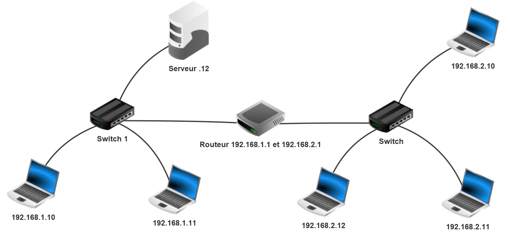

**Table des matières**

1. [Quelques éléments physiques d'un réseau](#elements-physiques)
2. [Communication dans un réseau local](#reseau-local)
3. [Communication entre réseaux locaux (Internet)](#entre-reseaux)
4. [Autres commandes sur un réseau](#commandes)
5. [Menaces courantes sur les réseaux](#menaces)
6. [Mesures de protection des réseaux](#protection)
7. [Analyse de trame](#analyse-trame)
8. [Simulation d'un réseau avec Filius](#filius)

---

Un **réseau informatique** est un ensemble de **machines interconnectées** permettant l'échange d'informations en utilisant des **protocoles de communication communs**. Ces protocoles définissent les règles de transmission des données.

Le terme **réseau** désigne à la fois :

- les **machines** qui y sont connectées (ordinateurs, serveurs, routeurs, etc.),

- les **infrastructures physiques** qui permettent la connexion (câbles, Wi-Fi, commutateurs, routeurs).

> 💡 **Lien avec le chapitre précédent** : dans le chapitre 07d, vous avez vu comment un formulaire HTML envoie des données via les méthodes GET ou POST, et comment un navigateur dialogue avec un serveur web. Ce chapitre explique ce qui se passe **au niveau du réseau** lors de ces échanges.

👉 **Vidéo :** [Histoire de l'Internet](https://ladigitale.dev/digiview/#/v/6690fd5d7c1bd)

---

## 1. Quelques éléments physiques d'un réseau { #elements-physiques }


### 1.1. Périphériques terminaux

Ce sont les **appareils utilisateurs**, situés en bout de chaîne, qui **émettent ou reçoivent des données** :

- les **serveurs** : ordinateurs qui offrent un service (serveur web, serveur de messagerie…)

- les **ordinateurs**

- les **imprimantes**

- les **téléphones**

- les **objets connectés** (voiture, frigo, aspirateur robot…)

> 💡 Ces périphériques ont une **adresse IP** et une **adresse MAC**.

### 1.2. Périphériques intermédiaires

Ce sont les équipements chargés **d'acheminer les données** entre les terminaux :

- les **commutateurs** (aussi appelés **switchs**)

- les **routeurs**

- les **box** (modem + routeur + pare-feu combinés)

### 1.3. Types de connexions réseau

- **Connexions filaires** (câble Ethernet)

- **Connexions sans-fil** : Wi-Fi, Bluetooth

- **Connexions optiques** : fibre optique

> 💡 Le type de connexion influence la **vitesse**, la **portée** et la **qualité** de la communication.

---

## 2. Communication dans un réseau local { #reseau-local }

Voici le réseau que l'on va étudier :


Ce réseau est composé de plusieurs **sous-réseaux**. On souhaite faire communiquer la machine M9 avec un autre ordinateur de son réseau local.

### 2.1. Le protocole TCP

Un **protocole réseau** est un ensemble de **règles et de formats normalisés** qui permettent à deux entités de communiquer de manière fiable et compréhensible.

Le protocole **TCP (Transmission Control Protocol)** fonctionne à la **couche transport** du modèle TCP/IP. Il est responsable de la **gestion de la connexion**, du **contrôle des erreurs** et de l'**acheminement fiable des données**.

### 2.2. Envoi d'un message : pourquoi TCP ?

On souhaite envoyer un poème, mais **on ne peut envoyer qu'un seul vers par message**.

> **L'Albatros** — *Charles Baudelaire*
>
> Souvent, pour s'amuser, les hommes d'équipage
>
> Prennent des albatros, vastes oiseaux des mers,
>
> Qui suivent, indolents compagnons de voyage,
>
> Le navire glissant sur les gouffres amers.
>
> *(On ne transmet que les deux premiers quatrains)*

Voici ce qu'on reçoit réellement :


**Problèmes observés :**

- Les vers **arrivent dans le désordre**.

- Certains **vers manquent** complètement.

**Solutions simples imaginables :**

1. **Numéroter chaque vers** avant l'envoi → pour remettre dans l'ordre à la réception.

2. **Demander un accusé de réception** → pour renvoyer un vers si l'accusé n'arrive pas.

C'est exactement ce que fait le protocole **TCP** :

- **découpage des données en paquets** (1460 octets maximum),

- **numérotation des paquets**,

- **accusés de réception (ACK)**,

- **retransmission automatique des paquets perdus**.

### 2.3. Les ports

Sur un ordinateur, plusieurs logiciels communiquent simultanément (navigateur web, messagerie, client FTP…). En face, un **serveur** peut offrir plusieurs services en parallèle.

❓ **Quel service va recevoir les données envoyées ?**

On associe un **identifiant numérique à chaque service** : c'est le **port**.

| Port | Service |
|------|---------|
| 80 | HTTP (web) |
| 443 | HTTPS (web sécurisé) |
| 25 | SMTP (mail sortant) |
| 21 | FTP (transfert de fichiers) |


Quand le serveur répond au client, il doit savoir **quel logiciel client** doit recevoir la réponse. Le système attribue donc au logiciel client un **port source temporaire aléatoire**, que le serveur utilise pour répondre.


> 💡 **Résumé** : un port identifie un logiciel de communication sur un appareil. Les **ports bien connus** (0 à 1023) sont réservés aux services standard.

### 2.4. Les segments TCP

Pour envoyer un message, on ajoute des **métadonnées** aux données : c'est l'**en-tête TCP**. Elle contient notamment :

- le **port source** (quel logiciel client a envoyé),

- le **port de destination** (quel service du serveur doit recevoir),

- un **numéro de séquence** (pour remettre dans le bon ordre),

- des **drapeaux (flags)**, comme le flag **ACK** (accusé de réception).


### 2.5. Les adresses IP

#### 2.5.1. Qu'est-ce qu'une adresse IP ?

L'**adresse IP** est une **adresse logique** qui permet d'**identifier un équipement sur un réseau**.

📌 **Exemple :** `192.168.1.10`

Il existe deux versions :

- **IPv4** (32 bits) → format classique : `192.168.1.1`

- **IPv6** (128 bits) → format étendu : `2001:db8::ff00:42:8329`

> ℹ️ **Pourquoi IPv6 ?** Le stock d'adresses IPv4 (~4,3 milliards) est presque épuisé. L'IPv6 génère un nombre quasi infini d'adresses pour répondre à la croissance des appareils connectés.

#### 2.5.2. NetID et HostID

Une adresse IP est composée de **deux parties** :

- **NetID** : identifiant du réseau

- **HostID** : identifiant de la machine au sein du réseau

🧪 **Exemple :** `131.254.100.48/24`

- Les **24 premiers bits** → NetID

- Les **8 bits restants** → HostID

| Octet 1 | Octet 2 | Octet 3 | Octet 4 |
|---------|---------|---------|---------|
| 131 | 254 | 100 | 48 |
| ⬅️ NetID (24 bits) | | | ➡️ HostID (8 bits) |

Toutes les machines du même réseau auront une adresse de la forme `131.254.100.xxx`.

❓ **Combien de machines sur ce réseau ?**

- HostID sur 8 bits → $2^8 = 256$ adresses possibles

- Dont 2 réservées : `131.254.100.0` (adresse réseau) et `131.254.100.255` (broadcast)

- Il reste **254 machines adressables**.

#### 2.5.3. Masque de sous-réseau

Le **masque de sous-réseau** permet de déterminer l'adresse réseau, l'adresse de broadcast et les adresses disponibles.

🔹 **Exemple 1 :** `192.168.1.55/24` → masque `255.255.255.0`

Table de vérité de l'opérateur **ET (AND)** :

| A | B | A AND B |
|---|---|---------|
| 0 | 0 | 0 |
| 0 | 1 | 0 |
| 1 | 0 | 0 |
| 1 | 1 | 1 |

```
Adresse IP :     11000000.10101000.00000001.00110111
Masque :         11111111.11111111.11111111.00000000
Résultat (AND) : 11000000.10101000.00000001.00000000
→ Adresse réseau : 192.168.1.0
→ Broadcast :      192.168.1.255
```

📌 **Quelques exemples directs :**

```
192.168.1.239/24
  → Adresse réseau : 192.168.1.0
  → Broadcast :      192.168.1.255

192.168.1.239/16
  → Adresse réseau : 192.168.0.0
  → Broadcast :      192.168.255.255

192.168.1.239/8
  → Adresse réseau : 192.0.0.0
  → Broadcast :      192.255.255.255
```

🔹 **Exemple 2 :** `90.98.100.3/21` → masque `255.255.248.0`

```
Adresse IP :     01011010.01100010.01100100.00000011
Masque :         11111111.11111111.11111000.00000000
Résultat (AND) : 01011010.01100010.01100000.00000000
→ Adresse réseau : 90.98.96.0
Broadcast :      01011010.01100010.01100111.11111111
→ Broadcast :      90.98.103.255
```

#### 2.5.4. Adresses publiques et privées

| **Type** | **Utilisation** | **Exemple** |
|----------|----------------|-------------|
| **Publique** | Visible sur Internet, attribuée par un FAI | `8.8.8.8` (DNS Google) |
| **Privée** | Réseau local uniquement, non routable sur Internet | `192.168.1.1` (box) |

📌 Pour accéder à Internet, les équipements d'un réseau local utilisent le mécanisme **NAT (Network Address Translation)** : le routeur traduit les adresses IP privées en adresse IP publique.

### 2.6. Le paquet IP

Pour déterminer si une machine de destination est dans le **même réseau local**, on calcule l'adresse réseau avec l'opération AND sur l'adresse IP et le masque.

🧮 **Exemple :**

- Machine locale : `192.168.1.1/24` → réseau `192.168.1.0`

- Machine de destination : `192.168.1.11/24` → réseau `192.168.1.0`

✅ **Même réseau** → communication directe sans passer par un routeur.

Pour envoyer les données, on encapsule le **segment TCP** dans un **paquet IP** en ajoutant une **en-tête IP** contenant :

- l'**adresse IP source**

- l'**adresse IP de destination**


### 2.7. L'adresse MAC

Dans un réseau local, chaque carte réseau possède un identifiant matériel unique : l'**adresse MAC** (Media Access Control).

- **Format :** 6 octets (48 bits)

- **Exemple :** `00:1A:2B:3C:4D:5E`

- **Gravée en usine** dans la carte réseau

🧭 **Rôle :** identifier une machine de manière unique dans le réseau local. Elle n'est **pas utilisée sur Internet** (elle ne sort pas du réseau local).

???+ question "Activité n°1 — Trouver votre adresse MAC"

    Ouvrir un terminal et saisir la commande suivante :

    - Sous **Windows** : `ipconfig /all`
    - Sous **Linux / macOS** : `ip a`

    Rechercher la ligne "Adresse physique" (Windows) ou "link/ether" (Linux) pour obtenir votre adresse MAC.

### 2.8. Le switch (commutateur réseau)

Un **switch** est un équipement qui **transmet les données uniquement au destinataire concerné**.

- Fonctionne en **couche 2 (liaison de données)**

- Enregistre les adresses MAC dans une **table CAM**

- Contrairement à un hub, il n'envoie pas les données à tous les appareils connectés

### 2.9. Le protocole ARP

❓ **Comment trouver l'adresse MAC correspondant à une adresse IP dans un réseau local ?**

Le **protocole ARP** (Address Resolution Protocol) permet de faire ce lien.

**Étapes :**

1. Notre ordinateur veut envoyer un message à l'IP `192.168.1.11`.

2. Il cherche dans son **cache ARP** si cette correspondance IP→MAC est déjà connue.

3. Si non, il envoie un **message ARP en broadcast** (diffusion à tous) : *"Qui a l'adresse IP `192.168.1.11` ? Donne-moi ton adresse MAC !"*

4. Seule la machine concernée répond : *"Moi ! Mon adresse MAC est `00:1A:2B:3C:4D:5E`"*

5. Notre ordinateur enregistre cette correspondance dans sa **table ARP** et peut envoyer les données.

???+ question "Activité n°2 — Afficher la table ARP"

    Dans un terminal, afficher la table ARP locale (correspondances IP → MAC) :

    - Sous **Windows** : `arp -a`
    - Sous **Linux / macOS** : `ip neigh`

### 2.10. La trame Ethernet

Pour envoyer un paquet dans le réseau local, on y ajoute une **en-tête Ethernet** contenant :

- l'**adresse MAC source** (notre machine)
- l'**adresse MAC de destination** (machine cible ou passerelle)

L'ensemble constitue une **trame**.


### 2.11. Le modèle TCP/IP

Le modèle en couches découpe le fonctionnement d'un réseau en étapes successives et indépendantes. Chaque couche a un rôle précis et ne communique qu'avec les couches adjacentes.

{ width=70%; .center }

Le **modèle TCP/IP** (utilisé sur Internet) regroupe les 7 couches du modèle OSI en 4 couches :

| Couche TCP/IP | Correspond à OSI | Protocoles |
|---------------|-----------------|------------|
| Application | Couches 5, 6, 7 | HTTP, HTTPS, FTP, DNS… |
| Transport | Couche 4 | TCP, UDP |
| Internet | Couche 3 | IP |
| Accès réseau | Couches 1, 2 | Ethernet, Wi-Fi |

**Exemple — transfert de fichiers entre deux ordinateurs du même réseau :**

- **Couche application** : protocole FTP

- **Couche transport** : encapsulation avec l'en-tête TCP → **segment**

- **Couche internet** : encapsulation avec l'en-tête IP → **paquet**

- **Couche accès réseau** : encapsulation avec l'en-tête Ethernet → **trame**


La trame est envoyée à l'ordinateur destinataire, qui **décapsule** chaque en-tête dans l'ordre inverse.


---

## 3. Communication entre réseaux locaux (Internet) { #entre-reseaux }

La machine M9 (`192.168.1.1/24`) souhaite contacter une machine à l'adresse `192.168.3.2/24`.


### 3.1. Rôle du routeur

On vérifie d'abord si les deux machines sont dans le même réseau :

- Machine 1 : `192.168.1.1` AND `255.255.255.0` → réseau `192.168.1.0`

- Machine 2 : `192.168.3.2` AND `255.255.255.0` → réseau `192.168.3.0`

❌ **Réseaux différents** → les machines ne peuvent pas communiquer directement. Il faut passer par une **passerelle** : c'est le rôle du **routeur**.


Un **routeur** :

- assure la **connexion entre plusieurs réseaux**,

- fonctionne en **couche 3 (réseau)**,

- utilise une **table de routage** pour choisir le chemin vers la destination.

💡 La **box Internet** joue le rôle de routeur entre votre réseau domestique et Internet.

### 3.2. Ce que fait le routeur (étape par étape)

{ width=35%; .center }

**1. Réception de la trame**

Le routeur reçoit une trame Ethernet et la **décapsule** pour lire l'en-tête IP.

{ width=75%; .center }

**2. Comparaison**

Il applique le masque à chaque adresse IP de ses interfaces pour savoir si l'IP de destination appartient à l'un de ses sous-réseaux.

**3. Consultation de la table de routage**

Si l'IP de destination n'est pas dans un de ses sous-réseaux, il consulte sa **table de routage** pour choisir le prochain routeur.

**4. Encapsulation et transmission**

Il crée une **nouvelle trame Ethernet** avec :

- **MAC source** : la sienne (dans le sous-réseau partagé avec le routeur suivant),
- **MAC destination** : celle du routeur suivant.

{ width=60%; .center }

**5. Résolution ARP si nécessaire**

Si le routeur ne connaît pas la MAC de destination, il envoie une requête ARP.

**6. Création de la trame finale et envoi au switch**

Le switch reçoit la trame, consulte sa **table CAM** et l'envoie sur le bon port.

**7. Réception par la machine finale**

La machine vérifie que l'adresse MAC destination est la sienne, puis décapsule successivement la trame, le paquet et le segment pour accéder aux données.


### 3.3. La résolution DNS : trouver l'adresse IP d'un nom de domaine

Sur Internet, les machines sont identifiées par leur **adresse IP**, pas par leur nom. Pourtant, on tape `www.google.com` et non `142.250.74.100` dans un navigateur.

C'est le rôle du **DNS (Domain Name System)** : faire la correspondance entre un **nom de domaine** et son **adresse IP**. C'est l'équivalent d'un annuaire téléphonique pour Internet.

📌 **Structure d'une URL**

```
protocole://nom-de-domaine:port/chemin?paramètre1=valeur1#ancre
```

| Élément | Rôle | Exemple |
|---------|------|---------|
| `protocole` | HTTP ou HTTPS | `https://` |
| `nom-de-domaine` | Adresse du serveur | `fr.wikipedia.org` |
| `:port` | Numéro de port (facultatif) | `:443` pour HTTPS |
| `chemin` | Page ou ressource demandée | `/wiki/Informatique` |
| `?param=valeur` | Paramètres transmis au serveur | `?search=python` |
| `#ancre` | Section précise dans la page | `#Algorithmique` |

🔄 **Processus de résolution DNS :**

1. **Le navigateur consulte son cache local** : a-t-il déjà l'adresse IP correspondant à ce nom de domaine ?
2. **Sinon, il envoie une requête DNS** à :
    - la **box internet** (DNS local),
    - le **serveur DNS du FAI** (fournisseur d'accès),
    - ou un **serveur DNS public** (ex. Google DNS `8.8.8.8`, Cloudflare `1.1.1.1`).
3. **Le serveur DNS répond** avec l'adresse IP associée. Cette IP est mise en cache pour les prochaines requêtes.

Une fois l'adresse IP obtenue, le navigateur peut établir la connexion TCP avec le serveur.


???+ question "Activité n°3 — Observer la résolution DNS"

    Dans un terminal, vider puis observer le cache DNS :

    - Sous **Windows** :
    ```bash
    ipconfig /flushdns
    ipconfig /displaydns
    ```
    - Sous **Linux / macOS** :
    ```bash
    host fr.wikipedia.org
    ```

    1. Ouvrir un navigateur et visiter `https://fr.wikipedia.org`

    2. Relancer `ipconfig /displaydns` (Windows) ou `host fr.wikipedia.org` (Linux).

    3. Quelle adresse IP correspond au nom de domaine `fr.wikipedia.org` ?

    4. Comparer avec la commande `ping fr.wikipedia.org` : retrouve-t-on la même IP ?

### 3.4. Établissement de la connexion TCP (Three-Way Handshake)

Avant d'échanger des données, TCP établit une connexion via un **processus en trois étapes** :

| Étape | Description |
|-------|-------------|
| **1. SYN** | Le client envoie une demande de connexion au serveur |
| **2. SYN-ACK** | Le serveur accepte et répond |
| **3. ACK** | Le client confirme |

🔢 **Exemple avec des numéros de séquence :**

- Client → Serveur : `SYN`, seq = 1010

- Serveur → Client : `SYN-ACK`, seq = 3001, ack = 1011

- Client → Serveur : `ACK`, ack = 3002

{ width=60%; .center }

📌 **Pourquoi cette étape est-elle indispensable ?** Elle garantit que le serveur est en ligne, que le client est identifié, et que la transmission sera fiable dès le départ.

> ⚠️ **IP spoofing** : attaque où un pirate falsifie l'adresse IP source lors de l'envoi d'un paquet SYN, pouvant mener à des attaques de type SYN Flood.

### 3.5. Fiabilité des transferts : le protocole du bit alterné

TCP garantit un transfert fiable grâce à un système d'**accusé de réception** et au **protocole du bit alterné**.

Ce protocole utilise un **bit de séquence** (0 ou 1) pour marquer chaque trame envoyée.

✅ **Cas normal :**

- Trame 1 : bit = 0 → ACK avec bit = 0 (demande la prochaine avec bit = 1)

- Trame 2 : bit = 1 → ACK avec bit = 1

- Et ainsi de suite…


❌ **Trame non reçue :** l'émetteur renvoie la trame après un délai d'attente.


⚠️ **Trame dupliquée :** si la trame initialement perdue arrive en retard, le récepteur la **rejette** car son bit de séquence n'est plus attendu.


### 3.6. Les protocoles par couche

**Couche Application**

| Protocole | Usage |
|-----------|-------|
| HTTP | Accès aux pages web |
| HTTPS | HTTP avec chiffrement TLS |
| FTP | Transfert de fichiers |
| DNS | Résolution de noms de domaine |

**Couche Transport**

| Protocole | Caractéristiques |
|-----------|-----------------|
| TCP | Fiable, avec accusés de réception (web, email…) |
| UDP | Rapide, sans accusé de réception (jeux, streaming, visio…) |


💡 **Pourquoi des couches ?** Si un protocole d'une couche est modifié (ex. HTTP → HTTPS), les autres couches n'ont pas besoin de changer. Cela garantit la modularité et la compatibilité.

---

## 4. Autres commandes sur un réseau { #commandes }

???+ question "Activité n°4 — Commandes réseau"

    Dans un terminal (`cmd` sous Windows, `terminal` sous Linux/macOS), utiliser les commandes suivantes :

    | **Commande** | **Description** |
    |-------------|----------------|
    | `hostname` | Affiche le nom réseau de l'ordinateur |
    | `ipconfig` / `ifconfig` | Résumé des paramètres IP : adresse IP, masque, passerelle |
    | `ipconfig /all` | Détails complets : nom d'hôte, adresse MAC, serveurs DNS |
    | `ipconfig /flushdns` | Vide le cache DNS |
    | `ipconfig /displaydns` | Affiche le cache DNS |
    | `ping [adresse]` | Vérifie la connexion (ex. `ping 8.8.8.8`) |
    | `tracert [adresse]` / `traceroute` | Affiche les sauts pour atteindre une adresse (ex. `tracert www.google.fr`) |
    | `netstat` | Affiche les ports actifs et les connexions réseau |

---

## 5. Menaces courantes sur les réseaux { #menaces }

### 5.1. Phishing (hameçonnage)

**Définition :** technique de fraude dans laquelle un attaquant se fait passer pour une entité de confiance (banque, administration…) pour soutirer des **informations sensibles** (identifiants, mots de passe, numéros de carte…).

**Exemple :** un email frauduleux prétend venir de votre banque et invite à cliquer sur un lien vers un faux site. Si vous saisissez vos identifiants, l'attaquant les récupère.

### 5.2. Attaque DDoS (Déni de service distribué)

**Définition :** inondation d'un serveur de requêtes provenant de milliers d'appareils compromis (botnet), dans le but de le **rendre indisponible**.

**Exemple :** un site e-commerce est ciblé, des milliers d'ordinateurs infectés envoient des requêtes en boucle, le serveur sature et devient inaccessible pour les vrais clients.

### 5.3. Attaque Man-In-The-Middle (MITM)

**Définition :** un attaquant **intercepte et peut modifier les échanges** entre deux parties qui pensent communiquer directement.

**Exemple :** sur un Wi-Fi public non sécurisé, un attaquant intercepte les données échangées entre un utilisateur et son site bancaire.

---

## 6. Mesures de protection des réseaux { #protection }

### 6.1. Pare-feu (firewall)

**Définition :** dispositif qui **filtre les échanges** entre un réseau interne et l'extérieur selon des règles prédéfinies.

**Fonctions :**

- **Filtrage de paquets** : analyse chaque paquet entrant/sortant et autorise ou bloque selon l'adresse IP, le port, le protocole.
- **Proxy** : agit comme intermédiaire, inspecte et contrôle les communications.

### 6.2. VPN (Virtual Private Network)

**Définition :** établit une **connexion chiffrée et sécurisée** entre l'utilisateur et un réseau distant.

**Fonctionnement :**

- **Tunneling** : les données sont encapsulées dans un canal sécurisé et chiffrées.
- **Authentification** : seuls les utilisateurs autorisés peuvent se connecter.

**Exemple :** un salarié utilise un VPN depuis son domicile pour accéder aux fichiers internes de son entreprise en toute sécurité.

### 6.3. Chiffrement des données

**Définition :** convertit des données lisibles en données inintelligibles pour toute personne ne possédant pas la clé de déchiffrement.

- **Symétrique** : même clé pour chiffrer et déchiffrer (ex. AES).
- **Asymétrique** : clé publique pour chiffrer, clé privée pour déchiffrer (ex. RSA, utilisé dans SSL/TLS).

**Exemple :** lors d'un paiement en ligne, les données bancaires sont chiffrées via SSL/TLS. C'est ce que signifie le **cadenas 🔒** dans la barre d'adresse (HTTPS).

---

## 7. Analyse de trame { #analyse-trame }

???+ question "Activité n°4 — Lire une capture de trame"

    Voici un extrait de capture réseau (format Wireshark) :

    ```
    Frame 1: 66 bytes on wire (528 bits), 66 bytes captured (528 bits)
    Ethernet II, Src: 00:0c:29:36:bc:5a, Dst: 00:50:56:c0:00:01
    Internet Protocol Version 4, Src: 192.168.1.101, Dst: 192.168.1.1
    Transmission Control Protocol, Src Port: 443, Dst Port: 56324, Seq: 1, Ack: 1, Len: 0
    ```

    1. **Adresses MAC** : quelle est l'adresse MAC source ? L'adresse MAC de destination ?
    2. **Adresses IP** : quelle est l'adresse IP source ? L'adresse IP de destination ?
    3. **Protocole de transport** : quel protocole de couche transport est utilisé ?
    4. **Ports** : quels sont les ports source et destination ? À quel service correspond le port source ?
    5. **Numéros TCP** : quel est le numéro de séquence ? Le numéro d'accusé de réception ?

    ??? success "Solution"

        1. MAC source : `00:0c:29:36:bc:5a` — MAC destination : `00:50:56:c0:00:01`
        2. IP source : `192.168.1.101` — IP destination : `192.168.1.1`
        3. Protocole : **TCP**
        4. Port source : `443` (HTTPS) — Port destination : `56324` (port temporaire du client)
        5. Numéro de séquence : `1` — Numéro d'accusé de réception : `1`

> 💡 **Wireshark** est un logiciel d'analyse de trame réseau. Il permet de capturer et d'inspecter en temps réel les paquets qui circulent sur un réseau.  
> Téléchargement : [https://www.wireshark.org/](https://www.wireshark.org/)

---

## 8. Simulation d'un réseau avec Filius { #filius }

???+ question "Activité n°5 — Lien direct entre 2 ordinateurs"

    

    1. Lancer **Filius** et créer le réseau illustré ci-dessus.

    2. Lancer la simulation.

    3. Sur le poste **10**, installer **Ligne de commande**.

    4. Ouvrir l'application et exécuter : `ping 192.168.1.11`

    5. Afficher les données échangées (clic droit sur l'ordinateur).

    6. Effectuer un `ipconfig` dans le terminal du poste **10** et comparer l'adresse MAC avec celle de la source affichée dans le tableau des données échangées.

???+ question "Activité n°6 — Réseau avec switch et serveur"

    

    1. Modifier le réseau précédent : ajouter un **serveur** (IP : `192.168.1.12`) et un **switch**.

    2. Installer un **serveur générique** sur le serveur (port `55555`) et le démarrer.

    3. Sur un des ordinateurs, installer un **client générique** et le connecter au serveur.

    4. Envoyer un **message** au serveur via le client générique.

    5. Observer les **données échangées** (clic droit sur l'ordinateur).

    **Comprendre le Three-Way Handshake TCP :**

    Lors de l'établissement d'une connexion TCP, trois étapes sont nécessaires :

    1. **SYN** : le client envoie `SYN` avec un numéro de séquence A.

    2. **SYN-ACK** : le serveur répond avec `SYN-ACK`, ack = A+1, et un numéro aléatoire B.

    3. **ACK** : le client confirme avec ack = B+1.

    Puis les échanges de messages suivent, avec accusés de réception. Cliquer sur **Déconnexion** pour terminer.

???+ question "Activité n°7 — Deux réseaux interconnectés"

    

    1. Modifier le réseau précédent pour obtenir **deux réseaux interconnectés**.

    2. Essayer de pinguer (`ping 1.10 → 2.10`) → le message ne peut pas traverser.

    3. Configurer la passerelle du **routeur** :

        - Réseau 1 : `192.168.1.1`

        - Réseau 2 : `192.168.2.1`

    4. Ajouter la passerelle correspondante sur chaque ordinateur.

    5. Pinguer à nouveau de **1.10** vers **2.10**.

    📌 **Test avancé** : installer un **client générique** sur `2.10` et envoyer `"Bonjour"` au **serveur `1.12`**. Observer les données échangées.

???+ question "Activité n°8 — Simulation du web avec adresse IP"

    1. Installer un **serveur Web** et un **éditeur de texte** sur `1.12`.

    2. Modifier le fichier `index.html` (situé dans `/root/webserver`).

    3. Ajouter vos propres fichiers en installant un explorateur de documents et en important dans `/root/webserver` :

        - `page1.html`, eventuellement : `script.js` (`/js/`), `style.css` (`/css/`), images (`/images/`)

    4. Renommer `index.html` → `indexold.html` et `page1.html` → `index.html`.

    5. Démarrer le **serveur Web** et tester depuis un navigateur sur `2.10` : `http://192.168.1.12`

    📌 **Observations possibles :** le CSS peut ne pas fonctionner, et l'encodage UTF-8 peut être incorrect — c'est une limitation connue du serveur web de Filius.

???+ question "Activité n°9 — Simulation du web avec serveur DNS"

    

    Sur Internet, on utilise des **noms de domaine** plutôt que des adresses IP. Le **serveur DNS** traduit ces noms en adresses IP.

    1. Ajouter un **serveur DNS** avec l'IP `192.168.3.10`, passerelle `192.168.3.1`.

    2. Connecter le serveur DNS au routeur (`192.168.3.1`).

    3. Ajouter l'IP du serveur DNS dans la configuration réseau de **tous les postes**.

    4. Installer et paramétrer l'application **serveur DNS** sur `192.168.3.10` :

        - Associer `www.serverwebdensi.fr` → `192.168.1.12`

        - Démarrer le serveur DNS.

    5. Sur `2.10`, tester dans un navigateur : `http://www.serverwebdensi.fr`

    6. Sur `1.10`, ouvrir un terminal et exécuter : `host www.serverwebdensi.fr`

???+ question "Activité n°10 — Chemin d'un client à un serveur"

    1. Télécharger le fichier : [snt_sim_res.fls](https://pixees.fr/informatiquelycee/n_site/asset/snt_sim_res.fls)

    2. Lancer un **traceroute** entre M14 et M9 :

        - Windows : `tracert [IP de M9]`

        - Linux/macOS : `traceroute [IP de M9]`

    3. Supprimer le câble **routeur F → routeur E** (simulation de panne).

    4. Refaire un **traceroute** entre M14 et M9.

    📌 La mise à jour des tables de routage peut prendre quelques secondes.

???+ question "Activité n°11 — Traceroute graphique en ligne"

    Utiliser le site : [Traceroute en ligne](https://gsuite.tools/traceroute)

    Entrer différentes URLs pour observer leur chemin sur Internet :

    - `gs-cassaigne.fr`

    - `aliexpress.com`

    - `www.intechinfo.fr`
    
    - `malekal.com`

---

*Je remercie mon ami Charles Poulmaire pour m'avoir inspiré.*
