---
author: ELP
title: 08a Les réseaux
---


**Table des matières** 

1. [Que se passe-t-il lorsqu’on veut afficher une page web dans le navigateur ?](#_page0_x40.00_y569.92)
2. [Observation d’un réseau](#_page5_x40.00_y260.92)
3. [Le protocole ARP](#_page5_x40.00_y455.92)
4. [Le modèle TCP/IP](#_page5_x40.00_y630.92)
5. [Menaces courantes sur les réseaux](#_titre5)
6. [Mesures de protection des réseaux](#_titre6)
7. [Analyse de trame](#_titre7)
8. [Simulation d’un réseau avec Filius](#_page10_x40.00_y36.92)

Un **réseau informatique** est un ensemble de **machines interconnectées** permettant l’échange d’informations en utilisant des **protocoles de communication communs**. Ces protocoles définissent les règles de transmission des données.  

Le terme **réseau** désigne à la fois :  
- **Les machines** qui y sont connectées (ordinateurs, serveurs, routeurs, etc.).  
- **Les infrastructures physiques** qui permettent la connexion (câbles, Wi-Fi, commutateurs, routeurs).  

👉 **Vidéo :** [Histoire de l’Internet](https://ladigitale.dev/digiview/#/v/6690fd5d7c1bd)  

Le Web correspond à **World Wide Web**, composé de *worldwide* (« **mondial** ») et *web* (« **toile d’araignée** »).  

## <H2 STYLE="COLOR:BLUE;">**1. Que<a name="_page0_x40.00_y569.92"></a> se passe-t-il lorsqu’on veut afficher une page web dans le navigateur ?**</H2>

Lorsqu’on veut afficher une page Web, plusieurs éléments interviennent :


### <H3 STYLE="COLOR:GREEN;">**1.1. Une<a name="_page0_x40.00_y699.92"></a> adresse MAC**</H3>

L’**adresse MAC** est un **identifiant physique unique** associé à une **carte réseau** (Wi-Fi, Ethernet).  
- Elle est **attribuée à la fabrication** du matériel et ne change pas.  
- On peut la comparer à une **plaque d’immatriculation** d’un appareil sur un réseau local.  


### <H3 STYLE="COLOR:GREEN;">**1.2. Une<a name="_page1_x40.00_y36.92"></a> adresse IP**</H3>

Une **adresse IP** est un numéro d’identification attribué **temporairement ou en permanence** à un périphérique connecté à un réseau.  
- Elle est essentielle au **routage des paquets de données** sur Internet.  
- Il existe deux versions :  
  - **IPv4** (32 bits) : format classique `192.168.1.1`.  
  - **IPv6** (128 bits) : format `2001:db8::ff00:42:8329`.  

ℹ️ **Pourquoi IPv6 ?** L’IPv4 est en cours de remplacement par l’IPv6 car les 4,3 milliards d’adresses IPv4 sont presque toutes utilisées.

### <H3 STYLE="COLOR:GREEN;">**1.3. Anatomie<a name="_page1_x40.00_y162.92"></a> d’une adresse IP**</H3>  
#### <H4 STYLE="COLOR:MAGENTA;">**1.3.1. Adresse<a name="_page1_x40.00_y181.92"></a> machine**</H4>

Une adresse IP est divisée en **deux parties** :  
- **NetID (identifiant du réseau)** : identifie le réseau.  
- **HostID (identifiant de l’hôte)** : identifie une machine spécifique sur ce réseau.  

Exemple :  
Si une machine a l’adresse `131.254.100.48/24`, cela signifie :  

| **Réseau** | **Réseau** | **Réseau** | **Hôte** |  
|-----------|-----------|-----------|-----------|  
| 131       | 254       | 100       | 48        |  

- Tous les appareils du même réseau auront une adresse commençant par `131.254.100.xxx`.  
- Le `/24` signifie que **24 bits** sont utilisés pour désigner le réseau, laissant **8 bits** pour identifier les machines.  


**Combien de machines sont adressables sur ce réseau ?**

On a l’identification de l’interface réseau de la machine comprend **8 bits**, on peut donc avoir $2^8$ = **256 possibilités** soit 256-2 = **254 machines différentes** dans le réseau.  

Il y a deux **adresses réservées** : 

- la **zéro (adresse du sous réseau)** 
- la **255** (c’est le **broadcast (adresse de diffusion)** : envoie vers toutes les machines) 


#### <H4 STYLE="COLOR:MAGENTA;">**1.3.2. Adresse<a name="_page1_x40.00_y612.92"></a> du sous réseau et masque de sous réseau**</H4>


Un **masque de sous-réseau** permet de découper un réseau en sous-réseaux plus petits.  

👉 **Exemple avec `192.168.1.55/24` (masque `255.255.255.0`)**  

| **Adresse IP**         | **Masque**          | **Résultat AND** (Adresse réseau) |  
|------------------------|--------------------|-----------------------------------|  
| `192.168.1.55`       | `255.255.255.0`    | `192.168.1.0`                    |  

L’adresse de **broadcast** sera `192.168.1.255`.  


On obtient **l'adresse du sous réseau** avec l'opérateur AND  

**Exemple 1 : Par exemple : Voici une IPv4 192.168.1.55/24 et son masque de sous réseau 255.255.255.0** En binaire cela donne 
```
  	 11000000.10101000.00000001.00110111 
AND  11111111.11111111.11111111.00000000

   	 11000000.10101000.00000001.000000000 
```
(AND : cela fait 1 quand les deux bits sont à 1) cela fait :

* soit 192.168.1.0 **c'est l'adresse du (sous) réseau**.

* et 192.168.1.255 **c'est l'adresse du broadcast**.

On comprend vite que donner ces réponses avec des masques de 255 et 0 **est très simple** et ne nécessite pas le passage en binaire. 
```
192.168.1.239/24
 	=> 192.168.1.0 pour le sous réseau
	=> 0.0.0.239 pour la partie hôte
	=> 192.168.1.255 pour le broadcast
192.168.1.239/16
 	=> 192.168.0.0 pour le sous réseau
	=> 0.0.1.239 pour la partie hôte
	=> 192.168.255.255 pour le broadcast
192.168.1.239/8
 	=> 192.0.0.0 pour le sous réseau
	=> 0.168.1.239 pour la partie hôte
	=> 192.255.255.255 pour le broadcast
```


**Exemple 2 : Par exemple 90.98.100.3/21** indique que le masque est 11111111.11111111.11111000.00000000 soit 255.255.248.0 

Cherchons l'adresse du sous réseau puis de l'hôte destination: 
```
     01011010.01100010.01100100.00000011 
AND  11111111.11111111 .11111000.00000000

     01011010.01100010.01100000.000000000 
```

soit 90.98.96.0 pour IP **du (sous) réseau**  
L'adresse de broadcast sera: 
```01011010.01100010.01100111.1111111111=> 90.98.103.255```

Pour aller plus loin:

- Protocole IP[ https://www.commentcamarche.net/contents/530-le-protocole-ip ](https://www.commentcamarche.net/contents/530-le-protocole-ip)

- Classes d’adresse[ https://www.inetdoc.net/articles/adressage.ipv4/adressage.ipv4.class.html ](https://www.inetdoc.net/articles/adressage.ipv4/adressage.ipv4.class.html)

#### <H4 STYLE="COLOR:MAGENTA;">**1.3.3. Adresse<a name="_page2_x40.00_y473.92"></a> publique et adresse privée**</H4>


| **Type d’adresse** | **Utilisation** | **Exemple** |  
|-------------------|----------------|------------|  
| **Publique**  | Visible sur Internet | `8.8.8.8` (Google DNS) |  
| **Privée**    | Réseaux internes | `192.168.1.1` (box internet) |  

📌 Les adresses privées **ne sont pas routables** sur Internet.  
📌 Un **NAT (Network Address Translation)** [^1] convertit une adresse privée en une adresse publique pour accéder à Internet.  


### <H3 STYLE="COLOR:GREEN;">**1.4. Un<a name="_page3_x40.00_y36.92"></a> switch (commutateur réseau)**</H3>

Un **switch** est un équipement qui **transmet les données uniquement aux destinataires concernés**.  
- Il fonctionne en **couche 2 (liaison de données)**.  
- Il **enregistre les adresses MAC** dans une table.  

🚀 **Avantages :**  
✅ Réduit le trafic réseau.  
✅ Plus performant qu’un hub (qui envoie à tout le monde).  


### <H3 STYLE="COLOR:GREEN;">**1.5. Un<a name="_page3_x40.00_y209.92"></a> routeur**</H3>

Un **routeur** assure la connexion **entre plusieurs réseaux**.  
- Il fonctionne en **couche 3 (réseau)**.  
- Il utilise une **table de routage** pour acheminer les paquets.  


Exemple :  
- La box internet fait office de **routeur** entre le réseau domestique (Wi-Fi) et Internet.  

### <H3 STYLE="COLOR:GREEN;">**1.6. Etude<a name="_page3_x40.00_y273.92"></a> de cas concret : charger une page WEB**</H3>

Lorsqu’un utilisateur souhaite afficher une page Web en entrant une URL dans son navigateur, plusieurs étapes techniques se déroulent en arrière-plan. Nous allons détailler le chemin emprunté par la requête et la réponse entre l’ordinateur et le serveur du site Web.


#### **1. La résolution de nom : obtenir l'adresse IP du site**

Lorsqu’on tape `www.nsi.fr` dans la barre d’adresse, cette adresse n’existe pas sous cette forme sur Internet. En réalité, chaque site est identifié par une **adresse IP**.

C’est le **serveur DNS (Domain Name System)** qui est chargé de traduire le nom de domaine en adresse IP.

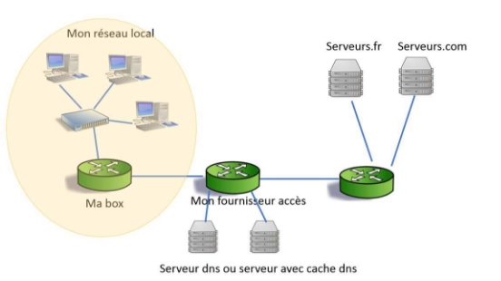

**Processus DNS**
1. Le navigateur vérifie d'abord dans **son cache** s'il possède déjà l'IP associée au site.
2. S’il ne la trouve pas, il envoie une requête DNS à :
   - La **box internet** locale.
   - Le **serveur DNS du fournisseur d'accès**.
   - Un **serveur DNS public** (ex : Google DNS `8.8.8.8`).
3. Une fois l’IP récupérée, elle est renvoyée à l’ordinateur.

**Exemple :** L’adresse IP de `www.nsi.fr` pourrait être `200.16.0.1`.

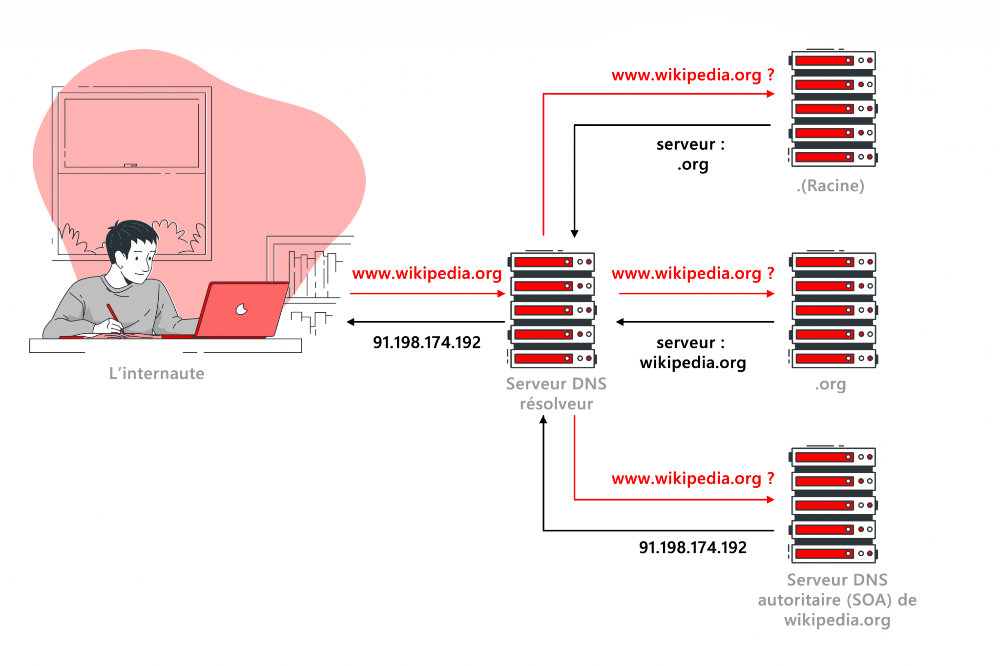

#### **2. L’envoi de la requête HTTP**

Maintenant que l’IP du site est connue, l’ordinateur peut envoyer une requête pour récupérer la page Web.

**Construction de la requête**
1. **Définition du type de données** : La couche application (couche 4 du modèle TCP/IP) décide d’envoyer une requête **HTTP**.
2. **Découpe des données** : La couche transport (couche 3) applique le protocole **TCP** pour segmenter la requête.
3. **Ajout des adresses IP** : La couche Internet (couche 2) encapsule les données avec les adresses **IP source et destination**.
4. **Encapsulation Ethernet** : La couche réseau (couche 1) ajoute les adresses **MAC** et envoie la trame sur le réseau.

On verra 
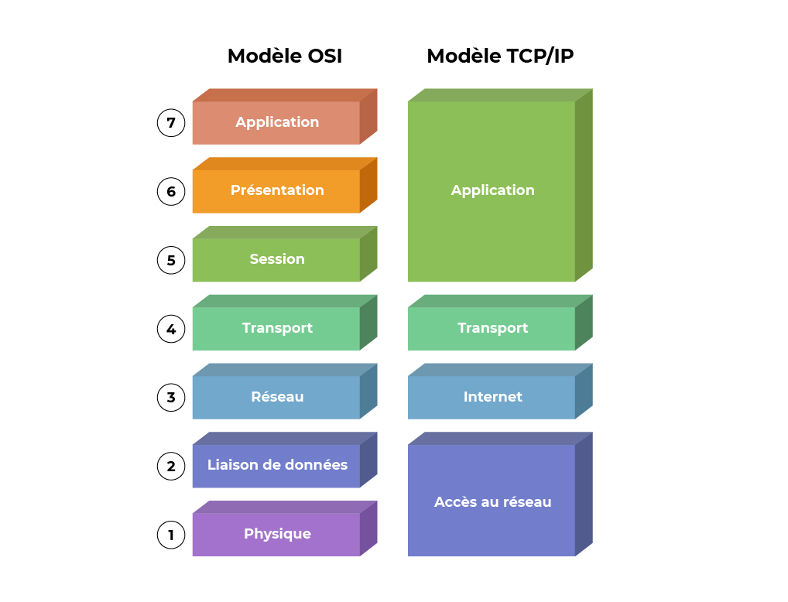

#### **3. L’intermédiaire : les routeurs et l’ARP**

Avant d’arriver sur Internet, la requête doit être acheminée vers **la passerelle** (généralement la box).

1. L’ordinateur vérifie sa **table ARP** (Address Resolution Protocol) pour savoir à quelle **adresse MAC** envoyer la requête.
2. Si l’adresse MAC de la passerelle est inconnue, une **requête ARP** est diffusée sur le réseau local pour la trouver.
3. Une fois connue, la requête est envoyée vers la **box**.

À chaque passage par un routeur, l’adresse MAC change, mais **l’adresse IP reste identique**.

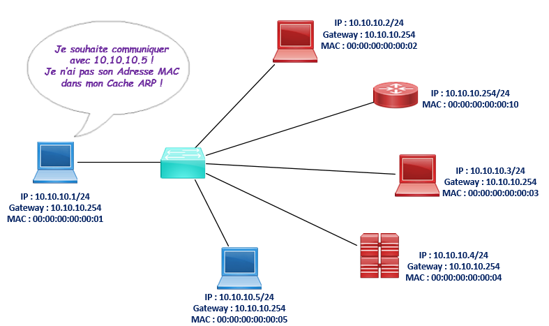
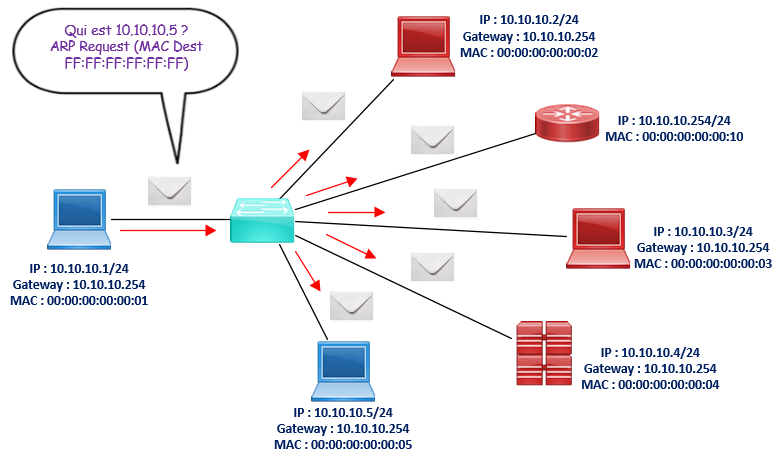
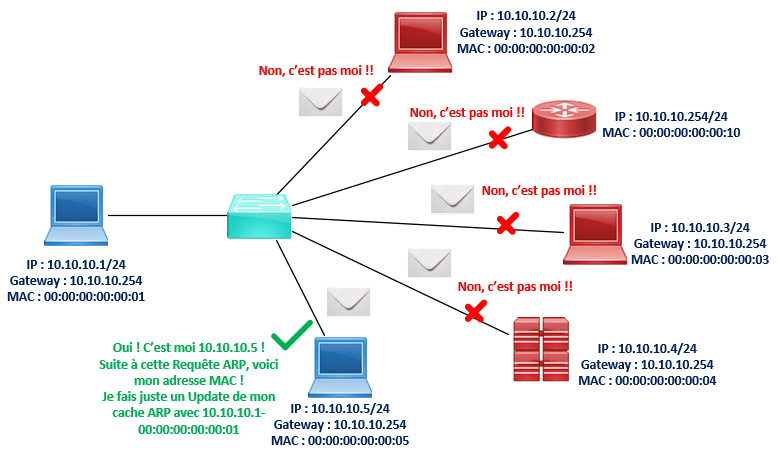
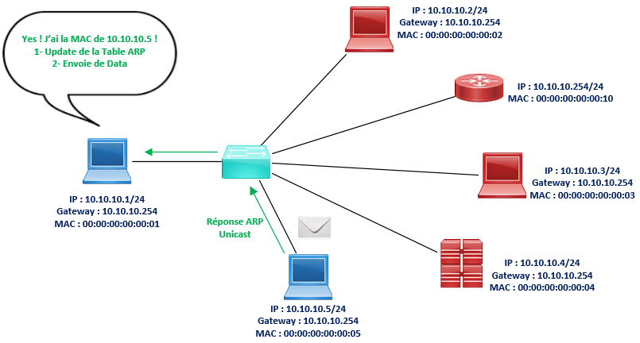

#### **4. L’acheminement de la requête sur Internet**

La requête quitte le réseau local et est transmise d’un **routeur à un autre** sur Internet.

1. Chaque routeur examine l’**adresse IP de destination** et choisit le **meilleur chemin** selon sa table de routage.
2. La requête traverse plusieurs **fournisseurs d’accès et backbone Internet** jusqu’au serveur du site Web.
3. Une fois arrivée sur le serveur, elle est traitée par le logiciel Web (ex : Apache, Nginx).

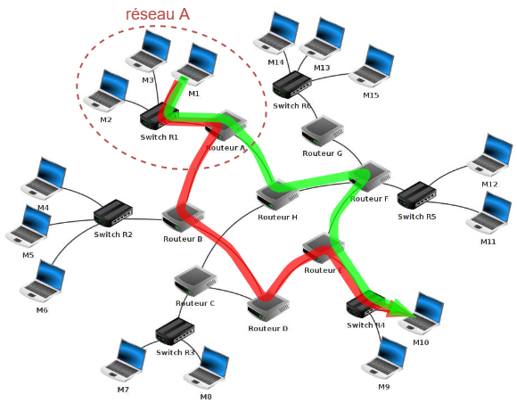


#### **5. La réponse du serveur Web**

Le serveur **lit la requête HTTP** et prépare la réponse avec la page demandée.

1. La page est convertie en **segments TCP**, puis en **paquets IP**, encapsulés dans des **trames Ethernet**.
2. Les paquets retournent vers l’ordinateur **par un chemin qui peut être différent de l’aller**.
3. Lors de la réception, l’ordinateur effectue une **désencapsulation** pour récupérer le contenu.


#### **6. Affichage de la page Web**

Une fois les données reçues :
1. Le **navigateur web** réassemble les paquets.
2. Il **interprète le code HTML, CSS et JavaScript**.
3. La page Web s’affiche sur l’écran.

📌 **Remarque** : Si certains fichiers (images, styles CSS) sont en cache, ils ne sont pas téléchargés à nouveau.


#### **7. Résumé des étapes**

| Étape | Action |
|-------|--------|
| **1** | L'utilisateur entre l’URL dans le navigateur |
| **2** | Recherche de l’adresse IP via DNS |
| **3** | Envoi d’une requête HTTP vers le serveur |
| **4** | Passage par plusieurs routeurs sur Internet |
| **5** | Réponse du serveur contenant la page Web |
| **6** | Affichage et rendu dans le navigateur |


## <H2 STYLE="COLOR:BLUE;">**2. Observation<a name="_page5_x40.00_y260.92"></a> d’un réseau**</H2>

**<H3 STYLE="COLOR:red;">Activité n°1.:</H3>** Dans une fenêtre **cmd** lancer les commandes 

Dans une **fenêtre de terminal** (`cmd` sous Windows, `terminal` sous Linux/macOS), utilisez les commandes suivantes pour observer et analyser le réseau :  

| **Commande** | **Description** |
|-------------|----------------|
| `hostname` | Affiche le nom réseau de l’ordinateur. |
| `ipconfig` (ou `ifconfig` sous Linux/macOS) | Affiche un résumé des paramètres IP des interfaces réseau : adresse IP, masque de sous-réseau, passerelle par défaut, IPv4 ou IPv6. |
| `ipconfig /all` | Donne des informations détaillées : nom d’hôte, adresse MAC, serveurs DNS. |
| `ipconfig /flushdns` | Vide le cache DNS. |
| `ipconfig /displaydns` | Affiche le cache DNS. |
| `ping [adresse]` | Vérifie la connexion à une adresse IP ou un site web. |
| `tracert [adresse]` (ou `traceroute` sous Linux) | Affiche les étapes (sauts) nécessaires pour atteindre une adresse réseau. |
| `netstat` | Affiche les ports actifs et les connexions réseau, utile pour détecter un virus. |


## <H2 STYLE="COLOR:BLUE;">**3. Le<a name="_page5_x40.00_y455.92"></a> protocole ARP**</H2>

Le protocole **ARP (Address Resolution Protocol)** est utilisé pour **associer une adresse IP (logique) à une adresse MAC (physique)** sur un réseau local.  
- **Pourquoi ?** Une machine connaît l’IP de sa destination, mais pour envoyer des données sur un réseau local, elle a besoin de son **adresse MAC**.  
- **Comment ça marche ?** ARP envoie une **requête de diffusion** pour demander *"Qui possède cette adresse IP ?"*, et le propriétaire de l’IP répond avec son adresse MAC.  

📌 **Pour aller plus loin :** [Le protocole ARP expliqué](https://www.supinfo.com/articles/single/2440-protocole-arp)  


Par exemple : la table ARP de mon ordinateur ci-contre

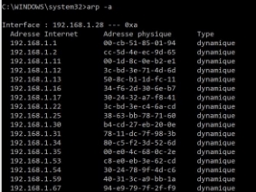 


**<H3 STYLE="COLOR:red;">Activité n°2.:</H3>** Dans une fenêtre **cmd** lancer la commande   l’instant fait 
```arp -a```

Cela affichera la table ARP, avec une liste d’adresses IP associées à des adresses MAC sur le réseau local. 

## <H2 STYLE="COLOR:BLUE;">**4. Le<a name="_page5_x40.00_y630.92"></a> modèle TCP/IP**</H2>
### <H3 STYLE="COLOR:GREEN;">**4.1. Principe<a name="_page5_x40.00_y658.92"></a> des couches**</H3>

Le modèle **OSI** (Open Systems Interconnection) a été conçu dans les années 70 pour normaliser les communications entre ordinateurs.  
Cependant, le modèle **TCP/IP**, plus simple et adopté dès 1983 sur **Arpanet** (ancêtre d’Internet), s’est imposé.  

📌 **TCP/IP regroupe un ensemble de protocoles**, dont **TCP** (Transmission Control Protocol) et **IP** (Internet Protocol), initialement développés par la **DARPA** (Défense américaine).


### <H3 STYLE="COLOR:GREEN;">**4.2. Les<a name="_page6_x40.00_y147.92"></a> rôles des couches dans le modèle TCP/IP**</H3>

Le modèle **TCP/IP** comporte **4 couches**, chacune ayant un rôle précis :  

| **Couche** | **Rôle** |
|-----------|---------|
| **Application** (4) | Gère les données envoyées (ex : HTTP, FTP, DNS). |
| **Transport** (3) | Assure la transmission fiable des données (ex : TCP, UDP). |
| **Internet** (2) | Responsable du routage des paquets (ex : IP). |
| **Réseau** (1) | Acheminement physique des données (ex : Ethernet, Wi-Fi). |

📌 **Exemple :** Lorsque vous chargez une page Web, les données passent par **ces couches** pour être envoyées puis reçues.


### <H3 STYLE="COLOR:GREEN;">**4.3. Principe<a name="_page6_x40.00_y290.92"></a> de l’encapsulation**</H3>

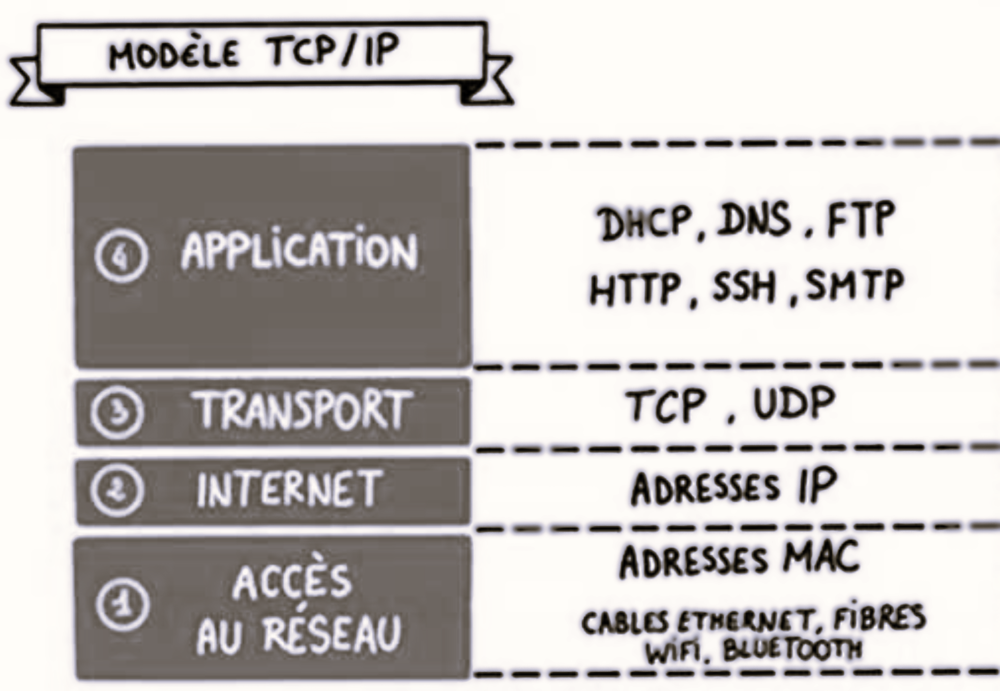

Lorsque des données sont envoyées sur le réseau :  
1. Chaque couche **ajoute une en-tête** aux données.  
2. Ces en-têtes permettent d'identifier **les protocoles utilisés**.  
3. À la réception, les couches **décryptent et suppriment** les en-têtes une par une (*désencapsulation*).  


 

### <H3 STYLE="COLOR:GREEN;">**4.4. Application<a name="_page6_x40.00_y409.92"></a> au modèle  TCP/IP**</H3>   

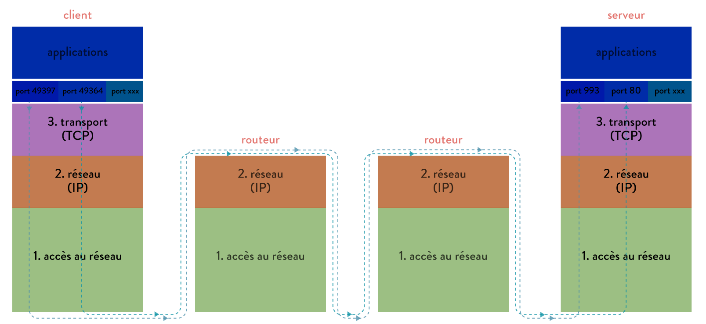

En **émission** :
- Chaque **paquet de données** traverse les **couches**, qui ajoutent une en-tête contenant les informations nécessaires au transport.  
- Ex : Une requête HTTP sera **d’abord** encapsulée dans TCP, puis IP, puis Ethernet.  

En **réception** :
- Chaque couche **décode** et **supprime** les en-têtes, jusqu’à ce que le message atteigne l’application destinataire.  


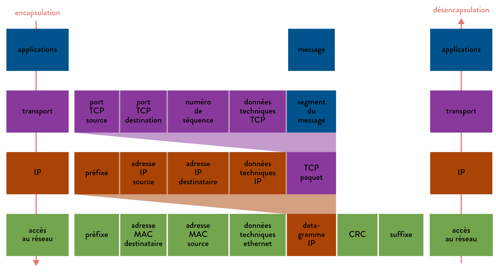

L’entête est lu, interprétée et supprimée => **désencapsulation** 

### <H3 STYLE="COLOR:GREEN;">**4.5. Etablissement<a name="_page7_x40.00_y349.92"></a> de la communication TCP (« three way handshake »)**</H3>

Le protocole **TCP** établit une connexion en **3 étapes** pour garantir un échange fiable entre un client et un serveur.  

| Étape | Action |
|------|--------|
| **1. SYN** | Le client envoie une demande de connexion (`SYN`). |
| **2. SYN-ACK** | Le serveur accepte et répond (`SYN-ACK`). |
| **3. ACK** | Le client confirme (`ACK`). |

Exemple avec des numéros de séquence :  
- Client → Serveur : **SYN (seq=1010)**  
- Serveur → Client : **SYN-ACK (seq=1011, ack=3002)**  
- Client → Serveur : **ACK (seq=3003)**  


📌 **Pourquoi cette étape est-elle importante ?** Elle évite l’envoi de données inutiles si la connexion ne peut être établie.


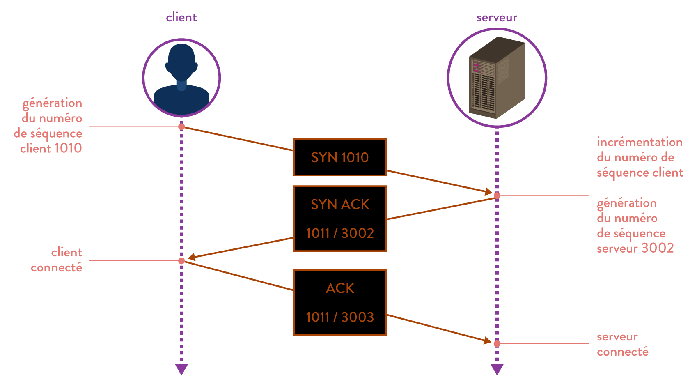

*Il existe une technique de piratage, appelée spoofing IP, permettant de corrompre cette relation d'approbation !*

### <H3 STYLE="COLOR:GREEN;">**4.6. Fiabilité<a name="_page8_x40.00_y36.92"></a> des transferts : protocole du bit alterné**</H3>

Le protocole TCP permet d’assurer le transfert des données de façon fiable. Pour cela, il possède un **système d’accusé de réception** permettant au client et au serveur de s’assurer de la bonne réception mutuelle des données.  

- **Cas où l’échange se passe correctement** 

Dans le protocole du **bit alterné**, l’émetteur envoie les données encapsulées dans des trames contenant entre autres informations techniques, **le bit de séquence.** La couche émettrice **alterne la valeur du bit de séquence d’une trame émise à l’autre**.  

- Lors de l’émission d’un segment, un numéro d’ordre est associé. La première trame aura pour **drapeau (flag) 0**.  

- A réception d’un segment de donnée, la machine réceptrice va retourner un segment de donnée dont le **drapeau** (flag) ACK (acknowledgement : accusé de réception) **est à 1** (afin de signaler qu’il l’a bien reçu) accompagné d’un numéro d’accusé de réception égal au **numéro d’ordre précédent** qui seront ajouter au niveau de l’entête. 


- **Cas où la trame émise n’est pas reçue** 

Si la trame émise n’est pas reçue, l’émetteur réagit. Il constate, en effet, qu’il n’a pas reçue d’accusé de réception dans les délais et renvoie la trame 

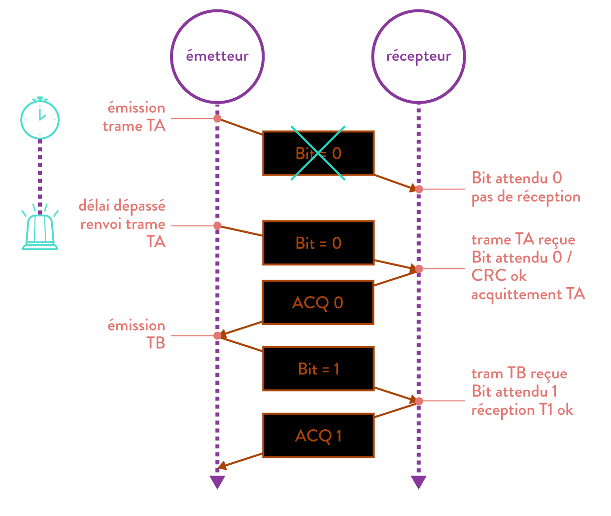

- **Cas du chevauchement de message** 

En fait la trame n’a pas été perdu, elle arrive tout de même à destination. Le récepteur reçoit finalement deux trames identiques, mais écartera la seconde car son bit de séquence ne correspondra pas au bit attendu.  

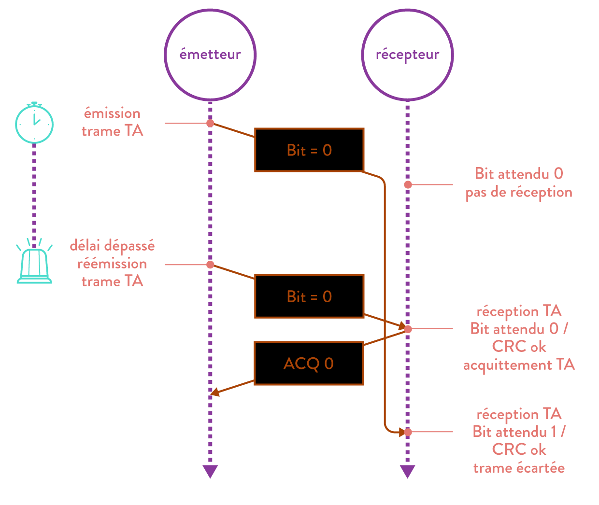

- **Cas du chevauchement d’acquittements** 

Il en va de même pour le chevauchement d’acquittements. Le récepteur rejettera l’acquittement qui n’aura pas le bit de séquence attendu. 

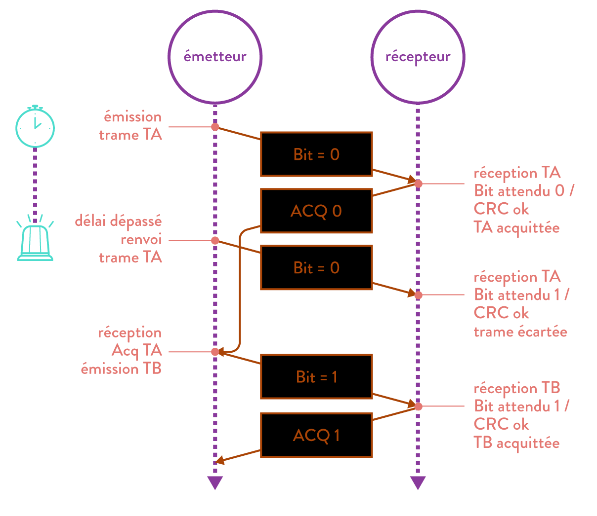

- **Pourquoi bit alterné ?** 

La règle est relativement simple : la première trame envoyée par A aura pour drapeau 0, dès cette trame reçue par B, ce dernier va envoyer un accusé de réception avec le drapeau 1 (ce 1 signifie "la prochaine trame que A va m'envoyer devra avoir son drapeau à 1"). Dès que A reçoit l'accusé de réception avec le drapeau à 1, il envoie la 2e trame avec un drapeau à 1, et ainsi de suite... 

*Pour aller encore plus loin : TCP sur site[ https://www.frameip.com/entete-tcp/ ](https://www.frameip.com/entete-tcp/) *

## <H2 STYLE="COLOR:BLUE;">**5. Menaces courantes sur les réseaux<a name="#_titre5"></a>**</H2>

### <H3 STYLE="COLOR:GREEN;">**5.1. Phishing**</H3>
- **Description** : Le phishing est une technique de fraude où un attaquant se fait passer pour une entité de confiance pour obtenir des informations sensibles comme des identifiants de connexion, des numéros de carte bancaire, etc.
- **Exemple** : Un utilisateur reçoit un email qui semble provenir de sa banque, lui demandant de vérifier ses informations de compte en cliquant sur un lien qui mène à un faux site web.

### <H3 STYLE="COLOR:GREEN;">**5.2. DDoS (Distributed Denial of Service)**</H3>
- **Description** : Une attaque DDoS vise à rendre un service ou un réseau indisponible en le submergeant de trafic provenant de multiples sources. Cela surcharge les serveurs et les réseaux, empêchant les utilisateurs légitimes d'accéder aux services.
- **Exemple** : Un site web d'e-commerce est bombardé de requêtes malveillantes provenant de milliers d'ordinateurs compromis, rendant le site inaccessible aux clients.

### <H3 STYLE="COLOR:GREEN;">**5.3. Man-In-The-Middle (MITM)**</H3>
- **Description** : Dans une attaque MITM, un attaquant intercepte et peut altérer les communications entre deux parties sans qu'elles le sachent. Cela permet à l'attaquant de voler des informations sensibles ou d'injecter des données malveillantes.
- **Exemple** : Un utilisateur se connecte à un Wi-Fi public et un attaquant intercepte les communications entre l'utilisateur et un site web sécurisé, dérobant ainsi les identifiants de connexion de l'utilisateur.

## <H2 STYLE="COLOR:BLUE;">**6. Mesures de protection des réseaux<a name="#_titre6"></a>**</H2>

### <H3 STYLE="COLOR:GREEN;">**6.1. Firewalls**</H3>
- **Description** : Un firewall est une barrière de sécurité qui surveille et contrôle le trafic réseau entrant et sortant en fonction de règles de sécurité prédéfinies. Il peut être matériel, logiciel, ou les deux.
- **Fonctionnement** : 
  - **Filtrage des paquets** : Analyse chaque paquet de données entrant ou sortant et le bloque ou le permet en fonction des règles établies.
  - **Proxy** : Intercepte toutes les communications entre les utilisateurs et le réseau, les inspecte et les transfère si elles sont sûres.
- **Exemple** : Un firewall bloque les tentatives de connexion non autorisées provenant d'adresses IP suspectes.

### <H3 STYLE="COLOR:GREEN;">**6.2. VPN (Virtual Private Network)**</H3>
- **Description** : Un VPN crée une connexion sécurisée et chiffrée entre l'utilisateur et le réseau, permettant de masquer l'adresse IP de l'utilisateur et de protéger ses données contre les interceptions.
- **Fonctionnement** :
  - **Tunneling** : Les données sont encapsulées dans un protocole de tunneling et chiffrées, rendant difficile pour les attaquants d'intercepter ou de lire les informations.
  - **Authentification** : Utilise des protocoles d'authentification pour s'assurer que seuls les utilisateurs autorisés peuvent accéder au réseau.
- **Exemple** : Un employé utilise un VPN pour accéder aux ressources de l'entreprise en travaillant à distance, garantissant que les données transmises sont sécurisées.

### <H3 STYLE="COLOR:GREEN;">**6.3. Chiffrement**</H3>
- **Description** : Le chiffrement transforme les données en une forme illisible pour toute personne non autorisée. Seules les parties possédant la clé de déchiffrement peuvent lire les données.
- **Fonctionnement** :
  - **Chiffrement symétrique** : Utilise la même clé pour chiffrer et déchiffrer les données.
  - **Chiffrement asymétrique** : Utilise une paire de clés (publique et privée). La clé publique chiffre les données, et seule la clé privée correspondante peut les déchiffrer.
- **Exemple** : Les transactions bancaires en ligne utilisent le chiffrement SSL/TLS pour sécuriser les données échangées entre le client et le serveur bancaire.

## <H2 STYLE="COLOR:BLUE;">**7. Mesures de protection des réseaux<a name="#_titre7"></a>**</H2>

**<H3 STYLE="COLOR:red;">Activité n°3 :**</H3> Analyse d'une trame fictive

```
Frame 1: 66 bytes on wire (528 bits), 66 bytes captured (528 bits) on interface en0, id 0
Ethernet II, Src: 00:0c:29:36:bc:5a, Dst: 00:50:56:c0:00:01
Internet Protocol Version 4, Src: 192.168.1.101, Dst: 192.168.1.1
Transmission Control Protocol, Src Port: 443, Dst Port: 56324, Seq: 1, Ack: 1, Len: 0
```

- Question 1 : Adresse MAC : Quelle est l'adresse MAC source et l'adresse MAC de destination ?

- Question 2 : Adresse IP: Quelle est l'adresse IP source et l'adresse IP de destination ?

- Question 3 : Protocole utilisé : Quel protocole de couche transport est utilisé par cette trame ?

- Question 4 : Ports utilisés : Quels sont les ports source et destination ?

- Question 5 : Numéro de séquence et d'accusé de réception : Quel est le numéro de séquence et le numéro d'accusé de réception de cette trame TCP ?

**Remarque** pour faire une analyse de trame, on peut utiliser un logiciel type wiresharp
**Installation et prise en main de Wireshark**

1. **Installation de Wireshark**

   - Aller sur le site officiel de Wireshark : [https://www.wireshark.org/](https://www.wireshark.org/).

   - Télécharger la version appropriée pour votre système d'exploitation (Windows, macOS, Linux).

   - Suivre les instructions d'installation.

2. **Premier lancement et configuration**
   - Ouvrir Wireshark.
   - Sélectionner l'interface réseau à utiliser pour la capture (par exemple, Wi-Fi ou Ethernet).
   - Démarrer une capture en cliquant sur le bouton "Start capturing packets".


**Capture et analyse de trames réseau**

1. **Démarrer une capture réseau**
   - Avec Wireshark ouvert et une capture en cours, ouvrir un navigateur web et visiter quelques sites web (ex. : www.google.com, www.wikipedia.org).
   - Retourner à Wireshark et arrêter la capture en cliquant sur le bouton "Stop capturing packets".

2. **Analyse des trames capturées**
   - Dans la fenêtre principale de Wireshark, vous verrez une liste de trames capturées.
   - Sélectionner une trame TCP et observer les détails dans les différentes sections (Frame, Ethernet, IP, TCP).


## <H2 STYLE="COLOR:BLUE;">**8.  Simulation d’un réseau avec Filius<a name="_page10_x40.00_y36.92"></a>**</H2>

**<H3 STYLE="COLOR:red;">Activité n°4.:**</H3> Lien direct entre deux ordinateurs  
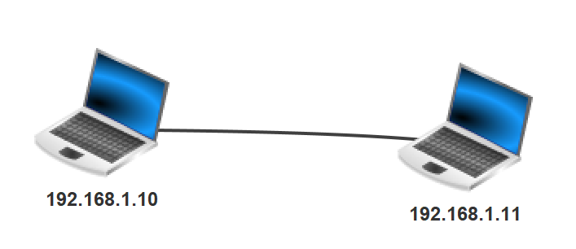

- Lancer **Filius**.  
- Créer le réseau illustré ci-dessus.  
- Lancer la simulation.  
- Sur le poste **10**, installer **Ligne de commande**.  
- Ouvrir l’application et exécuter :  
  ```bash
  ping 192.168.1.11
  ```
- Afficher les données échangées en effectuant un clic droit sur l’ordinateur.  
- Effectuer un `ipconfig` dans le terminal du poste **10** et comparer l’adresse **MAC** avec celle de la source affichée dans le tableau des données échangées.  

**<H3 STYLE="COLOR:red;">Activité n°5.:**</H3> 2 ordinateurs et un serveur  
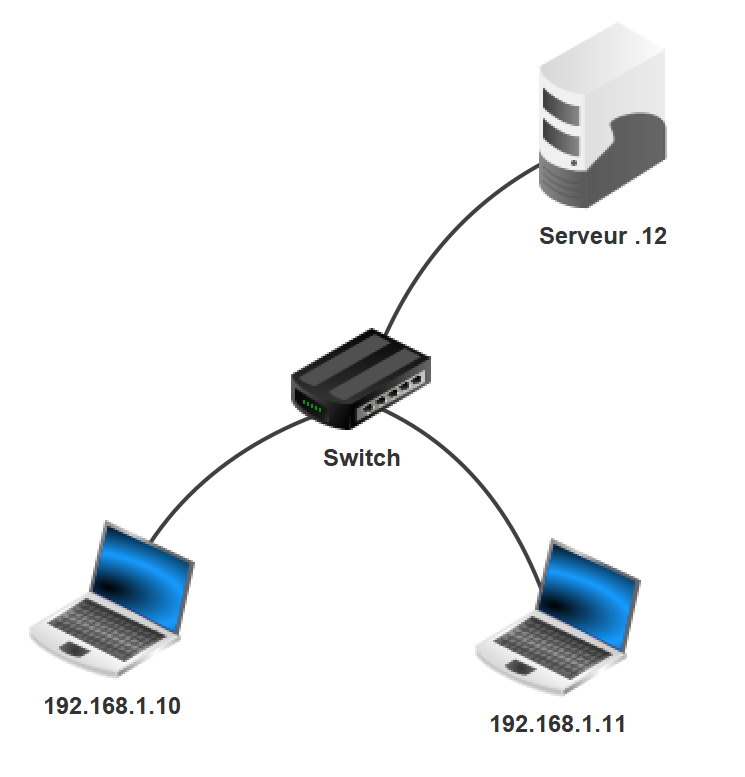

- Modifier le réseau précédent pour y ajouter un **serveur** (IP : `192.168.1.12`) et un **switch**.  
- Installer un **serveur générique** sur le serveur (`port 55555`) et le démarrer.  
- Sur un des ordinateurs, installer un **client générique** et le connecter au serveur.  
- Envoyer un **message** au serveur via le client générique.  
- Observer les **données échangées** en effectuant un clic droit sur l’ordinateur.  


**Comprendre la couche transport : le Three-Way Handshake TCP**  
Lorsqu’une connexion TCP s’établit, trois étapes sont nécessaires :  

1. **SYN** : Le client envoie une demande (`SYN`) au serveur avec un **numéro de séquence A**.  
2. **SYN-ACK** : Le serveur répond avec un **SYN-ACK**, où le numéro de séquence du `ACK` est **A+1**, et envoie un **numéro aléatoire B**.  
3. **ACK** : Le client envoie un dernier `ACK`, où le numéro du **ACK** est **B+1**.  

Ensuite :  
- Le client envoie son message au serveur.  
- Le serveur accuse réception en **A+2**.  
- Le serveur envoie sa réponse au client.  
- Le client accuse réception en **B+2**.  

Pour terminer la connexion, cliquez sur **Déconnexion**.  

On observe que les échanges entre le client et le serveur suivent **4 étapes**.  

**<H3 STYLE="COLOR:red;">Activité n°6.:**</H3> 2 réseaux  
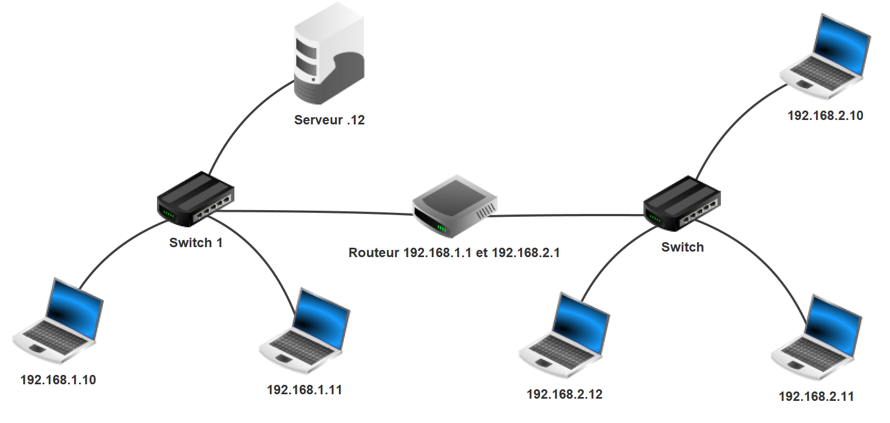

- Modifier le réseau précédent pour obtenir **deux réseaux interconnectés**.  
- Essayer de **pinguer** (`ping 1.10 → 2.10`).  
- Normalement, le message ne peut pas traverser le premier réseau vers le second.  

**Ajouter une passerelle pour permettre la communication**  
- Configurer la passerelle du **routeur** :
  - **Réseau 1** : `192.168.1.1`
  - **Réseau 2** : `192.168.1.2`
- Ajouter la passerelle correspondante sur **chaque ordinateur** (`1.x` et `2.x`).  
- Pinguer de **1.10** vers **2.10** après configuration.  

📌 **Test avancé** : Installer un **client générique** sur **2.10** et l’envoyer au **serveur 1.12** avec le message `"Bonjour"`. Observer les **données échangées**.  

**<H3 STYLE="COLOR:red;">Activité n°7.:**</H3> Simulation du web avec adresse IP 

- Installer un **serveur Web** et un **éditeur de texte** sur **1.12**.  
- Modifier le fichier **index.html** (situé dans `/root/webserver`).  
- Ajouter **vos propres fichiers** :
  - `page1.html`
  - `script.js` (`/js/`)
  - `style.css` (`/css/`)
  - Images (`/images/`)
- Renommer :
  - `index.html` → `indexold.html`
  - `page1.html` → `index.html`
- Sauvegarder les modifications.  

**Démarrer et tester le serveur Web**  
- Ouvrir l’application **Serveur Web**, cliquer sur **Démarrer**.  
- Depuis un **navigateur Web** sur **2.10**, entrer l’URL :  
  ```
  http://192.168.1.12
  ```
📌 **Problème observé :**  
- **CSS ne fonctionne pas**.  
- **Encodage UTF-8 incorrect**.  

**<H3 STYLE="COLOR:red;">Activité  n°8.:**</H3>  Simulation  du  web  avec  serveur DNS  

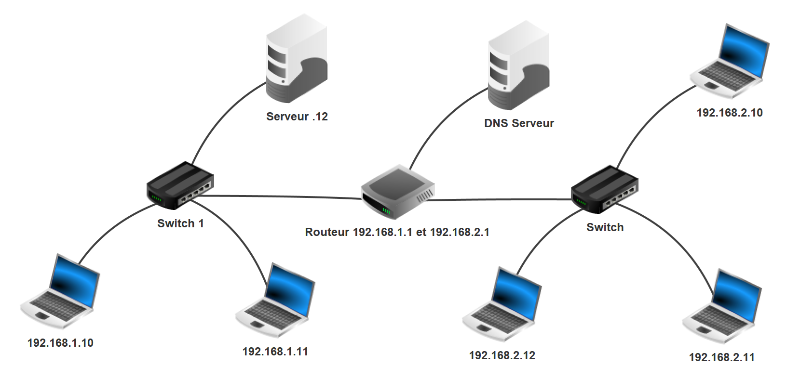

**Pourquoi utiliser un DNS ?**  
Sur Internet, on utilise des **noms de domaine** au lieu d’adresses IP. Le **serveur DNS** traduit ces noms en adresses IP.  

**Configuration d’un serveur DNS**  
1. Ajouter un **serveur DNS** avec l’IP `192.168.3.10` et comme passerelle `192.168.3.1`.  
2. Connecter le **serveur DNS** au **routeur** (`192.168.3.1`).  
3. Ajouter l’**IP du serveur DNS** dans la configuration **réseau de tous les postes**.  
4. Installer et **paramétrer** l’application **serveur DNS** sur `192.168.3.10` :
   - Associer **www.serverwebdensi.fr** → `192.168.1.12` (serveur Web).  
   - **Démarrer** le serveur DNS.  
5. Sur **2.10**, tester en tapant dans un navigateur :  
   ```
   http://www.serverwebdensi.fr
   ```
**Vérification**  
- Sur **1.10**, ouvrir un terminal et exécuter :  
  ```bash
  host www.serverwebdensi.fr
  ```
- Observer le résultat.  


**<H3 STYLE="COLOR:red;">Activité n°9.:**</H3> Chemin d’un client à un serveur 

- Ouvrir le fichier `snt_sim_res.fls`.  
- Lancer un **traceroute** entre **M14** et **M9** :  
  ```bash
  tracert [IP de M9]  # Windows
  traceroute [IP de M9]  # Linux/macOS
  ```
- Supprimer le câble **routeur F → routeur E** (simulation de panne).  
- Refaites un **traceroute** entre **M14** et **M9**.  

📌 **Remarque** : Il se peut que la mise à jour des tables de routage prenne du temps.  
- Si `ping` ne fonctionne pas immédiatement, **attendez quelques secondes et réessayez**.  


**<H3 STYLE="COLOR:red;">Activité n°10.:**</H3> Chemin d’un client à un serveur version graphique 

Utiliser le site : [Traceroute en ligne](https://gsuite.tools/traceroute)  
- Entrer une **URL** pour observer son chemin.  

**Exemples de sites à tester :**  
- `gs-cassaigne.fr`  
- `aliexpress.com`  
- `www.intechinfo.fr`  
- `malekal.com`  


**Ressources complémentaires**  
**Commandes réseau**  
- **ipconfig** (Windows) : [Guide PC Astuces](https://www.pcastuces.com/pratique/windows/outils_reseau/page4.htm)  
- **ipconfig** (PaperGeek) : [Explication détaillée](https://www.papergeek.fr/ipconfig-comment-connaitre-son-adresse-ip-locale-et-son-adresse-mac-sous-windows-80996)  

[^1]: Network Address Translation : Traduction d’adresse réseau