**Table des matières** 

1. [Modèle client/serveur](#_page0_x40.00_y516.92)
1. [Le protocole HTTP](#_page1_x40.00_y233.92)
3. [Coder l’envoi d’une requête par le navigateur](#_page3_x40.00_y617.92)
4. [APPLICATION : Création d’une page web dynamique](#_page8_x40.00_y503.92)
5. [Exercices](#_page13_x40.00_y36.92)

### <H3 STYLE="COLOR:GREEN;"> **3.1. La résolution de nom : obtenir l'adresse IP du site</h3>**


Lorsqu’un utilisateur saisit une URL dans la barre d’adresse d’un navigateur, par exemple :
`https://www.exemple.com/index.html`, le navigateur doit **trouver l’adresse IP** du serveur pour pouvoir lui envoyer une requête.

🔍 **Structure d'une URL** :

* **Protocole** : `https://` → indique le protocole utilisé pour la communication (ici HTTP sécurisé)
* **Nom de domaine** : `www.exemple.com` → nom lisible pour l'humain
* **Chemin** : `/index.html` → ressource demandée sur le serveur

Cependant, sur Internet, les machines ne sont identifiées **ni par leur nom**, ni par leur URL, mais par leur **adresse IP**.


🌐 **Rôle du DNS (Domain Name System)**

Le **serveur DNS** est chargé de faire la correspondance entre un **nom de domaine** et son **adresse IP**. C’est l’équivalent d’un annuaire téléphonique pour Internet.


🔄 **Processus de résolution DNS :**

1. **Le navigateur consulte le cache local** :
   Il vérifie s’il a déjà l’adresse IP correspondant au nom de domaine.

2. **Si ce n’est pas le cas, il envoie une requête DNS** à :

   * La **box internet** (DNS local)
   * Le **serveur DNS du fournisseur d’accès à Internet (FAI)**
   * Ou un **serveur DNS public** (ex. : Google DNS `8.8.8.8`, Cloudflare `1.1.1.1`)

3. **Réponse du serveur DNS** :
   Il retourne l’adresse IP associée au nom de domaine. Cette IP est alors stockée en cache pour les prochaines requêtes.


## **<H2 STYLE="COLOR:BLUE;">1. Modèle<a name="_page0_x40.00_y516.92"></a> client/serveur**</H2>


Dans un réseau, les **ordinateurs échangent des données** :  

- **Le client** envoie une requête pour demander une ressource (exemple : un navigateur web). 

- **Le serveur** reçoit la requête, la traite et répond avec la ressource demandée (exemple : un serveur web).  

💡 **Le Web est devenu dynamique**  

Les serveurs ne se limitent plus à envoyer des fichiers statiques. Grâce à des langages comme **PHP, Python ou Java**, ils génèrent du contenu en temps réel.

📌 **Exemple : Génération dynamique d'une page avec PHP**  

```php
<?php 
$heure = date("H:i"); 
echo "<h1>Bienvenue sur mon site</h1>";
echo "<p>Il est actuellement $heure</p>";
?>
```
Si un client se connecte à **18h23**, le serveur lui enverra :  

```html
<h1>Bienvenue sur mon site</h1>
<p>Il est actuellement 18h23</p>
```


## **<H2 STYLE="COLOR:BLUE;">2. Le<a name="_page1_x40.00_y233.92"></a> protocole HTTP**</H2>
### **<H3 STYLE="COLOR:GREEN;">2.1. Qu’est<a name="_page1_x40.00_y255.92"></a> ce que c’est et quel est son rôle ?**</H3>

Le **HyperText Transfer Protocol (HTTP)** est un protocole de communication entre un **client** et un **serveur**. Il permet l’**envoi de requêtes** par le client et la **réception de réponses** du serveur.  


### **<H3 STYLE="COLOR:GREEN;">2.2. Les<a name="_page1_x40.00_y417.92"></a> codes de statut HTTP**</H3>

Un serveur HTTP répond toujours avec un **code de statut**, qui indique le résultat de la requête :  

| **Code** | **Signification** |
|---------|------------------|
| **200** | Succès (OK) |
| **301** | Redirection permanente |
| **404** | Page non trouvée |
| **500** | Erreur interne du serveur |


### **<H3 STYLE="COLOR:GREEN;">2.3. Principe<a name="_page1_x40.00_y564.92"></a> d’une requête**</H3>

Un **navigateur** envoie une **requête** à un **serveur web** en suivant une **structure standardisée**.

**Structure d’une requête HTTP**

1️⃣ **Méthode HTTP** (`GET`, `POST`...)  

2️⃣ **URL de la ressource** (`/index.html`)  

3️⃣ **Version du protocole** (`HTTP/1.1`)  

4️⃣ **En-têtes de requête** (informations supplémentaires)  

5️⃣ **Corps de requête** *(optionnel - pour `POST` uniquement)*  


#### **<H4 STYLE="COLOR:MAGENTA;">2.3.1. Ligne de Requête**</H4>

Elle est composée de **trois éléments** :
```
GET /index.html HTTP/1.1
```
🔹 **Méthode** : `GET` (peut être `POST`, `PUT`, `DELETE`…)  
🔹 **Ressource demandée** : `/index.html`  
🔹 **Version du protocole** : `HTTP/1.1`  


#### **<H4 STYLE="COLOR:MAGENTA;">2.3.2. En-têtes de Requête (Headers)**</H4>

Les en-têtes HTTP fournissent des **informations supplémentaires** sur la requête et le client.

**Exemple de requête avec en-têtes** :
```
GET /index.html HTTP/1.1
Host: www.example.com
User-Agent: Mozilla/5.0 (Windows NT 10.0; Win64; x64)
Accept: text/html,application/xhtml+xml
```

📌 **Explication :**  

✔️ `Host` → Nom du site demandé (`www.example.com`)  

✔️ `User-Agent` → Type de navigateur utilisé (`Mozilla/5.0`)  

✔️ `Accept` → Type de contenu accepté (`text/html`, `image/png`...)  


#### **<H4 STYLE="COLOR:MAGENTA;">2.3.3. Transmission des données avec GET et POST**</H4>

Les formulaires HTML envoient **des données** au serveur via `GET` ou `POST`.


**Exemple avec `GET`** *(⚠️ Visible dans l’URL)*  
```html
<form method="GET" action="/login">
    <input type="text" name="username" placeholder="Nom d'utilisateur">
    <input type="password" name="password" placeholder="Mot de passe">
    <button type="submit">Se connecter</button>
</form>
```
➡️ **Les données sont visibles dans l’URL :**
```
https://www.example.com/login?username=dupont&password=azerty
```
🚨 **Problème** : Le mot de passe est en clair dans l’URL (**risque de sécurité !**).  


**Exemple avec `POST`** *(✔️ Sécurisé, car invisible dans l’URL)*  
```html
<form method="POST" action="/login">
    <input type="text" name="username" placeholder="Nom d'utilisateur">
    <input type="password" name="password" placeholder="Mot de passe">
    <button type="submit">Se connecter</button>
</form>
```
➡️ **Avec POST, les données sont envoyées dans le corps de la requête** et ne sont **pas visibles dans l’URL**.  


#### **<H4 STYLE="COLOR:MAGENTA;">2.3.4. Différences entre GET et POST**</H4>

| Critère  | **GET**  | **POST**  |
|----------|---------|---------|
| **Visibilité des données** | ✔️ Affichées dans l’URL  | ❌ Cachées dans la requête |
| **Utilisation principale** | Accéder à une ressource  | Envoyer des données |
| **Longueur des données** | ⚠️ Limitée (taille de l’URL) | ✅ Illimitée |
| **Sécurité** | ❌ Données visibles | ✔️ Masquées |
| **Historique** | ✔️ Stocké dans le cache | ❌ Non mémorisé |
| **Exemples** | Recherche sur un site | Connexion, formulaire |

🚀 **Bonnes pratiques** :  

✔️ **Utiliser GET pour des recherches (`?q=ordinateur`)**  

✔️ **Utiliser POST pour des données sensibles (mots de passe, paiements)**  


### **<H3 STYLE="COLOR:GREEN;">2.4. Réponse HTTP du Serveur**</H3>

Après réception d’une requête, **le serveur répond avec** :  

1️⃣ **Un code de statut** (`200 OK`, `404 Not Found`, `500 Internal Server Error`...)  

2️⃣ **Des en-têtes de réponse** (`Content-Type: text/html`)  

3️⃣ **Le contenu demandé** (HTML, JSON, image...)  


#### **<H4 STYLE="COLOR:MAGENTA;">2.4.1. Exemple d’une Réponse HTTP**</H4>

```
HTTP/1.1 200 OK
Content-Type: text/html; charset=UTF-8
Content-Length: 356
Connection: keep-alive
```

📌 **Explication** :  

✔️ `200 OK` → Requête réussie  

✔️ `Content-Type` → Contenu en HTML  

✔️ `Connection: keep-alive` → Maintient la connexion ouverte  


#### **<H4 STYLE="COLOR:MAGENTA;">2.4.2. Corps de la Réponse avec PHP**</H4>

Le corps de la réponse HTTP contient le **contenu réel renvoyé au navigateur**.  

Si une page web est demandée, elle est envoyée sous forme de HTML.

🔹 **Exemple d’une page générée dynamiquement avec PHP :**
```php
<!DOCTYPE html>
<html lang="fr">
<head>
    <meta charset="UTF-8">
    <title>Bienvenue</title>
</head>
<body>
    <?php
    // Récupération des données envoyées via une requête POST
    $name = htmlspecialchars($_POST['name']);
    $city = htmlspecialchars($_POST['city']);
    ?>
    <h1>Bienvenue sur mon site, <?php echo $name; ?> de <?php echo $city; ?> !</h1>
    <p>Nous sommes heureux de vous accueillir.</p>
</body>
</html>
```
📌 **Analyse** :

- Le serveur reçoit les données du formulaire via `$_POST['name']` et `$_POST['city']`.  

- `htmlspecialchars()` empêche les failles XSS en filtrant les caractères spéciaux.  

- Le serveur renvoie une page personnalisée au client.


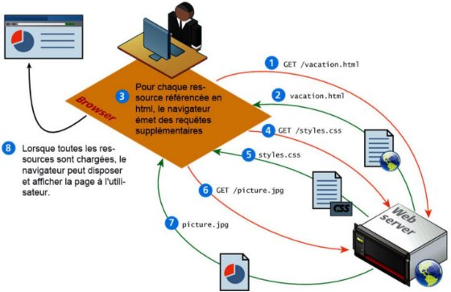

#### **<H4 STYLE="COLOR:MAGENTA;">2.4.3. HTTPS : Sécurisation des échanges**</H4>

🔹 **Différences entre HTTP et HTTPS**  

✔️ **HTTP** → Données **non chiffrées**, vulnérables aux attaques  

✔️ **HTTPS** → Données **chiffrées** grâce au protocole TLS  

🔹 **Pourquoi utiliser HTTPS ?**  

✔️ **Protection des données** (paiements, mots de passe)  

✔️ **Amélioration du référencement** (Google privilégie HTTPS) 

✔️ **Affichage du cadenas 🔒** dans la barre d’adresse  

💡 **Astuce** : Toujours vérifier la présence du 🔒 dans l’URL avant d’entrer des données sensibles.  


### **<H3 STYLE="COLOR:GREEN;">2.5. Syntaxe<a name="_page3_x40.00_y314.92"></a> complète des URL**</H3>

📌 **Structure d’une URL**  
```
protocole://nom-de-domaine:port/chemin?paramètre1=valeur1&paramètre2=valeur2#ancre
```

🔹 **Explication** :  

✔️ `protocole` → HTTP ou HTTPS  

✔️ `nom-de-domaine` → Adresse du serveur (`www.example.com`)  

✔️ `chemin` → Page demandée (`/index.html`)  

✔️ `?paramètre1=valeur1` → Données envoyées (utilisé avec GET)  

✔️ `#ancre` → Cible une section spécifique d’une page  

🔹 **Exemple concret**  
```
https://fr.wikipedia.org/wiki/Informatique#Algorithmique
```
💡 **Le `#Algorithmique` permet d’accéder directement à cette section de la page.**  


**<H3 STYLE="COLOR:RED;">Activité n°1.**</H3> Passage de paramètre  un serveur 

1️⃣ **Aller sur** [Wikipedia](https://fr.wikipedia.org/)  

2️⃣ **Taper "informatique" dans la barre de recherche**  

3️⃣ **Noter l’URL générée**  

4️⃣ **Comparer ces URLs** :

   - [https://fr.wikipedia.org/w/index.php?search=informatique](https://fr.wikipedia.org/w/index.php?search=informatique)

   - [https://fr.wikipedia.org/wiki/Informatique#Algorithmique](https://fr.wikipedia.org/wiki/Informatique#Algorithmique)

🔹 **Que remarquez-vous ?**  

📌 **Les paramètres sont passés via l’URL et permettent d’accéder directement aux résultats.**  


## **<H2 STYLE="COLOR:BLUE;">3.  Coder l’envoi d’une requête par le navigateur<a name="_page3_x40.00_y617.92"></a>**</H2>

Il existe plusieurs **manières d’envoyer une requête HTTP** :  

1️⃣ **Saisir une URL dans la barre d’adresse du navigateur**  

2️⃣ **Utiliser un formulaire HTML**  

3️⃣ **Envoyer une requête via JavaScript (AJAX, Fetch API, etc.)**  

### **<H3 STYLE="COLOR:GREEN;">3.1. Exemple<a name="_page4_x40.00_y36.92"></a> d'un formulaire HTML**</H3>

💡 **Un formulaire HTML permet d’envoyer des données au serveur avec les méthodes `GET` ou `POST`.**  

**1️⃣ Formulaire avec la méthode `GET` (⚠️ données visibles dans l’URL)**
```html
<form method="GET" action="/search">
    <input type="text" name="query" placeholder="Rechercher">
    <button type="submit">Rechercher</button>
</form>
```
➡️ **Résultat dans l’URL** :  
```
https://www.example.com/search?query=informatique
```
⚠️ **Problème** : Les données sont visibles dans l’URL et peuvent être interceptées.

---

**2️⃣ Formulaire avec la méthode `POST` (✔️ plus sécurisé)**
```html
<form method="POST" action="/login">
    <input type="text" name="username" placeholder="Nom d'utilisateur">
    <input type="password" name="password" placeholder="Mot de passe">
    <button type="submit">Se connecter</button>
</form>
```
✅ **Les données sont envoyées dans le corps de la requête HTTP et ne sont pas visibles dans l’URL.**  


**<H3 STYLE="COLOR:RED;">Activité n°2.**</H3>  Ouvrir un bloc-notes. Ajouter le script suivant et vérifier ce qu’on obtient dans le navigateur. Enregistrer le fichier sous `index.html`.

⚠ **ATTENTION** à bien sélectionner **tous les fichiers** lors de l'enregistrement !

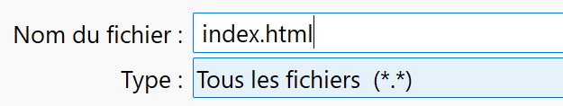
```html
<!DOCTYPE html>
<html lang="fr">
<head>
  <meta charset="UTF-8">
  <title>Requête</title>
</head>
<body>
<form method='GET' action='./login'>
    <input name='user' type='text' required>
    <input name='password' type='password' required>
    <button type='submit'>Login</button>
</form>
</body>
</html>
```
Ce formulaire utilise la **méthode GET**, ce qui signifie que :

- Les données saisies (`user` et `password`) seront ajoutées dans l’URL après soumission.

- Exemple d’URL après soumission :
  ```
  https://monsite.com/login?user=dupont&password=azerty
  ```
- ⚠️ **Problème** : Avec `GET`, le mot de passe est visible dans l’URL, ce qui n’est pas sécurisé.


**<H3 STYLE="COLOR:RED;">Activité n°3.**</H3> Remplir ce formulaire et le soumettre fera envoyer une requête **GET** vers l'URL `./login`. Observer la nouvelle URL.

Avec la méthode **GET**, les données du formulaire seront encodées **dans l’URL**.

Si on saisit les valeurs :

- **Nom d'utilisateur** : `Dupont`

- **Mot de passe** : `azerty`

➡ Le navigateur chargera la page avec l'URL suivante :
```
./login?user=dupont&password=azerty
```


**Problème :** 

  - Les données sont **visibles** dans l'URL, ce qui pose un problème de **sécurité**, notamment pour les mots de passe.


**<H3 STYLE="COLOR:RED;">Activité n°4.**</H3> 
Modifier la page pour pouvoir la soumettre avec une requête **POST**. Remplir ce formulaire et le soumettre fera envoyer une requête **POST**.

Dans ce cas, les données ne seront **pas visibles dans l’URL**, mais envoyées **dans le corps de la requête**.


✅ **Explication :**

Ici on demande de **modifier la méthode du formulaire** pour utiliser **POST** au lieu de **GET** :
  ```html
  <form method="POST" action="./login">
  ```
**Différence avec GET :**

  - Avec POST, les données sont **transmises dans le corps de la requête** et **non visibles dans l'URL**.

  - Cela permet de **protéger les informations sensibles** comme les mots de passe.

  - Exemple de requête envoyée par POST :
    ```
    POST /login HTTP/1.1
    Host: monsite.com
    Content-Type: application/x-www-form-urlencoded
    Content-Length: 32

    user=dupont&password=azerty
    ```


### **<H3 STYLE="COLOR:GREEN;">3.2. Différences entre GET et POST**<a name="_page7_x40.00_y370.92"></a> </H3>

| Critère  | **GET**  | **POST**  |
|----------|---------|---------|
| **Données visibles ?** | ✔️ Oui, dans l’URL | ❌ Non, cachées dans la requête |
| **Sécurité** | ❌ Risque de fuite d’infos sensibles | ✔️ Plus sécurisé (ex : mot de passe) |
| **Taille des données** | ⚠️ Limitée par l’URL | ✅ Illimitée |
| **Stockage dans l’historique ?** | ✔️ Oui | ❌ Non |
| **Cas d’utilisation** | Recherche, navigation | Connexion, formulaires sensibles |

💡 **Bonne pratique** : Toujours utiliser **POST** pour **les mots de passe et les données sensibles** !


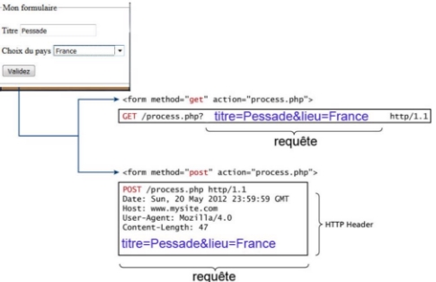


### **<H3 STYLE="COLOR:GREEN;">3.3. Les<a name="_page4_x40.00_y568.92"></a> éléments d’un formulaire HTML**</H3>

Un formulaire HTML est composé de plusieurs éléments permettant de structurer et saisir des données.


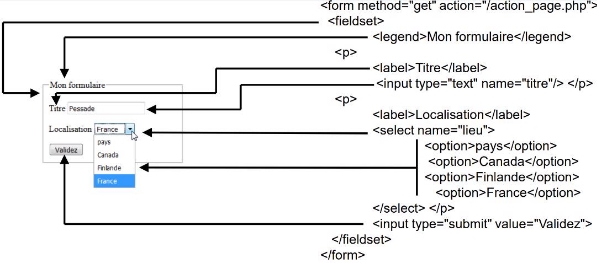

| **Type**        | **Description** |
|----------------|---------------|
| `<button>`     | Définit un bouton cliquable. |
| `<fieldset>`   | Regroupe les éléments liés dans un formulaire. |
| `<form>`       | Définit le conteneur de formulaire. |
| `<input>`      | Définit un champ de saisie. |
| `<label>`      | Définit une étiquette pour un élément de formulaire. |
| `<legend>`     | Définit l’étiquette d’un groupe de champs. |
| `<option>`     | Définit une option dans une liste déroulante. |
| `<optgroup>`   | Regroupe des options connexes dans une liste. |
| `<select>`     | Définit une liste à choix multiples. |
| `<textarea>`   | Définit une zone de saisie de texte multiligne. |


### **<H3 STYLE="COLOR:GREEN;">3.4. Elément<a name="_page5_x40.00_y275.92"></a> ```<input>``` : quelques exemples**</H3>

Le champ `<input>` est utilisé pour permettre la saisie de texte, mots de passe, et autres valeurs.


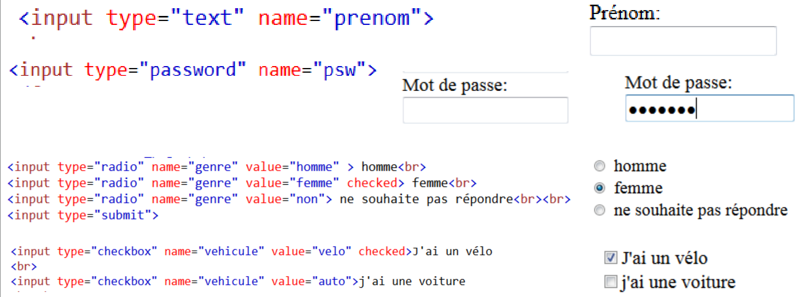

**📌 Exemples courants :**  

```html
<input type="text" name="nom" placeholder="Votre nom">
<input type="email" name="email" placeholder="Votre email">
<input type="password" name="motdepasse" placeholder="Mot de passe">
<input type="date" name="date_naissance">
<input type="checkbox" name="conditions" value="accept"> J’accepte les conditions
<input type="radio" name="sexe" value="homme"> Homme
<input type="radio" name="sexe" value="femme"> Femme
<input type="submit" value="Envoyer">
```

✅ **Les boutons radio permettent de choisir une seule option, tandis que les cases à cocher peuvent être sélectionnées simultanément.**


### **<H3 STYLE="COLOR:GREEN;">3.5. Elément<a name="_page5_x40.00_y485.92"></a> ```<select>``` : quelques exemples**</H3>

L'élément `<select>` permet de créer une liste déroulante avec des options de choix.


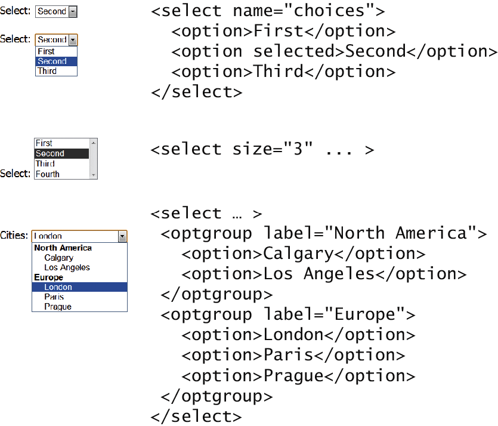

### **<H3 STYLE="COLOR:GREEN;">3.6. Elément<a name="_page6_x40.00_y36.92"></a> value dans ```<select>```**</H3>

L’attribut `value` d’un `<option>` définit la valeur qui sera envoyée au serveur lorsqu'un choix est fait.

L'attribut value est **facultatif**. S’il n’est pas spécifié, alors **le texte** dans le conteneur **est envoyé à la place** 


### **<H3 STYLE="COLOR:GREEN;">3.7. Les<a name="_page6_x40.00_y300.92"></a> boutons de commande**</H3>

💡 **Il existe plusieurs façons d’ajouter des boutons dans un formulaire :**

| **Type**                    | **Description** |
|-----------------------------|----------------|
| `<input type="submit">`     | Envoie les données du formulaire. |
| `<input type="reset">`      | Efface les champs du formulaire. |
| `<input type="button">`     | Bouton personnalisé (nécessite JavaScript). |
| `<input type="image">`      | Bouton sous forme d’image. |
| `<button>`                  | Bouton plus flexible pouvant contenir du texte et des images. |


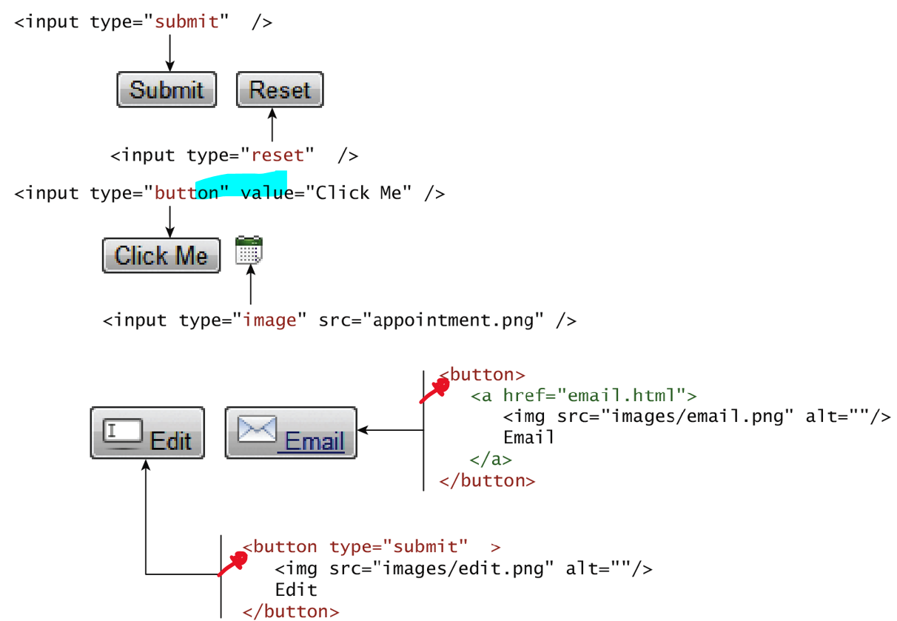

⚠ **Attention à ne pas confondre :**

- `<button>` avec `<input type='button'>`

- `<input type='submit'>` avec `<button type='submit'>`

🚀 **Préférez `<button>` pour plus de flexibilité !** 


### **<H3 STYLE="COLOR:GREEN;">3.8. Comment<a name="_page7_x40.00_y36.92"></a> le formulaire interagit avec le serveur ?**</H3> 

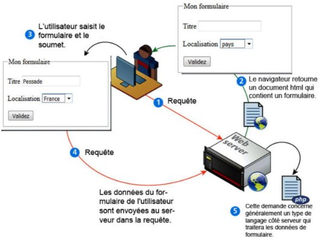


### **<H3 STYLE="COLOR:GREEN;">3.9. Les<a name="_page8_x40.00_y290.92"></a> cookies**</H3> 

Un site web utilise des **cookies** pour identifier et suivre ses visiteurs. Un cookie est une **petite quantité de données** stockée dans le navigateur du client. Il est composé de :

- **Un nom**  

- **Une valeur**  

- **Optionnellement, une date d'expiration**  

Le serveur choisit ces paramètres et envoie le cookie au client via les **en-têtes HTTP**.

**Exemple d'En-tête de Réponse HTTP avec un Cookie**  

```http
HTTP/1.1 200 OK
Content-Type: text/html; charset=UTF-8
Set-Cookie: username=JohnDoe; Expires=Wed, 21 Jul 2024 07:28:00 GMT; Path=/; Domain=example.com; Secure; HttpOnly
```

**Détails de la Réponse**  

**Ligne de Statut :**  

- `HTTP/1.1 200 OK` : La requête a été traitée avec succès, et le serveur renvoie une réponse correcte.  

**En-têtes de Réponse :**  

- `Content-Type: text/html; charset=UTF-8` : Le type du contenu est du **HTML encodé en UTF-8**.  

**Détails du cookie (`Set-Cookie`) :**  

- `Set-Cookie: username=JohnDoe` : Crée un cookie nommé **username** avec la valeur **JohnDoe**.  

- `Expires=Wed, 21 Jul 2024 07:28:00 GMT` : Date d’expiration du cookie ; après cette date, il sera supprimé automatiquement.  

- `Path=/` : Le cookie est disponible sur **toutes les pages** du site. 

- `Domain=example.com` : Le cookie est valide pour **example.com** et ses sous-domaines.  

- `Secure` : Le cookie est **transmis uniquement via HTTPS**, garantissant une transmission sécurisée.  

- `HttpOnly` : Le cookie **n’est pas accessible en JavaScript**, ce qui le protège des attaques XSS (Cross-Site Scripting).  


**<H3 STYLE="COLOR:RED;">Activité n°5**</H3>: faire les exercices

## **<H2 STYLE="COLOR:BLUE;">4. APPLICATION<a name="_page8_x40.00_y503.92"></a> : Création d’une page web dynamique** 🌍💻</H2>
Un site web peut être **statique** (HTML pur) ou **dynamique** (généré à la volée par un langage comme PHP).  

Nous allons mettre en place un **serveur web local** et apprendre à **créer une page dynamique en PHP**.


 


### **<H3 STYLE="COLOR:GREEN;">4.1. Mise<a name="_page8_x40.00_y565.92"></a> en place d’un serveur Apache Wamp** 🚀</H3>  

📥 **Téléchargement**  

Télécharger un serveur WAMP : [UwAmp Wamp Server - Apache MySQL PHP](https://www.uwamp.com/fr/)  
Normalement, il s’installe dans `C:\UwAmp`. 

**<H3 STYLE="COLOR:RED;">Activité n°6**</H3> 

**Démarrer le serveur WAMP**  

- Ouvrir `UwAmp.exe` et s'assurer qu'Apache et MySQL sont en cours d'exécution.  

- Vérifier en tapant **localhost** dans un navigateur.  

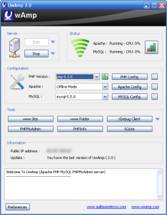

### **<H3 STYLE="COLOR:GREEN;">4.2. Affichage d'une<a name="_page9_x40.00_y154.92"></a> d’une page Web statique**</H3>


Avant de passer à **PHP**, créons une **page HTML statique**.


**<H3 STYLE="COLOR:RED;">Activité n°7.**</H3> Créer avec le bloc note, un fichier où on aura copier :

```html
<!doctype html>
<html lang="fr">
    <head>
        <meta charset="utf-8">
        <title>Utilisation d'Apache</title>
    </head>
    <body>
        <p>Le serveur Apache fonctionne parfaitement</p>
    </body>
</html>
```

📂 **Enregistrer sous** `C:\UwAmp\www\index.html`  

**ATTENTION** à bien sélectionner tous les fichiers.


**<H3 STYLE="COLOR:RED;">Activité n°8.**</H3> . 

✅ **Tester dans le navigateur**  

1️⃣ Ouvrir **`localhost`**  

2️⃣ La page doit afficher : *"Le serveur Apache fonctionne parfaitement !"*   

### **<H3 STYLE="COLOR:GREEN;">4.3. Affichage d'une d’une page Web dynamique**</H3>

**<H3 STYLE="COLOR:RED;">Activité n°9.**</H3> Après avoir supprimé le fichier "index.html" préalablement créé dans le répertoire "www" **ET** le fichier "index.php", Créer avec le bloc note, un fichier où on aura copier : toujours dans le répertoire "www". 
```php
<?php
date_default_timezone_set('Europe/Paris'); // Fuseau horaire Paris
$heure = date("H:i");
echo '<h1>Bienvenue sur mon site</h1>
      <p>Il est '.$heure.'</p>';
?>
```
📂 **Enregistrer sous** `C:\UwAmp\www\index.php`  

**ATTENTION** à bien sélectionner tous les fichiers.


**<H3 STYLE="COLOR:RED;">Activité n°10.**</H3> Ouvrir votre navigateur Web  

✅ **Tester dans le navigateur** 

1️⃣ Ouvrir `localhost`    

2️⃣ La page doit afficher **l’heure actuelle**  

📌 **Si vous actualisez la page, l’heure change** → preuve que **la page est générée dynamiquement** ! 🔄

### **<H3 STYLE="COLOR:GREEN;">4.4. Interaction avec un Formulaire en PHP** 🖊️</H3>

Un site web dynamique doit pouvoir **interagir avec l’utilisateur**.  


**<H3 STYLE="COLOR:RED;">Activité n°11.**</H3> Après avoir supprimé le fichier "index.php" préalablement créé dans le répertoire "www", Créer avec le bloc note, un fichier où on aura copier : toujours dans le répertoire "www". 

```html
<!doctype html>
<html lang="fr">
    <head>
        <meta charset="utf-8">
        <title>Le formulaire</title>
    </head>
    <body>
        <form action="trait_form.php" method="post">
                <label>Nom</label> : <input type="text" name="nom" />
                <label>Prénom</label> : <input type="text" name="prenom" />
                <input type="submit" value="Envoyer" />
        </form>
    </body>
</html>
```
📂 **Enregistrer sous** `C:\UwAmp\www\index.html` . 

ATTENTION à bien sélectionner tous les fichiers.

**<H3 STYLE="COLOR:RED;">Activité n°12.**</H3> : Créer avec le bloc note, un fichier où on aura copier : toujours dans le répertoire "www".  
```php
<?php
    $n=$_POST['nom'];
    $p=$_POST['prenom'];
    echo "<p>Bonjour ".$p." ".$n.", j'espère que vous allez bien.</p>";
?>
```
📂 **Enregistrer sous** `C:\UwAmp\www\trait_form.php`. 

ATTENTION à bien sélectionner tous les fichiers.

**<H3 STYLE="COLOR:RED;">Activité n°13.**</H3> : Ouvrir le navigateur Web 

✅ **Tester dans le navigateur**  

1️⃣ Ouvrir `localhost/index.html`  

2️⃣ Remplir le formulaire et cliquer sur **"Envoyer"**  

3️⃣ La page doit afficher **"Bonjour [Prénom] [Nom], bienvenue !"**  

📌 **Explication** : 

- **Le formulaire envoie les données en `POST` à `trait_form.php`**  

- **PHP récupère les données et affiche un message personnalisé** 


### **<H3 STYLE="COLOR:GREEN;">4.5. Interaction avec un Formulaire en PHP** 🖊️</H3>

**<H3 STYLE="COLOR:RED;">Activité n°14.**</H3> Modifier les fichiers "index.html" et "trait_form.php" comme suit : 

📂 Modifier `index.html` :  

```html
<form action="trait_form.php" method="get">
    <label>Nom</label> : <input type="text" name="nom" />
    <label>Prénom</label> : <input type="text" name="prenom" />
    <input type="submit" value="Envoyer" />
</form>
```

📂 Modifier `trait_form.php` :  

```php
<?php
    $n=$_GET['nom'];
    $p=$_GET['prenom'];
    echo "<p>Bonjour ".$p." ".$n.", j'espère que vous allez bien.</p>";
?>
```


**<H3 STYLE="COLOR:RED;">Activité n°15.**</H3> Ouvrir le navigateur Web 

✅ **Tester et observer l’URL après soumission** 

➡️ Avec **GET**, les données sont visibles dans l’URL :  
```
localhost/trait_form.php?nom=Dupont&prenom=Jean
```

| **Critère**   | **GET** | **POST** |
|--------------|--------|---------|
| **Données visibles dans l’URL ?** | ✅ Oui | ❌ Non |
| **Utilisation principale** | 🔍 Recherche | 🔐 Formulaires sensibles |
| **Sécurité** | ⚠️ Moins sécurisé | ✅ Recommandé |

📌 **Conclusion** :  

- **GET** est utile pour les **recherches et URL partageables**  

- **POST** est utilisé pour **les informations sensibles (ex: mots de passe)**  


**<H3 STYLE="COLOR:RED;">Activité n°16.**</H3> 

📌 **Objectif** : Observer les différences entre **les méthodes GET et POST**.

1️⃣ **Tester avec `POST`** et vérifier que les données **ne sont pas visibles dans l’URL**  

2️⃣ **Tester avec `GET`** et observer l’URL après validation du formulaire  


**<H3 STYLE="COLOR:RED;">Activité n°17**</H3> Fermer le serveur Wamp

📚 **Ressources utiles**

- [Introduction à PHP](http://www.phpdebutant.org/article118.php)  

- [Afficher la date et l’heure](http://www.phpdebutant.org/article53.php)  

- [PHP dans du code HTML](http://www.phpdebutant.org/article54.php)  

- [Les sessions PHP](http://www.phpdebutant.org/article69.php)  

🔧 **Editeurs PHP en ligne**  

- [PHPFiddle](http://phpfiddle.org/)  

- [RunPHPOnline](https://www.runphponline.com/)  


## **<H2 STYLE="COLOR:BLUE;">5. Exercices<a name="_page13_x40.00_y36.92"></a>**</H2> 


**<H3 STYLE="COLOR:RED;">Exercice n°1 :**</H3> Réaliser le visuel du formulaire suivant :

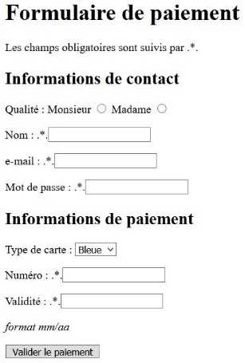

Pour cela : 

- vous utilisez les balises input et select,  

- vous préciserez le type lors de l'utilisation d'une balise input, 

- vous préciserez le name dans chacun des cas (attribut name utilisé plus tard pour retrouver la valeur d'un élément d'un formulaire).

- vous proposerez deux types de carte bancaire possibles : 'Visa' et 'Bleue' (carte par défaut).

- Attention ! Sans Javascript, votre bouton 'Valider le paiement' sera sans effet.

**<H3 STYLE="COLOR:RED;">Exercice n°2 :**</H3> Expliquer ce que fait ce code. 
```html
<form>
<p> Choix d'une nationalité :</p>
    <select id="choix" name="lang" onchange="selection()">
        <option value="ras">Choisir sa nationalité</option>
        <option value="fr">Français</option>
        <option value="zh">Chinois</option>
        <option value="it">Italien</option>
    </select>
<p> Vous avez choisi comme nationalité :<span id="nat">  </span>

 </p>
</form>
```


**Pour aller plus loin (avec du JS) : <H3 STYLE="COLOR:RED;">Exercice n°3 :**</H3>** 

Pour l'exercice on a besoin de trois instructions (déjà vues) : 

- **getElementById('id')** est une méthode qui récupère l'objet de la page identifié par 'id'. 

document.getElementById('id') récupère l'objet de la page en cours identifié par 'id'.

- **selectedIndex** est une méthode qui renvoie la valeur l'option choisie par une liste déroulante ; plus généralement, cette méthode indique le rang à partir de 0 de l'élément de la liste qui a été sélectionnée par l'utilisateur.

selecteur.selectedIndex renvoie l'indice du choix fait par l'utilisateur de la liste déroulante nommée 'selecteur'. 

- **innerHTML** est une méthode qui permet de récupérer tout le contenu HTML d'un élément d'une page html.

document.getElementById('ici').innerHTML intégre du contenu html à l'emplacement de la page identifié par l'id nommé 'ici'. 

voilà le script d'une fonction écrite en javascript :
```JS
function selection() {
        const selecteur = document.getElementById('choix');
        const monChoix = selecteur[selecteur.selectedIndex];
        console.log(monChoix.value +' '+ monChoix.text);
        document.getElementById('nat').innerHTML = monChoix.text;
    }
```


1. Intégrer au code de l'exercice 2 ci-dessus ce script, soit directement, soit avec un lien vers un fichier javascript. 

1. Relancer le code ainsi augmenté de l'exercice 2. Que remarquez-vous ? 

1. Commenter chaque ligne de cette fonction écrite en JavaScript. 

Utiliser la console de votre navigateur afin de voir l'effet d'une des lignes. 

**Pour aller plus loin (avec du JS) : <H3 STYLE="COLOR:RED;">Exercice n°4 :**</H3>**  

Ecrire un formulaire qui demande votre âge et qui indique dans la même page si vous êtes majeur ou mineur. 

 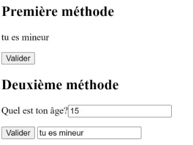

**Pour aller plus loin (avec du JS) : <H3 STYLE="COLOR:RED;">Exercice n°5 :**</H3>**  

On donne le code suivant : 
```html
<form>
    <fieldset>
        <legend>Veuillez sélectionner vos spécialités l'année prochaine :
        </legend>
        <div>
            <input type="checkbox" id="nsi" name="interest" value="nsi">
            <label for="nsi">NSI</label>
        </div>
        <div>
            <input type="checkbox" id="ma" name="interest" value="ma">
            <label for="ma">Maths</label>
        </div>
        <div>
            <input type="checkbox" id="svt" name="interest" value="svt">
            <label for="svt">SVT</label>
        </div>
    </fieldset>
</form>
```


En vous inspirant de l'exercice précédent, faire un formulaire qui demande quelles spécialités vous allez conserver l'année prochaine 

Vous ferez une question pour la première 

La réponse sera affichée dans la page HTML. 

Si la réponse contient NSI, la page HTML doit afficher : "Bravo, bon choix !". 