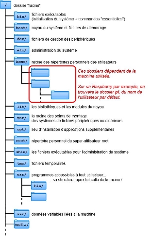
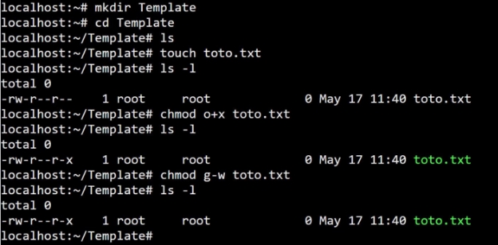
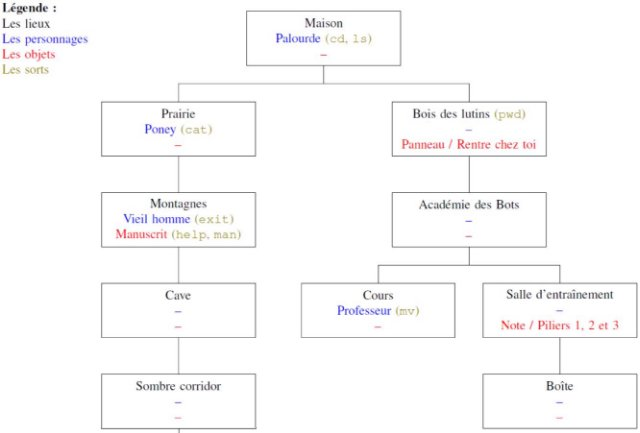
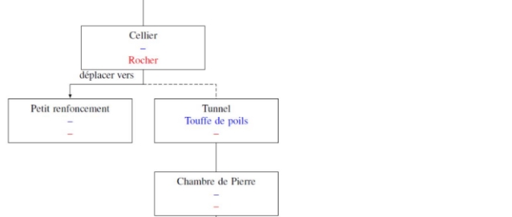
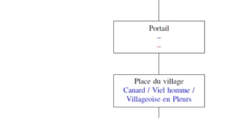
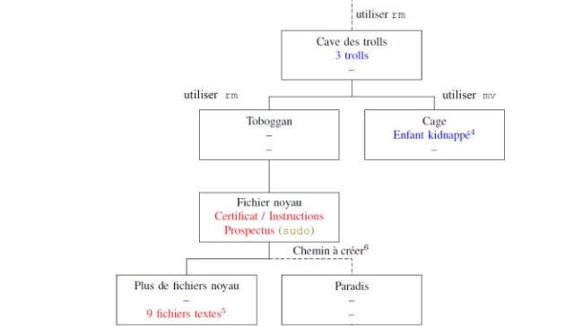
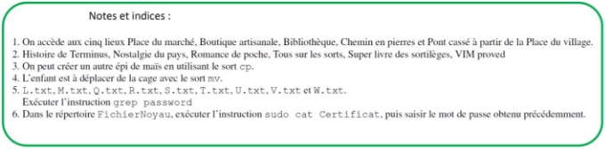
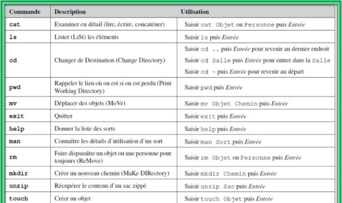
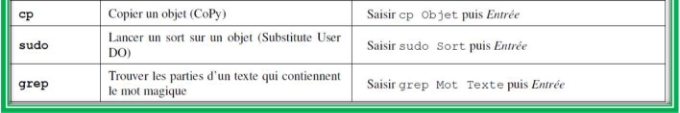

---
author: ELP
title: 10 Les systèmes d’exploitation
---

**Table des matières** 

1. [Les systèmes d’exploitation](#_page0_x40.00_y421.92)
2. [Premiers pas ](#_page2_x40.00_y222.92)
3. [Gestion des utilisateurs et des groupes](#_page5_x40.00_y526.92)
4. [Les commandes de base](#_page8_x40.00_y727.92)
5. [Exercices](#_page10_x40.00_y36.92)


## <H2 STYLE="COLOR:BLUE;">**1. Les<a name="_page0_x40.00_y421.92"></a> systèmes d’exploitation**</H2>

Un **système d’exploitation (OS - Operating System)** est un ensemble de programmes permettant de **gérer les ressources matérielles et logicielles d’un ordinateur**. Il assure l’interface entre **le matériel** (processeur, mémoire, disque dur...) et **les applications** utilisées par l’utilisateur.

### <H3 STYLE="COLOR:GREEN;">**1.1. Historique<a name="_page0_x40.00_y449.92"></a> des systèmes d’exploitation**</H3>

**<H3 STYLE="COLOR:red;">Activité n°1 :</H3>** 

🎥 **Regarder la vidéo** : [Histoire des systèmes d’exploitation](https://ladigitale.dev/digiview/#/v/669b7d43efb95)

**<H3 STYLE="COLOR:red;">Activité n°2 :</H3>**  

🎥 **Regarder la vidéo** : [Comprendre ce qu’est un système d’exploitation](https://ladigitale.dev/digiview/#/v/669b8058569c3)

📌 **Quelques repères historiques :** 

- **1975** : Création de Microsoft par **Bill Gates** et **Paul Allen**.  

- **1983** : Première version de **Windows**, fonctionnant avec **MS-DOS**.  

- **Aujourd’hui** : Windows reste **le système d’exploitation le plus utilisé** sur les ordinateurs grand public.  

💡 **Autres systèmes :** 

- **macOS** (Apple) : basé sur UNIX et **propriétaire**.  

- **Linux** : système **open-source**, utilisé principalement sur **les serveurs et les supercalculateurs**.


### <H3 STYLE="COLOR:GREEN;">**1.2. Le<a name="_page0_x40.00_y600.92"></a> libre et l’open source**</H3>

**<H3 STYLE="COLOR:red;">Activité n°3 :</H3>**  

🎥 **Regarder la vidéo** : [Libre et Open Source](https://ladigitale.dev/digiview/#/v/669b821ab4d41)  

📌 **Différences entre logiciel propriétaire et logiciel libre :**  
| Type de logiciel | Caractéristiques |
|------------------|----------------|
| **Logiciel propriétaire** | Code source fermé, usage restreint (ex : Windows, macOS). |
| **Logiciel libre** | Code source accessible, modifiable et redistribuable (ex : Linux, Firefox). |


### <H3 STYLE="COLOR:GREEN;">**1.3. UNIX<a name="_page0_x40.00_y725.92"></a>**</H3>

**<H3 STYLE="COLOR:red;">Activité n°4 :</H3>**  

🎥 **Regarder la vidéo** : [UNIX](https://ladigitale.dev/digiview/#/v/669beef2e5737)  

📌 **UNIX en bref :**  

- Développé dans les années **1970**.  

- Système **propriétaire** mais influençant de nombreux OS.  

- Base de **macOS**, **Linux**, et de nombreux systèmes d’exploitation professionnels.


### <H3 STYLE="COLOR:GREEN;">**1.4. Linux<a name="_page1_x40.00_y36.92"></a>**</H3>

**<H3 STYLE="COLOR:red;">Activité n°5 :</H3>** 

🎥 **Regarder la vidéo** : [Linux](https://ladigitale.dev/digiview/#/v/669beff7c88ee)  

📌 **Linux, un système open-source :**  

- Créé en **1991** par **Linus Torvalds**.  

- Fonctionne sur **serveurs, supercalculateurs, smartphones (Android), systèmes embarqués**.  

- **Mascotte** : un manchot nommé **TUX**.  

💡 **Différence majeure :** Contrairement à Windows et macOS, **Linux permet à chaque utilisateur de modifier son système** selon ses besoins.


### <H3 STYLE="COLOR:GREEN;">**1.5. Rôles<a name="_page1_x40.00_y333.92"></a> du système d’exploitation**</H3>

Un système d’exploitation assure plusieurs **fonctions essentielles** :  

- **Gestion du processeur** : répartit les tâches entre les programmes. 

- **Gestion de la mémoire vive** : alloue et libère la mémoire nécessaire aux applications.  

- **Gestion des entrées/sorties** : contrôle l’accès aux périphériques (souris, écran, disque dur…).  

- **Gestion des fichiers** : organise et sécurise les données stockées.  

- **Gestion des utilisateurs et des droits** : assure la protection des ressources.  


### <H3 STYLE="COLOR:GREEN;">**1.6. Composantes<a name="_page1_x40.00_y691.92"></a> d’un système d’exploitation**</H3>

📌 **Un OS est composé de plusieurs éléments :**  
| Composante | Rôle |
|------------|------|
| **Le noyau (Kernel)** | Gère la mémoire, les processus et le matériel. |
| **Le shell** | Interpréteur de commandes (interface texte). |
| **Le système de fichiers** | Structure l’organisation des fichiers et dossiers. |

💡 **Exemple d’organisation sous Linux :**  
```
/ (racine)
│── home (dossiers utilisateurs)
│── etc (configurations)
│── bin (programmes)
│── var (logs)
```


## <H2 STYLE="COLOR:BLUE;">**2. Premiers<a name="_page2_x40.00_y222.92"></a> pas**</H2>
### <H3 STYLE="COLOR:GREEN;">**2.1. Qu’est<a name="_page2_x40.00_y245.92"></a> ce qu’un shell ?**</H3>

Un **shell** est une **interface en ligne de commande** permettant de contrôler un OS.  

📌 **Exemples de shells :**  

- `Bash` (le plus courant sous Linux). 

- `Zsh`, `Sh`, `PowerShell` (Windows).


**Avantages :**  

✔ **Puissant** et rapide. 

✔ **Idéal pour l’automatisation des tâches**. 

### <H3 STYLE="COLOR:GREEN;">**2.2. Le prompt et l’invite de commandes<a name="_page2_x40.00_y485.92"></a>**</H3>

📌 **Exemple sous Linux (Raspberry Pi) :**  
```
pi@raspberrypi:~$  
```
💡 **Explication :**  

- `pi` → Nom de l’utilisateur.  

- `raspberrypi` → Nom de l’ordinateur.  

- `~` → Répertoire courant (dossier personnel).  

 

Sur Python le prompt est : >>> 

### <H3 STYLE="COLOR:GREEN;">**2.3. Système<a name="_page3_x285.00_y54.92"></a> de fichier**</H3>




📌 **Organisation des fichiers :**  

- **Tout est fichier** (y compris périphériques et processus). 

- **Arborescence unique** (racine `/`).  

📌 **Exemple :**
```
/home/user/docs/rapport.odt  # Chemin absolu
```


### <H3 STYLE="COLOR:GREEN;">**2.4. Chemin<a name="_page3_x40.00_y516.92"></a> absolu ou chemin relatif**</H3>


📌 **Différence entre les deux :**  
| Type | Exemple | Explication |
|------|---------|------------|
| **Chemin absolu** | `/home/boot/grub/grub.cfg` | Depuis la racine `/`. |
| **Chemin relatif** | `../../bin/cat` | Depuis le dossier courant `grub`. |
   


=> **CAPYTALE Le code vous sera donné par votre enseignant**

**<H3 STYLE="COLOR:red;">Activité n°6.:</H3>** Chemin absolu : en utilisant, l’arborescence précédente déterminer le chemin absolu permettant d’accéder au fichier :

-  "cat" 

-  "rapport.odt" 

**<H3 STYLE="COLOR:red;">Activité n°7.:</H3>** Chemin relatif : en utilisant, l’arborescence précédente déterminer le chemin relatif permettant d’accéder au fichier : 

-  "rapport.odt" depuis le répertoire "elsa" 

-  "fiche.ods" depuis le répertoire "boulot" 

 

### <H3 STYLE="COLOR:GREEN;">**2.5. Commande de base du terminal<a name="_page4_x40.00_y243.92"></a>**</H3>

#### <H4 STYLE="COLOR:MAGENTA;">**2.5.1. Changer de dossier : `cd`** </H4>

```bash
cd documents        # Aller dans "documents"
cd ..               # Revenir au dossier précédent
cd /home/user       # Chemin absolu vers le dossier "user"
```


Autres commandes à connaitre :  


- cd ~ : permet de revenir au répertoire précédent  

- cd / : permet de se placer à la racine des fichiers 

#### <H4 STYLE="COLOR:MAGENTA;">**2.5.2. Lister le contenu d’un dossier : `ls`** </H4>

```bash
ls                 # Liste simple
ls -l              # Liste détaillée
ls -a              # Affiche les fichiers cachés
```

**<H3 STYLE="COLOR:red;">Activité n°8.:</H3>** Faire l’exercice 1 

#### <H4 STYLE="COLOR:MAGENTA;">**2.5.3. Créer et supprimer un fichier/répertoire : `mkdir`, `rm`, `touch`** </H4>

```bash
mkdir mon_dossier  # Créer un répertoire
touch mon_fichier.txt  # Créer un fichier vide
rm mon_fichier.txt  # Supprimer un fichier
rm -r mon_dossier  # Supprimer un dossier et son contenu
```

#### <H4 STYLE="COLOR:MAGENTA;">**2.5.4. Copier et déplacer des fichiers : `cp`, `mv`** </H4>

```bash
cp fichier1.txt dossier/  # Copier un fichier
mv fichier1.txt dossier/  # Déplacer un fichier
```
#### <H4 STYLE="COLOR:MAGENTA;">**2.5.5. Connaître sa position dans l’arborescence : `pwd`**  </H4>

```bash
pwd   # Affiche le chemin absolu du dossier courant
```


## <H2 STYLE="COLOR:BLUE;">**3. Gestion<a name="_page5_x40.00_y526.92"></a> des utilisateurs et des groupes**</H2>

Les systèmes UNIX et Linux sont **multi-utilisateurs**, ce qui signifie que plusieurs utilisateurs peuvent partager un même ordinateur tout en conservant un environnement de travail propre à chacun.

Chaque utilisateur dispose **de droits spécifiques** qui lui permettent d’effectuer certaines opérations et d’en restreindre d’autres. Ces droits sont gérés par le système d’exploitation.

📌 **L’utilisateur "root" (super-administrateur)**  

- Il possède **tous les droits** sur le système.  

- Il peut **ajouter, modifier et supprimer** des fichiers et des utilisateurs.  

- Il peut attribuer ou retirer des **permissions** aux autres utilisateurs.  

💡 **Gestion par groupes**  

- Au lieu d’attribuer des droits à chaque utilisateur **individuellement**, il est plus efficace de **les regrouper** dans des groupes.  

- Un groupe possède des permissions spécifiques, et tous ses membres héritent de ces permissions.

### <H3 STYLE="COLOR:GREEN;">**3.1. Droits des fichiers et des répertoires**</H3> 

Chaque fichier et répertoire possède **trois types de droits** :  
| **Droit** | **Symbole** | **Description** |
|-----------|------------|----------------|
| **Lecture** | `r` (read) | Autorise à lire le contenu d’un fichier ou la liste d’un répertoire. |
| **Écriture** | `w` (write) | Autorise à modifier un fichier ou à ajouter/supprimer des fichiers dans un répertoire. |
| **Exécution** | `x` (execute) | Autorise l’exécution d’un fichier ou l’accès au contenu d’un répertoire. |

📌 **Trois types d’utilisateurs sont associés à chaque fichier :**  
| **Utilisateur** | **Symbole** | **Explication** |
|---------------|------------|----------------|
| **Propriétaire** | `u` (user) | Celui qui a créé le fichier, il peut modifier ses propres droits. |
| **Groupe** | `g` (group) | Ensemble d’utilisateurs partageant les mêmes permissions sur un fichier. |
| **Autres** | `o` (others) | Tous les autres utilisateurs du système. |

💡 **Affichage des permissions avec `ls -l`** 

Si on exécute la commande suivante :
```bash
ls -l fichier.txt
```
On peut obtenir un résultat comme celui-ci :
```
-rw-r--r-- 1 pi pi 204678 Mar 21 22:01 fichier.txt
```
📌 **Explication des colonnes :**  
| **Colonne** | **Signification** |
|------------|----------------|
| `-rw-r--r--` | Type de fichier et permissions |
| `1` | Nombre de liens |
| `pi` | Propriétaire du fichier |
| `pi` | Groupe du fichier |
| `204678` | Taille du fichier en octets |
| `Mar 21 22:01` | Date et heure de la dernière modification |
| `fichier.txt` | Nom du fichier |

💡 **Décryptage des permissions :** 

- `-` → Fichier normal (`d` pour un répertoire).  

- `rw-` → Le **propriétaire** (`u`) peut **lire** et **écrire**, mais pas exécuter.  

- `r--` → Le **groupe** (`g`) peut seulement **lire**.  

- `r--` → **Tous les autres utilisateurs** (`o`) peuvent seulement **lire**.  

### <H3 STYLE="COLOR:GREEN;">**3.2. Modifier les permissions avec `chmod`**</H3> 

📌 **Syntaxe de la commande :**  
```bash
chmod [u/g/o/a] [+/-/=] [r/w/x] fichier
```
- `u` → Propriétaire du fichier  
- `g` → Groupe  
- `o` → Autres  
- `a` → Tous (`u`, `g` et `o`)  

📌 **Exemples :**  
| **Commande** | **Explication** |
|-------------|----------------|
| `chmod u+x script.sh` | Ajoute l’exécution (`x`) au propriétaire. |
| `chmod g-w fichier.txt` | Retire l’écriture (`w`) au groupe. |
| `chmod o=r document.txt` | Donne uniquement la lecture (`r`) aux autres. |

📌 **Notation en base 8([ octal](https://fr.wikipedia.org/wiki/Systeme_octal))**  

Les permissions peuvent aussi être définies en utilisant des **chiffres** :
- `r (lecture) = 4`
- `w (écriture) = 2`
- `x (exécution) = 1`

Chaque groupe de permissions est additionné :  
| **Permissions** | **Valeur** |
|---------------|----------|
| `rwx` | `4+2+1 = 7` |
| `rw-` | `4+2+0 = 6` |
| `r--` | `4+0+0 = 4` |

📌 **Exemple de modification avec notation octale :**  
```bash
chmod 750 fichier.txt
```
🔹 **Décryptage des valeurs :**  
- `7` → **Propriétaire** (`rwx`)  
- `5` → **Groupe** (`r-x`)  
- `0` → **Autres** (`---`)  


Ce qui permet de faire toutes les combinaisons : 

|0  |1  |2  |3  |4  |5  |6  |7 |
|-|-|-|-|-|-|-|-|
|**- - -** |**- - x** |**- w –** |**- w x** |**r - -** |**r - x** |**r w –** |**r w x** | 
|aucun droit |exécution |écriture  |écriture et exécution |lecture seule |lecture et exécution |lecture et écriture |lecture  écriture exécution | 


**<H3 STYLE="COLOR:red;">Activité n°9.:</H3>** analyser l’enchainement de commandes suivantes : 



**<H3 STYLE="COLOR:red;">Activité n°10.:</H3>** Conversion en octal : donner les droits de la commande suivante 

```chmod 750 Template```

**<H3 STYLE="COLOR:red;">Activité n°11.:</H3>** gestion des droits : Dans le répertoire utilisateur ‘~’, les droits du dossier rep1 sont par défaut 
à 755 (rwxr-xr-x). Compléter les tableaux avec les commandes (en notation symbolique et en base 8) pour lui donner les droits suivants (on suppose qu'après chaque commande on remet le répertoire à 755) : 

|**Par défaut** ||
| - | - |
|**Commande 1** ||
|**Commande 2** ||
|**Commande 3** ||
|**Commande 4** ||

|||***Propriétaire(u)*** |||***Groupe(g)*** |||***Autres(o)*** ||
| :- | - | - | - | :- | :- | :- | :- | :- | :- |
||Lecture |Écriture |Accès |Lecture |Écriture |Accès |Lecture |Écriture |Accès |
|**défaut** |oui |oui |oui |oui |non |oui |oui |non |oui |
|**Commande 1** ||||||||||
|**Commande 2** ||||||||||
|**Commande 3** ||||||||||
|**Commande 4** ||||||||||

||**Notation symbolique (relatif)** |**Notation en base 8 (absolu)** |
| :- | - | - |
|**Commande 1** |chmod u-x,o-r rep1 |chmod 651 rep1 |
|**Commande 2** |||
|**Commande 3** |||
|**Commande 4** |||

## <H2 STYLE="COLOR:BLUE;">**4. Les commandes de base**</H2>

| **Commande**  | **Description** |
|--------------|------------------|
| `cat`        | Affiche le contenu d'un ou plusieurs fichiers sur la sortie standard (concatène les fichiers si plusieurs sont donnés). |
| `cd`         | Change de répertoire courant. |
| `chmod`      | Modifie les permissions d'accès d'un fichier ou d'un répertoire. |
| `chown`      | Change le propriétaire d'un fichier ou d'un répertoire. |
| `cp`         | Copie un ou plusieurs fichiers ou répertoires. |
| `crontab`    | Planifie des tâches automatiques. |
| `cut`        | Extrait certaines parties d’un fichier (colonnes, champs, caractères). |
| `date`       | Affiche ou modifie la date et l'heure du système. |
| `dd`         | Copie un fichier bit à bit (utile pour créer des images disque). |
| `df`         | Affiche l’espace disque disponible sur les systèmes de fichiers montés. |
| `du`         | Affiche l’espace disque utilisé par un fichier ou un répertoire. |
| `echo`       | Affiche du texte sur la sortie standard. |
| `exit`       | Ferme le terminal ou met fin à une session shell. |
| `find`       | Recherche de fichiers selon divers critères (nom, taille, permissions…). |
| `fsck`       | Vérifie et répare l’intégrité d’un système de fichiers. |
| `grep`       | Recherche une chaîne de texte dans un ou plusieurs fichiers. Exemple : `grep -n "montexte" monfichier` affiche les lignes contenant "montexte" avec leur numéro. |
| `groupadd`   | Crée un nouveau groupe d’utilisateurs. |
| `gunzip`     | Décompresse un fichier `.gz`. |
| `gzip`       | Compresse un fichier en format `.gz`. |
| `head`       | Affiche les 10 premières lignes d’un fichier (modifiable avec `-n`). |
| `help`       | Affiche l’aide sur les commandes internes de Bash. |
| `kill`       | Envoie un signal à un processus (ex : `kill -9 PID` force l'arrêt d’un processus). |
| `less`       | Permet de visualiser le contenu d’un fichier page par page. |
| `ln`         | Crée un lien symbolique ou un lien physique entre fichiers. |
| `ls`         | Liste le contenu d’un répertoire. |
| `man`        | Affiche le manuel d’une commande. Exemple : `man ls` pour la documentation de `ls`. |
| `mkdir`      | Crée un nouveau répertoire. |
| `mkfs`       | Crée un système de fichiers sur une partition ou un disque. |
| `more`       | Affiche un fichier page par page (comme `less`, mais avec moins de fonctionnalités). |
| `mount`      | Monte un système de fichiers (ex : `mount /dev/sdb1 /mnt`). |
| `mv`         | Déplace ou renomme un fichier ou un répertoire. |
| `ps`         | Affiche la liste des processus en cours d’exécution. |
| `pwd`        | Affiche le chemin absolu du répertoire courant. |
| `rm`         | Supprime un fichier (avec `-r` permet de supprimer un répertoire et son contenu). |
| `rmdir`      | Supprime un répertoire vide. |
| `tail`       | Affiche les 10 dernières lignes d’un fichier (modifiable avec `-n`). |
| `tar`        | Archive des fichiers en un fichier `.tar` (avec `-z` pour compression `.tar.gz`). |
| `touch`      | Crée un fichier vide ou met à jour la date de modification d’un fichier. |
| `su`         | Permet de changer d’utilisateur (ex : `su root` pour passer en super-utilisateur). |
| `uname`      | Affiche des informations sur le système d’exploitation. |
| `unzip`      | Décompresse un fichier `.zip`. |
| `useradd`    | Crée un nouvel utilisateur. |
| `whereis`    | Localise un fichier binaire, sa documentation et ses fichiers sources associés. |


📚 **Pour aller plus loin sur Linux**  

👉 [Tutoriel complet sur OpenClassrooms](https://openclassrooms.com/fr/courses/43538-reprenez-le-controle-a-laide-de-linux)


## <H2 STYLE="COLOR:BLUE;">**5. Exercices<a name="_page10_x40.00_y36.92"></a>**</H2>

**<H3 STYLE="COLOR:red;">Exercice n° 1 : Terminus</H3>**

Dans ce TP vous allez appliquer un certain nombre de commandes UNIX, utilisable dans le Shell (ou encore dans un terminal) en jouant à un jeu en ligne : TERMINUS.  

Vous  trouverez  ce  jeu  à  l’url  suivante  : 

[http://luffah.xyz/bidules/Terminus/ ](http://luffah.xyz/bidules/Terminus/)

Cette barre d’outils présente en bas du jeu :    est très utile.  

**Remarques :**  

Pour obtenir le caractère À : ctrl Alt 7 puis Maj A  

Pour obtenir le caractère É : Alt maintenu avec 0201 puis relâcher la touche  

Vous devrez quasiment à chaque étape utiliser les commandes ls et cat.  

La commande touch est utilisée pour « créer » un objet (et pas le « toucher », comme une mauvaise traduction le dit dans le jeu) 

**Il faut absolument tout lire pour ne pas manquer d’informations (cat)** Avant de commencer :  

- Lire  : [ https://www.alsacreations.com/astuce/lire/78-Quelle-est-la-difference-entre-les-chemins-relatifs- et-absolus-.html ](https://www.alsacreations.com/astuce/lire/78-Quelle-est-la-difference-entre-les-chemins-relatifs-et-absolus-.html)
- **Remarque :  ./ est facultatif**
- [https://www1.zonewebmaster.eu/serveur-debian-general/les-jokers-utilisation ](https://www1.zonewebmaster.eu/serveur-debian-general/les-jokers-utilisation)

Ceci pourra vous aider à gagner beaucoup de temps à la fin du jeu, quand vous chercherez le « password » 

**Quelques indices**  

- Vous trouverez dans la suite le plan du jeu, cela peut vous aider (document de Charles Poulmaire). Je donne aussi quelques indications qui permettent de ne pas perdre trop de temps. 
- Toujours commencer par ls. Vous verrez le rôle de cette commande. Il est préférable d’interagir et de parler, avant de se déplacer. 
- Depuis la maison, commencer par aller dans le Bois des lutins, avant d’aller dans la prairie. 













**Liste des commandes du jeu TERMINUS **



