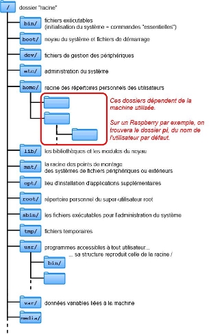
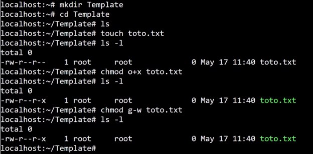

**Table des matières** 

1. [Les systèmes d’exploitation](#_page0_x40.00_y421.92)
2. [Premiers pas ](#_page2_x40.00_y222.92)
3. [Gestion des utilisateurs et des groupes](#_page5_x40.00_y526.92)
4. [Les commandes de base](#_page8_x40.00_y727.92)
5. [Exercices](#_page10_x40.00_y36.92)


## <H2 STYLE="COLOR:BLUE;">**1. Les<a name="_page0_x40.00_y421.92"></a> systèmes d’exploitation**</H2>

Un **système d’exploitation (OS - Operating System)** est un ensemble de programmes permettant de **gérer les ressources matérielles et logicielles d’un ordinateur**. Il assure l’interface entre **le matériel** (processeur, mémoire, disque dur...) et **les applications** utilisées par l’utilisateur.

### <H3 STYLE="COLOR:GREEN;">**1.1. Historique<a name="_page0_x40.00_y449.92"></a> des systèmes d’exploitation**</H3>

???+ question "Activité n°1 :"

    🎥 **Regarder la vidéo** : [Histoire des systèmes d’exploitation](https://www.youtube.com/watch?v=4OhUDAtmAUo)

???+ question "Activité n°2 :"

    🎥 **Regarder la vidéo** : [Comprendre ce qu’est un système d’exploitation](https://ladigitale.dev/digiview/#/v/669b8058569c3)

📌 **Quelques repères historiques :** 

- **1975** : Création de Microsoft par **Bill Gates** et **Paul Allen**.  

- **1983** : Première version de **Windows**, fonctionnant avec **MS-DOS**.  

- **Aujourd’hui** : Windows reste **le système d’exploitation le plus utilisé** sur les ordinateurs grand public.  

💡 **Autres systèmes :** 

- **macOS** (Apple) : basé sur UNIX et **propriétaire**.  

- **Linux** : système **open-source**, utilisé principalement sur **les serveurs et les supercalculateurs**.


### <H3 STYLE="COLOR:GREEN;">**1.2. Le<a name="_page0_x40.00_y600.92"></a> libre et l’open source**</H3>

???+ question "Activité n°3 :"

    🎥 **Regarder la vidéo** : [Libre et Open Source](https://ladigitale.dev/digiview/#/v/669b821ab4d41)  

📌 **Différences entre logiciel propriétaire, logiciel libre et lorgiciel open source:**  

:

| **Type de logiciel**      | **Caractéristiques**                                                                                                                                       |
| ------------------------- | ---------------------------------------------------------------------------------------------------------------------------------------------------------- |
| **Logiciel propriétaire** | Code source fermé, usage restreint, soumis à licence. Ex : **Windows**, **macOS**.                                                                         |
| **Logiciel libre**        | Code source **accessible**, **modifiable** et **redistribuable** sous certaines licences (GPL, etc.). Ex : **Linux**, **Firefox**.                         |
| **Logiciel open source**  | Code source **ouvert** et consultable, souvent modifiable, mais **pas toujours libre** (la licence peut limiter les usages). Ex : **Chrome**, **VS Code**. |

🔍 **Remarque** :

* Tous les logiciels **libres sont open source**, mais tous les **open source ne sont pas nécessairement libres**.
* Par exemple, **Firefox** est **libre** et **open source** ; **Google Chrome** est **open source** (partiellement via Chromium) mais **pas libre**.


### <H3 STYLE="COLOR:GREEN;">**1.3. UNIX<a name="_page0_x40.00_y725.92"></a>**</H3>

???+ question "Activité n°4 :"

    🎥 **Regarder la vidéo** : [UNIX](https://ladigitale.dev/digiview/#/v/669beef2e5737)  

📌 **UNIX en bref :**  

- Développé dans les années **1970**.  

- Système **propriétaire** mais influençant de nombreux OS.  

- Base de **macOS**, **Linux**, et de nombreux systèmes d’exploitation professionnels.


### <H3 STYLE="COLOR:GREEN;">**1.4. Linux<a name="_page1_x40.00_y36.92"></a>**</H3>

???+ question "Activité n°5 :"

    🎥 **Regarder la vidéo** : [Linux](https://ladigitale.dev/digiview/#/v/669beff7c88ee)  

📌 **Linux, un système open-source :**  

- Créé en **1991** par **Linus Torvalds**.  

- Fonctionne sur **serveurs, supercalculateurs, smartphones (Android), systèmes embarqués**.  

- **Mascotte** : un manchot nommé **TUX**.  

💡 **Différence majeure :** Contrairement à Windows et macOS, **Linux permet à chaque utilisateur de modifier son système** selon ses besoins.


### <H3 STYLE="COLOR:GREEN;">**1.5. Rôles<a name="_page1_x40.00_y333.92"></a> du système d’exploitation**</H3>

Un système d’exploitation assure plusieurs **fonctions essentielles** :  

- **Gestion du processeur** : répartit les tâches entre les programmes. 

- **Gestion de la mémoire vive** : alloue et libère la mémoire nécessaire aux applications.  

- **Gestion des entrées/sorties** : contrôle l’accès aux périphériques (souris, écran, disque dur…).  

- **Gestion des fichiers** : organise et sécurise les données stockées.  

- **Gestion des utilisateurs et des droits** : assure la protection des ressources.  


### <H3 STYLE="COLOR:GREEN;">**1.6. Composantes<a name="_page1_x40.00_y691.92"></a> d’un système d’exploitation**</H3>

📌 **Un OS est composé de plusieurs éléments :**  

| Composante | Rôle |
|------------|------|
| **Le noyau (Kernel)** | Gère la mémoire, les processus et le matériel. |
| **Le shell** | Interpréteur de commandes (interface texte). |
| **Le système de fichiers** | Structure l’organisation des fichiers et dossiers. |

💡 **Exemple d’organisation sous Linux :**  

```
/ (racine)
│── home (dossiers utilisateurs)
│── etc (configurations)
│── bin (programmes)
│── var (logs)
```


## <H2 STYLE="COLOR:BLUE;">**2. Premiers<a name="_page2_x40.00_y222.92"></a> pas**</H2>
### <H3 STYLE="COLOR:GREEN;">**2.1. Qu’est<a name="_page2_x40.00_y245.92"></a> ce qu’un shell ?**</H3>

Un **shell** est une **interface en ligne de commande** permettant de contrôler un OS.  

📌 **Exemples de shells :**  

- `Bash` (le plus courant sous Linux). 

- `Zsh`, `Sh`, `PowerShell` (Windows).


**Avantages :**  

✔ **Puissant** et rapide. 

✔ **Idéal pour l’automatisation des tâches**. 

### <H3 STYLE="COLOR:GREEN;">**2.2. Le prompt et l’invite de commandes<a name="_page2_x40.00_y485.92"></a>**</H3>

📌 **Exemple sous Linux (Raspberry Pi) :**  
```
pi@raspberrypi:~$  
```
💡 **Explication :**  

- `pi` → Nom de l’utilisateur.  

- `raspberrypi` → Nom de l’ordinateur.  

- `~` → Répertoire courant (dossier personnel de l'utilisateur).  

 

Sur Python le prompt est : >>> 

### <H3 STYLE="COLOR:GREEN;">**2.3. Système<a name="_page3_x285.00_y54.92"></a> de fichier**</H3>




📌 **Organisation des fichiers :**  

- **Tout est fichier** (y compris périphériques et processus). 

- **Arborescence unique** (racine `/`).  

📌 **Exemple :**
```
/home/user/docs/rapport.odt  # Chemin absolu
```


### <H3 STYLE="COLOR:GREEN;">**2.4. Chemin<a name="_page3_x40.00_y516.92"></a> absolu ou chemin relatif**</H3>


📌 **Différence entre les deux :**  

| Type | Exemple | Explication |
|------|---------|------------|
| **Chemin absolu** | `/home/boot/grub/grub.cfg` | Depuis la racine `/`. |
| **Chemin relatif** | `../../bin/cat` | Depuis le dossier courant `grub`. |
   


=> **CAPYTALE Le code vous sera donné par votre enseignant**

???+ question "Activité n°6 :"

    Chemin absolu : en utilisant, l’arborescence précédente déterminer le chemin absolu permettant d’accéder au fichier :

    -  "cat" 

    -  "rapport.odt" 

???+ question "Activité n°7 :" 

    Chemin relatif : en utilisant, l’arborescence précédente déterminer le chemin relatif permettant d’accéder au fichier : 

    -  "rapport.odt" depuis le répertoire "elsa" 

    -  "fiche.ods" depuis le répertoire "boulot" 

 

### <H3 STYLE="COLOR:GREEN;">**2.5. Commande de base du terminal<a name="_page4_x40.00_y243.92"></a>**</H3>

#### <H4 STYLE="COLOR:MAGENTA;">**2.5.1. Changer de dossier : `cd`** </H4>

```bash
cd documents        # Aller dans "documents"
cd ..               # Revenir au dossier précédent
cd /home/user       # Chemin absolu vers le dossier "user"
```


Autres commandes à connaitre :  


- cd ~ : permet de revenir au répertoire de l'utilisateur 

- cd / : permet de se placer à la racine des fichiers 

#### <H4 STYLE="COLOR:MAGENTA;">**2.5.2. Lister le contenu d’un dossier : `ls`** </H4>

```bash
ls                 # Liste simple
ls -l              # Liste détaillée
ls -a              # Affiche les fichiers cachés
```

???+ question "Activité n°8 :" 

    Faire l’exercice 1 

#### <H4 STYLE="COLOR:MAGENTA;">**2.5.3. Créer et supprimer un fichier/répertoire : `mkdir`, `rm`, `touch`** </H4>

```bash
mkdir mon_dossier  # Créer un répertoire
touch mon_fichier.txt  # Créer un fichier vide
rm mon_fichier.txt  # Supprimer un fichier
rm -r mon_dossier  # Supprimer un dossier et son contenu
```

#### <H4 STYLE="COLOR:MAGENTA;">**2.5.4. Copier et déplacer des fichiers : `cp`, `mv`** </H4>

```bash
cp fichier1.txt dossier/  # Copier un fichier
mv fichier1.txt dossier/  # Déplacer un fichier
```
#### <H4 STYLE="COLOR:MAGENTA;">**2.5.5. Connaître sa position dans l’arborescence : `pwd`**  </H4>

```bash
pwd   # Affiche le chemin absolu du dossier courant
```


## <H2 STYLE="COLOR:BLUE;">**3. Gestion<a name="_page5_x40.00_y526.92"></a> des utilisateurs et des groupes**</H2>

Les systèmes UNIX et Linux sont **multi-utilisateurs**, ce qui signifie que plusieurs utilisateurs peuvent partager un même ordinateur tout en conservant un environnement de travail propre à chacun.

Chaque utilisateur dispose **de droits spécifiques** qui lui permettent d’effectuer certaines opérations et d’en restreindre d’autres. Ces droits sont gérés par le système d’exploitation.

📌 **L’utilisateur "root" (super-administrateur)**  

- Il possède **tous les droits** sur le système.  

- Il peut **ajouter, modifier et supprimer** des fichiers et des utilisateurs.  

- Il peut attribuer ou retirer des **permissions** aux autres utilisateurs.  

💡 **Gestion par groupes**  

- Au lieu d’attribuer des droits à chaque utilisateur **individuellement**, il est plus efficace de **les regrouper** dans des groupes.  

- Un groupe possède des permissions spécifiques, et tous ses membres héritent de ces permissions.

### <H3 STYLE="COLOR:GREEN;">**3.1. Droits des fichiers et des répertoires**</H3> 

Chaque fichier et répertoire possède **trois types de droits** :  

| **Droit** | **Symbole** | **Description** |
|-----------|------------|----------------|
| **Lecture** | `r` (read) | Autorise à lire le contenu d’un fichier ou la liste d’un répertoire. |
| **Écriture** | `w` (write) | Autorise à modifier un fichier ou à ajouter/supprimer des fichiers dans un répertoire. |
| **Exécution** | `x` (execute) | Autorise l’exécution d’un fichier ou l’accès au contenu d’un répertoire. |

📌 **Trois types d’utilisateurs sont associés à chaque fichier :**  

| **Utilisateur** | **Symbole** | **Explication** |
|---------------|------------|----------------|
| **Propriétaire** | `u` (user) | Celui qui a créé le fichier, il peut modifier ses propres droits. |
| **Groupe** | `g` (group) | Ensemble d’utilisateurs partageant les mêmes permissions sur un fichier. |
| **Autres** | `o` (others) | Tous les autres utilisateurs du système. |

💡 **Affichage des permissions avec `ls -l`** 

Si on exécute la commande suivante :
```bash
ls -l fichier.txt
```
On peut obtenir un résultat comme celui-ci :
```
-rw-r--r-- 1 pi pi 204678 Mar 21 22:01 fichier.txt
```
📌 **Explication des colonnes :** 

| **Colonne** | **Signification** |
|------------|----------------|
| `-rw-r--r--` | Type de fichier et permissions |
| `1` | Nombre de liens |
| `pi` | Propriétaire du fichier |
| `pi` | Groupe du fichier |
| `204678` | Taille du fichier en octets |
| `Mar 21 22:01` | Date et heure de la dernière modification |
| `fichier.txt` | Nom du fichier |

💡 **Décryptage des permissions :** 

- `-` → Fichier normal (`d` pour un répertoire).  

- `rw-` → Le **propriétaire** (`u`) peut **lire** et **écrire**, mais pas exécuter.  

- `r--` → Le **groupe** (`g`) peut seulement **lire**.  

- `r--` → **Tous les autres utilisateurs** (`o`) peuvent seulement **lire**.  

### <H3 STYLE="COLOR:GREEN;">**3.2. Modifier les permissions avec `chmod`**</H3> 

📌 **Syntaxe de la commande :**  
```bash
chmod [u/g/o/a] [+/-/=] [r/w/x] fichier
```
- `u` → Propriétaire du fichier  
- `g` → Groupe  
- `o` → Autres  
- `a` → Tous (`u`, `g` et `o`)  

📌 **Exemples :**  

| **Commande** | **Explication** |
|-------------|----------------|
| `chmod u+x script.sh` | Ajoute l’exécution (`x`) au propriétaire. |
| `chmod g-w fichier.txt` | Retire l’écriture (`w`) au groupe. |
| `chmod o=r document.txt` | Donne uniquement la lecture (`r`) aux autres. |

📌 **Notation en base 8([ octal](https://fr.wikipedia.org/wiki/Systeme_octal))**  

Les permissions peuvent aussi être définies en utilisant des **chiffres** :
- `r (lecture) = 4`
- `w (écriture) = 2`
- `x (exécution) = 1`

Chaque groupe de permissions est additionné :  

| **Permissions** | **Valeur** |
|---------------|----------|
| `rwx` | `4+2+1 = 7` |
| `rw-` | `4+2+0 = 6` |
| `r--` | `4+0+0 = 4` |

📌 **Exemple de modification avec notation octale :**  
```bash
chmod 750 fichier.txt
```
🔹 **Décryptage des valeurs :**  
- `7` → **Propriétaire** (`rwx`)  
- `5` → **Groupe** (`r-x`)  
- `0` → **Autres** (`---`)  


Ce qui permet de faire toutes les combinaisons : 

|0  |1  |2  |3  |4  |5  |6  |7 |
|-|-|-|-|-|-|-|-|
|**- - -** |**- - x** |**- w –** |**- w x** |**r - -** |**r - x** |**r w –** |**r w x** | 
|aucun droit |exécution |écriture  |écriture et exécution |lecture seule |lecture et exécution |lecture et écriture |lecture  écriture exécution | 


???+ question "Activité n°9 :" 

    analyser l’enchainement de commandes suivantes : 

    

???+ question "Activité n°10 :" 

    Conversion en octal : donner les droits de la commande suivante 

    ```chmod 750 Template```

???+ question "Activité n°11 :" 

    gestion des droits : Dans le répertoire utilisateur ‘~’, les droits du dossier rep1 sont par défaut à 755 (rwxr-xr-x). Compléter les tableaux avec les commandes (en notation symbolique et en base 8) pour lui donner les droits suivants (on suppose qu'après chaque commande on remet le répertoire à 755) : 

    |**Par défaut** ||
    | - | - |
    |**Commande 1** ||
    |**Commande 2** ||
    |**Commande 3** ||
    |**Commande 4** ||

    |||***Propriétaire(u)*** |||***Groupe(g)*** |||***Autres(o)*** ||
    | :- | - | - | - | :- | :- | :- | :- | :- | :- |
    ||Lecture |Écriture |Accès |Lecture |Écriture |Accès |Lecture |Écriture |Accès |
    |**défaut** |oui |oui |oui |oui |non |oui |oui |non |oui |
    |**Commande 1** ||||||||||
    |**Commande 2** ||||||||||
    |**Commande 3** ||||||||||
    |**Commande 4** ||||||||||

    ||**Notation symbolique (relatif)** |**Notation en base 8 (absolu)** |
    | :- | - | - |
    |**Commande 1** |chmod u-x,o-r rep1 |chmod 651 rep1 |
    |**Commande 2** |||
    |**Commande 3** |||
    |**Commande 4** |||

## <H2 STYLE="COLOR:BLUE;">**4. Les commandes de base**<a name="_page8_x40.00_y727.92"></a></H2>

| **Commande**  | **Description** |
|--------------|------------------|
| `cat`        | Affiche le contenu d'un ou plusieurs fichiers sur la sortie standard (concatène les fichiers si plusieurs sont donnés). |
| `cd`         | Change de répertoire courant. |
| `chmod`      | Modifie les permissions d'accès d'un fichier ou d'un répertoire. |
| `chown`      | Change le propriétaire d'un fichier ou d'un répertoire. |
| `cp`         | Copie un ou plusieurs fichiers ou répertoires. |
| `crontab`    | Planifie des tâches automatiques. |
| `cut`        | Extrait certaines parties d’un fichier (colonnes, champs, caractères). |
| `date`       | Affiche ou modifie la date et l'heure du système. |
| `dd`         | Copie un fichier bit à bit (utile pour créer des images disque). |
| `df`         | Affiche l’espace disque disponible sur les systèmes de fichiers montés. |
| `du`         | Affiche l’espace disque utilisé par un fichier ou un répertoire. |
| `echo`       | Affiche du texte sur la sortie standard. |
| `exit`       | Ferme le terminal ou met fin à une session shell. |
| `find`       | Recherche de fichiers selon divers critères (nom, taille, permissions…). |
| `fsck`       | Vérifie et répare l’intégrité d’un système de fichiers. |
| `grep`       | Recherche une chaîne de texte dans un ou plusieurs fichiers. Exemple : `grep -n "montexte" monfichier` affiche les lignes contenant "montexte" avec leur numéro. |
| `groupadd`   | Crée un nouveau groupe d’utilisateurs. |
| `gunzip`     | Décompresse un fichier `.gz`. |
| `gzip`       | Compresse un fichier en format `.gz`. |
| `head`       | Affiche les 10 premières lignes d’un fichier (modifiable avec `-n`). |
| `help`       | Affiche l’aide sur les commandes internes de Bash. |
| `kill`       | Envoie un signal à un processus (ex : `kill -9 PID` force l'arrêt d’un processus). |
| `less`       | Permet de visualiser le contenu d’un fichier page par page. |
| `ln`         | Crée un lien symbolique ou un lien physique entre fichiers. |
| `ls`         | Liste le contenu d’un répertoire. |
| `man`        | Affiche le manuel d’une commande. Exemple : `man ls` pour la documentation de `ls`. |
| `mkdir`      | Crée un nouveau répertoire. |
| `mkfs`       | Crée un système de fichiers sur une partition ou un disque. |
| `more`       | Affiche un fichier page par page (comme `less`, mais avec moins de fonctionnalités). |
| `mount`      | Monte un système de fichiers (ex : `mount /dev/sdb1 /mnt`). |
| `mv`         | Déplace ou renomme un fichier ou un répertoire. |
| `ps`         | Affiche la liste des processus en cours d’exécution. |
| `pwd`        | Affiche le chemin absolu du répertoire courant. |
| `rm`         | Supprime un fichier (avec `-r` permet de supprimer un répertoire et son contenu). |
| `rmdir`      | Supprime un répertoire vide. |
| `tail`       | Affiche les 10 dernières lignes d’un fichier (modifiable avec `-n`). |
| `tar`        | Archive des fichiers en un fichier `.tar` (avec `-z` pour compression `.tar.gz`). |
| `touch`      | Crée un fichier vide ou met à jour la date de modification d’un fichier. |
| `su`         | Permet de changer d’utilisateur (ex : `su root` pour passer en super-utilisateur). |
| `uname`      | Affiche des informations sur le système d’exploitation. |
| `unzip`      | Décompresse un fichier `.zip`. |
| `useradd`    | Crée un nouvel utilisateur. |
| `whereis`    | Localise un fichier binaire, sa documentation et ses fichiers sources associés. |


📚 **Pour aller plus loin sur Linux**  

👉 [Tutoriel complet sur OpenClassrooms](https://openclassrooms.com/fr/courses/43538-reprenez-le-controle-a-laide-de-linux)


## <H2 STYLE="COLOR:BLUE;">**5. Exercices<a name="_page10_x40.00_y36.92"></a>**</H2>

!!! abstract "Exercice 1" 

    Dans ce TP vous allez appliquer un certain nombre de commandes UNIX, utilisable dans le Shell (ou encore dans un terminal) en jouant à un jeu en ligne : TERMINUS.  

    Vous  trouverez  ce  jeu  à  l’url  suivante  : 

    [http://luffah.xyz/bidules/Terminus/ ](http://luffah.xyz/bidules/Terminus/)

    Cette barre d’outils présente en bas du jeu :    est très utile.  

    **Remarques :**  

    Pour obtenir le caractère À : ctrl Alt 7 puis Maj A  

    Pour obtenir le caractère É : Alt maintenu avec 0201 puis relâcher la touche  

    Vous devrez quasiment à chaque étape utiliser les commandes ls et cat.  

    La commande touch est utilisée pour « créer » un objet (et pas le « toucher », comme une mauvaise traduction le dit dans le jeu) 

    **Il faut absolument tout lire pour ne pas manquer d’informations (cat)** Avant de commencer :  

    - Lire  : [ https://www.alsacreations.com/astuce/lire/78-Quelle-est-la-difference-entre-les-chemins-relatifs- et-absolus-.html ](https://www.alsacreations.com/astuce/lire/78-Quelle-est-la-difference-entre-les-chemins-relatifs-et-absolus-.html)
    - **Remarque :  ./ est facultatif**
    - [https://www1.zonewebmaster.eu/serveur-debian-general/les-jokers-utilisation ](https://www1.zonewebmaster.eu/serveur-debian-general/les-jokers-utilisation)

    Ceci pourra vous aider à gagner beaucoup de temps à la fin du jeu, quand vous chercherez le « password » 

    **Quelques indices**  

    - Vous trouverez dans la suite le plan du jeu, cela peut vous aider (document de Charles Poulmaire). Je donne aussi quelques indications qui permettent de ne pas perdre trop de temps. 
    - Toujours commencer par ls. Vous verrez le rôle de cette commande. Il est préférable d’interagir et de parler, avant de se déplacer. 
    - Depuis la maison, commencer par aller dans le Bois des lutins, avant d’aller dans la prairie. 

    - Visiter les lieux dans l’ordre suivant :

    - Place du vendeur. Ne pas oublier de cliquer deux fois pour acheter rm et mkdir. Si vous n’obtenez pas la confirmation de ces achats, vous serez bloqué ultérieurement.

    - Boutique artisanale.

    - Bibliothèque.

    - Chemin de pierres.

    - Pont cassé.


    1. On accède aux cinq lieux Place du marché, Boutique artisanale, Bibliothèque, Chemin en pierres et Pont cassé à partir de la Place du village.

    2. Histoire de Terminus, Nostalgie du pays, Romance de poche, Tous sur les sorts, Super livre des sortilèges, VIM proved.

    3. On peut créer un autre épi de maïs en utilisant le sort cp.

    4. L'enfant est à déplacer de la cage avec le sort mv.

    5. L.txt, M.txt, Q.txt, R.txt, S.txt, T.txt, U.txt, V.txt et W.txt. : Exécuter l'instruction grep password.

    6. Dans le répertoire FichierNoyau, exécuter l'instruction sudo cat Certificat, puis saisir le mot de passe obtenu précédemment.


    **Liste des commandes du jeu TERMINUS **


    | **Commande** | **Description** | **Utilisation** |
    |-------------|---------------|----------------|
    | **cat** | Examiner en détail (lire, écrire, concaténer) | Saisir `cat Objet` ou `Personne`, puis **Entrée** |
    | **ls** | Lister (LiSt) les éléments | Saisir `ls`, puis **Entrée** |
    | **cd** | Changer de destination (Change Directory) | Saisir `cd ..`, puis **Entrée** pour revenir au dernier endroit. <br> Saisir `cd Salle`, puis **Entrée** pour entrer dans la **Salle**. <br> Saisir `cd ~`, puis **Entrée** pour revenir au **départ**. |
    | **pwd** | Rappeler le lieu où on est ou perdu (Print Working Directory) | Saisir `pwd`, puis **Entrée** |
    | **mv** | Déplacer des objets (MoVe) | Saisir `mv Objet Chemin`, puis **Entrée** |
    | **exit** | Quitter | Saisir `exit`, puis **Entrée** |
    | **help** | Donner la liste des sorts | Saisir `help`, puis **Entrée** |
    | **man** | Connaître les détails d'utilisation d'un sort | Saisir `man Sort`, puis **Entrée** |
    | **rm** | Faire disparaître un objet ou une personne pour toujours (ReMove) | Saisir `rm Objet` ou `Personne`, puis **Entrée** |
    | **mkdir** | Créer un nouveau chemin (MaKe DIRectory) | Saisir `mkdir Chemin`, puis **Entrée** |
    | **unzip** | Récupérer le contenu d'un sac zippé | Saisir `unzip Sac`, puis **Entrée** |
    | **touch** | Créer un objet | Saisir `touch Objet`, puis **Entrée** |
    | **cp** | Copier un objet (CoPy) | Saisir `cp Objet`, puis **Entrée** |
    | **sudo** | Lancer un sort sur un objet (Substitute User DO) | Saisir `sudo Sort`, puis **Entrée** |
    | **grep** | Trouver les parties d’un texte qui contiennent le mot magique | Saisir `grep Mot Texte`, puis **Entrée** |

<html>
<body>
<svg xmlns="http://www.w3.org/2000/svg" viewBox="0 0 800 1800" style="background-color: white;">
  <style>
    .lieu { font-family: 'Arial', sans-serif; font-size: 11px; fill: black; text-anchor: middle; font-weight: bold; }
    .perso { font-family: 'Arial', sans-serif; font-size: 10px; fill: #4a4aff; text-anchor: middle; }
    .objet { font-family: 'Arial', sans-serif; font-size: 10px; fill: #ff4a4a; text-anchor: middle; }
    .sort { font-family: 'Arial', sans-serif; font-size: 10px; fill: #b8a000; text-anchor: middle; }
    .line { stroke: #333; stroke-width: 0.8; fill: none; }
    .line-dash { stroke: #333; stroke-width: 0.8; fill: none; stroke-dasharray: 3,2; }
    .inner-line { stroke: #999; stroke-width: 0.5; }
    .rect { fill: white; stroke: #000; stroke-width: 0.8; }
    .label { font-family: 'Arial', sans-serif; font-size: 9px; fill: #333; text-anchor: middle; }
   .label-cmd { font-family: 'Arial', sans-serif; font-size: 9px; fill: #333; text-anchor: middle; }
  </style>


  <g transform="translate(20, 20)">
    <text x="0" y="0" style="font-weight: bold; font-size: 12px;">Légende :</text>
    <text x="0" y="15" class="lieu" style="text-anchor: start;">Les lieux</text>
    <text x="0" y="30" class="perso" style="text-anchor: start;">Les personnages</text>
    <text x="0" y="45" class="objet" style="text-anchor: start;">Les objets</text>
    <text x="0" y="60" class="sort" style="text-anchor: start;">Les sorts</text>
  </g>

  <g transform="translate(340, 20)">
    <rect x="0" y="0" width="120" height="45" class="rect"/>
    <text x="60" y="15" class="lieu">Maison</text>
    <line x1="10" y1="20" x2="110" y2="20" class="inner-line"/>
    <text x="60" y="32" class="perso">Palourde <tspan class="sort">(cd, ls)</tspan></text>
    <line x1="10" y1="36" x2="110" y2="36" class="inner-line"/>
  </g>

  <path d="M400 65 V85 H200 V105" class="line"/>
  <path d="M400 65 V85 H600 V105" class="line"/>

  <g transform="translate(140, 105)">
    <rect x="0" y="0" width="120" height="45" class="rect"/>
    <text x="60" y="15" class="lieu">Prairie</text>
    <line x1="10" y1="20" x2="110" y2="20" class="inner-line"/>
    <text x="60" y="32" class="perso">Poney <tspan class="sort">(cat)</tspan></text>
    <line x1="10" y1="36" x2="110" y2="36" class="inner-line"/>
  </g>

  <line x1="200" y1="150" x2="200" y2="180" class="line"/>
  <g transform="translate(140, 180)">
    <rect x="0" y="0" width="120" height="55" class="rect"/>
    <text x="60" y="15" class="lieu">Montagnes</text>
    <line x1="10" y1="20" x2="110" y2="20" class="inner-line"/>
    <text x="60" y="32" class="perso">Vieil homme <tspan class="sort">(exit)</tspan></text>
    <line x1="10" y1="36" x2="110" y2="36" class="inner-line"/>
    <text x="60" y="48" class="objet">Manuscrit <tspan class="sort">(help, man)</tspan></text>
  </g>

  <line x1="200" y1="235" x2="200" y2="265" class="line"/>
  <g transform="translate(140, 265)">
    <rect x="0" y="0" width="120" height="45" class="rect"/>
    <text x="60" y="15" class="lieu">Cave</text>
    <line x1="10" y1="20" x2="110" y2="20" class="inner-line"/>
    <text x="60" y="32" class="perso">-</text>
    <line x1="10" y1="36" x2="110" y2="36" class="inner-line"/>
    <text x="60" y="42" class="objet">-</text>
  </g>

  <line x1="200" y1="310" x2="200" y2="340" class="line"/>
  <g transform="translate(140, 340)">
    <rect x="0" y="0" width="120" height="45" class="rect"/>
    <text x="60" y="15" class="lieu">Sombre corridor</text>
    <line x1="10" y1="20" x2="110" y2="20" class="inner-line"/>
    <text x="60" y="32" class="perso">-</text>
    <line x1="10" y1="36" x2="110" y2="36" class="inner-line"/>
    <text x="60" y="42" class="objet">-</text>
  </g>

  <g transform="translate(540, 105)">
    <rect x="0" y="0" width="120" height="55" class="rect"/>
    <text x="60" y="15" class="lieu">Bois des lutins <tspan class="sort">(pwd)</tspan></text>
    <line x1="10" y1="20" x2="110" y2="20" class="inner-line"/>
    <text x="60" y="32" class="objet">-</text>
    <line x1="10" y1="36" x2="110" y2="36" class="inner-line"/>
    <text x="60" y="48" class="objet">Panneau / Rentre chez toi</text>
  </g>

  <line x1="600" y1="160" x2="600" y2="190" class="line"/>
  <g transform="translate(540, 190)">
    <rect x="0" y="0" width="120" height="45" class="rect"/>
    <text x="60" y="15" class="lieu">Académie des Bots</text>
    <line x1="10" y1="20" x2="110" y2="20" class="inner-line"/>
    <text x="60" y="32" class="perso">-</text>
    <line x1="10" y1="36" x2="110" y2="36" class="inner-line"/>
    <text x="60" y="42" class="objet">-</text>
  </g>

  <path d="M600 235 V250 H500 V265" class="line"/>
  <path d="M600 235 V250 H700 V265" class="line"/>

  <g transform="translate(440, 265)">
    <rect x="0" y="0" width="120" height="45" class="rect"/>
    <text x="60" y="15" class="lieu">Cours</text>
    <line x1="10" y1="20" x2="110" y2="20" class="inner-line"/>
    <text x="60" y="32" class="perso">Professeur <tspan class="sort">(mv)</tspan></text>
    <line x1="10" y1="36" x2="110" y2="36" class="inner-line"/>
    <text x="60" y="42" class="objet">-</text>
  </g>

  <g transform="translate(640, 265)">
    <rect x="0" y="0" width="120" height="45" class="rect"/>
    <text x="60" y="15" class="lieu">Salle d'entraînement</text>
    <line x1="10" y1="20" x2="110" y2="20" class="inner-line"/>
    <text x="60" y="32" class="objet">Note / Piliers 1, 2 et 3</text>
    <line x1="10" y1="36" x2="110" y2="36" class="inner-line"/>
    
  </g>

  <line x1="700" y1="310" x2="700" y2="340" class="line"/>
  <g transform="translate(640, 340)">
    <rect x="0" y="0" width="120" height="45" class="rect"/>
    <text x="60" y="15" class="lieu">Boîte</text>
    <line x1="10" y1="20" x2="110" y2="20" class="inner-line"/>
    <text x="60" y="32" class="perso">-</text>
    <line x1="10" y1="36" x2="110" y2="36" class="inner-line"/>
    <text x="60" y="42" class="objet">-</text>
  </g>


  <g transform="translate(20, 20)">
    <text x="0" y="0" style="font-weight: bold; font-size: 12px;">Légende :</text>
    <text x="0" y="15" class="lieu" style="text-anchor: start;">Les lieux</text>
    <text x="0" y="30" class="perso" style="text-anchor: start;">Les personnages</text>
    <text x="0" y="45" class="objet" style="text-anchor: start;">Les objets</text>
    <text x="0" y="60" class="sort" style="text-anchor: start;">Les sorts</text>
  </g>

    <line x1="200" y1="385" x2="200" y2="416" class="line"/>
  <g transform="translate(140, 415)">
    <rect x="0" y="0" width="120" height="45" class="rect"/>
    <text x="60" y="15" class="lieu">Cellier</text>
    <line x1="10" y1="20" x2="110" y2="20" class="inner-line"/>
    <text x="60" y="32" class="objet">Rocher</text>
    <line x1="10" y1="36" x2="110" y2="36" class="inner-line"/>
    
  </g>

  <path d="M200 460 V480 H100 V500" class="line" />
  <path d="M200 480 H400 V500" class="line-dash" />
  <text x="180" y="475" class="label" style="text-anchor: end;">déplacer vers</text>

  <g transform="translate(40, 500)">
    <rect x="0" y="0" width="120" height="45" class="rect"/>
    <text x="60" y="15" class="lieu">Petit renforcement</text>
    <line x1="10" y1="20" x2="110" y2="20" class="inner-line"/>
    <text x="60" y="32" class="perso">-</text>
    <line x1="10" y1="36" x2="110" y2="36" class="inner-line"/>
    <text x="60" y="42" class="objet">-</text>
  </g>

  <g transform="translate(340, 500)">
    <rect x="0" y="0" width="120" height="45" class="rect"/>
    <text x="60" y="15" class="lieu">Tunnel</text>
    <line x1="10" y1="20" x2="110" y2="20" class="inner-line"/>
    <text x="60" y="32" class="perso">Touffe de poils</text>
    <line x1="10" y1="36" x2="110" y2="36" class="inner-line"/>
    <text x="60" y="42" class="objet">-</text>
  </g>
  <line x1="400" y1="545" x2="400" y2="575" class="line"/>
  <g transform="translate(340, 575)">
    <rect x="0" y="0" width="120" height="45" class="rect"/>
    <text x="60" y="15" class="lieu">Chambre de Pierre</text>
    <line x1="10" y1="20" x2="110" y2="20" class="inner-line"/>
    <text x="60" y="32" class="perso">-</text>
    <line x1="10" y1="36" x2="110" y2="36" class="inner-line"/>
    <text x="60" y="42" class="objet">-</text>
  </g>

  <line x1="400" y1="620" x2="400" y2="650" class="line"/>
  <g transform="translate(340, 650)">
    <rect x="0" y="0" width="120" height="45" class="rect"/>
    <text x="60" y="15" class="lieu">Portail</text>
    <line x1="10" y1="20" x2="110" y2="20" class="inner-line"/>
    <text x="60" y="32" class="perso">-</text>
    <line x1="10" y1="36" x2="110" y2="36" class="inner-line"/>
    <text x="60" y="42" class="objet">-</text>
  </g>

<line x1="400" y1="695" x2="400" y2="725" class="line"/>

  <g transform="translate(310, 725)">
    <rect x="0" y="0" width="180" height="65" class="rect"/>
    <text x="90" y="15" class="lieu">Place du village</text>
    <line x1="10" y1="20" x2="170" y2="20" class="inner-line"/>
    <text x="90" y="35" class="perso">Canard / Viel homme /</text>
    <text x="90" y="47" class="perso">Villageoise en Pleurs</text>
    <line x1="10" y1="52" x2="170" y2="52" class="inner-line"/>
    <text x="90" y="60" class="objet">-</text>
  </g>

  <line x1="400" y1="790" x2="400" y2="890" class="line"/>
  <text x="405" y="805" style="font-family:Arial; font-size:9px;">1</text>

  <line x1="130" y1="810" x2="670" y2="810" class="line"/>

  <line x1="130" y1="810" x2="130" y2="830" class="line"/> <line x1="400" y1="810" x2="400" y2="830" class="line"/> <line x1="670" y1="810" x2="670" y2="830" class="line"/> <g transform="translate(70, 830)">
    <rect x="0" y="0" width="120" height="55" class="rect"/>
    <text x="60" y="15" class="lieu">Place du marché</text>
    <line x1="10" y1="20" x2="110" y2="20" class="inner-line"/>
    <text x="60" y="32" class="perso">Vendeur</text>
    <line x1="10" y1="36" x2="110" y2="36" class="inner-line"/>
    <text x="60" y="45" class="objet">Sac à dos <tspan class="sort" style="font-size:8px;">(unzip,</tspan></text>
    <text x="60" y="53" class="sort" style="font-size:8px;">rm, mkdir)</text>
  </g>


  <g transform="translate(610, 830)">
    <rect x="0" y="0" width="120" height="55" class="rect"/>
    <text x="60" y="15" class="lieu">Boutique artisanale</text>
    <line x1="10" y1="20" x2="110" y2="20" class="inner-line"/>
    <text x="60" y="32" class="perso">Artisane <tspan class="sort">(touch)</tspan></text>
    <line x1="10" y1="36" x2="110" y2="36" class="inner-line"/>
    <text x="60" y="45" class="objet">Babiole étrange</text>
    <text x="60" y="53" class="objet">/ dragon <tspan class="sort">(cp)</tspan></text>
  </g>

  
  <line x1="400" y1="885" x2="400" y2="915" class="line"/> 
 
  <line x1="130" y1="900" x2="670" y2="900" class="line"/> 
  <line x1="130" y1="900" x2="130" y2="915" class="line"/> 
  
  <g transform="translate(70, 915)">
    <rect x="0" y="0" width="120" height="45" class="rect"/>
    <text x="60" y="15" class="lieu">Bibliothèque</text>
    <line x1="10" y1="20" x2="110" y2="20" class="inner-line"/>
    <text x="60" y="32" class="objet">Intrigant levier... ²</text>
  </g>

    <g transform="translate(340, 915)">
    <rect x="0" y="0" width="120" height="55" class="rect"/>
    <text x="60" y="15" class="lieu">Chemin en pierres</text>
    <line x1="10" y1="20" x2="110" y2="20" class="inner-line"/>
    <text x="60" y="32" class="perso">-</text>
    <line x1="10" y1="36" x2="110" y2="36" class="inner-line"/>
    <text x="60" y="48" class="objet">Enorme rocher</text>
  </g>


<line x1="400" y1="970" x2="400" y2="1000" class="line-dash"/>
  <text x="450" y="990" class="label" style="text-anchor: end;">utiliser rm</text>

  <g transform="translate(340, 1000)">
    <rect x="0" y="0" width="120" height="55" class="rect"/>
    <text x="60" y="15" class="lieu">Femme</text>
    <line x1="10" y1="20" x2="110" y2="20" class="inner-line"/>
    <text x="60" y="32" class="perso">Fermier</text>
    <line x1="10" y1="36" x2="110" y2="36" class="inner-line"/>
    <text x="60" y="48" class="objet">Epi de maïs ³</text>
  </g>

#<line x1="670" y1="960" x2="670" y2="900" class="line"/>
  <g transform="translate(610, 915)">
    <rect x="0" y="0" width="120" height="45" class="rect"/>
    <text x="60" y="15" class="lieu">Pont cassé</text>
    <line x1="10" y1="20" x2="110" y2="20" class="inner-line"/>
    <text x="60" y="32" class="perso">-</text>
    <line x1="10" y1="36" x2="110" y2="36" class="inner-line"/>
    <text x="60" y="42" class="objet">-</text>
  </g>

  <line x1="130" y1="960" x2="130" y2="990" class="line"/>
  <text x="165" y="975" class="label-cmd">./IntrigantLevier</text>

  <line x1="670" y1="960" x2="670" y2="990" class="line-dash"/>
  <text x="720" y="975" class="label-cmd">utiliser touch Planche</text>


  <g transform="translate(70, 990)">
    <rect x="0" y="0" width="120" height="45" class="rect"/>
    <text x="60" y="15" class="lieu">Pièce secrète</text>
    <line x1="10" y1="20" x2="110" y2="20" class="inner-line"/>
    <text x="60" y="32" class="perso">Bibliothécaire</text>
    <line x1="10" y1="36" x2="110" y2="36" class="inner-line"/>
    <text x="60" y="43" class="objet">Grep <tspan class="sort">(grep)</tspan></text>
  </g>

  <g transform="translate(610, 990)">
    <rect x="0" y="0" width="120" height="45" class="rect"/>
    <text x="60" y="15" class="lieu">Clairière</text>
    <line x1="10" y1="20" x2="110" y2="20" class="inner-line"/>
    <text x="60" y="32" class="perso">Homme en pleurs</text>
    <line x1="10" y1="36" x2="110" y2="36" class="inner-line"/>
    <text x="60" y="42" class="objet">-</text>
  </g>

  <path d="M670 1035 V1055 H500 V1075" class="line"/>
  <text x="730" y="1050" class="label-cmd">utiliser mkdir Maison</text>

  <path d="M670 1055 H730 V1075" class="line" stroke-dasharray="3,2"/>


  <path d="M670 1035 V1055 H500 V1075" class="line"/>
 
  <g transform="translate(440, 1075)">
    <rect x="0" y="0" width="120" height="45" class="rect"/>
    <text x="60" y="15" class="lieu">Chemin inquiétant</text>
    <line x1="10" y1="20" x2="110" y2="20" class="inner-line"/>
    <text x="60" y="32" class="objet">Ronces tordues</text>
    <line x1="10" y1="36" x2="110" y2="36" class="inner-line"/>
    
  </g>

  <path d="M670 1055 H730 V1075" class="line" stroke-dasharray="3,2"/>
  <g transform="translate(670, 1075)">
    <rect x="0" y="0" width="120" height="45" class="rect"/>
    <text x="60" y="15" class="lieu">Maison</text>
    <line x1="10" y1="20" x2="110" y2="20" class="inner-line"/>
    <text x="60" y="32" class="perso">-</text>
    <line x1="10" y1="36" x2="110" y2="36" class="inner-line"/>
    <text x="60" y="42" class="objet">-</text>
  </g>

  <line x1="500" y1="1120" x2="500" y2="1150" class="line"/>
  <text x="525" y="1140" class="label-cmd">utiliser rm</text>


  <g transform="translate(440, 1150)">
    <rect x="0" y="0" width="120" height="45" class="rect"/>
    <text x="60" y="15" class="lieu">Cave des trolls</text>
    <line x1="10" y1="20" x2="110" y2="20" class="inner-line"/>
    <text x="60" y="32" class="perso">3 trolls</text>
    <line x1="10" y1="36" x2="110" y2="36" class="inner-line"/>
    <text x="60" y="42" class="objet">-</text>
  </g>

  <path d="M500 1195 V1215 H400 V1235" class="line"/>
  <path d="M500 1195 V1215 H600 V1235" class="line"/>
  <text x="440" y="1210" class="label-cmd">utiliser rm</text>
  <text x="560" y="1210" class="label-cmd">utiliser mv</text>

  <g transform="translate(340, 1235)">
    <rect x="0" y="0" width="120" height="45" class="rect"/>
    <text x="60" y="15" class="lieu">Toboggan</text>
    <line x1="10" y1="20" x2="110" y2="20" class="inner-line"/>
    <text x="60" y="32" class="perso">-</text>
    <line x1="10" y1="36" x2="110" y2="36" class="inner-line"/>
    <text x="60" y="42" class="objet">-</text>
  </g>

  <g transform="translate(540, 1235)">
    <rect x="0" y="0" width="120" height="45" class="rect"/>
    <text x="60" y="15" class="lieu">Cage</text>
    <line x1="10" y1="20" x2="110" y2="20" class="inner-line"/>
    <text x="60" y="32" class="perso">Enfant kidnappé⁴</text>
    <line x1="10" y1="36" x2="110" y2="36" class="inner-line"/>
    <text x="60" y="42" class="objet">-</text>
  </g>


  <line x1="400" y1="1280" x2="400" y2="1310" class="line"/>

  <g transform="translate(330, 1310)">
    <rect x="0" y="0" width="140" height="65" class="rect"/>
    <text x="70" y="15" class="lieu">Fichier noyau</text>
    <line x1="10" y1="20" x2="130" y2="20" class="inner-line"/>
    <text x="70" y="32" class="objet">Certificat / Instructions</text>
    <text x="70" y="48" class="objet">Prospectus <tspan class="sort">(sudo)</tspan></text>
    <line x1="10" y1="36" x2="130" y2="36" class="inner-line"/>
    
  </g>

  <path d="M400 1375 V1395 H290 V1415" class="line-dash"/>
  <path d="M400 1375 V1395 H510 V1415" class="line"/>
  <text x="460" y="1390" class="label-cmd">Chemin à créer⁶</text>

  <g transform="translate(220, 1415)">
    <rect x="0" y="0" width="140" height="55" class="rect"/>
    <text x="70" y="15" class="lieu">Pile de fichiers noyau</text>
    <line x1="10" y1="20" x2="130" y2="20" class="inner-line"/>
    <text x="70" y="32" class="perso">-</text>
    <line x1="10" y1="36" x2="130" y2="36" class="inner-line"/>
    <text x="70" y="48" class="objet">9 fichiers textes⁵</text>
  </g>

  <g transform="translate(450, 1415)">
    <rect x="0" y="0" width="120" height="45" class="rect"/>
    <text x="60" y="15" class="lieu">Paradis</text>
    <line x1="10" y1="20" x2="110" y2="20" class="inner-line"/>
    <text x="60" y="32" class="perso">-</text>
    <line x1="10" y1="36" x2="110" y2="36" class="inner-line"/>
    <text x="60" y="42" class="objet">-</text>
  </g>

  <line x1="510" y1="1460" x2="510" y2="1500" class="line"/>
  <g transform="translate(450, 1500)">
    <rect x="0" y="0" width="120" height="40" class="rect"/>
    <text x="60" y="25" class="lieu" style="font-size: 14px;">THE END</text>
  </g>


</svg>
</body>
</html>
