---
author: Elisabeth Le Prettre (LePrettre)
title: 11 Algorithme des k plus proches voisins
---


!!! info "Repères du programme"
    **Référentiel Première NSI — Algorithmique :** *Algorithme des $k$ plus proches voisins.*

    - **Capacité attendue :** écrire un algorithme qui prédit la classe d'un élément en fonction de la classe majoritaire de ses $k$ plus proches voisins.
    - **Commentaire du programme :** il s'agit d'un **exemple d'algorithme d'apprentissage**.

!!! abstract "Objectifs du chapitre"
    À la fin de ce chapitre, vous serez capable de :

    - [x] expliquer ce qu'est un algorithme d'**apprentissage supervisé** ;
    - [x] calculer une **distance** entre deux points (euclidienne, Manhattan, Tchebychev, Hamming) ;
    - [x] **implémenter** en Python l'algorithme des $k$ plus proches voisins **à la main**, puis avec **scikit-learn** ;
    - [x] **expliciter** l'influence du choix de $k$ et de la métrique sur le résultat ;
    - [x] **identifier les limites** de l'algorithme (échelle des caractéristiques, coût, qualité des données).


## Avant de commencer — une question concrète

!!! tip "L'énigme Pl@ntNet"
    Vous photographiez une fleur inconnue avec **Pl@ntNet**. En quelques secondes, l'application vous propose : *« C'est très probablement une **digitale pourpre** »*.

    Comment l'application peut-elle **savoir** ?

    Elle n'a jamais vu **cette** fleur précise. Pourtant, elle décide. Sur quoi base-t-elle sa décision ?

À la fin de ce chapitre, vous saurez qu'un des algorithmes les plus simples capables de faire cela s'appelle **$k$-NN** ($k$ Nearest Neighbors, ou « les $k$ plus proches voisins »). Vous serez capable de l'écrire vous-même, en Python, en moins de 20 lignes.


## <span style="color:blue;">1. Quand la machine apprend</span>

### <span style="color:green;">1.1 Programmer des règles, ou apprendre des données ?</span>

En programmation classique, **vous écrivez les règles**. Par exemple, pour décider si un mail est un spam, vous pourriez écrire :

```python
if "gagnez 1000€" in mail or "cliquez ici" in mail:
    return "spam"
```

Mais les spammeurs s'adaptent vite, et les règles deviennent vite obsolètes. L'**apprentissage automatique** (*machine learning*, ML) propose une autre approche : **donner à la machine des exemples** (des milliers de mails, étiquetés « spam » ou « pas spam ») et la laisser **déduire seule** la règle de décision.

!!! quote ""
    En ML, on ne programme **pas** la solution. On programme une **méthode** qui trouve la solution à partir des données.

### <span style="color:green;">1.2 Trois grandes familles d'apprentissage</span>

| Type d'apprentissage | Les données sont… | Exemple |
|---|---|---|
| **Supervisé** | étiquetées (la « réponse » est connue) | reconnaître un chiffre manuscrit, filtrer le spam |
| **Non supervisé** | sans étiquette | regrouper des profils clients qui se ressemblent |
| **Par renforcement** | acquises par essais/erreurs, récompenses | apprendre à jouer aux échecs (AlphaZero) |

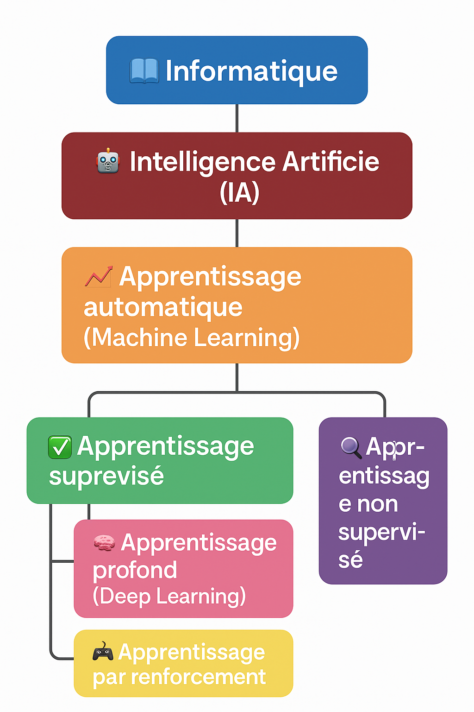{ width=60% }

!!! note "Et le *deep learning* dans tout ça ?"
    Le **deep learning** (apprentissage profond) est une **famille de techniques** à l'intérieur du ML, qui utilise des **réseaux de neurones artificiels**. Il excelle sur les images, le son, le langage. Mais ce n'est **pas la seule technique** : $k$-NN, que nous étudions ici, est plus simple, plus ancien, et reste utilisé.

### <span style="color:green;">1.3 Où se situe $k$-NN ?</span>

$k$-NN est un algorithme **d'apprentissage supervisé** servant à **classer** une nouvelle donnée parmi des catégories connues à l'avance.

!!! success "Principe en une phrase"
    Pour classer un nouvel élément, on regarde **les $k$ exemples connus qui lui ressemblent le plus**, et on lui attribue la **classe majoritaire** parmi ces voisins.

!!! abstract => **CAPYTALE : le code vous sera fourni par votre enseignant.**

## <span style="color:blue;">2. L'intuition avant le code — activité débranchée</span>

Avant d'écrire la moindre ligne de Python, **mettons-nous dans la peau de l'algorithme**.

!!! question "Activité 1 — Le marché aux fruits"
    Voici un panier d'exemples connus, décrits par deux caractéristiques :

    | Fruit | Diamètre (cm) | Couleur (rouge=0 → vert=10) | Étiquette |
    |---|---|---|---|
    | A | 8 | 1 | pomme |
    | B | 7 | 2 | pomme |
    | C | 9 | 0 | pomme |
    | D | 4 | 8 | citron |
    | E | 5 | 9 | citron |
    | F | 4 | 7 | citron |
    | G | 12 | 5 | melon |
    | H | 14 | 6 | melon |
    | I | 13 | 4 | melon |

    **Étape 1 — Observer les données.** En plaçant les 9 fruits dans un repère (diamètre en abscisse, couleur en ordonnée), on obtient :

    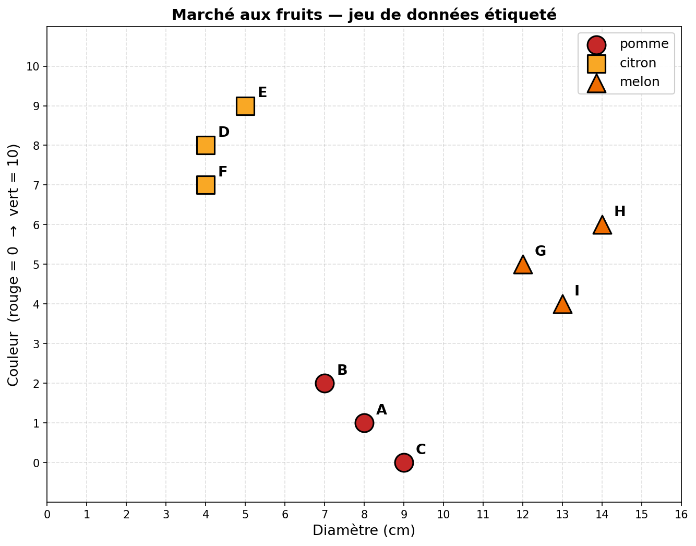{ width=80% }

    1. Combien de **groupes** distincts identifiez-vous ? Quelles caractéristiques les séparent ?

    **Étape 2 — Classer un fruit mystère.** On vous présente un **fruit mystère** dont on connaît seulement le diamètre (6 cm) et la couleur (2). Il est représenté par l'étoile violette :

    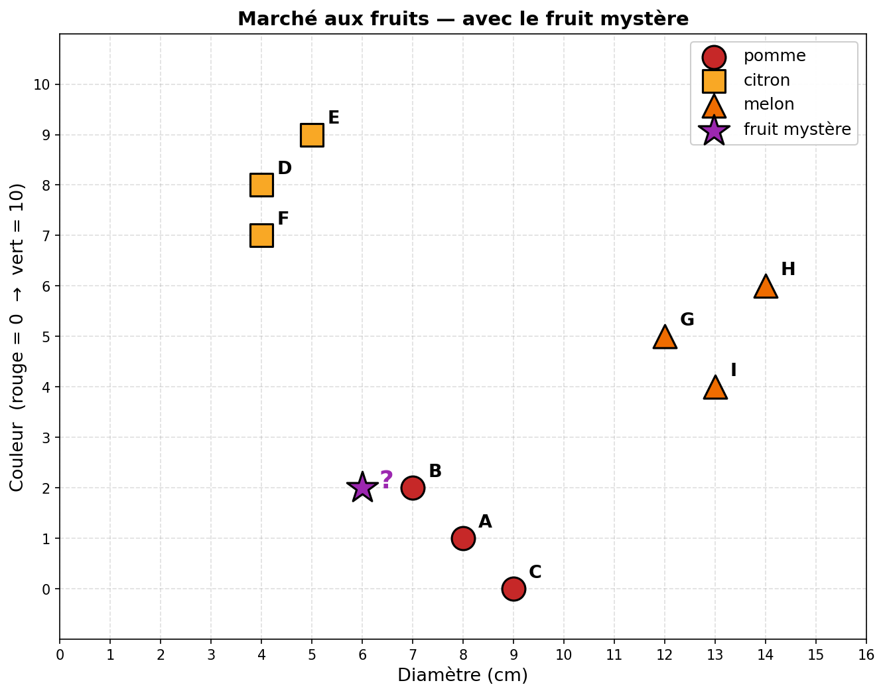{ width=80% }

    2. **Sans calculer**, à l'œil, lequel des 9 fruits semble le plus proche du mystère ? Quelle serait votre réponse pour $k=1$ ?
    3. Et pour $k=3$ ? Quels sont les 3 fruits les plus proches ? Comment décidez-vous ?
    4. Que se passe-t-il si on vous demande pour $k=4$ et que les 4 voisins sont 2 pommes et 2 citrons ? Comment trancher ?

!!! tip "Ce que cette activité a déjà montré"
    Sans le savoir, vous venez d'exécuter **l'algorithme $k$-NN** :

    1. **Représenter** les données dans un espace (le quadrillage) ;
    2. **Mesurer** la proximité (à l'œil, mais on peut formaliser) ;
    3. **Trier** pour garder les $k$ plus proches ;
    4. **Voter** à la majorité.

    Toute la suite du chapitre consiste à **automatiser chacune de ces étapes** en Python.


## <span style="color:blue;">3. Mesurer la proximité : la notion de distance</span>

### <span style="color:green;">3.1 Trois distances usuelles</span>

Soient deux points $P_1 = (x_1, y_1)$ et $P_2 = (x_2, y_2)$. On peut mesurer leur écart de plusieurs façons :

| Distance | Formule | Image mentale |
|---|---|---|
| **Euclidienne** | $\sqrt{(x_1-x_2)^2 + (y_1-y_2)^2}$ | « à vol d'oiseau » |
| **Manhattan** | $\lvert x_1-x_2\rvert + \lvert y_1-y_2\rvert$ | en taxi dans New York, on suit la grille |
| **Tchebychev** | $\max(\lvert x_1-x_2\rvert, \lvert y_1-y_2\rvert)$ | le déplacement du roi aux échecs |

!!! note "Pourquoi plusieurs distances ?"
    Selon le problème, certaines distances sont plus pertinentes que d'autres. Par exemple, pour mesurer combien deux mots se ressemblent, ni l'euclidienne ni Manhattan n'ont de sens : on utilise plutôt la **distance de Hamming** (cf. exercice 1).

### <span style="color:green;">3.2 Implémentation en Python</span>

!!! question "Activité 2 — Programmer les trois distances"
    Implémentez les trois distances comme des fonctions Python.

    ```python
    from math import sqrt

    def distance_euclidienne(x1, y1, x2, y2):
        """Renvoie la distance euclidienne entre deux points."""
        return sqrt((x1 - x2)**2 + (y1 - y2)**2)

    def distance_manhattan(x1, y1, x2, y2):
        """Renvoie la distance de Manhattan entre deux points."""
        return abs(x1 - x2) + abs(y1 - y2)

    def distance_tchebychev(x1, y1, x2, y2):
        """Renvoie la distance de Tchebychev entre deux points."""
        return max(abs(x1 - x2), abs(y1 - y2))

    # Tests
    assert distance_euclidienne(4, 0, 1, 4) == 5.0
    assert distance_manhattan(4, 0, 1, 4) == 7
    assert distance_tchebychev(4, 0, 1, 4) == 4
    ```

    **À vous :** Testez avec les deux point  (0,0) et (3,4)

    La distance euclidienne entre $(0, 0)$ et $(3, 4)$ vaut-elle 5, 7 ou 12 ? Et la distance de Manhattan ? Et celle de Tchebychev ?

    ??? success "Réponse"

        Euclidienne = $\sqrt{9 + 16} = 5$. Manhattan = $3 + 4 = 7$. Tchebychev = $\max(3, 4) = 4$.


## <span style="color:blue;">4. Construire l'algorithme $k$-NN, étape par étape</span>

Nous allons maintenant **construire l'algorithme** en Python, en commençant par le cas le plus simple ($k=1$), puis en généralisant.

### <span style="color:green;">4.1 Représenter un jeu de données</span>

!!! question "Activité 3 — Générer des points aléatoires"
    ```python
    from random import randint

    xmin, xmax = -20, 20
    ymin, ymax = -20, 20

    def genere_liste_points(nbmin, nbmax):
        """Génère une liste aléatoire de points (x, y)."""
        nb_points = randint(nbmin, nbmax)
        return [(randint(xmin, xmax), randint(ymin, ymax)) for _ in range(nb_points)]

    # Test
    print(genere_liste_points(5, 15))
    ```

!!! question "Activité 4 — Visualiser avec Matplotlib"
    ```python
    import matplotlib.pyplot as plt

    # Données de deux classes
    x1, y1 = [1, 3, 8, 13], [28, 27.2, 37.6, 40.7]    # classe 1
    x2, y2 = [2, 3, 10, 15], [30, 26, 39, 35.5]       # classe 2

    plt.axis([0, 15, 0, 50])
    plt.xlabel('Caractéristique 1')
    plt.ylabel('Caractéristique 2')
    plt.title('Représentation des deux classes')
    plt.scatter(x1, y1, label='Classe 1', color='red')
    plt.scatter(x2, y2, label='Classe 2', color='blue')
    plt.legend()
    plt.grid()
    plt.show()
    ```

### <span style="color:green;">4.2 Cas particulier : $k = 1$, le plus proche voisin</span>

C'est l'algorithme à $k=1$ : on classe le point cible **comme son unique voisin le plus proche**.

!!! question "Activité 5 — Trouver le plus proche voisin"
    ```python
    def plus_proche_voisin(liste_points, x, y):
        """
        Renvoie le point de liste_points le plus proche de (x, y),
        au sens de la distance euclidienne.
        """
        # Initialisation
        point_le_plus_proche = None
        distance_minimale = float('inf')

        # Parcours
        for (x_p, y_p) in liste_points:
            d = distance_euclidienne(x, y, x_p, y_p)
            if d < distance_minimale:
                distance_minimale = d
                point_le_plus_proche = (x_p, y_p)

        return point_le_plus_proche

    # Test
    liste = genere_liste_points(5, 15)
    cible = (5, 5)
    print("Point le plus proche de", cible, ":", plus_proche_voisin(liste, *cible))
    ```

!!! tip "Coût de cet algorithme"
    On parcourt **chaque point une seule fois** : le coût est **linéaire** en $n$ (le nombre de points). Si on a 10 000 exemples, on fait 10 000 calculs de distance. C'est encore raisonnable.

### <span style="color:green;">4.3 Généralisation : les $k$ plus proches voisins</span>

On veut maintenant non pas **le** plus proche, mais les **$k$ plus proches**.

#### <span style="color:magenta;">Étapes de l'algorithme</span>

1. Pour chaque exemple connu, **calculer la distance** à la cible.
2. **Trier** les exemples par distance croissante.
3. **Garder les $k$ premiers** (les plus proches).
4. **Voter** : prendre la classe **majoritaire** parmi ces $k$ voisins.
5. **Attribuer** cette classe à la cible.

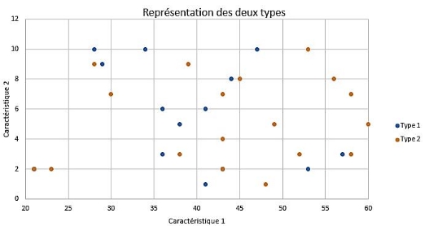

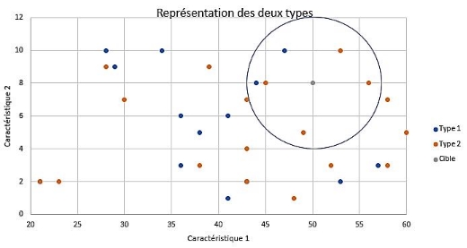

#### <span style="color:magenta;">Préconditions</span>

!!! info "Pour utiliser $k$-NN, il faut :"
    - un **jeu de données étiquetées** (chaque exemple a une classe connue) ;
    - une **donnée cible** dont on veut déterminer la classe ;
    - une **valeur de $k$** ;
    - une **distance** choisie.

### <span style="color:green;">4.4 Étudier l'influence de $k$ et de la distance</span>

!!! question "Activité 6 — Influence de $k$"
    On observe les 6 plus proches voisins d'une cible. Parmi ces 6, il y a 4 points rouges (classe 2) et 2 points bleus (classe 1).

    **Question :** à quelle classe la cible est-elle attribuée ?

    ??? success "Réponse"
        À la **classe 2** (rouge), car c'est la classe majoritaire parmi les 6 voisins.


!!! question "Activité 7 — Exemple 1 : $k = 4$"
    Une cible a pour caractéristiques $(50, 8)$ et on choisit $k = 4$. On trace un cercle englobant les 4 voisins les plus proches.

    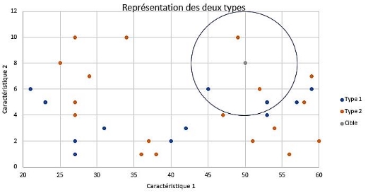

    1. Quelle est la classe majoritaire ?
    2. Quelle valeur de $k$ donnerait une classification plus fiable ?

!!! question "Activité 8 — Exemple 2 : et si une caractéristique disparaît ?"
    On fixe $k = 10$, mais cette fois **on n'utilise que la deuxième caractéristique** (la première est ignorée).

    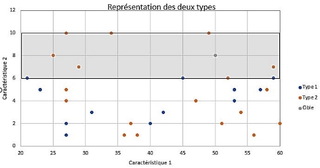

    1. La décision change-t-elle ?

    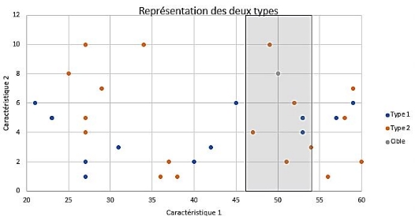

    2\. Et si on prend $k = 7$ avec uniquement la première caractéristique ?

    !!! tip "Ce que cet exemple révèle"
        Le choix des **caractéristiques** retenues est aussi important que le choix de $k$. Garder une seule caractéristique revient à projeter les points sur un axe : on perd de l'information.


## <span style="color:blue;">5. Étude de cas : le jeu de données *Iris*</span>

!!! note "Petite histoire"
    En **1936**, le biologiste **Edgar Anderson** a mesuré méticuleusement 150 fleurs de trois espèces d'iris : *setosa*, *virginica* et *versicolor*. La même année, le statisticien **Ronald Fisher** s'est servi de ces données pour mettre au point une des premières méthodes statistiques de classification. Depuis, le **jeu de données Iris** est devenu un grand classique de l'apprentissage automatique : tous les étudiants en data science y passent. Vous aussi.


*iris setosa*


*iris virginica*


*iris versicolor*

Par souci de simplification, on n'étudiera ici que :

- la **longueur** des pétales ;
- la **largeur** des pétales ;
- l'**espèce** (codée : 0 = setosa, 1 = virginica, 2 = versicolor).


!!! question "Activité 9 — Visualiser le jeu Iris"
    ```python
    import pandas as pd
    import matplotlib.pyplot as plt

    iris = pd.read_csv("iris.csv")
    x = iris["petal_length"]
    y = iris["petal_width"]
    lab = iris["species"]

    plt.scatter(x[lab == 0], y[lab == 0], color='g', label='setosa')
    plt.scatter(x[lab == 1], y[lab == 1], color='r', label='virginica')
    plt.scatter(x[lab == 2], y[lab == 2], color='b', label='versicolor')
    plt.xlabel("Longueur du pétale (cm)")
    plt.ylabel("Largeur du pétale (cm)")
    plt.legend()
    plt.show()
    ```

    **Observation attendue :** les trois espèces forment trois nuages relativement distincts.

    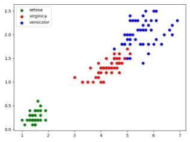

!!! question "Activité 10 — Une cible facile"
    On ajoute une cible : pétale de **2 cm de long** et **0,5 cm de large**. Ajouter avant `plt.legend()` :
    ```python
    plt.scatter(2.0, 0.5, color='k')
    ```
    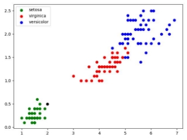

    **À l'œil :** quelle espèce ? 

!!! question "Activité 11 — Une cible plus difficile"
    On change la cible : pétale de **2,5 cm de long** et **0,75 cm de large**.

    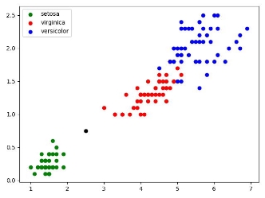

    **À l'œil :** difficile de trancher. On va laisser l'algorithme $k$-NN décider à notre place.

    **Application manuelle pour $k = 3$.** Calculons (à la main, ou avec votre fonction `distance_euclidienne` de l'Activité 2) la distance entre la cible $(2{,}5\,;\,0{,}75)$ et quelques iris du jeu de données :

    | Iris (long., larg.) | Espèce | Distance euclidienne à la cible |
    |---|---|---|
    | $(1{,}4\,;\,0{,}2)$ | setosa | $\sqrt{1{,}1^2 + 0{,}55^2} \approx 1{,}23$ |
    | $(1{,}5\,;\,0{,}2)$ | setosa | $\sqrt{1^2 + 0{,}55^2} \approx 1{,}14$ |
    | $(1{,}6\,;\,0{,}2)$ | setosa | $\sqrt{0{,}9^2 + 0{,}55^2} \approx 1{,}05$ |
    | $(4{,}5\,;\,1{,}5)$ | versicolor | $\sqrt{2^2 + 0{,}75^2} \approx 2{,}14$ |
    | $(5{,}0\,;\,1{,}9)$ | virginica | $\sqrt{2{,}5^2 + 1{,}15^2} \approx 2{,}75$ |

    Les **3 plus proches voisins** sont tous des ...? 

    

    **Résultat :** l'espèce inconnue est classée ...?


## <span style="color:blue;">6. Industrialiser : utilisation de scikit-learn</span>

Réécrire $k$-NN à la main est utile pour **comprendre**, mais en pratique on utilise des bibliothèques optimisées. **scikit-learn** est la référence en Python.

!!! question "Activité 12 — k-NN avec scikit-learn"
    ```python
    import pandas
    import matplotlib.pyplot as plt
    from sklearn.neighbors import KNeighborsClassifier

    # Chargement du jeu de données
    iris = pandas.read_csv("iris.csv")
    x = iris.loc[:, "petal_length"]
    y = iris.loc[:, "petal_width"]
    lab = iris.loc[:, "species"]

    # Valeurs de la cible
    longueur = 2.5
    largeur = 0.75
    k = 3

    # Affichage
    plt.scatter(x[lab == 0], y[lab == 0], color='g', label='setosa')
    plt.scatter(x[lab == 1], y[lab == 1], color='r', label='virginica')
    plt.scatter(x[lab == 2], y[lab == 2], color='b', label='versicolor')
    plt.scatter(longueur, largeur, color='k')
    plt.legend()

    # Algorithme k-NN
    d = list(zip(x, y))
    model = KNeighborsClassifier(n_neighbors=k)
    model.fit(d, lab)
    prediction = model.predict([[longueur, largeur]])

    # Résultat
    txt = "Résultat : "
    if prediction[0] == 0:
        txt += "setosa"
    elif prediction[0] == 1:
        txt += "virginica"
    else:
        txt += "versicolor"

    plt.text(3, 0.5, f"largeur : {largeur} cm longueur : {longueur} cm", fontsize=12)
    plt.text(3, 0.3, f"k : {k}", fontsize=12)
    plt.text(3, 0.1, txt, fontsize=12)
    plt.show()
    ```

    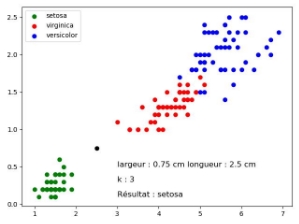

    ??? success "Décodage du code scikit-learn"

        ```python
        d = list(zip(x, y))
        ```
        On passe d'un format en **deux listes parallèles** :
        ```python
        x = [1.4, 1.4, 1.3, 1.5, ...]
        y = [0.2, 0.2, 0.2, 0.2, ...]
        ```
        à une **liste de tuples** (coordonnées) :
        ```python
        d = [(1.4, 0.2), (1.4, 0.2), (1.3, 0.2), (1.5, 0.2), ...]
        ```

        | Ligne | Rôle |
        |---|---|
        | `KNeighborsClassifier(n_neighbors=k)` | crée un modèle $k$-NN avec $k$ voisins |
        | `model.fit(d, lab)` | « entraîne » le modèle (ici, mémorise les exemples étiquetés) |
        | `model.predict([[longueur, largeur]])` | prédit la classe de la cible |

        !!! warning "Attention"
            `prediction` est une **liste à un seul élément** : on accède au résultat par `prediction[0]`.

!!! question "Activité 13 — Faire varier $k$ : cas d'une cible-frontière"
    La cible précédente $(2{,}5\,;\,0{,}75)$ est en plein milieu du nuage *setosa* : quelle que soit la valeur de $k$, la prédiction reste *setosa*. C'est rassurant, mais peu instructif.

    **À vous :** modifiez le code pour tester une **cible située près de la frontière** entre deux espèces, par exemple :
    ```python
    longueur = 4.8
    largeur = 1.6
    ```

    Faites varier $k = 1$, $3$, $5$, $11$, $21$ et complétez le tableau :

    | $k$ | Prédiction |
    |---|---|
    | 1 | ? |
    | 3 | ? |
    | 5 | ? |
    | 11 | ? |
    | 21 | ? |

    **Questions :**

    1. La prédiction change-t-elle selon $k$ ? Pourquoi ?
    2. Quelle valeur de $k$ vous semble la plus raisonnable ici ? Justifiez.


## <span style="color:blue;">7. Esprit critique : forces, limites, pièges de $k$-NN</span>

!!! danger "À lire absolument avant le DST"
    Cette section vous prépare aux questions de raisonnement, où on ne vous demande pas seulement *d'appliquer* l'algorithme, mais *d'analyser* ses choix.

### <span style="color:green;">7.1 Les forces</span>

- **Simplicité conceptuelle.** L'algorithme tient en 5 étapes.
- **Pas d'entraînement coûteux.** On dit que $k$-NN est un *lazy learner* : il ne « calcule un modèle » que lorsqu'on lui pose une question.
- **Polyvalent.** Tout jeu de données numérique peut s'y prêter, dès qu'on définit une distance.

### <span style="color:green;">7.2 Les limites et les pièges</span>

#### <span style="color:magenta;">Piège n° 1 — Le choix de $k$</span>

| Si $k$ est… | Conséquence |
|---|---|
| **trop petit** ($k=1$) | algorithme **sensible au bruit** : un seul point aberrant suffit à mal classer |
| **trop grand** | la décision **lisse** trop, on perd les distinctions fines |
| **pair** | possibilité d'**égalité** entre deux classes — comment trancher ? |

!!! tip "Astuce pratique"
    En pratique, on prend souvent un **$k$ impair** pour éviter les égalités sur deux classes.

#### <span style="color:magenta;">Piège n° 2 — L'échelle des caractéristiques</span>

Imaginez un jeu de données où l'on classe des personnes selon :

- leur **taille en mètres** (ex : 1,75) ;
- leur **salaire mensuel en euros** (ex : 2 400).

Quel est l'écart « dominant » dans le calcul de la distance euclidienne ?

!!! warning "Le salaire écrase la taille"
    Avec une distance euclidienne brute, la composante « salaire » (en milliers) domine totalement la composante « taille » (en unités). Deux personnes de tailles très différentes mais de salaires identiques seront jugées **très proches**.

    **Solution :** **normaliser** les caractéristiques (les ramener par exemple sur $[0, 1]$) avant d'appliquer $k$-NN. 

#### <span style="color:magenta;">Piège n° 3 — Le coût</span>

Pour **chaque** nouvelle prédiction, $k$-NN calcule la distance à **tous** les exemples du jeu d'entraînement. Coût : $O(n)$ par prédiction.

- 1 000 exemples → rapide ;
- 1 000 000 exemples → lent ;
- Cas d'un site qui doit classer **un million de requêtes par seconde** → impossible tel quel.

#### <span style="color:magenta;">Piège n° 4 — La qualité des données</span>

!!! quote ""
    *Garbage in, garbage out.*

Si le jeu d'exemples est :

- **biaisé** (sous-représentation d'une classe),
- **bruité** (étiquettes erronées),
- **non représentatif** du monde réel,

…alors les prédictions de $k$-NN seront mauvaises, sans qu'il y ait un « bug » dans le code. C'est un enjeu **éthique** majeur de l'IA contemporaine.

### <span style="color:green;">7.3 À retenir</span>

!!! success "Synthèse 'esprit critique'"
    Un bon utilisateur de $k$-NN :

    1. **Choisit $k$** avec soin (souvent impair, ajusté par essais) ;
    2. **Normalise** les caractéristiques quand elles sont d'échelles très différentes ;
    3. **Vérifie la qualité** et la **représentativité** du jeu de données ;
    4. **Mesure le coût** pour les grands jeux de données.


## <span style="color:blue;">8. Synthèse : ce qu'il faut retenir</span>

!!! abstract "L'essentiel en une page"

    **Famille.** $k$-NN est un algorithme d'**apprentissage supervisé** servant à **classer** une nouvelle donnée.

    **Principe (5 étapes).**

    1. Calculer la **distance** de la cible à chaque exemple étiqueté.
    2. **Trier** par distance croissante.
    3. Garder les **$k$ plus proches**.
    4. Identifier la **classe majoritaire** parmi ces voisins.
    5. **Attribuer** cette classe à la cible.

    **Ingrédients indispensables.** Un jeu de données étiqueté, une distance, une valeur de $k$.

    **Distances usuelles.**

    - Euclidienne : $\sqrt{(x_1-x_2)^2 + (y_1-y_2)^2}$
    - Manhattan : $\lvert x_1-x_2\rvert + \lvert y_1-y_2\rvert$
    - Tchebychev : $\max(\lvert x_1-x_2\rvert, \lvert y_1-y_2\rvert)$
    - Hamming (pour les chaînes) : nombre de positions où les caractères diffèrent.

    **Limites.** Sensible à $k$, à l'échelle des caractéristiques, au coût (linéaire par prédiction) et à la qualité des données.

    **Vocabulaire.** classe / étiquette / label, jeu de données, cible, $k$, distance, apprentissage supervisé, *lazy learner*.

!!! tip "Retour à l'énigme Pl@ntNet"
    Vous connaissez maintenant le principe que des applications comme **Pl@ntNet** exploitent à grande échelle : comparer une photo nouvelle aux exemples étiquetés les plus proches. En pratique, Pl@ntNet n'utilise évidemment pas la distance euclidienne sur les pixels bruts (ce serait trop naïf) : il combine $k$-NN avec des techniques de *deep learning* qui extraient des caractéristiques pertinentes (forme des feuilles, nervures, contours). Mais le **squelette de la décision** reste celui que vous venez d'apprendre.


## <span style="color:blue;">9. Auto-évaluation</span>

!!! question "QCM rapide — vérifiez vos acquis"

    **Q1.** $k$-NN est un algorithme :

    1. d'apprentissage non supervisé ;
    2. d'apprentissage supervisé ;
    3. d'apprentissage par renforcement.

    ??? success "Réponse Q1"
        **2.** Apprentissage supervisé : les exemples sont **étiquetés**.

    **Q2.** Dans $k$-NN, à quoi sert l'étape de vote majoritaire ?

    1. À trier les exemples par ordre alphabétique.
    2. À choisir la valeur de $k$.
    3. À attribuer à la cible la classe la plus représentée parmi ses $k$ voisins.

    ??? success "Réponse Q2"
        **3.**

    **Q3.** On classe un point en 2D avec $k = 5$. Parmi les 5 voisins : 3 rouges et 2 bleus. Quelle classe est attribuée ?

    ??? success "Réponse Q3"
        **Rouge** (majoritaire, 3 > 2).

    **Q4.** Pourquoi $k = 1$ est-il généralement risqué ?

    ??? success "Réponse Q4"
        Parce qu'un **seul point aberrant** (mal étiqueté, ou très atypique) suffit à fausser la classification de la cible. L'algorithme est **très sensible au bruit**.

    **Q5.** Pourquoi prend-on souvent $k$ **impair** ?

    ??? success "Réponse Q5"
        Pour **éviter les égalités** dans le vote majoritaire à deux classes.

    **Q6.** La distance euclidienne entre $(1, 1)$ et $(4, 5)$ vaut :

    1. 7
    2. 5
    3. 25

    ??? success "Réponse Q6"
        **2.** $\sqrt{(4-1)^2 + (5-1)^2} = \sqrt{9 + 16} = \sqrt{25} = 5$.

    **Q7.** Vrai ou faux : *« $k$-NN nécessite un long entraînement avant de pouvoir prédire. »*

    ??? success "Réponse Q7"
        **Faux.** $k$-NN est un *lazy learner* : il ne fait quasiment rien à l'« entraînement » (il mémorise). Tout le coût est dans la **prédiction**.

    **Q8.** Quel est le coût (en nombre de calculs de distance) d'une prédiction $k$-NN sur un jeu de $n$ exemples ?

    1. constant
    2. linéaire en $n$
    3. quadratique en $n$

    ??? success "Réponse Q8"
        **2. Linéaire.** On calcule **une** distance par exemple connu.


## <span style="color:blue;">10. Exercices</span>

!!! abstract "Exercice 1 — Distance de Hamming"
    On appelle [distance de Hamming](https://fr.wikipedia.org/wiki/Distance_de_Hamming) entre deux chaînes de caractères $A$ et $B$ de même longueur le **nombre d'indices $i$** tels que $A[i] \neq B[i]$.

    Exemples :

    - `distance('ami', 'amu') = 1`
    - `distance('don', 'bon') = 1`
    - `distance('zozo', 'bobo') = 2`

    **Travail à faire :** écrire une fonction Python qui prend deux chaînes de même longueur et renvoie leur distance de Hamming.

    Tests :
    ```python
    if __name__ == '__main__':
        assert hamming('abri', 'ubri') == 1
        assert hamming('010101', '010110') == 2
    ```

!!! abstract "Exercice 2 — k-NN avec la distance de Manhattan"
    Voici un programme déjà rédigé. Lisez-le, exécutez-le, puis répondez aux questions.

    ```python
    from math import sqrt
    import matplotlib.pyplot as plt

    # Données de classe 1
    liste_x_1 = [1, 3, 8, 13]
    liste_y_1 = [28, 27.2, 37.6, 40.7]

    # Données de classe 2
    liste_x_2 = [2, 3, 10, 15]
    liste_y_2 = [30, 26, 39, 35.5]

    plt.axis('equal')
    plt.xlabel('Caractéristique 1')
    plt.ylabel('Caractéristique 2')
    plt.title('Représentation des deux classes')
    plt.grid()
    plt.scatter(liste_x_1, liste_y_1, label='classe 1')
    plt.scatter(liste_x_2, liste_y_2, label='classe 2')
    plt.scatter(7, 28.4, label='cible')
    plt.legend()
    plt.show()

    table = [['t1', 1, 28], ['t1', 3, 27.2], ['t1', 8, 37.6], ['t1', 13, 40.7],
             ['t2', 2, 30], ['t2', 3, 26], ['t2', 10, 39], ['t2', 15, 35.5]]
    cible = [7, 28.4]
    k = 3

    def k_plus_proches_voisins(table, cible, k):
        """Renvoie la liste des k plus proches voisins de la cible."""

        def distance_cible(donnee):
            """Distance de Manhattan entre une donnée et la cible."""
            return abs(donnee[1] - cible[0]) + abs(donnee[2] - cible[1])

        table_triee = sorted(table, key=distance_cible)
        return table_triee[:k]

    print("Les", k, "plus proches voisins de la cible :",
          k_plus_proches_voisins(table, cible, k))
    ```

    **Questions :**

    1. Affichez le résultat. Quelle est la classe majoritaire de la cible ?
    2. Quelle est la valeur de $k$ ?
    3. Quelle distance est utilisée ?
    4. Essayez d'autres valeurs de $k$. Le résultat change-t-il ?
    5. Programmez la distance de **Tchebychev** et remplacez. Quel est l'effet ?

!!! abstract "Exercice 3 — Application : archéologie de la Grande Guerre"
    Sur un champ de bataille de la Première Guerre mondiale, un mémorial doit être agrandi. L'**INRAP** (Institut national de recherches archéologiques préventives) mène des fouilles préventives. Différents objets et éléments de squelettes sont trouvés, et l'étude permet d'identifier la nationalité de la plupart d'entre eux : **allemande**, **anglaise** ou **française**.

    Le plan ci-dessous représente la zone, l'unité est le mètre.

    Un élément d'un squelette est retrouvé en $(10, 4)$ — représenté par un losange magenta. L'objectif est de **déterminer une origine probable** pour cet élément avant son dépôt dans un ossuaire.

    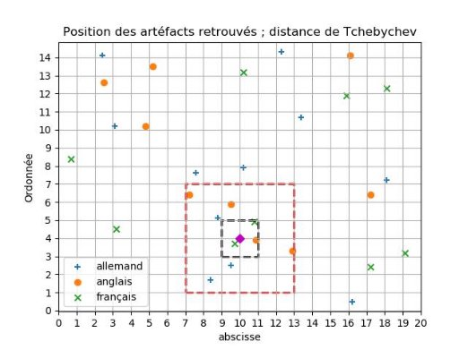

    On utilise la **distance de Tchebychev**. Rappel utile : l'ensemble des points à distance $r$ d'un point $I$ forme le **contour d'un carré** de centre $I$, de côtés parallèles aux axes, et de longueur $2r$.

    Sur le graphique :

    - le carré **rouge** = ensemble des points à 3 m ;
    - le carré **noir** = ensemble des points à 1 m.

    **Questions :**

    1. À quelle valeur de $k$ correspond le carré noir ?
    2. Quelle serait l'origine du squelette pour cette valeur de $k$ ?
    3. Pour $k = 9$, quelle origine ?
    4. Pour $k = 11$, quelle origine ?
    5. En prenant une valeur de $k$ inférieure ou égale à 11, peut-on déterminer **avec certitude** si ce combattant appartenait à la **Triple-Entente** (France + Royaume-Uni + Russie) ou à la **Triple-Alliance** (Allemagne + Autriche-Hongrie + Italie) ?


---

## Annexe — Lecture et écriture de fichiers (prérequis pour le problème ci-dessous)

**Cette partie ne peux pas se faire sur Capytale**

!!! info "À quoi sert cette annexe ?"
    Le **problème d'analyse de texte** ci-après a besoin de **lire un fichier `.txt`** et d'y **écrire des résultats**. Cette annexe rappelle les opérations Python correspondantes. Vous pouvez la consulter au moment où vous en avez besoin.

### A.1 Écriture dans un fichier

#### <span style="color:magenta;">Mode `'w'` (write)</span>

!!! question "Activité 14 — Création, ouverture et écriture"
    ```python
    # coding=utf-8
    # script lecture.py

    nom_fichier = 'test.txt'
    # Création/ouverture en mode 'w' (write) : écrase si le fichier existe déjà
    fichier = open(nom_fichier, 'w')
    fichier.write('Bonjour à tous !')
    fichier.close()
    ```

    Enregistrez le script dans *Documents*, lancez-le, puis ouvrez `test.txt`.

    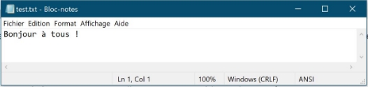

#### <span style="color:magenta;">Mode `'a'` (append)</span>

!!! question "Activité 15 — Ajout à la fin d'un fichier"
    ```python
    # coding=utf-8
    fichier = open('test.txt', 'a')
    fichier.write('\nUne deuxième ligne.\n')
    fichier.write('abc\tABC\t123\n')
    fichier.write(str(126.85) + '\n')
    fichier.write('\x31\x41\x61\n')   # '1Aa' en code ASCII
    fichier.write(chr(0x62) + '\n')   # 'b' en code ASCII
    fichier.write(chr(99))            # 'c' en code ASCII
    fichier.close()
    ```

    Enregistrez, lancez, ouvrez `test.txt`.

    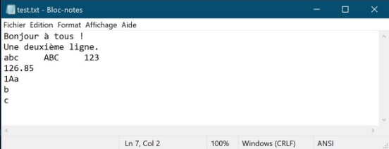

### A.2 Lecture dans un fichier

#### <span style="color:magenta;">Lecture brute</span>

!!! question "Activité 16 — Lecture en mode texte"
    ```python
    # coding=utf-8
    fichier = open('test.txt', 'r')
    chaine = fichier.read()
    print('Contenu du fichier :\n' + chaine)
    fichier.close()
    ```

#### <span style="color:magenta;">Lecture ligne par ligne (`readlines`)</span>

!!! question "Activité 17 — Récupérer les lignes sous forme de liste"
    `readlines()` renvoie une **liste** dont chaque élément est une ligne du fichier.
    ```python
    # coding=utf-8
    fichier = open('test.txt', 'r')
    liste = fichier.readlines()
    fichier.close()
    ```

#### <span style="color:magenta;">Modifier puis réécrire</span>

!!! question "Activité 18 — Insérer une ligne"
    `insert(i, x)` insère `x` à l'indice `i` d'une liste, puis `writelines()` écrit une liste de chaînes dans un fichier (une chaîne = une ligne).
    ```python
    # coding=utf-8
    fichier = open('test.txt', 'r')
    liste = fichier.readlines()
    fichier.close()

    phrase = "Je suis en NSI !\n"   # ne pas oublier le \n
    liste.insert(2, phrase)          # insertion en 3ᵉ position (indice 2)

    fichier = open('test.txt', 'w')  # mode 'w' : on écrase
    fichier.writelines(liste)
    fichier.close()
    ```

### A.3 Problème — Analyse de texte

!!! abstract "Problème — Analyse de texte avec $k$-NN"

    => **CAPYTALE : le code vous sera fourni par votre enseignant.**

    Suivez les indications du fichier `knn_analyse_texte_eleve.py`.
