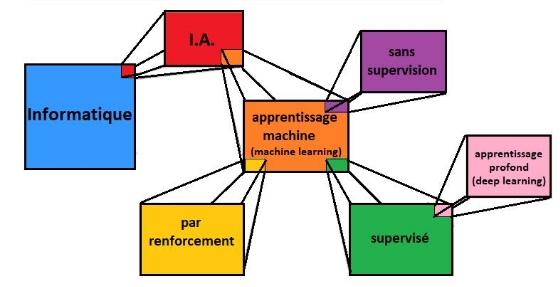
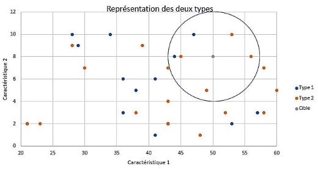
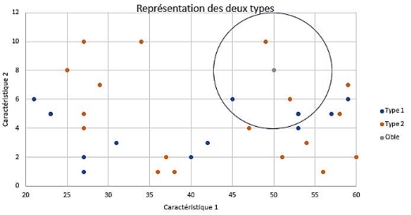
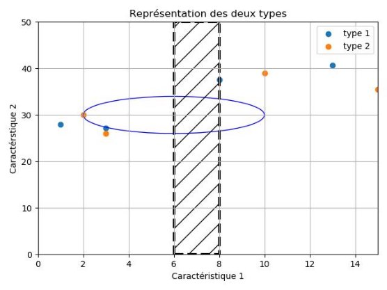
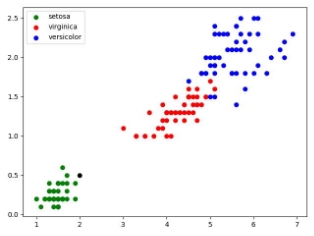
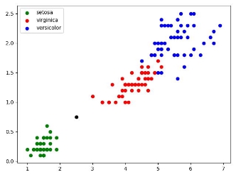
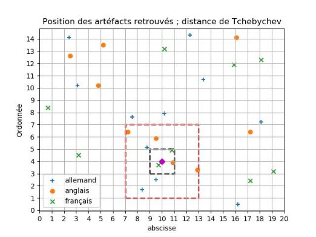

**Table des matières** 

1. [**ALGORITHMES DES K PLUS PROCHES VOISINS (K NEAREST NEIGHBORS : K-NN)**](#_page0_x61.00_y296.92)
2. [**EXERCICES**](#_page12_x40.00_y36.92)
3. [**PROBLEME : ANALYSE DE TEXTE**](#_page14_x40.00_y36.92)

## <H2 STYLE="COLOR:BLUE;"> **1. Algorithmes<a name="_page0_x61.00_y296.92"></a> des k plus proches voisins (k Nearest Neighbors : k-NN)** </H2>
### <H3 STYLE="COLOR:GREEN;"> **1.1. Le<a name="_page0_x40.00_y318.92"></a> machine learning** </H3>

**L’apprentissage  machine**  (ou  apprentissage  automatique)  consiste  en  des  programmes  capables  de **modifier leur comportement à des données.**  

- On fournit à une machine un très grand nombre de données.  
- À partir de ces données, la machine s’entraîne (**phase d’apprentissage ou d’entraînement**) pour définir son comportement ultérieur (**phase d’inférence**).  
- Il exploite des **méthodes mathématiques** qui, à partir du repérage de tendances (corrélations, similarités) sur de très grandes quantités de données (**Big Data**), permettent de faire des **prédictions ou de prendre des décisions** sur d’autres données. 

Il y a trois catégories d’apprentissage machine : 

- **Avec supervision** : les opérateurs donnent à l’ordinateur des **exemples d’entrées et les sorties souhaitées**,  et  l’ordinateur  recherche  les  **solutions  par  modélisation  prédictive**.  Il  existe  de nombreux algorithmes qui entrent dans cette catégorie : **méthode du k plus proche voisin**, **la régression linéaire**, **les arbres décisionnels**… Cette catégorie est par exemple utilisée dans les prévisions météorologiques.  

Le **deep learning** (apprentissage profond) est une des méthodes d’apprentissage supervisé. Les sorties de chaque module servent d’entrée aux suivants. On parle alors de réseaux de neurones artificiels. 

- **Sans supervision** : l’algorithme est **laissé à lui-même**, alors qu’on lui fournit un grand nombre de données  non  étiquetées.  La  machine  y  repère  des  corrélations  pour  construire  elle-même  son algorithme de classification. Par exemple, l’algorithme de **reconnaissance faciale de Facebook** qui identifie les personnes sur les photos est un exemple d’apprentissage machine sans supervision. 
- **Par renforcement** : un programme informatique interagit avec un environnement dynamique dans lequel il doit atteindre un but. Le programme-apprenti reçoit **des récompenses ou des punitions** pendant qu’il navigue dans l’espace du problème et qu’il apprend à identifier le comportement le plus efficace. C’est ce type d’apprentissage qui a permis au programme Alpha Zero de Google de battre le champion de jeu de go Lee Sedol en 2016. 



### <H3 STYLE="COLOR:GREEN;"> **1.2. Le<a name="_page1_x40.00_y258.92"></a> principe de l’algorithme k-NN** </H3>

**L’algorithme k-NN** est un **apprentissage supervisé.** A partir d’un ensemble de données labellisées, il sera possible de **classer** (déterminer le label) d’une nouvelle donnée. 

Il est par exemple utilisé par des entreprises d’Internet comme Amazon, Netflix, Spotify ou iTunes afin de prévoir si on est intéressé ou non par un produit. 


Voici le principe de l’algorithme des k plus proches voisins : 

- On calcule les distances entre la donnée à classer *u* et chaque donnée appartenant à l’ensemble E des données à l’aide de la fonction d . 
- On retient les k données du jeu de données E, les plus proches de la donnée *u* à classer. 
- On attribue à *u* la classe qui est la plus fréquente parmi les k données les plus proches. 

On comprend bien que la notion de distance est un élément central de cet algorithme. 

### <H3 STYLE="COLOR:GREEN;"> 1.3. **Distances<a name="_page1_x40.00_y681.92"></a>** </H3>

La **distance Euclidienne** (dans un repère orthonormé) : 

Soit deux données<sub>1</sub> et  donnée<sub>2</sub> de coordonnées respectives  (x1, y1) et  (x2, y2)

distance(données<sub>1</sub>,  donnée<sub>2</sub>)=$\sqrt{(x1-x2)²+(y1- y2)²}$

**<H3 STYLE="COLOR:red;">Activité n°1. : Calcul de distance euclidienne**</H3>

Dans un fichier distance_euclidienne.py 
Ecrire une fonction qui permet de générer au hasard une liste de points à coordonnées entières : 
- Abscisses comprises entre xmin et xmax 
-  Ordonnées comprises entre ymin et ymax 
Le nombre de points de cette liste sera généré au hasard entre nbmin et nbmax (paramètre de la fonction).  
```python
from random import randint
xmin, xmax = -20, 20
ymin, ymax = -20, 20


def genereListePoints(nbmin, nbmax):
    """
    nbmin -- entier
    nbmax -- entier
    précondition: nbmin < nbmax

    Renvoie une liste de couples d'entiers,
    le premier élément de chaque couple
    est compris entre xmin et xmax (au sens large),
    le second élément de chaque couple est
    compris entre ymin et ymax (au sens large).
    Les couples (x, y) sont générés au hasard.
    Le nombre de couples est généré au hasard, entre nbmin et nbmax.
    """
    
    # à compléter
```

Tester votre fonction avec l’appel : 
```genereListePoints(5, 15)``` permet de retourner une liste de coordonnées de points contenant entre 5 et 15 points 

???+ question "Faire ce qui est proposé"

    {{ IDE() }}

Écrire et ajouter à la suite du code précédent une fonction distance prenant en paramètres 4 nombres x1, y1, x2, y2 et renvoyant la distance euclidienne entre les points M(x1,y1) et A(x2,y2). 

```python
from math import sqrt

def distance(x1,y1,x2,y2):
    """
    Renvoie la distance euclidienne entre A(a,b) et M(x,y)
    """
    # à compléter
```

Exemple d'appel (distance entre les points A(4,0) et B(1,4)): 
```
>>> distance(4, 0, 1, 4) 
5.0 
```

Écrire une fonction python ```plusProcheVoisin(listePoints, x, y)``` prenant en paramètres: 
-  une liste de points telle que celle de l'activité 1 ci-dessus. 
-  un nouveau point A de coordonnées entières (abscisse entre xmin et xmax et ordonnée entre ymin et ymax). 

et renvoyant le point de la liste qui est le plus proche de A. 
```python
def plusProcheVoisin(listePoints, x, y):
    """
    listePoints -- liste de points à coordonnées entières
    x -- entier entre xmin et xmax
    y -- entier entre ymin et ymax

    Renvoie le point de la liste listePoints le plus proche de (x,y)
    """
    distance_min = inf # initialisation à +infini
    # à compléter
```
???+ question "Faire ce qui est proposé"

    {{ IDE() }}

### <H3 STYLE="COLOR:GREEN;"> **1.4. Présentation<a name="_page3_x40.00_y36.92"></a> de l’algorithme des k plus proches voisins** </H3>

On considère un jeu de données constitué de la façon suivante : 
- les données sont réparties suivant deux types : le type 1 et le type 2 
- les données n'ont que deux caractéristiques 

Voici une représentation de ces données : 


Il faut introduire une **nouvelle donnée** (appelée cible) avec ses deux caractéristiques.  

Dans un premier temps, il faut fixer le nombre de voisins. On choisit k = 6. C’est un choix arbitraire. Voici une nouvelle représentation avec la cible et la recherche des 

6 voisins : 



Parmi ses 6 voisins, il y a 2 voisins de type 1 et 4 voisins de type 2. Il est donc probable que la cible soit de type 2. On a choisi la **distance Euclidienne** mais on aurait pu choisir une **autre distance (**Manhattan, Tchebychev…) **.** 

### <H3 STYLE="COLOR:GREEN;"> **1.5. L’algorithme<a name="_page3_x40.00_y616.92"></a>** </H3>
#### <H4 STYLE="COLOR:MAGENTA;"> **1.5.1. Préconditions**<a name="_page3_x40.00_y636.92"></a>  </H4>

Pour prédire la classe d’un nouvel élément, il faut: 

- Un **échantillon de données** 
- Un **nouvel élément** dont on veut prédire le type 
- La **valeur de k **

Une fois ces données modélisées, on peut formaliser l’algorithme de la façon suivante : 

- Trouver, dans l’échantillon, les k plus proches voisins de l’élément à déterminer 
- Parmi ces proches_voisins, trouver la classification majoritaire 
- Renvoyer la classification_majoritaire 

**Remarque** : k = 6 est ici un **choix arbitraire**. Cette valeur doit néanmoins être choisie judicieusement. 

#### <H4 STYLE="COLOR:MAGENTA;"> **1.5.2. Un<a name="_page4_x40.00_y149.92"></a> premier exemple** </H4>


La cible : caractéristique1 = 50 et caractéristique2 = 8

**<H3 STYLE="COLOR:red;">Activité n°2.:** On choisit k = 4 et la distance schématisée par un disque. </H3>



a.  Quel est le type de notre donnée cible ? 
b.  A quelle valeur de k peut-on décider du type de notre donnée cible ? 
On choisit k = 10. Pour la distance, on décide que les valeurs de la caractéristique1 n’ont pas d’importance. La distance dépend de la caractéristique2. 


c.  Quel est le type de notre donnée cible ? 
On choisit k = 7. Pour la distance, on décide que les valeurs de la caractéristique2 n’ont pas d’importance. La distance dépend de la caractéristique1 


d.  Quel est le type de notre donnée cible ? 

#### <H4 STYLE="COLOR:MAGENTA;"> **1.5.3. Comment<a name="_page5_x40.00_y520.92"></a> représenter ce type de donnée en Python avec matplotlib** </H4>

Vérification que **matplotlib** est installée : dans la console python (on vérifie aussi pour la bibliothèque **sklearn**) 

**vérification de l’installation** 
```
>>> import matplotlib 
>>> import sklearn  
```
Si matplotlib n’est pas installé : 
Lancer **l’invite de commande windows** en mode administrateur (taper cmd dans la barre de recherche de windows) puis bouton droit et « exécuter en tant qu’administrateur ». 
Mise à jour de l’installateur *pip* de python : 
```python -m pip install --upgrade pip ```

Installation de matplotlib :  
```python -m pip install matplotlib sklearn ```

on peut en profiter pour installer d’autres bibliothèques : 
```python -m pip install numpy scipy pandas ipython jupyter sympy nose pygame flask pillow ```

**<H3 STYLE="COLOR:red;">Activité n°3.: Représentation avec matplotlib**</H3> Copier coller le script suivant dans un fichier python 
```python
from math import *
import matplotlib.pyplot as plt

# Données de type 1
liste_x_1=[1,3,8,13]
liste_y_1=[28,27.2,37.6,40.7]

# Données de type 2
liste_x_2=[2,3,10,15]
liste_y_2=[30,26,39,35.5]

plt.axis([0,15, 0, 50]) # Attention [x1,x2,y1,y2]
plt.xlabel('Caractéristique 1')
plt.ylabel('Caractérstique 2')
plt.title('Représentation des deux types')
plt.grid()
plt.scatter(liste_x_1,liste_y_1, label='type 1')
plt.scatter(liste_x_2,liste_y_2, label='type 2')
plt.legend()
plt.show()
```


**<H3 STYLE="COLOR:red;">Activité n°4.: Représentation avec matplotlib avec les rectangle et ellipse :**</H3> Copier coller le script suivant dans un fichier python 
```python
from math import *
import matplotlib.pyplot as plt

# Données de type 1
liste_x_1=[1,3,8,13]
liste_y_1=[28,27.2,37.6,40.7]

# Données de type 2
liste_x_2=[2,3,10,15]
liste_y_2=[30,26,39,35.5]

fig, ax = plt.subplots()

plt.axis([0,15, 0, 50]) # Attention [x1,x2,y1,y2]
plt.xlabel('Caractéristique 1')
plt.ylabel('Caractérstique 2')
plt.title('Représentation des deux types')
plt.grid()
plt.scatter(liste_x_1,liste_y_1, label='type 1')
plt.scatter(liste_x_2,liste_y_2, label='type 2')
plt.legend()

ax.add_artist(plt.Circle((6, 30), 4, edgecolor='b', facecolor='none'))
ax.add_artist(
    plt.Rectangle((6,0), 2, 50,
                      edgecolor = 'black', facecolor = 'none',
                      fill = True, hatch = '/', linestyle = 'dashed',
                      linewidth = 3, zorder = 1))

plt.show()
```



### <H3 STYLE="COLOR:GREEN;"> **1.6. Etude<a name="_page8_x40.00_y36.92"></a> sur le jeu de données « iris »** </H3>

En 1936, Edgar Anderson a collecté des données sur 3 espèces d'iris : "iris setosa", "iris virginica" et "iris versicolor" 


iris setosa


iris virginica


iris versicolor


Pour chaque iris étudié, Anderson a mesuré (en cm) : 

- la largeur des sépales 
- la longueur des sépales 
- la largeur des pétales 
- la longueur des pétales 

Par souci simplification, on étudiera uniquement la largeur et à la longueur des pétales. Pour chaque iris mesuré, Anderson a aussi noté l'espèce ("iris setosa", "iris  virginica" ou "iris versicolor") 


Le fichier iris.csv se trouve dans le dossier Ressources. Copier le dans  le dossier personnel noté kNN  

En résumé, le fichier contient :  

- la longueur des pétales  
- la largeur des pétales  
- l'espèce de l'iris (au lieu d'utiliser les noms des espèces, on utilisera  des chiffres : 0 pour "iris setosa", 1 pour "iris virginica" et 2 pour  "iris versicolor")  

Ce jeu de donnée est actuellement utilisé par des personnes désirant s’initier aux algorithmes de machine learning 


**<H3 STYLE="COLOR:red;">Activité n°5.: Représentation avec matplotlib et pandas :**</H3> Visualiser le résultats du code suivant : 
```python
import

 pandas
import matplotlib.pyplot as plt

iris=pandas.read_csv("iris.csv")
x=iris.loc[:,"petal_length"]
y=iris.loc[:,"petal_width"]
lab=iris.loc[:,"species"]
plt.scatter(x[lab == 0], y[lab == 0], color='g', label='setosa')
plt.scatter(x[lab == 1], y[lab == 1], color='r', label='virginica')
plt.scatter(x[lab == 2], y[lab == 2], color='b', label='versicolor')
plt.legend()
plt.show()
```

**Sur la figure** : x correspond à la longueur des pétales, correspond à la largeur des pétales et lab correspond à l'espèce d'iris (0,1 ou 2).|

```"plt.scatter"``` permet de tracer des points, et ```"x[lab == 0]"``` permet de considérer uniquement l'espèce "iris setosa" (lab==0).  

Le premier ```"plt.scatter"``` permet de tracer les points correspondant à l'espèce "iris setosa", ces points seront vert (```color='g'```), 

Le deuxième ```"plt.scatter"``` permet de tracer les points correspondant à l'espèce "iris virginica", ces points seront rouge (```color='r'```), 

Le troisième ```"plt.scatter"``` permet de tracer les points correspondant à l'espèce "iris versicolor", ces points seront bleu (```color='b'```).  

On a en abscisse la longueur du pétale et en ordonnée la largeur du pétale. On remarque que les points sont regrouper par espèces d’iris. 


**<H3 STYLE="COLOR:red;">Activité n°6.: Choix de la cible :**</H3>  On choisit un pétale de 0,5 cm de large et 2 cm de long. Rajouter au fichier précédent (avant ```ptl.show()```) : 
```python
plt.scatter(**2.0, 0.5,** color='k') 
```



Conclusion : il y a de fortes chances que l’iris soit de l’espèce « iris setosa » 


**<H3 STYLE="COLOR:red;">Activité n°7.: Autre choix de la cible :**</H3>  On choisit un pétale de 0,75 cm de large et 2,5 cm de long. Modifier le fichier pour observer la nouvelle cible. 

Dans ce cas il est plus difficile de choisir. Il faut alors  utiliser l’algorithme des « k plus proches voisins ».  



- on calcule la distance entre la cible et chaque  point issu du jeu de données « iris » (c’est un  calcul de distance entre deux points)  
- on sélectionne uniquement les k distances les plus  petites (les k plus proches voisins)  
- parmi les k plus proches voisins, on détermine  quelle est l’espèce majoritaire. On associe alors  l’espèce  majoritaire  parmi  les  k  plus  proches  voisins.  

Si k = 3   


L’espèce inconnue est l’espèce « setosa ».  

La bibliothèque Python Scikit Learn propose un grand  nombre d'algorithmes lié au machine learning (c'est sans  aucun doute la bibliothèque la plus utilisée en machine  learning).  Parmi  tous  ces  algorithmes, Scikit Learn propose l'algorithme des k plus proches voisins.  

**<H3 STYLE="COLOR:red;">Activité n°8.: Représentation avec matplotlib, pandas et sklean :**</H3> Visualiser le résultat du code suivant 
```python
import pandas
import matplotlib.pyplot as plt
from sklearn.neighbors import KNeighborsClassifier

#traitement CSV
iris=pandas.read_csv("iris.csv")
x=iris.loc[:,"petal_length"]
y=iris.loc[:,"petal_width"]
lab=iris.loc[:,"species"]
#fin traitement CSV

#valeurs
longueur=2.5
largeur=0.75
k=3
#fin valeurs

#graphique
plt.scatter(x[lab == 0], y[lab == 0], color='g', label='setosa')
plt.scatter(x[lab == 1], y[lab == 1], color='r', label='virginica')
plt.scatter(x[lab == 2], y[lab == 2], color='b', label='versicolor')
plt.scatter(longueur, largeur, color='k')
plt.legend()
#fin graphique

#algo knn
d=list(zip(x,y))
model = KNeighborsClassifier(n_neighbors=k)
model.fit(d,lab)
prediction= model.predict([[longueur,largeur]])
#fin algo knn

#Affichage résultats
txt="Résultat : "
if prediction[0]==0:
  txt=txt+"setosa"
if prediction[0]==1:
  txt=txt+"virginica"
if prediction[0]==2:
  txt=txt+"versicolor"
plt.text(3,0.5, f"largeur : {largeur} cm longueur : {longueur} cm", fontsize=12)
plt.text(3,0.3, f"k : {k}", fontsize=12)
plt.text(3,0.1, txt, fontsize=12)
#fin affichage résultats

plt.show()
```


Interressons nous à la partie « knn » 
```python
#algo knn
d=list(zip(x,y))
model = KNeighborsClassifier(n_neighbors=k)
model.fit(d,lab)
prediction= model.predict([[longueur,largeur]])
#fin algo knn
```

La fonction ```zip()``` permet de faire **des boucles sur deux séquences en même temps**. On passe alors de  
```python
x = [1.4, 1.4, 1.3, 1.5, 1.4, 1.7, 1.4, ...] 
y = [0.2, 0.2, 0.2, 0.2, 0.2, 0.2, 0.4,....] 
```
à une **liste de tuples** d : 
```python
d = [(1.4, 0.2), (1.4, 0.2), (1.3, 0.2) (1.5, 0.2), (1.4, 0.2), (1.7, 0.2), (1.4, 0.4), ...] 
```
On obtient ainsi une liste de tuples qui représentent les coordonnées (x, y). 

- ```KNeighborsClassifier``` est une méthode issue de la bibliothèque scikit-learn (voir plus haut le ```from sklearn.neighbors import KNeighborsClassifier```), cette méthode prend ici en paramètre le nombre de "plus proches voisins" (```model = KNeighborsClassifier(n\_neighbors=k)```)
- ```model.fit(d, lab)``` permet d'associer les tuples présents dans la liste d avec les labels (0 : "iris setosa", 1 : "iris virginica" ou 2 : "iris versicolor").  
Par exemple le premier tuple de la liste d, (1.4, 0.2) est associé au premier label de la liste lab (0), et ainsi de suite...

- La ligne ```prediction= model.predict([[longueur,largeur]])``` permet d'effectuer une prédiction pour un couple [longueur, largeur] (dans l'exemple ci-dessus longueur=2.5 et largeur=0.75). La variable prediction contient alors le label trouvé par l'algorithme knn.  
Attention, prediction est une liste Python qui contient un seul élément (le label), il est donc nécessaire d'écrire prediction[0] afin d'obtenir le label. 

**<H3 STYLE="COLOR:red;">Activité n°9.: Utilisation de l’algorithme knn :**</H3> Modifier l’algorithme précédent pour qu’il affiche un nombre de voisin différents → k = 5 

**<H3 STYLE="COLOR:red;">Activité n°10.: Utilisation de l’algorithme knn :**</H3> Modifier l’algorithme précédent pour qu’il affiche un nombre de voisin différents et une cible différente. 

## <H2 STYLE="COLOR:BLUE;"> **2. Exercices<a name="_page12_x40.00_y36.92"></a>** </H2>

**<H3 STYLE="COLOR:red;">Exercice n° 1 : Distance de Hamming :**</H3> On appelle[ distance de Hamming ](https://fr.wikipedia.org/wiki/Distance_de_Hamming)entre deux chaînes de caractères A et B de même longueur le nombre

 d'indices i tels que A[i] ≠≠ B[i]. 

Exemples. 

- distance('ami' , 'amu') = 1 
- distance('don' , 'bon') = 1 
- distance('zozo' , 'bobo') = 2 

Écrire une fonction python prenant en entrée deux chaînes de caractères de même longueur et renvoyant la distance de Hamming entre ces deux chaînes. 

Tests : 
```python
if __name__ == '__main__':
    assert hamming('abri', 'ubri') == 1
    assert hamming('010101', '010110') == 2
```

**<H3 STYLE="COLOR:red;">Exercice n° 2 : k-NN et distance :**</H3> Ouvrir le fichier k-nn.py

1. Afficher le résultat de la fonction k\_plus\_proches\_voisins(table,cible,k). Quel est le type de la cible ? 
1. Quelle est la valeur de k ? 
1. Quelle distance a-t-on utilisée ? 
1. Utiliser d'autres valeurs de k. Quel est l'effet sur le type de la cible ? 
1. Changer la distance. Programmer la distance de Tchebychev. Quel est l'effet sur le type de la cible ? 

**<H3 STYLE="COLOR:red;">Exercice n° 3 : algorithme k-NN**</H3> 

Sur un champ de bataille de la Première Guerre Mondiale un mémorial a été construit. Afin de réaliser une extension, des fouilles préventives ont été réalisées par l'INRAP (Institut National de Recherches Archéologiques Préventives). Au cours de ces fouilles, différents objets ou éléments de squelettes humains ont été trouvés. L'étude de ces découvertes a permis d'identifier la nationalité de nombreux artéfacts retrouvés : soit allemand, anglais ou français. Le plan ci-dessous représente la zone de fouille et la position des éléments dont l'origine a été identifiée. L'unité est le mètre. 

Un élément d'un squelette a été retrouvé en (10;4) ; il est représenté par un losange couleur magenta sur le plan. L'objectif est de déterminer une origine probable pour cet élément de squelette avant de le déposer dans un ossuaire. 




La distance qui sera prise en compte est la distance dite de Tchebychev. (la définition précise de celle-ci sera donnée au 2.) 

Ce que vous devez seulement savoir sur cette distance pour cet exercice c'est que l'ensemble des points se trouvant à une  distance r d'un  point I correspond  au  pourtour  du  carré,  de  centre I,  de  côtés  parallèles  aux  axes  et  de longueurs 2r. 

Sur le graphique ci-dessus, le carré dessiné : 

- en rouge correspond ainsi à l'ensemble des points se trouvant à 3 mètres. 
- en noir correspond ainsi à l'ensemble des points se trouvant à 1 mètre. 
 
1. À quelle valeur de k correspond le carré noir ? 
1. Quelle serait l'origine de l'élément de squelette en considérant cette valeur de k ? 
2. On choisit k=9. Quelle serait l'origine de l'élément de squelette en considérant cette valeur de k ? 
2. On choisit k=11. Quelle serait l'origine de l'élément de squelette en considérant cette valeur de k ? 
2. Peut-on savoir à coup sûr, en prenant une valeur de k inférieure au égale à 11, si le combattant dont on a trouvé un élément de squelette était un combattant de la Triple-Entente (France + Royaume-Uni + Russie) ou de la Triple-Alliance (Allemagne + Autriche-Hongrie + Italie) ? 

## <H2 STYLE="COLOR:BLUE;"> **3.  Problème : analyse de texte<a name="_page14_x40.00_y36.92"></a>** </H2>

**Nous aurons besoin de quelques connaissances : Lecture et écriture dans un fichier** 

### <H3 STYLE="COLOR:GREEN;"> **3.1. Ecriture dans un fichier** </H3>

#### <H4 STYLE="COLOR:MAGENTA;"> **3.1.1. Le mode write**</H4>

L’écriture dans un fichier se fait avec la fonction ```open()``` en mode écriture : 

**<H3 STYLE="COLOR:red;">Activité n° 11.**</H3>: création, ouverture et écriture dans un fichier texte 

```python
# coding=utf-8
# script lecture.py

NomFichier = 'test.txt'
# création et ouverture du fichier test.txt en mode write 'w' (écriture)
# si le fichier test.txt existe déjà, il est écrasé
Fichier = open(NomFichier,'w')      # instanciation de l'objet Fichier de la classe file

# écriture dans le fichier avec la méthode write()
Fichier.write('Bonjour à tous !')

# fermeture du fichier avec la méthode close()
Fichier.close()
```

Enregistrer le script dans Documents et lancer le script 
Ouvrir le fichier test.txt qui se trouve dans Documents 


#### <H4 STYLE="COLOR:MAGENTA;"> **3.1.2. Le mode append**</H4>

Pour écrire à la fin d’un fichier, on utilise la fonction ```open()``` en mode ajout. 

**<H3 STYLE="COLOR:red;">Activité n° 12.**</H3>: Repartons du fichier précédent : en mode append (ajout)  
```python
# coding=utf-8
# ouverture du fichier test.txt en mode append 'a' (ajout)
Fichier = open('test.txt','a')    # instanciation de l'objet Fichier
Fichier.write('\nUne deuxième ligne.\n')# '\n' saut de ligne
Fichier.write('abc\tABC\t123\n')   # '\t' tabulation
Fichier.write(str(126.85)+'\n')       # str() transforme un nombre en chaîne de caractères
Fichier.write('\x31\x41\x61\n')       # écriture de '1Aa' en code ASCII
Fichier.write(chr(0x62)+'\n')     # écriture de 'b' en code ASCII
Fichier.write(chr(99))       # écriture de 'c' en code ASCII
Fichier.close()
```

Enregistrer le script dans Documents et lancer le script 
Ouvrir le fichier test.txt qui se trouve dans Documents 


### <H3 STYLE="COLOR:GREEN;"> **3.2. Lecture dans un fichier** </H3>
#### <H4 STYLE="COLOR:MAGENTA;"> **3.2.1. Lecture en mode texte** </H4>

**<H3 STYLE="COLOR:red;">Activité n° 13.**</H3>: La lecture dans un fichier texte se fait avec la fonction ```open()``` en mode … lecture : 
```python
# coding=utf-8
# ouverture du fichier test.txt en mode read 'r' (lecture en mode texte)
Fichier = open('test.txt','r')      # instanciation de l'objet Fichier de la classe file
# lecture dans le fichier avec la méthode read()
chaine = Fichier.read()
# affichage du contenu du fichier
print('Contenu du fichier :\n' + chaine)
# fermeture du fichier avec la méthode close()
Fichier.close()
```

#### <H4 STYLE="COLOR:MAGENTA;"> **3.2.2. Conversion un fichier txt en Liste en insertion d’une phrase dans un fichier txt**</H4>   

**<H3 STYLE="COLOR:red;">Activité n° 14.**</H3>: la méthode ```readlines()``` permet de récupérer l’ensemble des lignes du fichier texte sous forme d’une liste. Le premier élément de la liste sera la première ligne, le second élément sera le deuxième élément … 
```python
# coding: utf-8
Fichier = open('test.txt', 'r')
Liste = Fichier.readlines() # permet de récupérer le fichier txt sous forme d'une liste
Fichier.close()
```

**<H3 STYLE="COLOR:red;">Activité n° 15.**</H3>: La méthode ```insert()``` permet de d’insérer un élément dans une liste, puis on utilise ```writelines()```pour insérer chaque élément de la liste dans une ligne seule : le premier élément sera sur la première ligne, … 
```python
# coding: utf-8
Fichier = open('test.txt', 'r')
Liste = Fichier.readlines() # permet de récupérer le fichier txt sous forme d'une liste
Fichier.close()
phrase_a_inserer = "Je suis en NSI! \n" # ne pas oublier le retour à la ligne
Liste.insert(2,phrase_a_inserer) # insertion de la phrase à la troisième position
Fichier = open("test.txt", "w") # on mode write donc on écrase le contenu existant
Fichier.writ

elines(Liste)
Fichier.close()
```

### <H3 STYLE="COLOR:GREEN;"> **3.3. Suivre les indications du fichier knn_analyse_texte_eleve.py**</H3>
